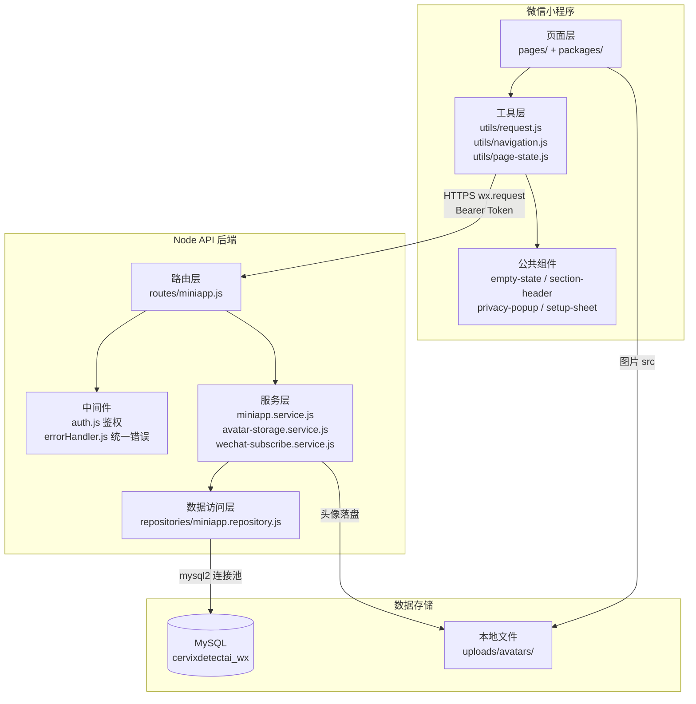

本文档是 **云端智诊**（CervixDetectAI_wx）项目的入门导读。阅读完毕后，你将了解这个项目是什么、做了什么、由哪些技术组成、目录如何组织，以及接下来应该读哪些文档来深入了解。

## 项目定位

**云端智诊** 是一款面向女性用户的健康管理微信小程序，核心目标是帮助用户在日常生活中**沉淀健康检查摘要、管理复查提醒、整理就诊前问题清单**。项目在提审时定位为「工具 / 健康管理」类目，个人主体即可上架，**不接入任何医疗服务**（无在线问诊、无 AI 诊断、无报告单查询）。

小程序的四个底部导航页签分别为：**首页**、**记录**、**提醒**、**我的**。其中「记录」承载健康检查摘要的增删改查，「提醒」负责复查日程的管理与完成标记，「我的」汇总了用户资料、隐私说明、合规边界和意见反馈等入口。

后端采用 **Express + MySQL** 的轻量方案，仅提供 RESTful API 给小程序调用，不承载页面渲染。

Sources: [README.md](README.md#L1-L10), [miniprogram/app.json](miniprogram/app.json#L76-L102)

## 核心功能一览

下表列出首版已实现的全部功能模块，以及它们对应的代码入口：

| 功能模块 | 说明 | 入口路径 |
|---------|------|---------|
| **首页** | 展示最近检查摘要、下次提醒、快捷操作卡片、免责声明；支持下拉刷新 | `pages/home/index` |
| **登录** | 微信 `code2Session` 登录，头像和昵称为选填项；采用用户主动触发，非强制登录 | `pages/login/index` |
| **检查记录** | 新增、查看、编辑、删除健康检查摘要；支持多种状态（已记录、待复查、待关注） | `pages/records/index` → `packages/records/record-form` |
| **复查提醒** | 提醒 CRUD、标记完成；预留订阅消息模板，用户主动点击时请求授权 | `pages/reminders/index` → `packages/reminders/reminder-form` |
| **问题整理** | 提供模板问题库 + 自定义问题，支持填写咨询备忘和记录回答 | `packages/tools/questions` |
| **健康知识** | 文章列表 + 弹层正文，涵盖筛查准备、记录管理、隐私保护等知识 | `packages/tools/articles` |
| **用户资料** | 头像上传、昵称设置（登录后选填，可跳过） | `packages/profile/setup` |
| **隐私说明** | 展示微信官方隐私协议与项目级说明 | `packages/profile/privacy` |
| **合规说明** | 明确列出项目可提供和不提供的服务边界 | `packages/profile/compliance` |
| **意见反馈** | 站内反馈表单（内容保存至后端），同时保留微信官方 `open-type="feedback"` 入口 | `packages/profile/feedback` |

Sources: [docs/wiki/01-project-overview.md](docs/wiki/01-project-overview.md#L13-L38), [miniprogram/app.json](miniprogram/app.json#L2-L101)

## 系统架构

云端智诊采用经典的 **前端 → API → 数据库** 三层架构。小程序前端通过 HTTPS（携带 Bearer Token）调用 Node API 后端，后端通过连接池访问 MySQL 数据库。下图展示了整体分层关系：



**请求流转过程**可以简要概括为：用户在小程序页面点击操作 → `utils/request.js` 封装 HTTP 请求并附带 Token → 后端路由接收请求 → 鉴权中间件校验 Token → 服务层执行业务逻辑与合规校验 → 数据访问层操作 MySQL → 响应返回小程序渲染。

Sources: [docs/wiki/02-architecture.md](docs/wiki/02-architecture.md#L1-L27), [server/src/app.js](server/src/app.js#L1-L49), [miniprogram/app.js](miniprogram/app.js#L1-L76)

## 技术栈

### 前端技术栈

| 维度 | 选型 | 说明 |
|------|------|------|
| 框架 | **微信原生小程序** | 无第三方 UI 框架，仅使用微信内置 `weui` 扩展库 |
| 包管理 | 无 npm 依赖 | 所有逻辑自行实现，保持包体精简 |
| 分包加载 | 4 个分包 | `records`、`reminders`、`tools`、`profile`，配合 `preloadRule` 预加载 |
| 状态管理 | 页面自管理 `data` | 跨页数据通过 `wx.storage` 和请求层内存缓存共享 |
| 组件化 | 6 个公共组件 | `empty-state`、`section-header`、`privacy-popup`、`privacy-consent`、`setup-sheet`、`weui-confirm` |
| 公共工具 | 7 个工具模块 | 网络请求、路由导航、页面状态机、表单锁、头像处理、反馈提示、订阅消息 |

### 后端技术栈

| 维度 | 选型 | 说明 |
|------|------|------|
| 运行时 | **Node.js** | 无 TypeScript，纯 JavaScript |
| Web 框架 | Express 4 | 配合 helmet（安全头）、cors（跨域）、morgan（日志） |
| 数据库 | MySQL | 通过 `mysql2/promise` 连接池访问，连接数默认 10 |
| 鉴权 | 自定义 Bearer Token | 会话存于 `wx_sessions` 表，有效期 30 天 |
| 文件存储 | 本地磁盘 | 头像保存至 `server/uploads/avatars/`，通过 Express 静态资源对外暴露 |
| 校验 | 服务层拦截 | 日期格式校验、合规禁用词拦截（`PROHIBITED_SERVICE_TERMS`） |

Sources: [server/package.json](server/package.json#L1-L20), [miniprogram/config/app.js](miniprogram/config/app.js#L1-L15), [server/src/config/env.js](server/src/config/env.js#L1-L26)

## 项目目录结构

```
CervixDetectAI_wx/
├── miniprogram/                     # 📱 微信小程序前端
│   ├── app.js / app.json / app.wxss #    全局入口与配置
│   ├── config/app.js                #    环境配置（API 地址、订阅模板 ID）
│   ├── pages/                       #    主包页面（5 个）
│   │   ├── home/                    #      首页
│   │   ├── login/                   #      登录页
│   │   ├── records/                 #      记录列表页
│   │   ├── reminders/               #      提醒列表页
│   │   └── profile/                 #      我的页面
│   ├── packages/                    #    分包页面（4 个分包）
│   │   ├── records/                 #      记录详情 + 记录表单
│   │   ├── reminders/               #      提醒表单
│   │   ├── tools/                   #      问题整理 + 健康文章
│   │   └── profile/                 #      隐私 / 合规 / 设置 / 反馈 / 服务
│   ├── components/                  #    公共组件（6 个）
│   ├── utils/                       #    公共工具模块（7 个）
│   └── assets/icons/                #    TabBar 图标资源
│
├── server/                          # 🖥️ Node API 后端
│   ├── src/
│   │   ├── app.js                   #    Express 入口
│   │   ├── config/                  #    环境变量 + 数据库连接池配置
│   │   ├── middleware/              #    鉴权中间件 + 统一错误处理
│   │   ├── routes/                  #    路由定义（单文件 miniapp.js）
│   │   ├── services/                #    业务服务层（3 个服务）
│   │   └── repositories/            #    数据访问层（MySQL CRUD）
│   ├── database/                    #    建库建表 + 升级脚本
│   ├── uploads/                     #    用户头像（运行时生成）
│   └── public/agreements/           #    隐私协议落地页（静态 HTML）
│
├── docs/                            # 📚 文档与提审材料
│   ├── wiki/                        #    Code Wiki（本文档所在目录）
│   ├── api-contract.md              #    接口文档
│   ├── category-guide.md            #    提审类目填写说明
│   └── submission-checklist.md      #    提审前自查清单
│
├── project.config.json              # 微信开发者工具工程配置
└── README.md                        # 项目总说明
```

Sources: [docs/wiki/01-project-overview.md](docs/wiki/01-project-overview.md#L41-L63), [miniprogram/app.json](miniprogram/app.json#L1-L102)

## 数据库概览

项目使用一个名为 `cervixdetectai_wx` 的 MySQL 数据库，共包含 **8 张核心表**：

| 表名 | 用途 | 关键字段 |
|------|------|---------|
| `wx_users` | 用户基础信息 | `id`, `openid`, `nickname`, `avatar_url` |
| `wx_sessions` | 登录会话（Token） | `token`, `user_id`, `expires_at` |
| `wx_health_records` | 健康检查摘要 | `id`, `user_id`, `record_date`, `status` |
| `wx_reminders` | 复查提醒 | `id`, `user_id`, `remind_date`, `done` |
| `wx_question_templates` | 就诊前问题模板 | `id`, `content`, `sort_order` |
| `wx_user_questions` | 用户自定义问题 | `id`, `user_id`, `question_text`, `answer_text` |
| `wx_articles` | 健康知识文章 | `id`, `title`, `summary`, `content` |
| `wx_feedback` | 用户反馈 | `id`, `user_id`, `feedback_type`, `content` |

所有业务表通过 `user_id` 外键关联 `wx_users`，并设置了 `ON DELETE CASCADE` 级联删除，保证用户注销时数据一致性。完整建表语句和演示数据见 [server/database/init.sql](server/database/init.sql)。

Sources: [server/database/init.sql](server/database/init.sql#L1-L100), [docs/wiki/05-database-schema.md](docs/wiki/05-database-schema.md)

## 合规边界

作为个人主体上线的健康管理工具，项目严格遵守微信小程序审核要求，在前后端共享同一份**禁用词清单**（`PROHIBITED_SERVICE_TERMS`）：

**项目不提供的服务：** AI 诊断、辅助诊断、在线问诊、诊疗建议、治疗方案、处方代开、疾病预测、病变识别、挂号缴费、报告单官方查询。

**项目提供的功能：** 本人填写的健康检查摘要、复查提醒、就诊前问题清单、健康管理知识阅读、隐私与服务边界说明、用户反馈。

前端在所有文案中主动规避敏感表达，后端在服务层对用户提交的反馈、记录摘要、问题文本等做合规词拦截，确保内容不偏离健康记录工具的定位。

Sources: [docs/wiki/01-project-overview.md](docs/wiki/01-project-overview.md#L66-L72), [README.md](README.md#L70-L76)

## 推荐阅读路径

根据你的关注方向，建议按以下顺序深入阅读：

| 你的情况 | 推荐阅读顺序 |
|---------|------------|
| **第一次接触项目** | → [环境搭建与运行](2-huan-jing-da-jian-yu-yun-xing) → [系统分层架构](8-xi-tong-fen-ceng-jia-gou) |
| **想改前端代码** | → [页面结构与分包机制](11-ye-mian-jie-gou-yu-fen-bao-ji-zhi) → [请求封装与Token管理](12-qing-qiu-feng-zhuang-yu-tokenguan-li) → [公共组件设计](14-gong-gong-zu-jian-she-ji) |
| **想改后端代码** | → [Express路由与中间件设计](15-expresslu-you-yu-zhong-jian-jian-she-ji) → [业务服务层架构](16-ye-wu-fu-wu-ceng-jia-gou) → [数据库访问层实现](17-shu-ju-ku-fang-wen-ceng-shi-xian) |
| **想对接 API 接口** | → [数据库表结构设计](19-shu-ju-ku-biao-jie-gou-she-ji) → [API 参考文档](docs/wiki/06-api-reference.md) |
| **准备提审上线** | → [微信小程序提审指南](6-wei-xin-xiao-cheng-xu-ti-shen-zhi-nan) → [后端服务部署](7-hou-duan-fu-wu-bu-shu) |