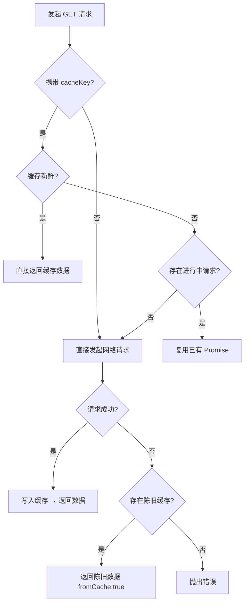
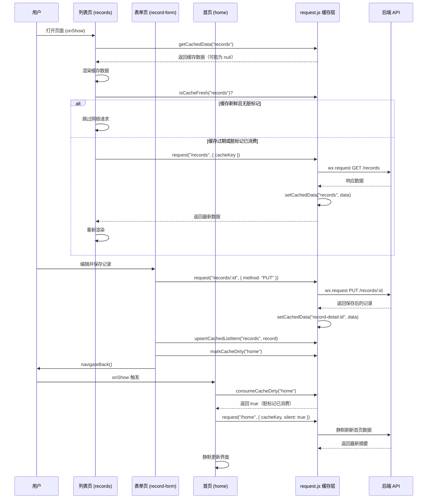

本文档深入分析 CervixDetectAI 微信小程序的前端缓存架构与数据同步机制。系统采用 **内存级响应缓存 + 持久化存储分离** 的双层策略，通过 TTL 过期判定、脏标记传播、乐观更新和请求去重四套协作机制，在微信小程序的运行时约束下实现了流畅的页面体验与跨页面数据一致性。

## 缓存分层架构

系统将缓存职责划分为两个清晰的层级：运行时内存缓存用于加速页面间导航与瞬时数据复用，持久化存储用于保障登录态与用户偏好在小程序冷启动后依然可用。

| 层级 | 存储介质 | 生命周期 | 数据类型 | 关键函数 |
|------|----------|----------|----------|----------|
| **运行时内存缓存** | JS 模块变量 `responseCache` | 小程序进程存活期间（随进程销毁而清空） | API 响应数据（列表、详情、首页摘要） | `getCachedData` / `setCachedData` / `markCacheDirty` |
| **持久化存储** | `wx.setStorageSync` / `wx.getStorageSync` | 跨会话持久（需主动清除） | 登录 Token、用户资料、设备 ID、隐私协议状态 | `wx.setStorageSync` / `wx.removeStorageSync` |

运行时缓存以 `responseCache` 对象为核心，定义在 [request.js](miniprogram/utils/request.js#L20) 中。每个缓存条目包含 `data`（深拷贝的响应数据）、`updatedAt`（写入时间戳）和 `dirty`（脏标记布尔值）三个字段。这种结构使得缓存条目既支持 TTL 过期判定，也支持跨页面写入时的脏标记传播。

持久化存储的使用场景较为有限，仅限于身份与偏好类数据。Token 通过 `wx.getStorageSync("token")` 读取（[request.js#L147](miniprogram/utils/request.js#L147)），用户资料存于 `wx.getStorageSync("user")`，设备标识符通过 `wx.getStorageSync("deviceId")` 在应用启动时初始化（[app.js#L55-57](miniprogram/app.js#L55-L57)）。隐私协议同意状态则通过 `wx.getStorageSync("privacyConsentAgreed")` 持久化（[app.js#L60](miniprogram/app.js#L60)）。

## 缓存键命名体系

缓存键是整个缓存系统寻址的基础。系统通过 `CACHE_KEYS` 常量统一管理所有缓存键的命名，避免散落的字符串硬编码。该常量定义在 [request.js#L5-14](miniprogram/utils/request.js#L5-L14) 中。

```javascript
const CACHE_KEYS = {
  home: "home",
  records: "records",
  reminders: "reminders",
  questions: "questions",
  questionTemplates: "questionTemplates",
  articles: "articles",
  recordDetail: (id) => `record-detail:${id}`,
  reminderDetail: (id) => `reminder-detail:${id}`
};
```

键的设计遵循两条规则：**列表级数据使用静态字符串键**（如 `"records"`），**详情级数据使用参数化函数生成复合键**（如 `record-detail:${id}`）。这种设计确保列表缓存与详情缓存可以独立失效——删除一条记录时，只需清除对应的 `record-detail:${id}` 条目，而非整个列表缓存。

## TTL 过期与新鲜度判定

缓存新鲜度由 `isCacheFresh` 函数判定（[request.js#L71-75](miniprogram/utils/request.js#L71-L75)），核心逻辑为：当前时间减去缓存写入时间不超过指定的 `maxAge`，且缓存条目未被标记为脏。

系统设定了一个全局默认 TTL 为 **30 秒**（[request.js#L3](miniprogram/utils/request.js#L3)），但各业务模块根据数据变更频率配置了不同的 `maxAge`：

| 数据域 | 缓存键 | maxAge | 设计理由 |
|--------|--------|--------|----------|
| 首页摘要 | `home` | 60 秒 | 汇总数据，变更频率中等，可容忍 1 分钟延迟 |
| 检查记录列表 | `records` | 30 秒（默认） | 用户主动增删改操作频繁 |
| 复查提醒列表 | `reminders` | 30 秒（默认） | 同上 |
| 问题清单 | `questions` | 30 秒（默认） | 同上 |
| 问题模板 | `questionTemplates` | **5 分钟** | 服务端配置数据，几乎不变 |
| 健康知识文章 | `articles` | **5 分钟** | 同上，属于准静态内容 |

值得注意的是，`isCacheFresh` 还会检查 `dirty` 标记——即使 TTL 尚未过期，一旦缓存条目被标记为脏，`isCacheFresh` 也会返回 `false`，强制触发重新请求。

## 请求层缓存集成

缓存并非由各页面自行管理，而是深度集成在统一的 `request` 函数中（[request.js#L250-320](miniprogram/utils/request.js#L250-L320)）。对于每一个 GET 请求，`request` 函数在发起网络调用前会依次执行三层缓存决策。

**第一层：命中判定。** 当请求携带 `cacheKey` 且未设置 `forceRefresh` 时，`request` 函数首先检查缓存是否新鲜。若 `isCacheFresh(cacheKey, maxAge)` 返回 `true`，直接 `Promise.resolve` 返回缓存数据，完全跳过网络调用（[request.js#L257-259](miniprogram/utils/request.js#L257-L259)）。

**第二层：请求去重。** 若缓存未命中，系统通过 `inflightRequests` 对象检查是否存在相同路径的进行中请求。若存在，直接复用该 Promise，避免重复网络调用（[request.js#L261-264](miniprogram/utils/request.js#L261-L264)）。去重键由 HTTP 方法、完整 URL 和 cacheKey 拼接而成（[request.js#L245-248](miniprogram/utils/request.js#L245-L248)）。

**第三层：陈旧回退。** 若网络请求失败（服务端 5xx 错误或 `wx.request` 的 `fail` 回调），系统会尝试从缓存中读取陈旧数据并返回，附加 `fromCache: true` 标记（[request.js#L267-273](miniprogram/utils/request.js#L267-L273)）。这确保在网络波动或服务端短暂故障时，用户仍能看到上次成功加载的数据。



## 脏标记与跨页面同步

小程序的页面栈架构意味着数据变更（如编辑记录后返回列表页）无法通过传统的事件总线机制通知。系统采用 **脏标记（dirty flag）** 机制解决此问题，其核心函数为 `markCacheDirty` 和 `consumeCacheDirty`（[request.js#L77-96](miniprogram/utils/request.js#L77-L96)）。

工作流程如下：当用户在表单页成功保存数据后，写操作除了更新自身的详情缓存和列表缓存外，还会调用 `markCacheDirty(CACHE_KEYS.home)` 将首页摘要标记为脏。当用户返回到首页时，`onShow` 生命周期中检测到脏标记后，会静默发起一次网络请求刷新首页数据。

以检查记录的完整保存流程为例（[record-form/index.js#L362-384](miniprogram/packages/records/record-form/index.js#L362-L384)）：

```javascript
const savedRecord = res.data;
setCachedData(CACHE_KEYS.recordDetail(savedRecord.id), res);        // 更新详情缓存
upsertCachedListItem(CACHE_KEYS.records, savedRecord, { prepend: true }); // 更新列表缓存
markCacheDirty(CACHE_KEYS.home);                                      // 标记首页为脏
```

返回列表页或首页时，`onShow` 中的检测逻辑为（[records/index.js#L96-102](miniprogram/pages/records/index.js#L96-L102)）：

```javascript
const shouldRefresh = !hasCachedRecords
  || consumeCacheDirty(CACHE_KEYS.records)  // 消费脏标记
  || !isCacheFresh(CACHE_KEYS.records);      // TTL 过期检测
```

各页面间的脏标记传播关系如下：

| 操作页面 | 写操作目标 | 直接更新的缓存 | 脏标记目标 | 受影响页面 |
|----------|-----------|---------------|-----------|-----------|
| record-form | 保存记录 | `record-detail:${id}` + `records` | `home` | 首页 |
| reminder-form | 保存提醒 | `reminder-detail:${id}` + `reminders` | `home` | 首页 |
| records 列表 | 删除记录 | `records`（移除条目） | `home` | 首页 |
| reminders 列表 | 删除提醒 | `reminders`（移除条目）+ 清除详情缓存 | `home` | 首页 |
| reminders 列表 | 标记完成 | `reminders`（更新条目）+ `reminder-detail:${id}` | `home` | 首页 |
| record-detail | 删除记录 | `records`（移除条目）+ 清除详情缓存 | `home` | 首页 |
| questions | 保存问题 | `questions`（直接 set） | — | — |

首页之所以成为脏标记的汇聚点，是因为它通过 `/home` 接口聚合了记录数量、最近记录摘要、最近提醒等跨模块的汇总数据。任何子模块的变更都会影响首页的展示内容。

## 乐观更新策略

系统在所有写操作（创建、编辑、删除、标记完成）后，**不等待下次页面渲染时重新拉取全量列表**，而是立即在内存缓存中执行对应的增量更新。这套策略通过三组缓存操作函数实现，定义在 [request.js#L98-144](miniprogram/utils/request.js#L98-L144) 中。

**`upsertCachedListItem(key, item, options)`** 用于创建或编辑操作。它在列表缓存中查找匹配 `item.id` 的条目：若找到则原地替换，若未找到则根据 `options.prepend` 决定插入到头部还是尾部。创建记录时使用 `{ prepend: true }` 确保新记录出现在列表顶部（[record-form/index.js#L376](miniprogram/packages/records/record-form/index.js#L376)）。

**`removeCachedListItem(key, id)`** 用于删除操作。它通过 `filter` 从列表缓存中移除匹配的条目（[records/index.js#L222](miniprogram/pages/records/index.js#L222)）。删除时还会同步清除对应的详情缓存（[record-detail/index.js#L179-180](miniprogram/packages/records/record-detail/index.js#L179-L180)）。

**`updateCachedListItem(key, id, updater)`** 用于部分更新操作，如标记提醒完成。它接受一个 `updater` 函数或对象，仅修改匹配条目的部分字段（[reminders/index.js#L211](miniprogram/pages/reminders/index.js#L211)）。

这种乐观更新的设计目标是：**用户执行写操作后，列表页和首页在下次 `onShow` 时能立即展示最新数据**，即使网络请求尚未完成或恰好失败。由于 `request` 函数本身会在成功响应后写入缓存（[request.js#L301-303](miniprogram/utils/request.js#L301-L303)），乐观更新与服务端响应最终会保持一致。

## 页面级缓存消费模式

各列表页在 `onShow` 生命周期中遵循统一的 **"先渲染缓存，再判断刷新"** 模式。以检查记录列表为例（[records/index.js#L75-103](miniprogram/pages/records/index.js#L75-L103)）：

1. 从缓存中读取数据并立即渲染（`applyRecords`）
2. 判断是否需要刷新：无缓存 / 脏标记已消费 / TTL 过期
3. 若需要刷新且已有缓存数据，以 `silent: true` 模式静默请求（不显示 loading 骨架屏）
4. 若需要刷新且无缓存数据，以 `silent: false` 模式显示 loading 状态

详情页则采用 **"详情缓存 → 列表缓存回退"** 的两级读取策略。`hydrateRecord` 函数（[record-detail/index.js#L80-105](miniprogram/packages/records/record-detail/index.js#L80-L105)）首先尝试从 `record-detail:${id}` 读取精确缓存；若未命中，则回退到 `records` 列表缓存中查找匹配 `id` 的条目。这确保从列表页点击进入详情页时，即使详情缓存为空也能立即展示数据。

首页的缓存消费逻辑略有特殊（[home/index.js#L172-195](miniprogram/pages/home/index.js#L172-L195)）：未登录用户直接渲染预设的 `GUEST_HOME` 静态内容，已登录用户先尝试从缓存渲染，再通过 `scheduleHomeRefresh` 在 `wx.nextTick` 后发起静默刷新。

## 登录态与缓存生命周期

缓存的生命周期与登录态紧密耦合。系统在两个关键节点管理缓存的清除：

**登录时**，`login/index.js` 中的 `_performLogin` 方法在获取到服务端响应后调用 `clearAllCaches()`（[login/index.js#L188](miniprogram/pages/login/index.js#L188)），清空整个 `responseCache` 和 `inflightRequests` 对象。这是因为登录前的浏览数据（游客模式下的文章、问题模板等）可能与登录后的个性化数据不同，需要彻底刷新。

**Token 失效时**，`request` 函数在收到 401 响应后调用 `redirectLogin()`（[request.js#L287-295](miniprogram/utils/request.js#L287-L295)），该函数会清除 `wx.setStorageSync` 中的 token 和 user 数据，并调用 `clearAllCaches()` 清空所有内存缓存，最后通过 `wx.reLaunch` 跳转到登录页。为防止短时间内重复跳转，系统通过 `lastLoginRedirectAt` 时间戳实现了 **800ms 防抖**（[request.js#L170-172](miniprogram/utils/request.js#L170-L172)）。

## 服务端缓存控制

后端在 HTTP 层面采用了 **无缓存策略**。AI 助手的 SSE 流式接口显式设置 `Cache-Control: no-cache`（[miniapp.js#L151](server/src/routes/miniapp.js#L151)），确保客户端不会缓存流式传输的中间状态。其他常规 API 接口未设置额外的缓存头，依赖 Express 默认行为。

后端唯一的服务端缓存是 **微信 access_token 的进程内缓存**（[wechat-subscribe.service.js#L3-61](server/src/services/wechat-subscribe.service.js#L3-L61)）。该缓存存储在模块级变量 `tokenCache` 中，包含 `token` 和 `expiresAt` 两个字段。每次调用 `getAccessToken()` 时检查距过期是否还有 60 秒以上的余量，若有则直接返回缓存的 token，否则重新向微信服务器申请。这是标准的微信服务端 token 管理实践，避免了每次发送订阅消息都请求 token 接口。

## 网络状态感知

应用在启动时初始化网络状态监听（[app.js#L64-73](miniprogram/app.js#L64-L73)），通过 `wx.getNetworkType` 和 `wx.onNetworkStatusChange` 持续追踪连接状态，结果存储在 `globalData.isOnline` 和 `globalData.networkType` 中。虽然当前的缓存策略并未直接基于网络状态做差异化处理（如离线时优先使用缓存），但 `request` 函数中的陈旧缓存回退机制在网络断开时会自动生效——`wx.request` 的 `fail` 回调触发后，系统会尝试返回陈旧数据而非直接报错。



## 设计权衡与边界说明

系统选择内存缓存而非 `wx.setStorageSync` 存储 API 响应数据，这是一个有意为之的设计决策。`wx.setStorageSync` 是同步 I/O 操作，在数据量较大时（如包含完整检查记录的列表）会影响页面渲染帧率。内存缓存虽然在小程序被系统回收后会丢失，但此时所有页面栈也会被销毁，用户重新进入时自然会触发全新的数据加载，不存在状态不一致的问题。

`DEFAULT_CACHE_MAX_AGE` 设定为 30 秒而非更长的时间，是因为本应用属于 **个人健康管理工具**，用户可能在短时间内连续添加多条记录或修改提醒状态。过长的缓存窗口会导致用户在页面间切换时看到过时数据，降低信任感。而对于变更频率极低的配置数据（问题模板、文章列表），则通过单独的 `maxAge: 5 * 60 * 1000` 参数延长缓存有效期，减少不必要的网络开销。

当前系统未实现 **离线队列**（offline queue）机制——当用户在无网络环境下执行写操作时，请求会直接失败。这是基于产品定位的权衡：健康记录数据的准确性优先于离线可用性，且微信小程序的网络环境通常较为稳定（Wi-Fi 或 4G/5G）。`globalData.isOnline` 状态已在应用层持续追踪，未来如需增强离线体验，可在此基础上引入写操作排队与重放机制。