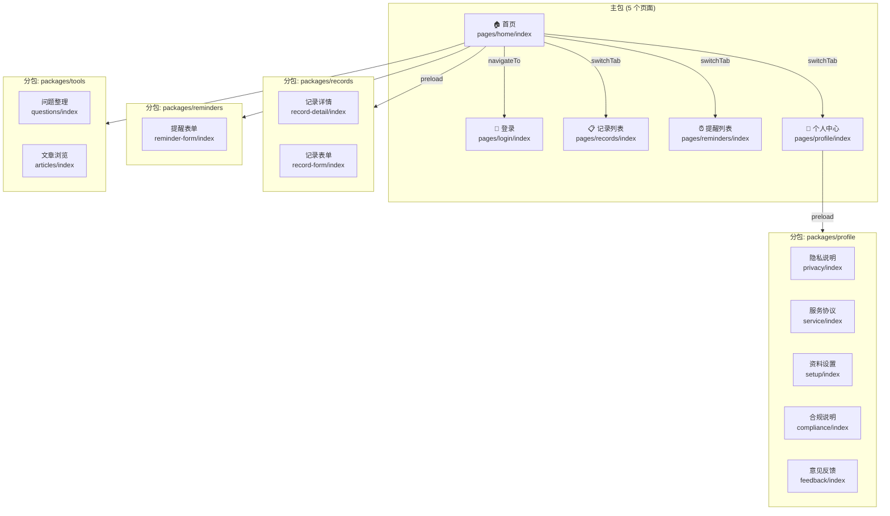
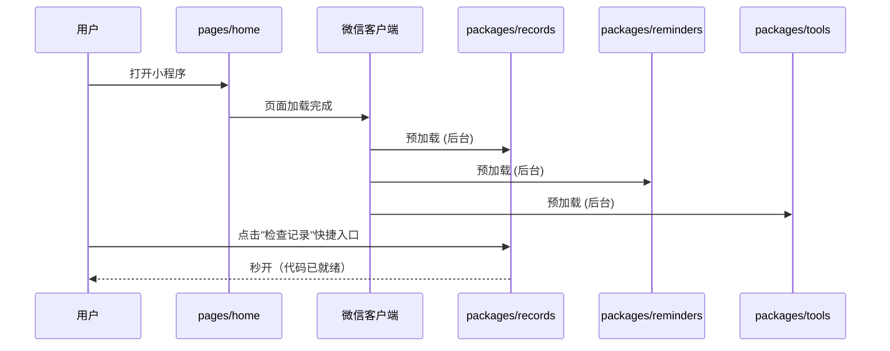
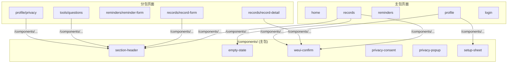

本文档详细介绍 CervixDetectAI 微信小程序的页面组织方式、分包策略及预加载机制。项目采用 **主包 + 4 个分包** 的架构，在保证首屏加载速度的同时，将 17 个页面按业务域合理拆分。

## 整体架构概览

小程序的页面结构以 `miniprogram/app.json` 为中心配置文件，定义了主包页面、分包路径、预加载规则和 TabBar 导航。整体采用**扁平化主包 + 域聚合分包**的模式：主包承载核心入口与 TabBar 页面，分包按业务域聚合子页面和专属工具函数。



## 主包页面：TabBar 与核心入口

主包包含 5 个页面，其中 4 个作为 TabBar 底部导航项，1 个作为登录入口。这些页面构成了用户打开小程序后的**最小加载集**，因此必须保留在主包中。

| 页面路径 | 功能定位 | 下拉刷新 | 组件依赖 |
|----------|----------|----------|----------|
| `pages/home/index` | 首页仪表盘，快捷操作入口 | ✅ | WeUI Icon |
| `pages/login/index` | 登录与资料初始化 | ❌ | WeUI Icon、隐私协议组件 |
| `pages/records/index` | 检查记录列表与搜索 | ✅ | 段落头、空状态、确认弹窗、WeUI 搜索栏 |
| `pages/reminders/index` | 复查提醒列表与搜索 | ✅ | 段落头、空状态、确认弹窗、WeUI 搜索栏 |
| `pages/profile/index` | 个人中心与功能导航 | ✅ | 确认弹窗、设置面板 |

Sources: [app.json](miniprogram/app.json#L3-L8)

**TabBar 配置**定义了 4 个底部导航项，使用双态图标（未选中/选中）实现视觉反馈：

| Tab | 图标路径 | 文字 | 路径 |
|-----|----------|------|------|
| 首页 | `assets/icons/home-*.png` | 首页 | `pages/home/index` |
| 记录 | `assets/icons/records-*.png` | 记录 | `pages/records/index` |
| 提醒 | `assets/icons/reminders-*.png` | 提醒 | `pages/reminders/index` |
| 我的 | `assets/icons/profile-*.png` | 我的 | `pages/profile/index` |

TabBar 的选中色为 `#1f53c9`，未选中色为 `#66748a`，背景色为 `#f8f9ff`，边框样式为白色（无分隔线），视觉上更融入页面背景。

Sources: [app.json](miniprogram/app.json#L59-L92)

## 分包划分：四域聚合策略

项目将非 TabBar 页面按业务域拆分为 4 个分包，每个分包拥有独立的 `root` 路径，内部页面共享该分包内的工具函数。这种划分遵循**功能内聚、按需加载**原则。

### 分包概览

| 分包 root | 页面数 | 业务域 | 页面列表 |
|-----------|--------|--------|----------|
| `packages/records` | 2 | 记录管理 | record-detail、record-form |
| `packages/reminders` | 1 | 提醒管理 | reminder-form |
| `packages/tools` | 2 | 健康工具 | questions、articles |
| `packages/profile` | 5 | 用户资料与合规 | privacy、service、setup、compliance、feedback |

**总计**：主包 5 页 + 4 个分包共 10 页 = **15 个页面**

Sources: [app.json](miniprogram/app.json#L9-L30)

### packages/records — 记录管理分包

承载检查记录的详情查看和表单编辑功能，同时包含报告订阅消息的工具函数。

```
packages/records/
├── record-detail/       # 记录详情页
│   ├── index.js         # 详情逻辑、编辑/删除操作
│   ├── index.json       # 引用 weui-confirm、WeUI Icon
│   ├── index.wxml       # 详情展示模板
│   └── index.wxss       # 详情页样式
├── record-form/         # 记录表单页（新增/编辑）
│   ├── index.js         # 表单提交逻辑
│   ├── index.json       # 引用 section-header、WeUI 表单组件
│   ├── index.wxml       # 表单模板
│   └── index.wxss       # 表单样式
└── utils/
    └── report-subscription.js   # 报告查看订阅消息工具
```

record-detail 页面引用主包的公共组件（如 `weui-confirm`）时使用**绝对路径** `/components/weui-confirm/index`，而引用分包内部工具则使用**相对路径** `../../../utils/request`。record-form 页面还引用了大量 WeUI 表单组件（`mp-form`、`mp-cells`、`mp-cell`、`mp-checkbox-group` 等）来构建检查记录编辑表单。

Sources: [packages/records/record-detail/index.json](miniprogram/packages/records/record-detail/index.json#L1-L8), [packages/records/record-form/index.json](miniprogram/packages/records/record-form/index.json#L1-L14), [packages/records/utils/report-subscription.js](miniprogram/packages/records/utils/report-subscription.js#L1-L42)

### packages/reminders — 提醒管理分包

承载复查提醒的表单编辑功能，包含订阅消息授权工具。

```
packages/reminders/
├── reminder-form/       # 提醒表单页
│   ├── index.js
│   ├── index.json
│   ├── index.wxml
│   └── index.wxss
└── utils/
    └── subscription.js  # 提醒订阅消息授权工具
```

`subscription.js` 从全局配置读取订阅模板 ID，通过 `wx.requestSubscribeMessage` 接口请求用户授权微信服务通知。

Sources: [packages/reminders/utils/subscription.js](miniprogram/packages/reminders/utils/subscription.js#L1-L45)

### packages/tools — 健康工具分包

承载问题整理和健康知识文章两个独立功能页面。

```
packages/tools/
├── articles/            # 健康知识文章列表页
│   ├── index.js
│   ├── index.json       # 引用 section-header、WeUI 搜索栏、图标
│   ├── index.wxml
│   └── index.wxss
└── questions/           # 问题整理页
    ├── index.js
    ├── index.json       # 引用 section-header、确认弹窗、搜索栏、复选框
    ├── index.wxml
    └── index.wxss
```

questions 页面的组件依赖较多，除了公共组件外还使用了 WeUI 的 `mp-searchbar`、`mp-cells`、`mp-checkbox-group`、`mp-checkbox` 来实现问题的搜索和多选管理。

Sources: [packages/tools/questions/index.json](miniprogram/packages/tools/questions/index.json#L1-L15), [packages/tools/articles/index.json](miniprogram/packages/tools/articles/index.json)

### packages/profile — 用户资料与合规分包

这是页面数最多的分包（5 个页面），涵盖用户资料设置和各类合规协议说明。

```
packages/profile/
├── privacy/             # 隐私与服务说明
│   └── index.json       # 引用 section-header
├── service/             # 用户服务协议
├── setup/               # 资料设置（头像、昵称）
│   └── index.json       # 仅引用 WeUI Icon
├── compliance/          # 合规与服务边界说明
└── feedback/            # 意见反馈
```

该分包页面的组件依赖普遍较轻——setup 页面仅依赖 WeUI Icon，privacy 页面额外引用了 section-header 组件。这是因为这些页面以静态内容展示为主，交互逻辑较少。

Sources: [packages/profile/setup/index.json](miniprogram/packages/profile/setup/index.json#L1-L7), [packages/profile/privacy/index.json](miniprogram/packages/profile/privacy/index.json#L1-L8)

## 分包预加载策略

小程序通过 `preloadRule` 在特定页面触发分包预加载，确保用户进入高频操作路径时分包代码已准备就绪。项目配置了两条预加载规则：

| 触发页面 | 网络条件 | 预加载分包 | 设计意图 |
|----------|----------|------------|----------|
| `pages/home/index` | all（任何网络） | records、reminders、tools | 用户进入首页后，大概率会浏览记录、提醒或工具，提前加载可消除分包切换延迟 |
| `pages/profile/index` | all（任何网络） | profile | 用户进入"我的"页后，大概率会查看隐私说明或编辑资料 |



`network: "all"` 表示不限网络类型（WiFi 和蜂窝网络均生效），这体现了对核心功能路径的加载保障优先级。

Sources: [app.json](miniprogram/app.json#L31-L49)

## 路由注册与导航机制

所有页面路由在 `utils/navigation.js` 中统一注册为 `ROUTES` 常量对象，避免在业务代码中硬编码路径字符串。路由注册区分了**主包路径**和**分包路径**：

```mermaid
graph LR
    subgraph ROUTES["ROUTES 常量"]
        direction TB
        R1["login → /pages/login/index"]
        R2["home → /pages/home/index"]
        R3["records → /pages/records/index"]
        R4["reminders → /pages/reminders/index"]
        R5["profile → /pages/profile/index"]
        R6["recordDetail → /packages/records/record-detail/index"]
        R7["recordForm → /packages/records/record-form/index"]
        R8["reminderForm → /packages/reminders/reminder-form/index"]
        R9["questions → /packages/tools/questions/index"]
        R10["articles → /packages/tools/articles/index"]
        R11["privacy → /packages/profile/privacy/index"]
        R12["serviceAgreement → /packages/profile/service/index"]
        R13["profileSetup → /packages/profile/setup/index"]
        R14["compliance → /packages/profile/compliance/index"]
        R15["feedback → /packages/profile/feedback/index"]
    end
```



`openRoute` 函数根据目标路由自动选择正确的导航方式：

| 条件 | 调用的 API | 适用场景 |
|------|-----------|----------|
| `options.reLaunch` 为 true | `wx.reLaunch` | 重启应用到目标页 |
| `options.redirect` 为 true | `wx.redirectTo` | 替换当前页面栈 |
| 目标在 `TAB_ROUTES` 中 | `wx.switchTab` | TabBar 页间切换 |
| 其他情况 | `wx.navigateTo` | 常规页面导航 |

`TAB_ROUTES` 数组包含 4 个 TabBar 路径，`openRoute` 通过检查目标路径是否在该数组中来决定使用 `switchTab` 还是 `navigateTo`。`buildUrl` 辅助函数负责将查询参数编码到 URL 中，自动过滤 `undefined`、`null` 和空字符串值。

Sources: [navigation.js](miniprogram/utils/navigation.js#L1-L57)

## 页面文件结构约定

每个页面遵循微信小程序标准的四文件结构，分包页面和主包页面格式一致：

```
pages/<page-name>/
├── index.js       # 页面逻辑（Page 实例）
├── index.json     # 页面配置（组件引用、导航栏标题等）
├── index.wxml     # 页面模板
└── index.wxss     # 页面样式
```

**关键配置项**通过 `index.json` 声明：

- `navigationBarTitleText`：导航栏标题
- `enablePullDownRefresh`：是否启用下拉刷新（列表类页面均启用）
- `usingComponents`：页面级组件注册

| 页面类型 | 启用下拉刷新 | 典型标题 |
|----------|-------------|----------|
| 列表页（records、reminders） | ✅ | "检查记录"、"复查提醒" |
| 首页（home） | ✅ | "云端智诊" |
| 个人中心（profile） | ✅ | "我的" |
| 表单页（record-form、reminder-form） | ❌ | "编辑检查记录"等 |
| 静态页（privacy、compliance 等） | ❌ | "隐私说明"等 |

Sources: [records/index.json](miniprogram/pages/records/index.json#L1-L14), [reminders/index.json](miniprogram/pages/reminders/index.json#L1-L14), [profile/index.json](miniprogram/pages/profile/index.json#L1-L11)

## 公共组件与分包内组件引用

项目在 `miniprogram/components/` 目录下维护 6 个公共组件，供所有页面（包括分包页面）共享使用：

| 组件名 | 用途 | 引用路径 |
|--------|------|----------|
| `section-header` | 区域标题头，支持多插槽 | `/components/section-header/index` |
| `empty-state` | 空数据状态展示与操作引导 | `/components/empty-state/index` |
| `weui-confirm` | 确认/删除操作的弹窗封装 | `/components/weui-confirm/index` |
| `privacy-consent` | 隐私协议同意弹窗 | `/components/privacy-consent/index` |
| `privacy-popup` | 隐私声明弹窗 | `/components/privacy-popup/index` |
| `setup-sheet` | 资料设置底部面板 | `/components/setup-sheet/index` |

分包页面引用公共组件时使用**绝对路径**（以 `/` 开头），而非相对路径。这是因为分包页面可能嵌套在不同层级的目录中，绝对路径可确保解析一致性，不受文件相对位置影响。



此外，项目通过 `useExtendedLib` 启用了 **WeUI 扩展库**，页面直接引用 `weui-miniprogram/` 下的组件（如 `mp-icon`、`mp-searchbar`、`mp-badge`、`mp-form` 等），无需在各页面目录中存放组件代码。

Sources: [section-header/index.json](miniprogram/components/section-header/index.json#L1-L10), [empty-state/index.json](miniprogram/components/empty-state/index.json#L1-L7), [app.json](miniprogram/app.json#L50-L53)

## 懒加载与性能优化

项目通过以下配置实现按需加载，减少小程序首次启动时的代码下载量和解析时间：

**`lazyCodeLoading: "requiredComponents"`**：启用组件懒加载。页面注册的 `usingComponents` 中声明的组件，仅在页面首次渲染需要时才加载其代码，而非在小程序启动时全部加载。这对组件依赖较多的页面（如 records 页面引用 6 个组件、questions 页面引用 7 个组件）效果尤为明显。

**`style: "v2"`**：使用新版基础组件样式，减少冗余样式代码的注入。

**`packOptions.ignore`**：通过 `project.config.json` 配置，在打包时排除 `minitest/` 测试目录，避免测试代码混入生产包体。

Sources: [app.json](miniprogram/app.json#L98-L99), [project.config.json](miniprogram/project.config.json#L38-L47)

## 页面与功能模块映射

下表展示了每个页面对应的业务功能，便于开发者快速定位代码：

| 页面 | 所属分包 | 业务功能 | 详细文档 |
|------|----------|----------|----------|
| home | 主包 | 首页仪表盘、快捷操作 | [健康检查记录管理](25-jian-kang-jian-cha-ji-lu-guan-li) |
| login | 主包 | 用户登录与资料初始化 | [用户登录与资料管理](29-yong-hu-deng-lu-yu-zi-liao-guan-li) |
| records | 主包 | 检查记录列表与搜索 | [健康检查记录管理](25-jian-kang-jian-cha-ji-lu-guan-li) |
| reminders | 主包 | 复查提醒列表与搜索 | [复查提醒与订阅消息](26-fu-cha-ti-xing-yu-ding-yue-xiao-xi) |
| profile | 主包 | 个人中心与功能导航 | [用户登录与资料管理](29-yong-hu-deng-lu-yu-zi-liao-guan-li) |
| record-detail | records | 检查记录详情查看/编辑/删除 | [健康检查记录管理](25-jian-kang-jian-cha-ji-lu-guan-li) |
| record-form | records | 检查记录新增/编辑表单 | [健康检查记录管理](25-jian-kang-jian-cha-ji-lu-guan-li) |
| reminder-form | reminders | 复查提醒新增/编辑表单 | [复查提醒与订阅消息](26-fu-cha-ti-xing-yu-ding-yue-xiao-xi) |
| questions | tools | 问题整理与咨询备忘 | [问题整理功能](27-wen-ti-zheng-li-gong-neng) |
| articles | tools | 健康知识文章浏览 | [健康知识文章浏览](28-jian-kang-zhi-shi-wen-zhang-liu-lan) |
| privacy | profile | 隐私与服务说明 | [隐私协议实现](22-yin-si-xie-yi-shi-xian) |
| service | profile | 用户服务协议 | [隐私协议实现](22-yin-si-xie-yi-shi-xian) |
| setup | profile | 头像/昵称资料设置 | [用户登录与资料管理](29-yong-hu-deng-lu-yu-zi-liao-guan-li) |
| compliance | profile | 合规与服务边界说明 | [合规词拦截机制](23-he-gui-ci-lan-jie-ji-zhi) |
| feedback | profile | 用户意见反馈 | — |

## 下一步阅读

了解了页面结构与分包机制后，建议按以下顺序继续深入：

1. **[请求封装与 Token 管理](12-qing-qiu-feng-zhuang-yu-tokenguan-li)** — 理解页面如何通过 `utils/request.js` 与后端通信，以及缓存机制如何与分包页面配合
2. **[路由管理与页面状态机](13-lu-you-guan-li-yu-ye-mian-zhuang-tai-ji)** — 深入了解 `openRoute` 的导航策略和 `PAGE_STATUS` 状态机
3. **[公共组件设计](14-gong-gong-zu-jian-she-ji)** — 详细了解 6 个公共组件的接口设计与跨分包引用规范