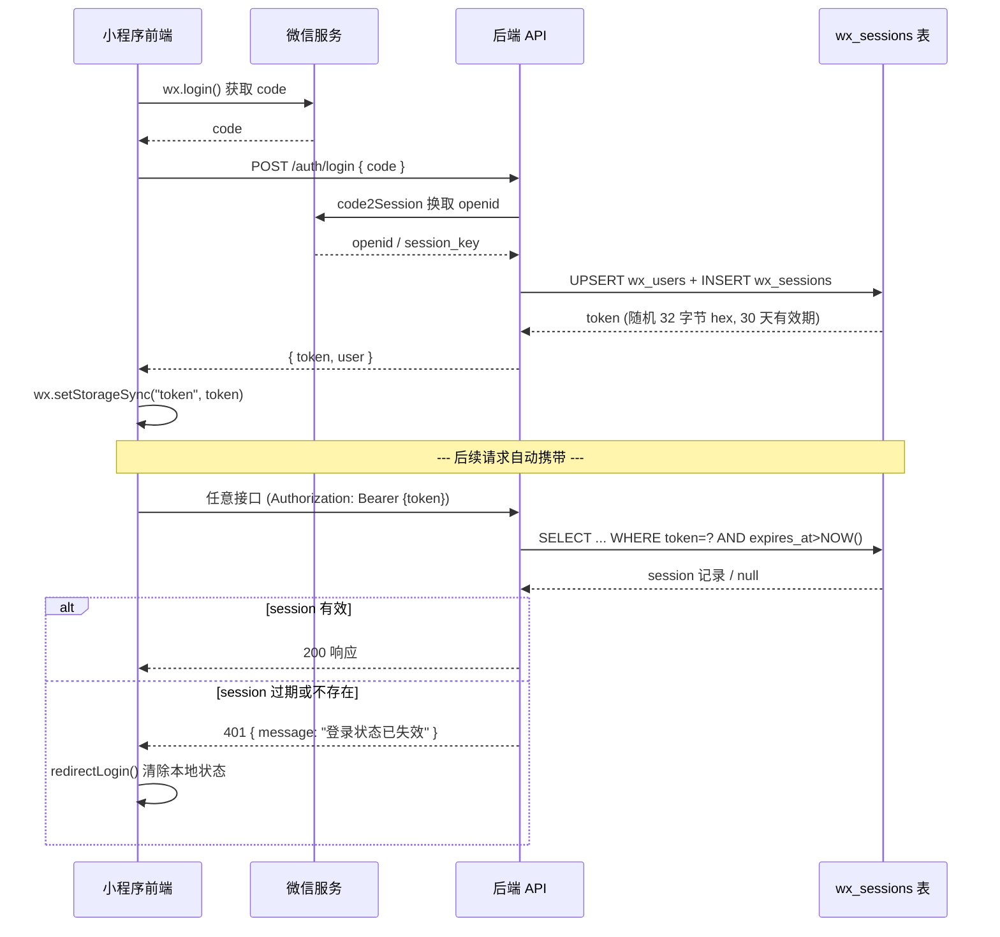
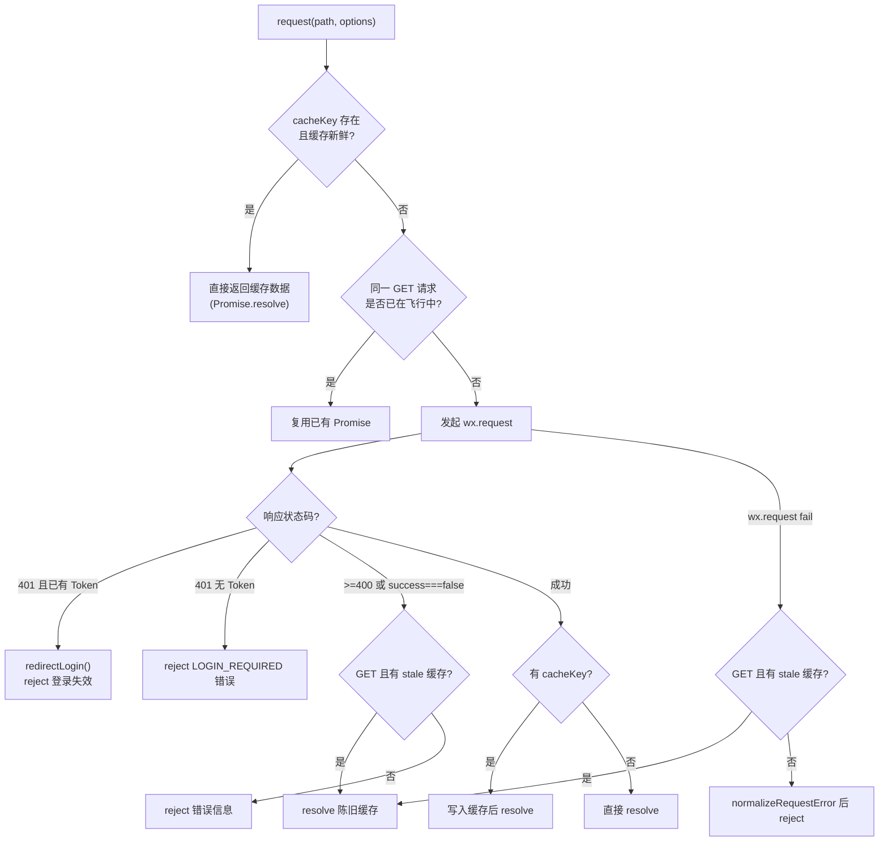
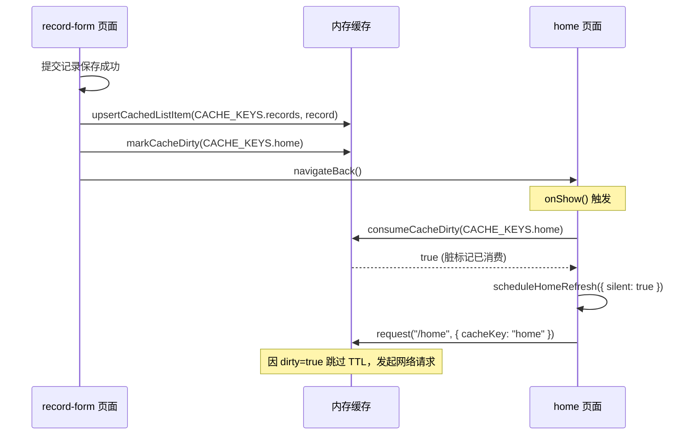
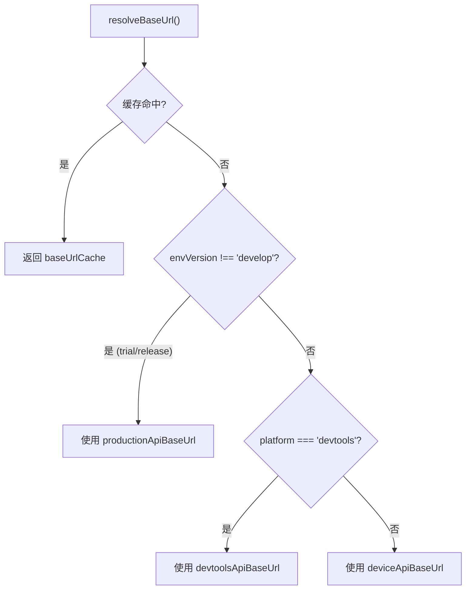
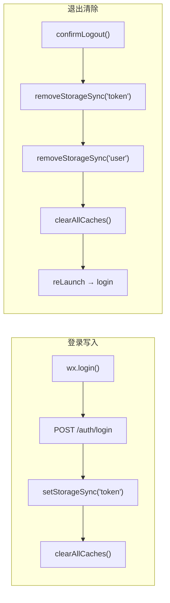

本文档解析小程序前端的网络请求体系——以 `miniprogram/utils/request.js` 为核心的**请求封装层**、**Token 鉴权生命周期**以及**内存级响应缓存机制**。所有业务页面和分包模块均通过此层与后端通信，理解它是掌握前后端数据流的关键入口。

## 整体架构：请求模块的职责分层

`request.js` 并非简单的 `wx.request` 包装，而是同时承担了四项横切关注点：**请求发送与错误归一化**、**Token 自动注入与 401 拦截**、**GET 请求内存缓存与脏标记**、**并发去重**。以下是各职责在模块内部的分布：

| 职责域 | 核心函数 | 作用 |
|--------|----------|------|
| 请求发送 | `request(path, options)` | 统一入口，组装 URL/Header/超时，分发 `wx.request` |
| Token 管理 | `getToken()`, `isLoggedIn()`, `redirectLogin()` | 读取/判断/清除 Token，触发登录跳转 |
| 缓存读写 | `getCachedData()`, `setCachedData()`, `isCacheFresh()` | 内存级 GET 响应缓存，30 秒 TTL |
| 脏标记同步 | `markCacheDirty()`, `consumeCacheDirty()` | 跨页面数据变更通知，触发后台刷新 |
| 列表级操作 | `upsertCachedListItem()`, `removeCachedListItem()`, `updateCachedListItem()` | 对缓存中的列表数据做局部增删改 |
| 并发去重 | `inflightRequests` | 同一 GET 请求未完成时复用 Promise |
| 错误归一化 | `normalizeRequestError()`, `getErrorMessage()` | 将微信底层错误转为用户可读文案 |

Sources: [request.js](miniprogram/utils/request.js#L1-L381)

## Token 生命周期：从签发到失效

本项目的 Token 采用**服务端随机字节串**方案（非 JWT），其完整生命周期如下：



**Token 的生成**在后端使用 `crypto.randomBytes(32).toString("hex")` 产生 64 字符十六进制串，有效期 30 天，存储于 `wx_sessions` 数据库表。每次登录会创建新的 session 记录，旧 token 不主动失效（靠过期时间自然淘汰）。

Sources: [miniapp.repository.js](server/src/repositories/miniapp.repository.js#L1-L13), [miniapp.repository.js](server/src/repositories/miniapp.repository.js#L174-L186), [auth.js](server/src/middleware/auth.js#L1-L34)

## 请求发送核心：`request()` 函数解析

`request(path, options)` 是所有 HTTP 调用的唯一出口。其内部执行流程如下：



**关键设计要点**：

- **缓存新鲜度判断**：默认 30 秒 TTL（`DEFAULT_CACHE_MAX_AGE`），可由调用方通过 `maxAge` 参数覆盖。首页请求使用了 `maxAge: 60 * 1000` 即 60 秒。
- **陈旧缓存降级**：当 GET 请求遇到 5xx 错误或网络失败时，如果有过期但仍存在的缓存数据，会返回带 `fromCache: true` 标记的缓存数据，而非直接报错。
- **并发去重**：通过 `inflightRequests` 对象以 `METHOD:url:cacheKey` 为键，在同一请求未完成前复用 Promise，避免页面 onShow 重复触发时产生冗余网络请求。
- **超时控制**：默认 12 秒，由 `config.requestTimeout` 统一配置。

Sources: [request.js](miniprogram/utils/request.js#L250-L320), [config/app.js](miniprogram/config/app.js#L9)

## Token 注入与 401 拦截机制

请求发出前，`request()` 函数在构建 header 时自动注入 Token：

```javascript
header: {
  "content-type": "application/json",
  ...(getToken() ? { Authorization: `Bearer ${getToken()}` } : {}),
  ...(options.header || {})
}
```

当后端返回 **401** 状态码时，前端根据本地是否持有 Token 区分两种场景：

| 场景 | 条件 | 行为 |
|------|------|------|
| Token 过期 | `getToken()` 存在（说明曾经登录） | 清除本地 token/user/所有缓存，跳转登录页 |
| 未登录访问 | `getToken()` 为空（游客） | 抛出 `LOGIN_REQUIRED` 错误，由页面自行处理引导 |

`redirectLogin()` 内置了 **800 毫秒防抖**（`lastLoginRedirectAt`），防止短时间内多次 401 导致重复跳转。该函数同时清除内存中所有缓存（`clearAllCaches()`），确保登录后数据重新加载。

Sources: [request.js](miniprogram/utils/request.js#L280-L294), [request.js](miniprogram/utils/request.js#L146-L173)

## 内存缓存体系详解

请求模块实现了一套完整的**进程级内存缓存**，核心数据结构为 `responseCache` 对象，每个缓存条目包含三个字段：

| 字段 | 类型 | 含义 |
|------|------|------|
| `data` | object | 深拷贝的响应数据 |
| `updatedAt` | number | 写入时间戳（`Date.now()`） |
| `dirty` | boolean | 脏标记，为 true 时跳过 TTL 判断，强制刷新 |

### 缓存键（CACHE_KEYS）设计

缓存键采用枚举式定义，确保全局唯一性：

| 键名 | 值 | 用途 |
|------|----|------|
| `home` | `"home"` | 首页摘要数据 |
| `records` | `"records"` | 检查记录列表 |
| `reminders` | `"reminders"` | 复查提醒列表 |
| `questions` | `"questions"` | 问题列表 |
| `questionTemplates` | `"questionTemplates"` | 问题模板 |
| `articles` | `"articles"` | 文章列表 |
| `recordDetail(id)` | `"record-detail:{id}"` | 单条记录详情（动态键） |
| `reminderDetail(id)` | `"reminder-detail:{id}"` | 单条提醒详情（动态键） |

Sources: [request.js](miniprogram/utils/request.js#L5-L14)

### 脏标记机制：跨页面数据同步

当某个页面修改了数据（如新增/编辑/删除记录），除了更新本页面缓存外，还会通过 `markCacheDirty()` 标记依赖该数据的其他缓存条目为"脏"。典型流程：



`consumeCacheDirty()` 的设计意图是**一次性消费**：读取后立即将 dirty 置为 false，避免重复刷新。这在 `onShow` 等高频生命周期中尤为重要。

Sources: [request.js](miniprogram/utils/request.js#L77-L96), [record-detail/index.js](miniprogram/packages/records/record-detail/index.js#L205-L217), [record-form/index.js](miniprogram/packages/records/record-form/index.js#L376-L377)

## Base URL 解析策略

请求模块根据运行环境自动选择不同的后端地址，解析逻辑按优先级如下：



当前配置中三个地址均指向同一后端 `https://xcx.hpvsc.icu/api/miniapp`，此设计为未来多环境切换预留了扩展点。

Sources: [request.js](miniprogram/utils/request.js#L199-L220), [config/app.js](miniprogram/config/app.js#L4-L8)

## 错误归一化与用户提示

`normalizeRequestError()` 将微信底层的网络错误转为面向用户的友好文案：

| 微信错误特征 | 转换后文案 | 适用场景 |
|-------------|-----------|---------|
| `url not in domain list` | "接口域名未加入微信小程序合法域名，请配置 HTTPS 服务器域名。" | 开发阶段域名未配置 |
| `timeout` | "网络响应较慢，请稍后重试。" | 请求超时 |
| `request:fail` + devtools | "无法连接后端服务，请检查接口地址：{baseUrl}" | 开发工具连接失败 |
| `request:fail` + 真机 | "当前网络连接不稳定，请检查网络后重试。" | 真机网络异常 |
| 其他 | "网络请求失败，请稍后再试" | 兜底 |

后端返回的业务错误则通过 `getErrorMessage()` 提取 `body.message` 或 `body.error` 字段。

Sources: [request.js](miniprogram/utils/request.js#L222-L243)

## 业务便捷函数

模块在 `request()` 基础上封装了四个高频业务接口：

| 函数 | 路径 | 方法 | 用途 |
|------|------|------|------|
| `login(payload)` | `/auth/login` | POST | 微信登录，code 换 token |
| `updateProfile(payload)` | `/me/profile` | PUT | 更新用户昵称等资料 |
| `uploadAvatar(payload)` | `/me/avatar` | POST | 上传头像（base64） |
| `createFeedback(payload)` | `/feedback` | POST | 提交用户反馈 |

这些函数本身不含特殊逻辑，仅作为语义化快捷入口。其余接口（如 `/home`、`/records`、`/reminders`）则由各页面直接调用 `request()` 并传入对应 `cacheKey`。

Sources: [request.js](miniprogram/utils/request.js#L331-L357)

## 模块导出清单

`request.js` 通过 `module.exports` 向外暴露的 API 可分为四类：

| 类别 | 导出项 | 典型使用者 |
|------|--------|-----------|
| 请求 | `request`, `login`, `updateProfile`, `uploadAvatar`, `createFeedback` | 所有页面/分包 |
| Token | `getToken`, `isLoggedIn`, `isLoginRequiredError`, `createLoginRequiredError` | 登录页、需鉴权页面、首页 |
| 缓存读写 | `getCachedData`, `setCachedData`, `clearCachedData`, `isCacheFresh`, `clearAllCaches` | 首页、详情页、个人中心 |
| 缓存操作 | `markCacheDirty`, `consumeCacheDirty`, `removeCachedListItem`, `upsertCachedListItem`, `updateCachedListItem` | 列表页、表单页 |
| 缓存键常量 | `CACHE_KEYS` | 所有使用缓存的页面 |

Sources: [request.js](miniprogram/utils/request.js#L359-L380)

## 登录流程与 Token 持久化

登录页面 (`pages/login/index`) 是 Token 写入本地存储的唯一入口。核心流程为：

1. 调用 `wx.login()` 获取微信临时 code
2. 将 code 发送至后端 `/auth/login`，后端换取 openid 后创建 session
3. 前端收到 `{ token, user }` 响应后，通过 `wx.setStorageSync("token", loginRes.data.token)` 持久化
4. 调用 `clearAllCaches()` 清除登录前的匿名缓存数据

退出登录时（`confirmLogout`），按顺序清除 `token`、`user`、`profileNicknameReady`、`profileAvatarReady` 四项 Storage 键，并调用 `clearAllCaches()` 清空内存缓存，最后 `reLaunch` 到登录页。



Sources: [login/index.js](miniprogram/pages/login/index.js#L171-L233), [profile/index.js](miniprogram/pages/profile/index.js#L408-L416)

## 调用方使用模式总结

各页面和分包模块使用请求模块遵循一致的模式：**声明式缓存键 + 响应后更新缓存 + 写操作后标记脏数据**。以记录详情页删除操作为例——调用 `request()` 执行 DELETE，成功后依次调用 `removeCachedListItem`（从列表缓存移除）、`clearCachedData`（清除详情缓存）、`markCacheDirty`（标记首页需刷新）——形成一条完整的缓存一致性链条。

首页作为缓存聚合点，几乎所有写操作都会 `markCacheDirty(CACHE_KEYS.home)`，确保用户返回首页时通过 `consumeCacheDirty` 检测到变更并静默刷新。