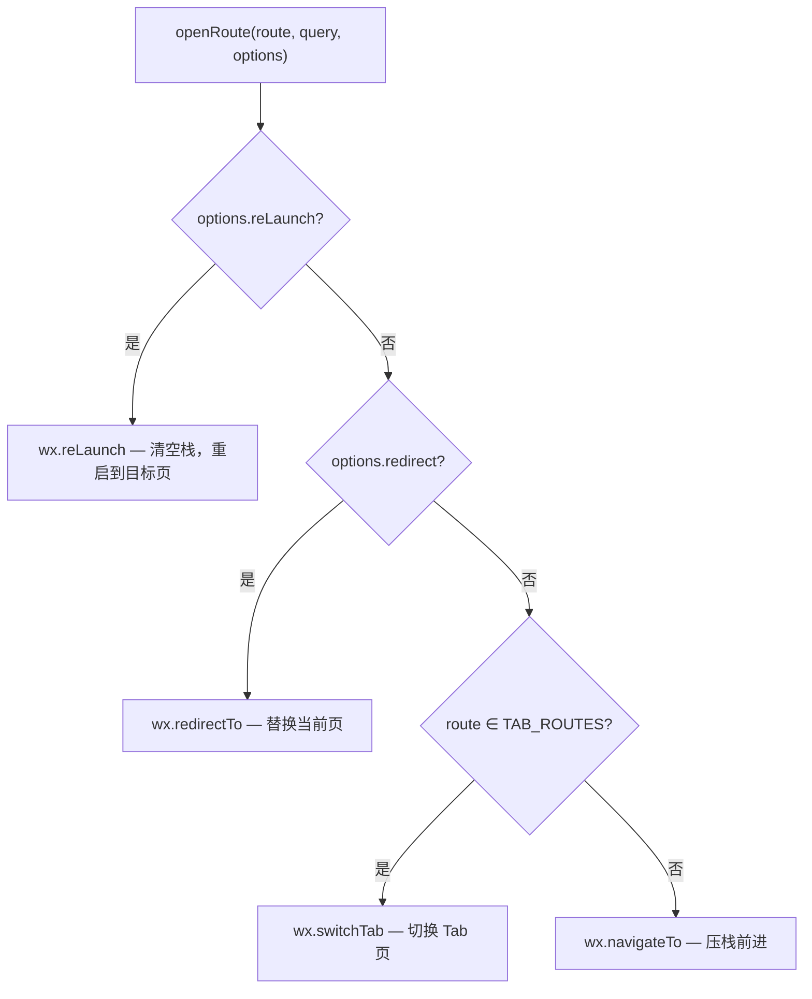
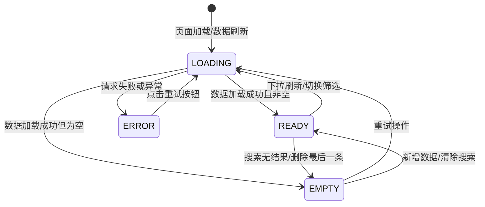
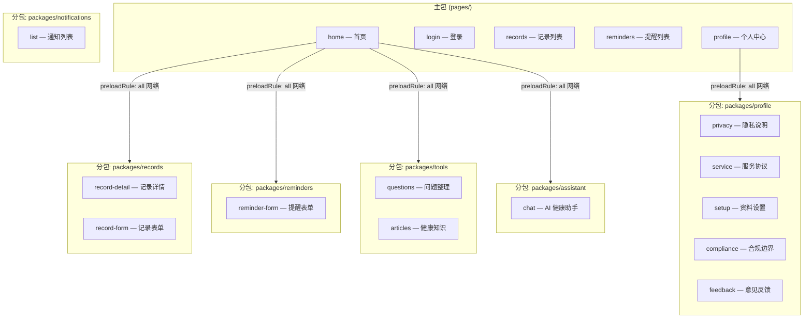
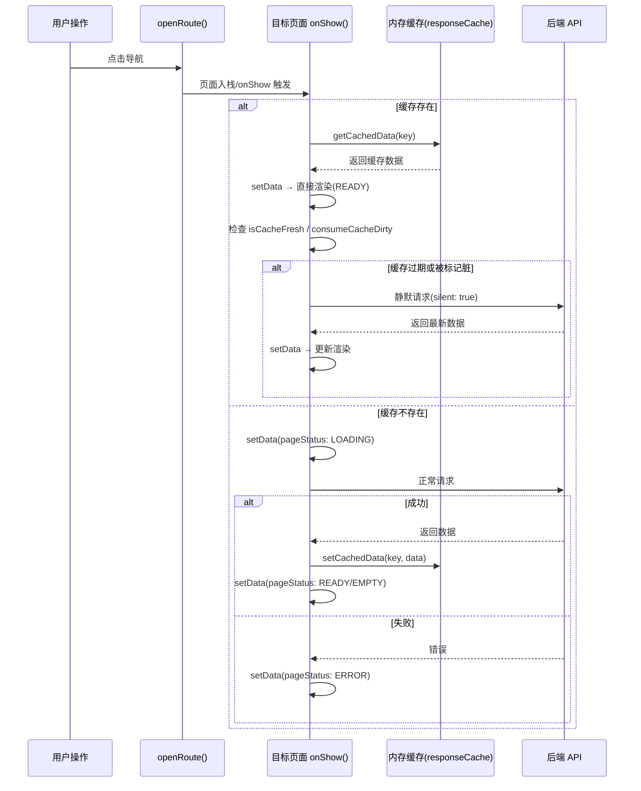
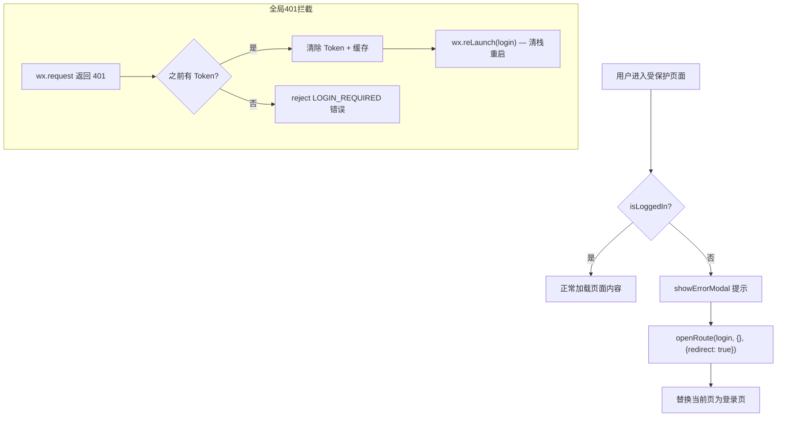

本文档系统阐述 CervixDetectAI 微信小程序的**路由注册与分发机制**、**页面状态生命周期模型**以及二者协同驱动的用户导航体验。内容聚焦于前端路由层和视图状态层的设计模式，不涉及具体的业务组件实现（参见[公共组件设计](14-gong-gong-zu-jian-she-ji)）或后端服务架构（参见[Express路由与中间件设计](15-expresslu-you-yu-zhong-jian-jian-she-ji)）。

## 路由注册表：统一路径字典

项目将所有可导航页面的路径集中定义在 `ROUTES` 字典中，消除了散落在各处的硬编码字符串。该字典是整个小程序路由体系的**单一事实来源**（Single Source of Truth），涵盖主包页面和全部六个分包页面。

```js
// 核心路由字典
const ROUTES = {
  login:          "/pages/login/index",
  home:           "/pages/home/index",
  records:        "/pages/records/index",
  reminders:      "/pages/reminders/index",
  profile:        "/pages/profile/index",
  recordDetail:   "/packages/records/record-detail/index",
  recordForm:     "/packages/records/record-form/index",
  reminderForm:   "/packages/reminders/reminder-form/index",
  questions:      "/packages/tools/questions/index",
  articles:       "/packages/tools/articles/index",
  privacy:        "/packages/profile/privacy/index",
  serviceAgreement:"/packages/profile/service/index",
  profileSetup:   "/packages/profile/setup/index",
  compliance:     "/packages/profile/compliance/index",
  feedback:       "/packages/profile/feedback/index",
  assistantChat:  "/packages/assistant/chat/index",
  notifications:  "/packages/notifications/list/index"
};
```

与之配合的 `TAB_ROUTES` 数组标识了四个底部 Tab 栏页面，导航分发逻辑依赖此数组决定是否使用 `switchTab` 而非普通 `navigateTo`。

```js
const TAB_ROUTES = [
  ROUTES.home,       // 首页
  ROUTES.records,    // 记录
  ROUTES.reminders,  // 提醒
  ROUTES.profile     // 我的
];
```

Sources: [navigation.js](miniprogram/utils/navigation.js#L1-L26)

## 路由分发器：openRoute 统一调度

`openRoute()` 是整个小程序唯一的导航入口函数，封装了微信四种导航 API 的选择逻辑。调用方只需传入路由名称和查询参数，无需关心底层使用哪种导航方式。



**分发策略详解**：

| 条件优先级 | 导航方式 | 使用场景 | 页面栈影响 |
|-----------|---------|---------|-----------|
| 1（最高） | `wx.reLaunch` | 登出后跳转登录页、Token 失效强制跳转 | 清空全部页面栈，仅保留目标页 |
| 2 | `wx.redirectTo` | 未登录用户进入表单页时重定向到登录页 | 替换栈顶页面，不增加栈深度 |
| 3 | `wx.switchTab` | Tab 栏页面间的切换 | 清空所有非 Tab 页面，切换到目标 Tab |
| 4（默认） | `wx.navigateTo` | 从列表进入详情、从首页进入子功能 | 压入新页面，栈深度 +1 |

`buildUrl()` 辅助函数负责将查询参数对象编码为 URL 查询字符串，自动过滤 `undefined`、`null` 和空字符串值，确保生成的 URL 干净有效。`navigateBackLater()` 则是对 `wx.navigateBack` 的轻量封装，用于表单提交成功或删除操作完成后回退到上一页。

Sources: [navigation.js](miniprogram/utils/navigation.js#L28-L58)

## 页面状态机：四态模型

项目定义了一个简洁的四态页面状态机，统一管理所有页面的视图渲染状态。该状态机的核心价值在于：**将"页面正在做什么"这一信息从各页面的私有逻辑中抽象出来，形成全局一致的状态语言**。



| 状态 | 枚举值 | 视图表现 | 典型触发时机 |
|------|-------|---------|------------|
| **LOADING** | `"loading"` | 骨架屏/加载占位符 | 首次进入页面、数据缓存未命中 |
| **READY** | `"ready"` | 正常业务内容展示 | 缓存命中或网络请求成功返回非空数据 |
| **EMPTY** | `"empty"` | 空状态引导提示 | 列表为空、搜索无匹配、未登录的访客模式 |
| **ERROR** | `"error"` | 错误信息 + 重试按钮 | 网络异常、服务端错误、无缓存可兜底 |

两个辅助解析函数分别服务于列表页和详情页的数据判空逻辑：

- **`resolveListStatus(items)`**：检查数组是否非空，返回 `READY` 或 `EMPTY`
- **`resolveDetailStatus(item)`**：检查单个对象是否存在，返回 `READY` 或 `EMPTY`

Sources: [page-state.js](miniprogram/utils/page-state.js#L1-L20)

## 分包路由与预加载策略

`app.json` 中定义了主包 + 六个分包的路由布局。主包仅保留五个核心页面（含四个 Tab 页），其余功能页面按职责域拆分到独立分包中，实现按需加载。



**预加载规则**的设计意图：当用户进入首页时，系统在任何网络条件下均提前加载 `records`、`reminders`、`tools`、`assistant` 四个分包——这些是用户从首页"快捷操作"入口最可能前往的目标。当用户进入"我的"页面时，预加载 `profile` 分包——该页面的菜单项全部指向此分包内的页面。`notifications` 分包未列入预加载，属于低频访问路径。

Sources: [app.json](miniprogram/app.json#L1-L69)

## 导航场景全景图

下表汇总了项目中所有实际导航调用的场景、所用导航方式和关键代码路径：

| 场景 | 源页面 | 目标页面 | 导航方式 | 查询参数 |
|------|-------|---------|---------|---------|
| 首页快捷操作卡片点击 | home | records / reminders / questions / articles / assistantChat | `navigateTo` 或 `switchTab` | — |
| 首页通知入口 | home | notifications | `navigateTo` | — |
| 首页"登录保存数据" | home | login | `navigateTo` | — |
| 记录列表 → 查看详情 | records | recordDetail | `navigateTo` | `{ id }` |
| 记录列表 → 新增记录 | records | recordForm | `navigateTo` | — |
| 记录列表 → 编辑记录 | records | recordForm | `navigateTo` | `{ id }` |
| 记录详情 → 编辑记录 | recordDetail | recordForm | `navigateTo` | `{ id }` |
| 记录详情 → 删除后返回 | recordDetail | (上一页) | `navigateBackLater` | — |
| 记录表单 → 保存后返回 | recordForm | (上一页) | `navigateBackLater` | — |
| 提醒列表 → 新增提醒 | reminders | reminderForm | `navigateTo` | — |
| 提醒列表 → 编辑提醒 | reminders | reminderForm | `navigateTo` | `{ id }` |
| 提醒表单 → 保存后返回 | reminderForm | (上一页) | `navigateBackLater` | — |
| 个人中心 → 菜单项 | profile | privacy / service / compliance / feedback / records / reminders / questions | `navigateTo` 或 `switchTab` | — |
| 个人中心 → 退出登录 | profile | login | `reLaunch` | — |
| 个人中心 → 跳转登录 | profile | login | `navigateTo` | — |
| 登录页 → 登录成功 | login | home | `navigateTo` | — |
| 登录页 → 查看隐私/协议 | login | privacy / serviceAgreement | `navigateTo` | — |
| 未登录 → 进入表单页 | recordForm / reminderForm | login | `redirectTo` | — |
| 401 Token 失效 | (任意页面) | login | `reLaunch` | — |

## 缓存优先渲染与脏标记同步

路由导航与页面状态机的协作核心在于**缓存优先渲染**（Cache-first Rendering）策略。当用户通过 `navigateTo` 或 `switchTab` 到达目标页时，页面不会立即显示加载态，而是先检查内存缓存，命中则直接渲染，再异步决定是否需要刷新。



**脏标记（Dirty Flag）机制**是跨页面数据同步的关键。当用户在子页面（如记录表单）执行增删改操作后，通过 `markCacheDirty(CACHE_KEYS.home)` 将关联的首页缓存标记为脏。当用户返回首页时，`onShow()` 中调用 `consumeCacheDirty()` 检测到脏标记后触发静默刷新，在不打断用户浏览的情况下更新数据。

各页面的 `onShow()` 生命周期是这套同步机制的触发点——由于 Tab 页在切换时不会重新 `onLoad`，但每次切回都会触发 `onShow`，这保证了跨 Tab 数据的一致性。

Sources: [request.js](miniprogram/utils/request.js#L37-L96), [home/index.js](miniprogram/pages/home/index.js#L139-L163), [records/index.js](miniprogram/pages/records/index.js#L110-L138), [record-form/index.js](miniprogram/packages/records/record-form/index.js#L362-L384)

## 鉴权拦截与强制跳转

项目采用**页面级鉴权守卫**模式：敏感页面在 `onLoad` 阶段主动检查登录状态，未登录时通过 `redirectTo` 跳转至登录页，避免用户通过页面栈返回绕过鉴权。同时，请求层的全局 401 拦截作为兜底防线。



`redirectLogin()` 函数实现了防抖逻辑——800ms 内的重复 401 只触发一次跳转，避免多个并发请求同时失效时反复重定向。登出操作使用 `reLaunch` 而非 `redirectTo`，是为了彻底清空页面栈，防止用户通过物理返回键回到已认证状态的页面。

Sources: [request.js](miniprogram/utils/request.js#L154-L173), [record-form/index.js](miniprogram/packages/records/record-form/index.js#L173-L178), [record-detail/index.js](miniprogram/packages/records/record-detail/index.js#L86-L91), [reminder-form/index.js](miniprogram/packages/reminders/reminder-form/index.js#L196-L200), [profile/index.js](miniprogram/pages/profile/index.js#L408-L416)

## 表单页的加载态管理

表单页（record-form、reminder-form）使用 `withPageLoading` 高阶函数包装异步操作，提供统一的 loading 状态管理。该函数在异步任务执行期间将 `page.data.loading` 设为 `true`，完成后恢复为 `false`，与页面 WXML 中的按钮禁用状态联动，防止重复提交。

```js
async function withPageLoading(page, task) {
  if (page.data.loading) return false; // 防重入
  page.setData({ loading: true });
  try {
    await task();
    return true;
  } finally {
    page.setData({ loading: false });
  }
}
```

表单提交成功后的标准流程为：更新本地缓存 → 标记关联缓存为脏 → 显示成功提示 → `navigateBackLater()` 返回上一页。上一页（列表页）在 `onShow` 中检测到脏标记后自动刷新，形成完整的数据闭环。

Sources: [form.js](miniprogram/utils/form.js#L1-L14), [record-form/index.js](miniprogram/packages/records/record-form/index.js#L362-L384), [reminder-form/index.js](miniprogram/packages/reminders/reminder-form/index.js#L379-L403)

## 全局事件与状态初始化

`app.js` 的 `onLaunch` 生命周期负责全局状态的初始化，这些状态间接影响路由决策：

- **设备标识**：首次启动时生成 `deviceId` 并持久化，后续复用
- **隐私协议状态**：读取 `privacyConsentAgreed` 存储值，决定是否需要展示隐私弹窗
- **版本更新检测**：监听小程序更新事件，提示用户重启以应用新版本
- **网络状态监听**：实时跟踪网络连接状态，存入 `globalData` 供各页面查询

这些全局状态不直接参与路由分发，但构成了页面渲染决策的环境上下文——例如未登录用户在首页看到的是访客模式占位内容而非加载态。

Sources: [app.js](miniprogram/app.js#L40-L75)

## 关键设计模式总结

| 设计模式 | 实现位置 | 解决的问题 |
|---------|---------|-----------|
| **路由字典（Route Registry）** | `navigation.js` ROUTES | 消除硬编码路径字符串，集中管理路由变更 |
| **统一导航分发（Navigation Dispatcher）** | `navigation.js` openRoute | 封装四种导航 API 的选择逻辑，调用方无需感知 |
| **四态页面状态机** | `page-state.js` PAGE_STATUS | 统一各页面的视图状态语言，标准化 loading/ready/empty/error 处理 |
| **缓存优先渲染** | `request.js` + 各页面 onShow | 有缓存即渲染，异步刷新，消除白屏等待 |
| **脏标记同步** | `request.js` markCacheDirty/consumeCacheDirty | 跨页面数据变更的通知机制，避免轮询 |
| **页面级鉴权守卫** | 各表单/详情页 onLoad | 在页面入口处拦截未授权访问 |
| **全局 401 兜底** | `request.js` redirectLogin | 处理 Token 过期的异步场景 |
| **表单 loading 防重入** | `form.js` withPageLoading | 防止重复提交，统一按钮禁用逻辑 |
| **分包预加载** | `app.json` preloadRule | 提前加载高频访问分包，减少页面切换延迟 |