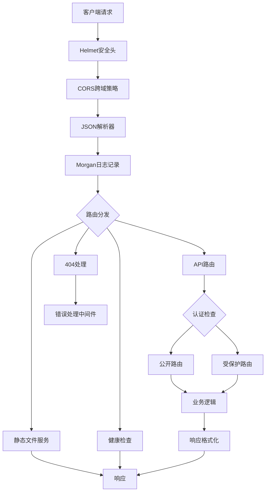
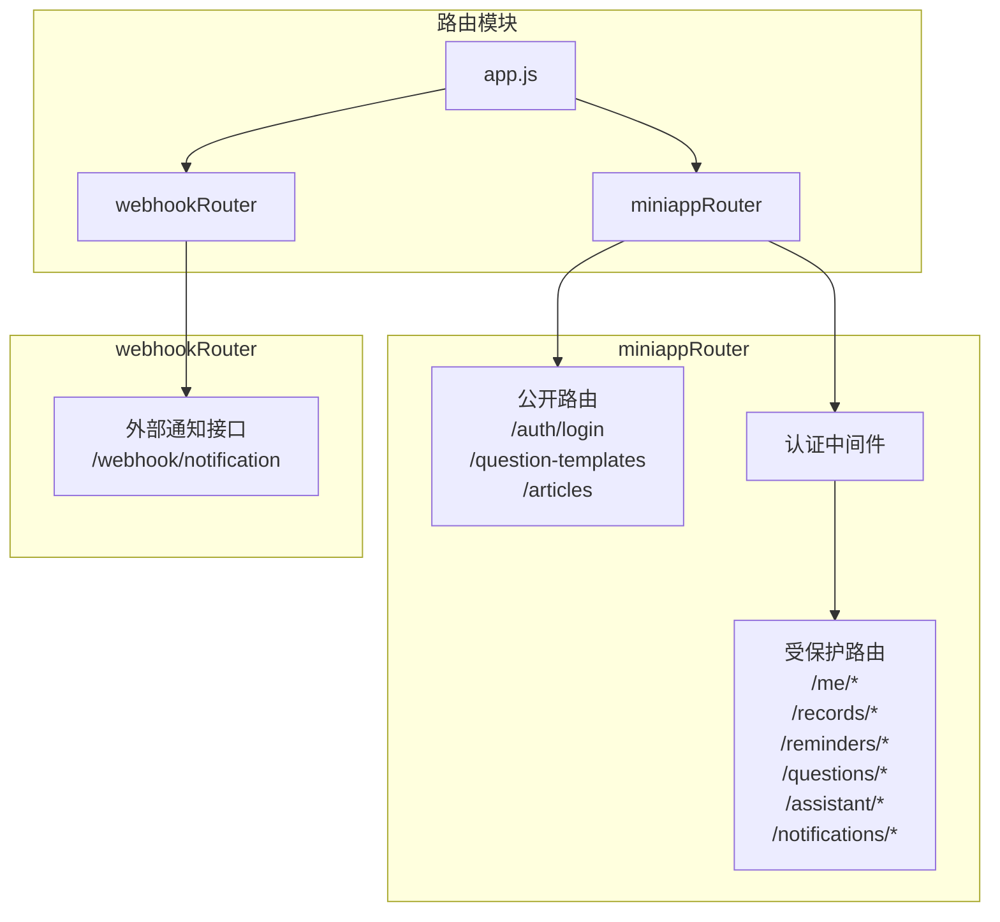
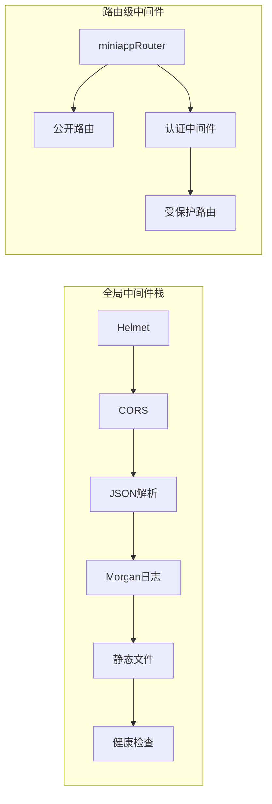
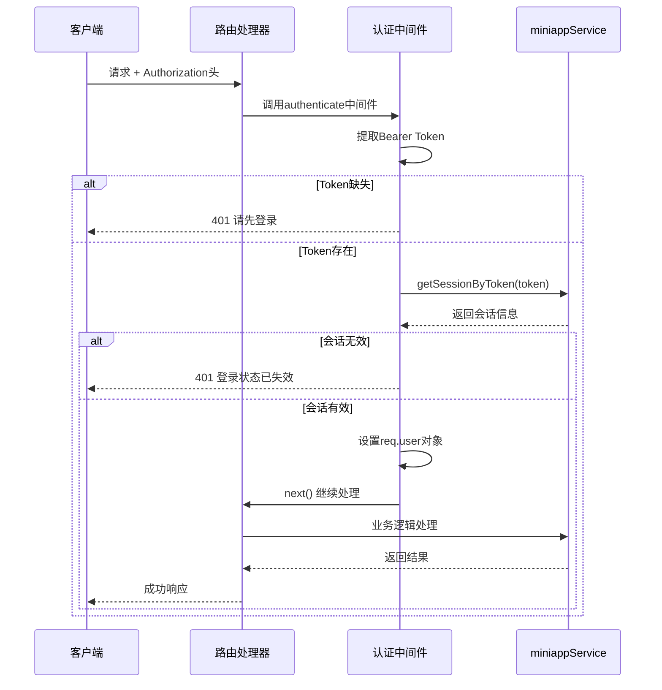
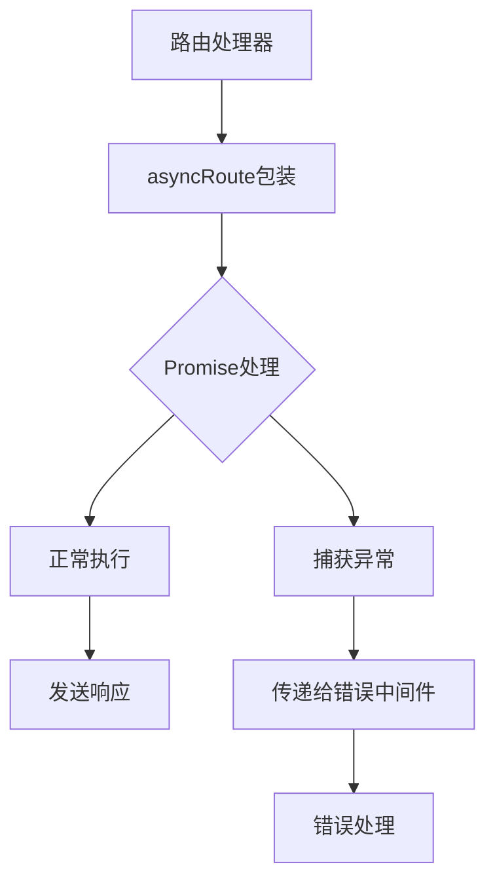
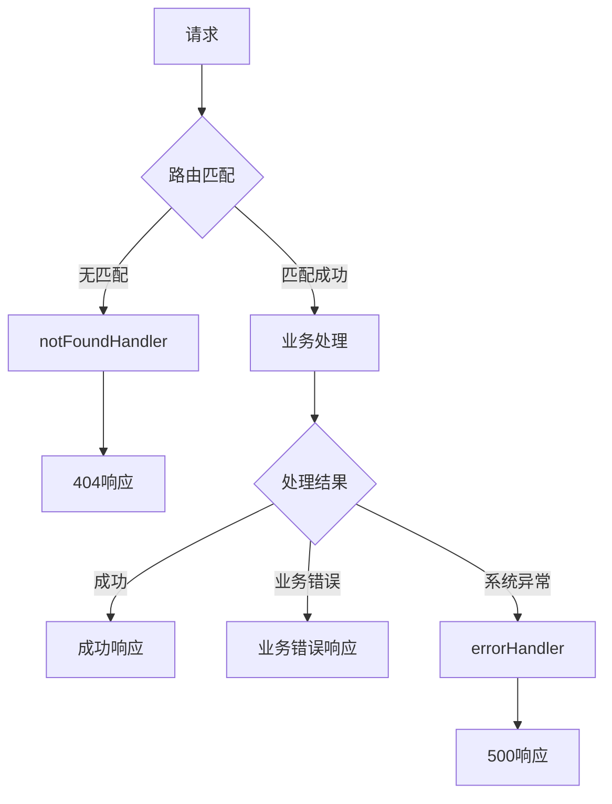

本文档深入解析CervixDetectAI微信小程序后端服务的Express路由架构与中间件设计模式。通过分析路由组织结构、中间件执行流程、认证机制以及错误处理策略，帮助开发者理解系统的请求处理管线与安全防护体系。

## 架构概览与请求处理流程

系统采用经典的Express分层架构，请求经过一系列中间件处理后最终到达路由处理器。整个流程遵循"安全前置、日志记录、业务处理、错误兜底"的设计原则。



在`server/src/app.js`中，中间件按严格顺序注册：首先是安全相关的Helmet和CORS，然后是请求体解析和日志记录，接着是静态文件服务，最后才是业务路由。这种顺序确保安全策略在业务逻辑之前生效。

Sources: [app.js](server/src/app.js#L1-L51)

## 路由模块组织结构

系统将路由逻辑拆分为两个独立的Router实例，分别处理小程序核心业务和外部系统集成。



**路由职责划分**：
- `miniappRouter`：处理小程序所有核心业务逻辑，包括用户认证、记录管理、提醒设置等
- `webhookRouter`：提供外部系统集成接口，目前预留了通知推送功能

这种分离设计遵循单一职责原则，使得路由模块职责清晰，便于独立测试和维护。

Sources: [app.js](server/src/app.js#L39-L41), [miniapp.js](server/src/routes/miniapp.js#L1-L192), [webhook.js](server/src/routes/webhook.js#L1-L42)

## 中间件执行顺序与配置策略

中间件的注册顺序直接影响请求处理流程。系统采用分层配置策略，将通用中间件与业务中间件分离。



**安全中间件配置**：
1. **Helmet**：设置安全HTTP头，特别配置了`crossOriginResourcePolicy: "cross-origin"`以允许跨域资源嵌入
2. **CORS**：通过环境变量`MINIAPP_ALLOWED_ORIGIN`控制允许的源，默认值为`"*"`
3. **JSON解析器**：限制请求体大小为3MB，防止大文件攻击
4. **Morgan**：使用"dev"格式记录请求日志

**静态文件服务**：
- `/uploads`：存储用户头像等上传文件，设置跨域头以支持小程序渲染层加载
- `/agreements`：存放隐私协议等公开文档

Sources: [app.js](server/src/app.js#L15-L28), [env.js](server/src/config/env.js#L6)

## 认证机制与路由保护策略

系统采用Bearer Token认证，通过中间件实现路由级别的访问控制。认证逻辑集中在`auth.js`中间件中，确保一致性。



**认证策略特点**：
1. **选择性保护**：在`miniapp.js`第30行，`router.use(authenticate)`之前的路由（登录、问题模板、文章）无需认证
2. **统一错误格式**：认证失败返回统一的`{success: false, message: "..."}`格式
3. **会话验证**：通过`miniappService.getSessionByToken()`验证token有效性
4. **用户信息注入**：认证成功后将用户ID和token注入`req.user`对象

**公开路由列表**：
- `POST /api/miniapp/auth/login` - 用户登录
- `GET /api/miniapp/question-templates` - 获取问题模板
- `GET /api/miniapp/articles` - 获取文章列表

Sources: [auth.js](server/src/middleware/auth.js#L1-L34), [miniapp.js](server/src/routes/miniapp.js#L18-L30)

## 异步路由处理与错误捕获

系统采用通用的`asyncRoute`包装器处理异步操作，避免在每个路由处理器中重复编写try-catch逻辑。



**asyncRoute实现模式**：
```javascript
function asyncRoute(handler) {
  return (req, res, next) => {
    Promise.resolve(handler(req, res, next)).catch(next);
  };
}
```

这种模式的优势：
1. **代码简洁**：路由处理器只需关注业务逻辑，无需编写错误处理代码
2. **统一错误处理**：所有异步错误都会传递到Express错误处理中间件
3. **Promise兼容**：支持返回Promise的异步函数
4. **向后兼容**：也支持传统回调风格的路由处理器

Sources: [miniapp.js](server/src/routes/miniapp.js#L12-L16), [webhook.js](server/src/routes/webhook.js#L6-L8)

## 错误处理与响应标准化

系统采用双层错误处理策略：404处理和通用错误处理，确保所有请求都能得到适当的响应。



**错误处理中间件设计**：
1. **notFoundHandler**：处理所有未匹配的路由，返回404状态码和"接口不存在"消息
2. **errorHandler**：通用错误处理，根据错误状态码决定响应消息
   - 状态码≥500：返回"服务暂时不可用，请稍后再试"（隐藏技术细节）
   - 状态码<500：返回具体错误消息（便于前端提示用户）

**响应格式标准化**：
所有API响应都遵循统一的JSON格式：
```json
{
  "success": true/false,
  "data": {...},  // 成功时的业务数据
  "message": "..." // 错误时的提示信息
}
```

Sources: [errorHandler.js](server/src/middleware/errorHandler.js#L1-L21), [miniapp.js](server/src/routes/miniapp.js#L8-L10)

## 路由参数验证与业务逻辑分离

系统在路由层面进行基本的参数验证，复杂的业务逻辑验证则委托给服务层处理。

**路由层验证示例**：
```javascript
// miniapp.js 第161-166行
router.post("/assistant/explain", asyncRoute(async (req, res) => {
  const term = String(req.body?.term || "").trim();
  if (!term) return res.status(400).json({ success: false, message: "请输入需要解释的术语" });
  const result = await aiAssistant.explainTerm(term);
  ok(res, result);
}));
```

**验证策略分层**：
1. **路由层**：基础格式验证（如必填字段、类型检查）
2. **服务层**：业务规则验证（如用户权限、数据一致性）
3. **数据库层**：约束验证（如唯一性、外键关系）

这种分层验证确保了代码的职责清晰，同时提供了多层安全防护。

Sources: [miniapp.js](server/src/routes/miniapp.js#L161-L166)

## Webhook接口安全设计

外部系统集成接口采用secret验证机制，确保只有授权的外部系统才能调用。

**安全验证流程**：
1. 从请求体中提取secret参数
2. 与环境变量`WEBHOOK_SECRET`比对
3. 验证必填字段（userId、title、content）
4. 创建通知记录

**安全考虑**：
- secret验证失败返回403状态码
- 缺少必填字段返回400状态码
- 使用环境变量存储secret，避免硬编码
- 接口设计为幂等操作

Sources: [webhook.js](server/src/routes/webhook.js#L17-L39), [env.js](server/src/config/env.js#L32-L34)

## 性能优化与监控

系统通过多种机制优化性能并提供监控能力：

1. **数据库连接池**：通过`mysql2`的连接池管理，限制最大连接数为10
2. **请求体大小限制**：JSON解析器限制为3MB，防止大文件攻击
3. **代理信任设置**：`app.set("trust proxy", 1)`支持反向代理环境
4. **请求日志**：Morgan记录详细的请求信息，便于性能分析和问题排查

**监控端点**：
- `GET /health`：健康检查接口，返回服务状态和数据库信息

Sources: [app.js](server/src/app.js#L14-L37), [env.js](server/src/config/env.js#L21-L23)

## 扩展性与维护性设计

路由架构设计考虑了未来的扩展需求：

1. **模块化路由**：新的业务功能可以轻松添加为独立的路由模块
2. **中间件复用**：认证等通用中间件可以在不同路由模块中复用
3. **环境配置**：通过环境变量控制行为，便于不同环境部署
4. **错误处理标准化**：统一的错误响应格式便于前端处理

**添加新路由的步骤**：
1. 在`server/src/routes/`目录下创建新的路由文件
2. 实现路由逻辑和必要的中间件
3. 在`app.js`中注册新的路由模块
4. 更新API文档

Sources: [app.js](server/src/app.js#L39-L41), [miniapp.js](server/src/routes/miniapp.js#L1-L192)

## 配置依赖与环境要求

系统依赖以下核心npm包：
- **express** (^4.18.3)：Web框架核心
- **cors** (^2.8.5)：跨域资源共享中间件
- **helmet** (^7.1.0)：安全HTTP头设置
- **morgan** (^1.10.0)：HTTP请求日志记录
- **mysql2** (^3.11.5)：MySQL数据库驱动
- **dotenv** (^16.4.7)：环境变量加载

**环境变量配置**：
- `PORT`：服务端口（默认3789）
- `HOST`：监听地址（默认0.0.0.0）
- `MINIAPP_ALLOWED_ORIGIN`：CORS允许的源
- `WECHAT_*`：微信小程序相关配置
- `DB_*`：数据库连接配置
- `AI_*`：AI服务配置
- `WEBHOOK_SECRET`：Webhook验证密钥

Sources: [package.json](server/package.json#L11-L18), [env.js](server/src/config/env.js#L1-L36)

## 最佳实践与设计模式总结

1. **安全优先**：所有安全相关中间件在业务逻辑之前执行
2. **关注点分离**：路由、服务、数据访问层职责清晰
3. **错误处理统一**：标准化的错误响应和集中式错误处理
4. **异步处理简化**：asyncRoute包装器减少样板代码
5. **配置外部化**：通过环境变量管理所有配置项
6. **监控内置**：健康检查端点便于运维监控

这种架构设计平衡了开发效率、系统安全性和可维护性，为微信小程序后端服务提供了坚实的基础。