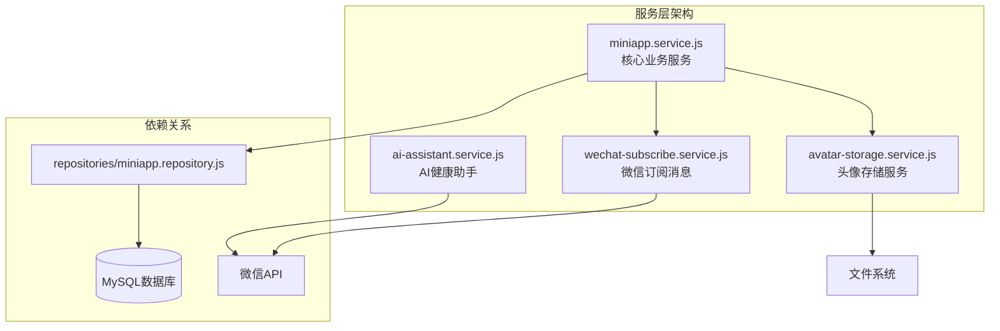
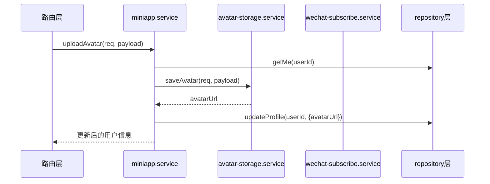

业务服务层是 CervixDetectAI 后端架构的核心协调者，负责在路由层与数据访问层之间实施业务规则、数据验证和合规性检查。该层采用**集中式服务协调模式**，通过 `miniapp.service.js` 统一管理所有业务逻辑，同时将特定职责委托给专用服务组件。

## 服务层整体结构

服务层由四个独立的服务模块组成，形成清晰的职责边界：



**核心服务（miniapp.service.js）** 承担了80%的业务逻辑，包括用户管理、健康记录、复查提醒、问题整理、反馈处理和通知管理。这种集中式设计简化了服务间的依赖关系，使得业务流程的追踪和维护更加直观。

Sources: [miniapp.service.js](server/src/services/miniapp.service.js#L1-L431)

## 服务层的职责边界

服务层在分层架构中扮演着**业务逻辑执行者**和**数据转换器**的双重角色：

| 职责类型 | 具体实现 | 示例函数 |
|---------|---------|---------|
| **数据验证** | 字段必填检查、格式验证、长度限制 | `requireText()`、`requireDate()` |
| **数据清洗** | 去除空白字符、标准化格式、类型转换 | `cleanText()`、`normalizeRecordPayload()` |
| **合规性检查** | 医疗术语拦截、敏感词过滤 | `assertComplianceText()` |
| **业务编排** | 协调多个数据源、构建复合响应 | `getHome()`、`sendRecordReportSubscription()` |
| **外部集成** | 调用微信API、文件存储操作 | `wechatSubscribe.sendSubscribeMessage()` |

这种职责划分确保了路由层仅负责HTTP协议处理，而数据访问层专注于SQL操作，业务逻辑被有效隔离在服务层内。

Sources: [miniapp.service.js](server/src/services/miniapp.service.js#L25-L181)

## 数据验证与清洗机制

服务层实现了系统化的数据验证策略，通过一系列辅助函数确保输入数据的质量：

```javascript
// 验证链模式示例
function requireText(value, fieldName, maxLength = 500) {
  const text = cleanText(value, maxLength);      // 1. 清洗
  if (!text) {                                    // 2. 必填检查
    const error = new Error(`${fieldName}不能为空`);
    error.status = 400;
    throw error;
  }
  assertComplianceText(text, fieldName);          // 3. 合规检查
  return text;
}
```

**关键验证函数**：
- `cleanText(value, maxLength)`: 基础清洗，去除空白并截断
- `requireText(value, fieldName, maxLength)`: 必填字段验证
- `requireDate(value, fieldName)`: 日期格式验证（YYYY-MM-DD）
- `assertComplianceText(text, fieldName)`: 医疗术语合规检查

**负载规范化函数**：
- `normalizeRecordPayload()`: 规范化健康记录数据
- `normalizeReminderPayload()`: 规范化复查提醒数据
- `normalizeQuestionPayload()`: 规范化问题数据

这些函数共同构建了一个防御性编程层，确保所有进入业务逻辑的数据都符合预期格式和业务规则。

Sources: [miniapp.service.js](server/src/services/miniapp.service.js#L25-L181)

## 合规词拦截机制

为满足医疗健康类小程序的监管要求，服务层实现了严格的合规性检查：

```javascript
const PROHIBITED_SERVICE_TERMS = [
  "AI诊断", "辅助诊断", "在线诊断", "在线问诊",
  "诊疗建议", "治疗方案", "处方代开", "疾病预测",
  "病变识别", "挂号缴费"
];

function assertComplianceText(text, fieldName) {
  const value = String(text || "");
  const matchedTerm = PROHIBITED_SERVICE_TERMS.find((term) => value.indexOf(term) > -1);
  if (!matchedTerm) return;

  const error = new Error(`${fieldName}包含"${matchedTerm}"等本小程序不提供的服务内容，请改为健康记录或线下咨询准备描述`);
  error.status = 400;
  throw error;
}
```

**拦截范围**：
- 用户输入字段：昵称、记录标题、摘要、建议等
- AI助手响应：通过 `sanitizeOutput()` 过滤敏感术语
- 微信模板消息：确保消息内容符合平台规范

**错误处理流程**：
1. 检测到敏感术语时抛出400错误
2. 错误信息明确指出违规术语和修改建议
3. 前端通过Toast显示错误信息
4. 记录被阻止，避免合规风险

Sources: [miniapp.service.js](server/src/services/miniapp.service.js#L10-L95)

## 服务间协作模式

服务层采用**依赖注入**和**委托模式**实现服务间的协作：



**协作模式特点**：
1. **单一入口原则**：路由层只与 `miniapp.service` 交互
2. **职责委托**：特定功能委托给专用服务（头像存储、消息发送）
3. **数据聚合**：服务层聚合多个数据源构建复合响应
4. **错误传播**：下层错误在服务层被捕获并重新包装

Sources: [miniapp.service.js](server/src/services/miniapp.service.js#L217-L224)

## 微信订阅消息服务

`wechat-subscribe.service.js` 封装了微信订阅消息的发送逻辑，提供统一的API：

| 功能 | 方法 | 说明 |
|-----|------|------|
| **获取访问令牌** | `getAccessToken()` | 带缓存的令牌获取，自动刷新 |
| **发送订阅消息** | `sendSubscribeMessage(payload)` | 统一消息发送接口 |
| **错误映射** | `knownMessages` | 微信错误码到用户友好消息的映射 |

**令牌管理策略**：
```javascript
let tokenCache = {
  token: "",
  expiresAt: 0
};

async function getAccessToken() {
  // 检查缓存，提前60秒刷新
  if (tokenCache.token && tokenCache.expiresAt - now > 60 * 1000) {
    return tokenCache.token;
  }
  // 获取新令牌并更新缓存
}
```

**消息模板支持**：
- 报告查看提醒：`REPORT_TEMPLATE_ID`
- 复查提醒：`REMINDER_TEMPLATE_ID`
- 模板数据通过 `buildReportMessageData()` 和 `buildReminderMessageData()` 构建

Sources: [wechat-subscribe.service.js](server/src/services/wechat-subscribe.service.js#L1-L99)

## 头像存储服务

`avatar-storage.service.js` 处理用户头像的上传和存储：

**处理流程**：
1. **格式验证**：支持JPG、PNG、WebP格式
2. **大小限制**：最大2MB
3. **内容验证**：通过文件魔数检测实际格式
4. **安全存储**：使用随机文件名防止冲突
5. **URL生成**：基于配置的公共基础URL生成访问地址

```javascript
async function saveAvatar(req, payload) {
  const { buffer, extension } = decodeAvatar(payload);
  await fs.mkdir(AVATAR_DIR, { recursive: true });
  
  const fileName = `${req.user.id}-${Date.now()}-${crypto.randomBytes(6).toString("hex")}.${extension}`;
  const filePath = path.join(AVATAR_DIR, fileName);
  await fs.writeFile(filePath, buffer);
  
  return `${resolvePublicBaseUrl(req)}/uploads/avatars/${fileName}`;
}
```

**安全特性**：
- 文件内容与扩展名一致性验证
- 随机文件名防止目录遍历攻击
- 基于用户ID的文件组织

Sources: [avatar-storage.service.js](server/src/services/avatar-storage.service.js#L1-L104)

## AI助手服务

`ai-assistant.service.js` 提供健康科普AI助手功能，集成阿里云DashScope服务：

**功能矩阵**：

| 功能 | 方法 | 特点 |
|-----|------|------|
| **普通对话** | `chat()` | 完整响应，适合简单查询 |
| **流式对话** | `chatStream()` | SSE流式响应，提升用户体验 |
| **术语解释** | `explainTerm()` | 专业术语的通俗化解释 |

**合规性保障**：
```javascript
const SYSTEM_PROMPT = `你是一个女性健康科普助手...你绝对不提供以下内容：
- 医疗诊断或诊断结论
- 治疗方案或处方建议
- 在线问诊服务...`;
```

**响应处理流程**：
1. 合规性预检查：拦截敏感问题
2. 消息历史构建：保留最近10条对话
3. AI服务调用：通过DashScope API
4. 响应后处理：过滤敏感术语、添加免责声明

Sources: [ai-assistant.service.js](server/src/services/ai-assistant.service.js#L1-L234)

## 错误处理策略

服务层采用分层错误处理机制：

```javascript
function createStatusError(message, status = 500) {
  const error = new Error(message);
  error.status = status;
  return error;
}
```

**错误类型分类**：
- **400 Bad Request**：输入验证失败、合规词拦截
- **401 Unauthorized**：认证失败、令牌过期
- **404 Not Found**：资源不存在
- **500 Internal Server Error**：系统内部错误
- **502 Bad Gateway**：外部服务调用失败

**错误传播机制**：
1. 服务层抛出带状态码的错误
2. 路由层通过 `asyncRoute` 捕获
3. `errorHandler` 中间件统一处理
4. 返回标准化错误响应 `{ success: false, message }`

Sources: [errorHandler.js](server/src/middleware/errorHandler.js#L1-L21)

## 数据访问层集成

服务层通过 `miniapp.repository` 与数据库交互，遵循**仓储模式**：

**映射函数**：
- `mapUser()`: 数据库行 → 用户对象
- `mapRecord()`: 数据库行 → 健康记录对象
- `mapReminder()`: 数据库行 → 提醒对象
- `mapQuestion()`: 数据库行 → 问题对象

**数据转换示例**：
```javascript
function mapRecord(row) {
  return {
    id: row.id,
    date: row.record_date,
    title: row.title,
    project: row.project,
    // ... 其他字段
    attachments: parseJsonField(row.attachments)
  };
}
```

**JSON字段处理**：
```javascript
function parseJsonField(value) {
  if (!value) return [];
  if (Array.isArray(value)) return value;
  try {
    const parsed = JSON.parse(value);
    return Array.isArray(parsed) ? parsed : [];
  } catch {
    return [];
  }
}
```

这种映射确保了数据访问层返回的对象结构与前端期望的格式一致，隐藏了数据库实现细节。

Sources: [miniapp.repository.js](server/src/repositories/miniapp.repository.js#L26-L85)

## 性能优化策略

服务层实现了多项性能优化措施：

1. **数据缓存**：
   - 微信访问令牌缓存，避免频繁API调用
   - 前端内存缓存配合，减少重复请求

2. **批量操作**：
   - `saveQuestions()` 支持批量保存问题
   - `markAllNotificationsRead()` 批量标记通知为已读

3. **查询优化**：
   - 限制返回字段，避免SELECT *
   - 分页查询支持（通知列表）
   - 条件过滤减少数据传输

4. **连接管理**：
   - 使用MySQL连接池
   - 连接数限制（默认10）
   - 自动连接回收

Sources: [database.js](server/src/config/database.js#L1-L23)

## 配置管理

服务层依赖集中的环境配置：

```javascript
// env.js 关键配置
module.exports = {
  wechat: {
    appId: process.env.WECHAT_APP_ID,
    appSecret: process.env.WECHAT_APP_SECRET,
    // 消息模板ID
  },
  database: {
    host: process.env.DB_HOST,
    connectionLimit: 10,
    // 数据库连接配置
  },
  ai: {
    apiKey: process.env.AI_API_KEY,
    baseUrl: "https://dashscope.aliyuncs.com/api/v1",
    model: "qwen-turbo",
    // AI服务配置
  }
};
```

**配置验证**：服务层在关键操作前验证必要配置是否存在，如微信AppID/AppSecret、AI服务API密钥等，确保服务不会因配置缺失而运行异常。

Sources: [env.js](server/src/config/env.js#L1-L36)

## 下一步阅读

了解业务服务层架构后，建议按以下顺序深入：

1. **[数据库访问层实现](17-shu-ju-ku-fang-wen-ceng-shi-xian)** - 了解服务层如何与数据库交互
2. **[Express路由与中间件设计](15-expresslu-you-yu-zhong-jian-jian-she-ji)** - 理解请求处理流程
3. **[鉴权机制与会话管理](18-jian-quan-ji-zhi-yu-hui-hua-guan-li)** - 深入认证授权机制
4. **[核心业务实体关系](20-he-xin-ye-wu-shi-ti-guan-xi)** - 理解数据模型设计