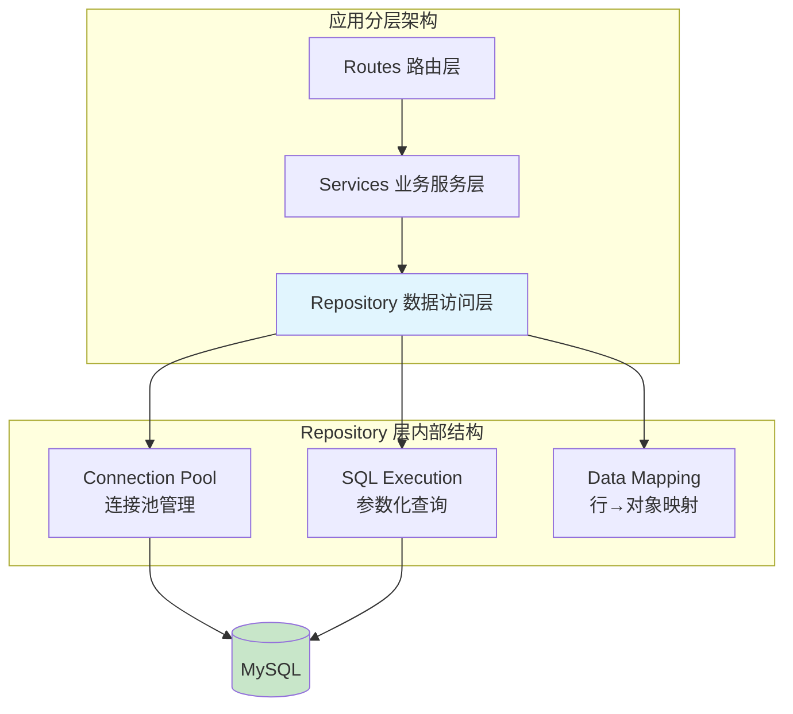
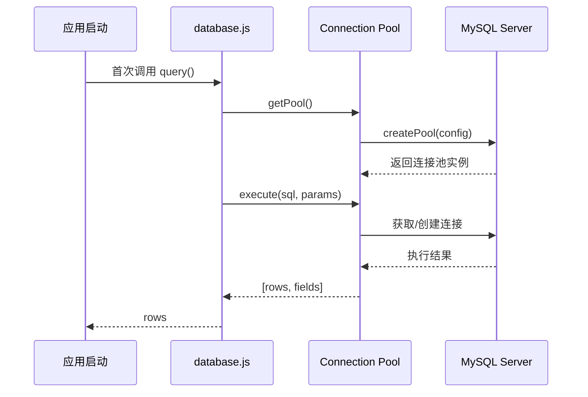
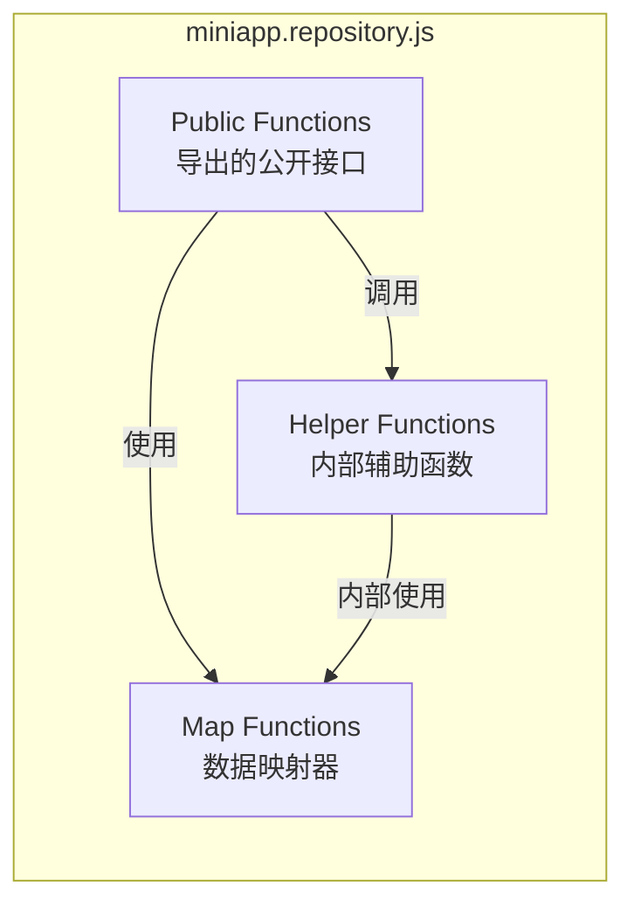
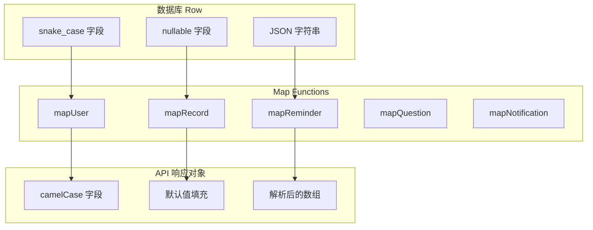
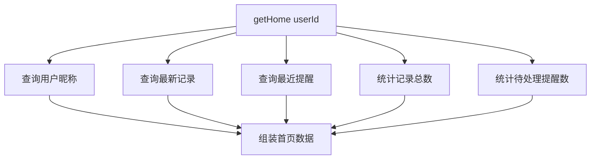
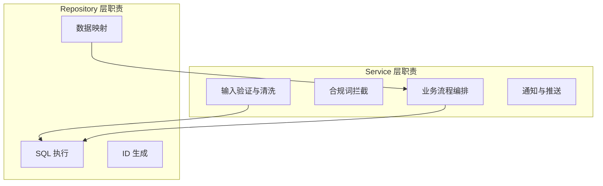

数据库访问层（Repository Layer）是 CervixDetectAI 小程序后端与 MySQL 数据库交互的唯一通道。它将所有 SQL 操作封装在单一模块中，为上层业务服务提供清晰、一致的数据访问接口。本文档将深入剖析这一层的架构设计、核心实现细节以及与 Service 层的协作模式。

## 架构总览

数据库访问层位于服务端分层架构的最底层，向上为业务服务层提供数据操作抽象，向下直接与 MySQL 数据库交互。



Sources: [miniapp.repository.js](server/src/repositories/miniapp.repository.js#L1-L4), [miniapp.service.js](server/src/services/miniapp.service.js#L1-L6)

## 连接池管理

连接池是数据库访问的基础设施，负责高效复用数据库连接。系统采用 **mysql2/promise** 驱动实现基于 Promise 的异步连接池。



连接池配置通过环境变量注入，核心参数如下表所示：

| 配置项 | 环境变量 | 默认值 | 说明 |
|--------|----------|--------|------|
| host | DB_HOST | 127.0.0.1 | 数据库主机地址 |
| port | DB_PORT | 3306 | 数据库端口 |
| database | DB_NAME | cervixdetectai_wx | 数据库名称 |
| user | DB_USER | root | 数据库用户名 |
| password | DB_PASSWORD | (空) | 数据库密码 |
| connectionLimit | DB_CONNECTION_LIMIT | 10 | 最大连接数 |
| charset | - | utf8mb4 | 字符编码 |
| waitForConnections | - | true | 无可用连接时排队等待 |

Sources: [database.js](server/src/config/database.js#L1-L21), [env.js](server/src/config/env.js#L15-L24)

连接池采用 **懒初始化** 模式——仅在首次查询调用时创建池实例，避免启动时的无效连接开销。`query()` 函数封装了 `pool.execute()` 调用，解构返回的 `[rows, fields]` 元组，仅暴露 `rows` 给调用方：

```javascript
// database.js 核心实现
async function query(sql, params = []) {
  const [rows] = await getPool().execute(sql, params);
  return rows;
}
```

Sources: [database.js](server/src/config/database.js#L13-L16)

## Repository 模式设计

### 设计原则

系统采用 **单文件模块化** Repository 模式，而非传统的类继承体系。选择函数式导出而非类实例化，体现了以下设计考量：

- **简化依赖管理**：无继承链、无实例化参数，导入即可使用
- **函数粒度组合**：每个数据库操作作为独立函数，易于测试和替换
- **Map 与 Reduce 分离**：数据映射逻辑与业务查询逻辑解耦



Sources: [miniapp.repository.js](server/src/repositories/miniapp.repository.js#L643-L674)

### 导出接口清单

Repository 模块导出 **25 个公开函数**，覆盖用户、记录、提醒、问题、文章、反馈和通知七大业务领域：

| 业务域 | 函数名 | 功能 |
|--------|--------|------|
| 用户认证 | `login` | 微信登录并创建会话 |
| | `getSessionByToken` | 验证会话令牌 |
| | `getMe` | 获取当前用户信息 |
| | `getUserOpenid` | 获取用户 openid |
| | `updateProfile` | 更新用户资料 |
| 健康记录 | `getHome` | 首页聚合数据 |
| | `listRecords` | 记录列表查询 |
| | `getRecordById` | 单条记录详情 |
| | `createRecord` | 新增记录 |
| | `updateRecord` | 更新记录 |
| | `deleteRecord` | 删除记录 |
| 复查提醒 | `listReminders` | 提醒列表查询 |
| | `getReminderById` | 单条提醒详情 |
| | `createReminder` | 新增提醒 |
| | `updateReminder` | 更新提醒 |
| | `completeReminder` | 标记完成 |
| | `deleteReminder` | 删除提醒 |
| 问题管理 | `listQuestionTemplates` | 问题模板列表 |
| | `listQuestions` | 用户问题列表 |
| | `saveQuestions` | 批量保存问题 |
| | `createQuestion` | 新增问题 |
| | `updateQuestion` | 更新问题 |
| | `deleteQuestion` | 删除问题 |
| 其他 | `listArticles` | 文章列表 |
| | `createFeedback` | 创建反馈 |
| | `listNotifications` | 通知列表 |
| | `getUnreadCount` | 未读通知数 |
| | `markNotificationRead` | 标记单条已读 |
| | `markAllNotificationsRead` | 全部标记已读 |
| | `createNotification` | 创建通知 |

Sources: [miniapp.repository.js](server/src/repositories/miniapp.repository.js#L643-L674)

## 数据映射与转换

数据映射器（Map Functions）负责将数据库行（Row）转换为前端友好的对象结构，实现数据库模型与 API 响应模型的解耦。

### 映射函数设计



以 `mapRecord` 为例，展示了完整的数据转换逻辑：

| 数据库字段 | 映射逻辑 | API 字段 |
|------------|----------|----------|
| `id` | 直接映射 | `id` |
| `record_date` | 重命名 | `date` |
| `title` | 直接映射 | `title` |
| `hospital` | 空值默认 `""` | `hospital` |
| `attachments` | JSON 解析 | `attachments` |

Sources: [miniapp.repository.js](server/src/repositories/miniapp.repository.js#L36-L50)

### JSON 字段处理

`parseJsonField` 函数提供防御性 JSON 解析，处理三种场景：

1. **null/undefined**：返回空数组 `[]`
2. **已是数组**：直接返回
3. **JSON 字符串**：解析后返回，解析失败则返回空数组

```javascript
function parseJsonField(value) {
  if (!value) return [];
  if (Array.isArray(value)) return value;
  try {
    const parsed = JSON.parse(value);
    return Array.isArray(parsed) ? parsed : [];
  } catch {
    return [];
  }
}
```

Sources: [miniapp.repository.js](server/src/repositories/miniapp.repository.js#L52-L61)

## 查询模式详解

### 参数化查询

所有 SQL 查询均使用 **参数化占位符** `?`，由 mysql2 驱动自动转义参数，杜绝 SQL 注入风险：

```javascript
// 正确的参数化查询示例
await db.query(
  "SELECT id, nickname FROM wx_users WHERE id = ? LIMIT 1",
  [userId]
);
```

### UPSERT 模式

登录流程采用 `INSERT ... ON DUPLICATE KEY UPDATE` 实现用户信息的幂等更新，利用 `openid` 唯一索引避免重复用户：

```sql
INSERT INTO wx_users (openid, nickname, avatar_url, phone, created_at, updated_at)
VALUES (?, ?, ?, ?, NOW(), NOW())
ON DUPLICATE KEY UPDATE
  nickname = VALUES(nickname),
  avatar_url = COALESCE(VALUES(avatar_url), avatar_url),
  phone = COALESCE(VALUES(phone), phone),
  updated_at = CURRENT_TIMESTAMP
```

`COALESCE` 函数确保只在新值非空时覆盖旧值，保护用户已有数据不被意外清空。

Sources: [miniapp.repository.js](server/src/repositories/miniapp.repository.js#L156-L167)

### 返回-读取模式

创建或更新操作后，Repository 会立即读取最新数据并返回完整的业务对象，而非返回插入 ID 或 affectedRows：

```javascript
async function createRecord(userId, payload) {
  const id = createCompactId();
  await db.query( /* INSERT SQL */ );
  return getRecordById(userId, id);  // 读取完整对象
}
```

这种模式确保 Service 层获得的数据格式一致，无需额外映射。

Sources: [miniapp.repository.js](server/src/repositories/miniapp.repository.js#L324-L337)

### 动态 WHERE 子句

列表查询支持可选过滤条件，通过条件拼接构建动态 SQL：

```javascript
async function listRecords(userId, options = {}) {
  const status = options.status;
  const params = [userId];
  let whereClause = "WHERE user_id = ?";
  
  if (status) {
    whereClause += " AND status = ?";
    params.push(status);
  }
  
  const rows = await db.query(`SELECT ... FROM wx_health_records ${whereClause} ...`, params);
}
```

条件参数通过 `params` 数组动态追加，保持参数化查询的安全性。

Sources: [miniapp.repository.js](server/src/repositories/miniapp.repository.js#L283-L305)

## ID 生成策略

系统采用两种不同的 ID 生成策略，分别适用于不同的业务场景：

| ID 类型 | 生成方式 | 长度 | 适用场景 |
|---------|----------|------|----------|
| Compact ID | UUID 去除连字符 | 32 字符 | 记录、提醒等业务实体 |
| Session Token | 32 字节随机十六进制 | 64 字符 | 登录会话令牌 |
| Feedback ID | 完整 UUID | 36 字符 | 反馈记录 |

```javascript
function createCompactId() {
  return crypto.randomUUID().replace(/-/g, "");  // 32 chars
}

function createToken() {
  return crypto.randomBytes(32).toString("hex");  // 64 chars
}
```

Compact ID 节省存储空间，Token 的高熵值增强安全性。

Sources: [miniapp.repository.js](server/src/repositories/miniapp.repository.js#L7-L13)

## 复杂业务查询

### 首页聚合查询

`getHome` 函数是典型的多表聚合查询示例，单次调用完成四项独立查询：



返回结构包含用户信息、最新记录摘要、待处理提醒和统计数据：

```javascript
return {
  userName: user?.nickname || "微信用户",
  latestTitle: latest?.title || "最近一次健康检查摘要",
  nextReminder: nextReminderText,
  metrics: [
    { label: "已记录", value: `${recordCount.total} 次` },
    { label: "待关注", value: `${pendingCount.total} 项` },
    { label: "下次提醒", value: nextReminder?.remind_date?.slice(5) || "暂无" }
  ]
};
```

Sources: [miniapp.repository.js](server/src/repositories/miniapp.repository.js#L219-L281)

### 排序策略

不同业务场景采用差异化的排序规则：

| 业务对象 | 排序规则 | 设计意图 |
|----------|----------|----------|
| 健康记录 | `record_date DESC, created_at DESC` | 最新记录优先 |
| 复查提醒 | `done ASC, remind_date ASC` | 未完成优先，日期升序 |
| 用户问题 | `updated_at DESC, created_at DESC` | 最近编辑优先 |
| 通知列表 | `created_at DESC` | 最新通知优先 |

Sources: [miniapp.repository.js](server/src/repositories/miniapp.repository.js#L300), [miniapp.repository.js](server/src/repositories/miniapp.repository.js#L376), [miniapp.repository.js](server/src/repositories/miniapp.repository.js#L475)

## Service 层集成模式

Repository 层与 Service 层的关系遵循 **单一依赖原则**——Service 层通过 `mysqlRepository` 别名引用唯一的 Repository 实例：

```javascript
// miniapp.service.js
const mysqlRepository = require("../repositories/miniapp.repository");
const repository = mysqlRepository;
```

Service 层负责：
- **输入清洗**：`cleanText`, `requireText`, `requireDate`
- **合规校验**：`assertComplianceText` 拦截敏感服务词
- **业务编排**：组合多个 Repository 调用

Repository 层负责：
- **SQL 执行**：参数化查询与结果返回
- **数据映射**：Row → Object 转换
- **ID 生成**：业务实体 ID 和会话令牌



Sources: [miniapp.service.js](server/src/services/miniapp.service.js#L1-L6)

## 设计权衡与演进建议

### 当前设计的优势

- **单一职责清晰**：Repository 仅处理数据访问，不含业务逻辑
- **参数化安全**：全部使用占位符，SQL 注入零风险
- **惰性初始化**：连接池按需创建，启动无负担
- **映射解耦**：数据库模型与 API 模型可独立演进

### 潜在的演进方向

随着业务增长，可考虑以下优化：

1. **事务支持**：当前单语句查询不涉及多表事务，若需要跨表一致性（如删除记录时同步清理关联数据），可扩展 `beginTransaction()` / `commit()` / `rollback()` 方法
2. **批量操作**：`saveQuestions` 当前逐条插入，可优化为批量 INSERT 减少网络往返
3. **Repository 拆分**：当单一文件超过 700 行时，可按业务域拆分为 `user.repository.js`、`record.repository.js` 等

Sources: [miniapp.repository.js](server/src/repositories/miniapp.repository.js#L482-L494)

## 相关文档

- 如需了解数据库表结构的完整设计，请参阅 [数据库表结构设计](19-shu-ju-ku-biao-jie-gou-she-ji)
- 如需了解 Service 层的业务逻辑实现，请参阅 [业务服务层架构](16-ye-wu-fu-wu-ceng-jia-gou)
- 如需了解数据库初始化脚本，请参阅 [数据库初始化](5-shu-ju-ku-chu-shi-hua)
- 如需了解 API 路由如何调用 Repository，请参阅 [Express路由与中间件设计](15-expresslu-you-yu-zhong-jian-jian-she-ji)