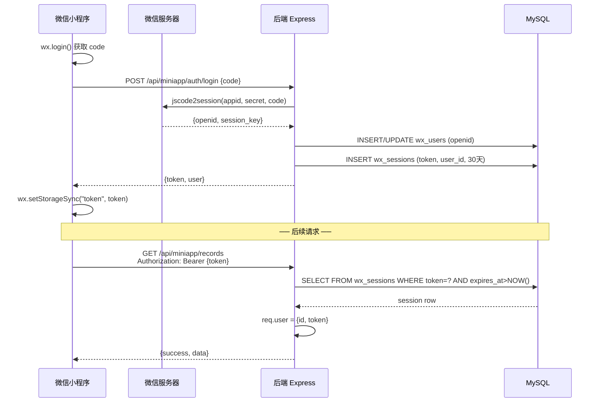
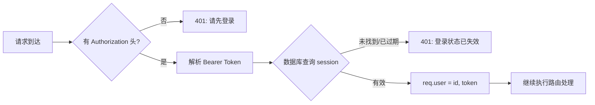
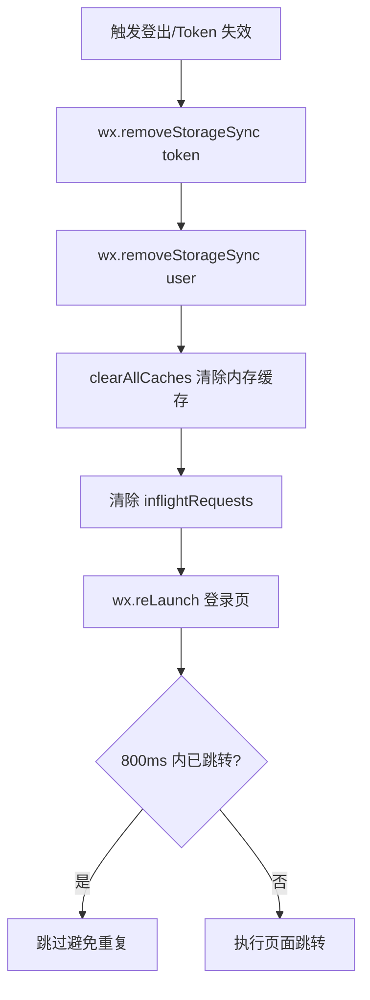

本页详细解析 CervixDetectAI 微信小程序的完整鉴权体系——从微信登录凭证获取、服务端会话创建、到前端 Token 持久化与请求拦截。理解这套机制是安全开发和调试登录相关问题的基础。

## 整体鉴权架构概览

系统采用 **微信 code 换 openid + 服务端随机 Token** 的会话模型，而非 JWT。这意味着每次鉴权都需要查询数据库验证 Token 有效性，换取了服务端对会话的完全控制能力（可随时吊销）。



Sources: [miniapp.repository.js](server/src/repositories/miniapp.repository.js#L107-L149), [auth.js](server/src/middleware/auth.js#L1-L34)

## 微信登录流程：code 换 openid

登录入口是 `POST /api/miniapp/auth/login`，该路由位于鉴权中间件之前，属于**公开路由**。服务端收到客户端传来的微信 `code` 后，调用微信 `jscode2session` 接口换取用户唯一标识 `openid`。

关键设计要点：

- **appid/appsecret 从环境变量读取**，不硬编码在代码中，避免泄露
- **openid 是用户唯一标识**，通过 `UNIQUE KEY uk_wx_users_openid` 确保不重复
- **采用 INSERT ... ON DUPLICATE KEY UPDATE** 模式，首次登录自动创建用户，后续登录更新资料
- **session_key 仅用于微信侧解密**，本系统不存储也不使用它

```mermaid
flowchart TD
    A[客户端 wx.login] -->|code| B[/auth/login]
    B --> C{code 有效?}
    C -->|否| D[400: 未获取到微信登录凭证]
    C -->|是| E[调用微信 jscode2session]
    E --> F{返回 openid?}
    F -->|errcode 40029/40163| G[401: 凭证已失效]
    F -->|errcode 40125| H[500: AppSecret 配置错误]
    F -->|是| I[INSERT/UPDATE wx_users]
    I --> J[生成 Token]
    J --> K[INSERT wx_sessions]
    K --> L[返回 token + user]
```

Sources: [miniapp.repository.js](server/src/repositories/miniapp.repository.js#L50-L91), [miniapp.service.js](server/src/services/miniapp.service.js#L185-L195)

## 会话存储与 Token 生成

系统使用**数据库持久化会话**而非内存存储，确保服务重启不丢失登录状态。

**Token 生成策略**：使用 `crypto.randomBytes(32).toString("hex")` 生成 64 字符的十六进制随机字符串，熵值为 256 位，理论上碰撞概率极低。

**会话有效期**：固定 30 天（`SESSION_DAYS = 30`），通过 MySQL `DATE_ADD(NOW(), INTERVAL 30 DAY)` 计算过期时间。

**数据库表结构**：

| 字段 | 类型 | 说明 |
|------|------|------|
| `token` | `CHAR(64)` PK | 会话令牌，主键即索引 |
| `user_id` | `BIGINT UNSIGNED` FK | 关联 wx_users.id，级联删除 |
| `expires_at` | `DATETIME` | 过期时间，查询时校验 `> NOW()` |
| `created_at` | `DATETIME` | 创建时间 |

**索引设计**：`idx_wx_sessions_user_expires (user_id, expires_at)` 支持按用户维度查询和清理过期会话。

Sources: [miniapp.repository.js](server/src/repositories/miniapp.repository.js#L3-L10), [init.sql](server/database/init.sql#L20-L32)

## 鉴权中间件：请求拦截与用户识别

所有需要登录的路由都经过 `authenticate` 中间件。该中间件的职责链为：

1. **提取 Token**：从 `Authorization: Bearer <token>` 头解析
2. **验证有效性**：查询数据库确认 Token 存在且未过期
3. **注入用户信息**：将 `req.user = { id, token }` 附加到请求对象
4. **错误响应**：Token 缺失返回 401 + "请先登录"，过期返回 401 + "登录状态已失效"



Sources: [auth.js](server/src/middleware/auth.js#L1-L34)

## 路由保护策略：公开与受保护路由

路由文件中通过 `router.use(authenticate)` 的位置巧妙划分了公开路由和受保护路由。位于该中间件调用之前的路由**无需登录**，之后的路由**必须登录**。

| 路由类型 | 路由示例 | 是否需要 Token |
|----------|----------|----------------|
| **公开路由** | `POST /auth/login` | ❌ 登录接口本身 |
| **公开路由** | `GET /question-templates` | ❌ 模板数据可公开访问 |
| **公开路由** | `GET /articles` | ❌ 知识文章可公开访问 |
| **受保护路由** | `GET /me` | ✅ 获取当前用户信息 |
| **受保护路由** | `GET /records` | ✅ 健康记录属于用户私有数据 |
| **受保护路由** | `POST /assistant/chat` | ✅ AI 助手对话 |
| **受保护路由** | `GET /notifications` | ✅ 通知中心 |

这种设计使得未登录用户仍可浏览知识文章和问题模板，实现了"**先体验后登录**"的用户引导策略。

Sources: [miniapp.js](server/src/routes/miniapp.js#L22-L35)

## 前端 Token 管理与请求拦截

前端通过 `miniprogram/utils/request.js` 封装了统一的请求层，自动处理 Token 注入和 401 响应。

**Token 存储**：使用微信小程序本地存储 `wx.setStorageSync("token", token)`，小程序生命周期内持久有效。

**请求拦截逻辑**：

```javascript
// 请求时自动注入 Token
header: {
  "content-type": "application/json",
  ...(getToken() ? { Authorization: `Bearer ${getToken()}` } : {}),
}

// 响应时处理 401
if (res.statusCode === 401) {
  if (getToken()) {
    redirectLogin();  // Token 过期 → 清除本地状态 → 跳转登录页
    reject(new Error("登录状态已失效，请重新登录"));
    return;
  }
  reject(createLoginRequiredError("登录后可继续使用此功能"));
}
```

**重定向防抖**：`lastLoginRedirectAt` 时间戳确保 800ms 内不会重复跳转登录页，避免多个并发请求同时触发 401 时的页面抖动。

Sources: [request.js](miniprogram/utils/request.js#L136-L170), [request.js](miniprogram/utils/request.js#L280-L310)

## 登出与状态清理

当 Token 过期或用户主动退出时，前端执行完整的状态清理流程：



**清理范围**：
- `wx.removeStorageSync("token")` — 移除本地 Token
- `wx.removeStorageSync("user")` — 移除本地用户缓存
- `clearAllCaches()` — 清除 `responseCache` 和 `inflightRequests` 中所有内存缓存

Sources: [request.js](miniprogram/utils/request.js#L128-L135)

## 登录页面的合规前置检查

登录页面 (`/pages/login/index`) 在用户触发登录前执行**两层合规检查**：

1. **隐私协议同意检查**：`wx.getStorageSync("privacyConsentAgreed")` 为 false 时弹出隐私协议弹窗，阻止登录
2. **资料设置同意检查**：若用户选择了头像或昵称但未同意资料设置说明，弹出二级确认弹窗

这种设计确保了用户在数据收集前明确知晓并同意相关条款，符合微信小程序隐私合规要求。

**登录流程选择**：
- `submitLogin()` — 登录并保存资料（昵称 + 头像）
- `skipSetupAndLogin()` — 跳过资料设置，直接登录

两种路径都会先检查隐私协议同意状态，确保合规前置。

Sources: [index.js](miniprogram/pages/login/index.js#L135-L175), [index.wxml](miniprogram/pages/login/index.wxml#L62-L104)

## 安全考量与设计权衡

| 维度 | 当前实现 | 设计考量 |
|------|----------|----------|
| **Token 类型** | 随机字符串（非 JWT） | 服务端可随时吊销，但每次请求需查库 |
| **Token 有效期** | 30 天固定 | 平衡用户体验与安全性，无滑动续期 |
| **Token 存储** | wx.setStorageSync | 微信小程序沙箱隔离，非明文暴露 |
| **密码体系** | 无密码 | 依赖微信 openid 唯一标识，简化用户管理 |
| **HTTPS** | 强制（小程序要求） | 微信小程序域名必须 HTTPS |
| **错误信息** | 服务端 500+ 隐藏详情 | `errorHandler.js` 对 500+ 返回通用提示 |

**未实现的防护措施**（可作为后续优化方向）：
- 过期会话自动清理（当前依赖数据库记录积累）
- Token 轮换机制（同一用户多设备登录时的会话管理）
- 请求频率限制（防暴力破解 Token）

Sources: [errorHandler.js](server/src/middleware/errorHandler.js#L1-L21), [env.js](server/src/config/env.js#L1-L36)

## 下一步阅读建议

- 若需了解请求封装的完整机制（缓存、去重、错误处理），请参阅 [请求封装与Token管理](12-qing-qiu-feng-zhuang-yu-tokenguan-li)
- 若需了解 Express 路由与中间件的整体设计模式，请参阅 [Express路由与中间件设计](15-expresslu-you-yu-zhong-jian-jian-she-ji)
- 若需了解数据库表结构的完整设计，请参阅 [数据库表结构设计](19-shu-ju-ku-biao-jie-gou-she-ji)
- 若需了解隐私协议的实现细节，请参阅 [隐私协议实现](22-yin-si-xie-yi-shi-xian)