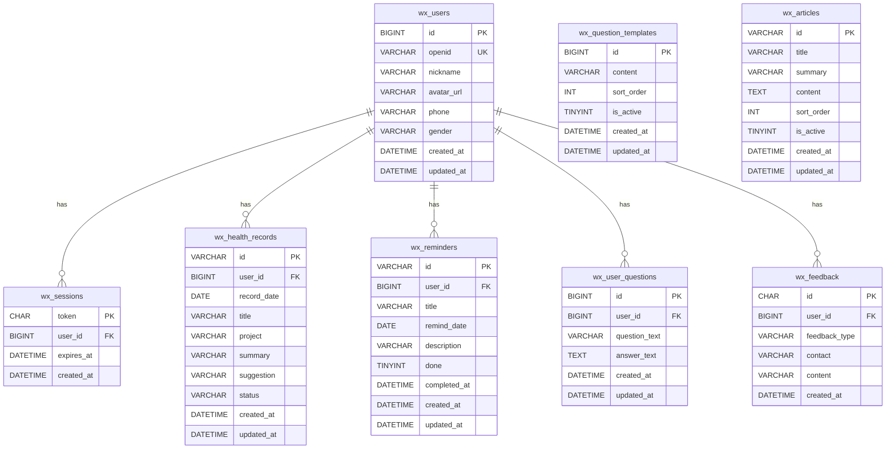
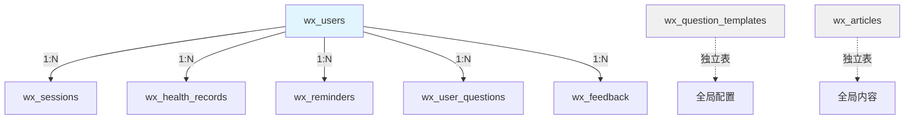

本文档详细介绍 CervixDetectAI 微信小程序的数据库表结构设计，包括所有表的字段定义、约束关系和索引策略。数据库采用 MySQL 8.x 引擎，字符集为 `utf8mb4`，排序规则为 `utf8mb4_unicode_ci`，完整建表脚本位于 [server/database/init.sql](server/database/init.sql)。

## 数据库概述

CervixDetectAI 数据库命名为 `cervixdetectai_wx`，采用关系型设计模式，共包含 8 张数据表。系统以 `wx_users` 为核心用户表，通过外键关联实现用户数据的级联管理。数据库设计遵循第三范式，在保证数据完整性的同时优化查询性能。

Sources: [init.sql](server/database/init.sql#L1-L18)

## 表清单总览

| 表名 | 用途说明 | 主键类型 | 外键关联 | 记录特征 |
|------|---------|---------|----------|----------|
| `wx_users` | 小程序用户基础信息 | `BIGINT AUTO_INCREMENT` | — | 用户维度 |
| `wx_sessions` | 登录会话管理 | `CHAR(64) token` | → `wx_users.id` | 时效性记录 |
| `wx_health_records` | 健康检查摘要记录 | `VARCHAR(32) UUID` | → `wx_users.id` | 用户维度 |
| `wx_reminders` | 复查提醒事项 | `VARCHAR(32) UUID` | → `wx_users.id` | 用户维度 |
| `wx_question_templates` | 就诊前问题模板 | `BIGINT AUTO_INCREMENT` | — | 全局配置 |
| `wx_user_questions` | 用户整理的问题清单 | `BIGINT AUTO_INCREMENT` | → `wx_users.id` | 用户维度 |
| `wx_articles` | 健康管理知识文章 | `VARCHAR(32) UUID` | — | 全局内容 |
| `wx_feedback` | 用户反馈记录 | `CHAR(36) UUID` | → `wx_users.id` | 用户维度 |

Sources: [init.sql](server/database/init.sql#L7-L117)

## 用户与会话表

### wx_users（用户表）

用户表是整个系统的核心实体，存储微信小程序用户的基础信息。主键采用自增 `BIGINT` 类型，通过 `openid` 字段与微信用户体系关联。`nickname` 字段设置默认值 `'微信用户'`，确保用户数据完整性。

| 字段 | 类型 | 约束 | 默认值 | 说明 |
|------|------|------|--------|------|
| `id` | BIGINT UNSIGNED | PRIMARY KEY, AUTO_INCREMENT | — | 用户唯一标识 |
| `openid` | VARCHAR(128) | UNIQUE KEY | NULL | 微信 openid |
| `nickname` | VARCHAR(80) | NOT NULL | '微信用户' | 用户昵称 |
| `avatar_url` | VARCHAR(500) | NULL | NULL | 头像外链地址 |
| `phone` | VARCHAR(32) | NULL | NULL | 手机号（保留字段） |
| `gender` | VARCHAR(16) | NULL | NULL | 性别（保留字段） |
| `created_at` | DATETIME | NOT NULL | CURRENT_TIMESTAMP | 创建时间 |
| `updated_at` | DATETIME | NOT NULL | CURRENT_TIMESTAMP ON UPDATE | 更新时间 |

**索引策略**：主键索引 + `openid` 唯一索引，确保微信用户唯一性。

Sources: [init.sql](server/database/init.sql#L7-L18)

### wx_sessions（会话表）

会话表管理用户登录状态，采用 64 字符十六进制 token 作为主键。会话默认有效期为 30 天，通过 `expires_at` 字段实现自动过期机制。当用户删除时，关联会话通过 `ON DELETE CASCADE` 级联删除。

| 字段 | 类型 | 约束 | 默认值 | 说明 |
|------|------|------|--------|------|
| `token` | CHAR(64) | PRIMARY KEY | — | 会话令牌 |
| `user_id` | BIGINT UNSIGNED | FOREIGN KEY → wx_users.id | — | 关联用户 |
| `expires_at` | DATETIME | NOT NULL | — | 过期时间 |
| `created_at` | DATETIME | NOT NULL | CURRENT_TIMESTAMP | 创建时间 |

**索引策略**：`idx_wx_sessions_user_expires (user_id, expires_at)` 复合索引，优化会话查询和清理性能。

Sources: [init.sql](server/database/init.sql#L20-L30)

## 健康记录表

### wx_health_records（健康检查记录表）

健康检查记录表存储用户的检查摘要信息，主键采用 32 字符紧凑 UUID 格式（去除连字符的 UUID）。`record_date` 字段用于按日期排序和查询，`status` 字段支持多状态管理（如"已记录"、"待复查"、"待关注"）。

| 字段 | 类型 | 约束 | 默认值 | 说明 |
|------|------|------|--------|------|
| `id` | VARCHAR(32) | PRIMARY KEY | — | 记录唯一标识 |
| `user_id` | BIGINT UNSIGNED | FOREIGN KEY → wx_users.id | — | 所属用户 |
| `record_date` | DATE | NOT NULL | — | 检查日期 |
| `title` | VARCHAR(120) | NOT NULL | — | 记录标题 |
| `project` | VARCHAR(120) | NOT NULL | — | 检查项目 |
| `summary` | VARCHAR(500) | NOT NULL | — | 检查摘要 |
| `suggestion` | VARCHAR(500) | NOT NULL | — | 建议提醒 |
| `status` | VARCHAR(40) | NOT NULL | '已记录' | 记录状态 |
| `created_at` | DATETIME | NOT NULL | CURRENT_TIMESTAMP | 创建时间 |
| `updated_at` | DATETIME | NOT NULL | CURRENT_TIMESTAMP ON UPDATE | 更新时间 |

**索引策略**：`idx_wx_health_records_user_date (user_id, record_date)` 复合索引，优化用户按日期查询记录的性能。

Sources: [init.sql](server/database/init.sql#L32-L48)

## 提醒与问题表

### wx_reminders（复查提醒表）

复查提醒表支持用户设置复查计划，通过 `done` 字段标记完成状态，`completed_at` 记录实际完成时间。主键同样采用 32 字符紧凑 UUID 格式。

| 字段 | 类型 | 约束 | 默认值 | 说明 |
|------|------|------|--------|------|
| `id` | VARCHAR(32) | PRIMARY KEY | — | 提醒唯一标识 |
| `user_id` | BIGINT UNSIGNED | FOREIGN KEY → wx_users.id | — | 所属用户 |
| `title` | VARCHAR(120) | NOT NULL | — | 提醒标题 |
| `remind_date` | DATE | NOT NULL | — | 提醒日期 |
| `description` | VARCHAR(500) | NOT NULL | — | 提醒内容 |
| `done` | TINYINT(1) | NOT NULL | 0 | 是否完成 |
| `completed_at` | DATETIME | NULL | NULL | 完成时间 |
| `created_at` | DATETIME | NOT NULL | CURRENT_TIMESTAMP | 创建时间 |
| `updated_at` | DATETIME | NOT NULL | CURRENT_TIMESTAMP ON UPDATE | 更新时间 |

**索引策略**：`idx_wx_reminders_user_done_date (user_id, done, remind_date)` 复合索引，优化用户查询未完成提醒的性能。

Sources: [init.sql](server/database/init.sql#L50-L65)

### wx_question_templates（问题模板表）

问题模板表存储系统预设的就诊前问题，供用户选择使用。通过 `sort_order` 字段控制显示顺序，`is_active` 字段支持模板的启用/禁用管理。

| 字段 | 类型 | 约束 | 默认值 | 说明 |
|------|------|------|--------|------|
| `id` | BIGINT UNSIGNED | PRIMARY KEY, AUTO_INCREMENT | — | 模板唯一标识 |
| `content` | VARCHAR(255) | NOT NULL | — | 问题内容 |
| `sort_order` | INT | NOT NULL | 0 | 排序权重 |
| `is_active` | TINYINT(1) | NOT NULL | 1 | 是否启用 |
| `created_at` | DATETIME | NOT NULL | CURRENT_TIMESTAMP | 创建时间 |
| `updated_at` | DATETIME | NOT NULL | CURRENT_TIMESTAMP ON UPDATE | 更新时间 |

**索引策略**：`idx_wx_question_templates_active_sort (is_active, sort_order)` 复合索引，优化启用模板的排序查询。

Sources: [init.sql](server/database/init.sql#L67-L76)

### wx_user_questions（用户问题表）

用户问题表存储用户整理的问题清单，支持问题文本和答案备忘。通过 `updated_at` 字段记录最后修改时间，便于按时间排序显示。

| 字段 | 类型 | 约束 | 默认值 | 说明 |
|------|------|------|--------|------|
| `id` | BIGINT UNSIGNED | PRIMARY KEY, AUTO_INCREMENT | — | 问题唯一标识 |
| `user_id` | BIGINT UNSIGNED | FOREIGN KEY → wx_users.id | — | 所属用户 |
| `question_text` | VARCHAR(255) | NOT NULL | — | 问题内容 |
| `answer_text` | TEXT | NULL | NULL | 答案备忘 |
| `created_at` | DATETIME | NOT NULL | CURRENT_TIMESTAMP | 创建时间 |
| `updated_at` | DATETIME | NOT NULL | CURRENT_TIMESTAMP ON UPDATE | 更新时间 |

**索引策略**：`idx_wx_user_questions_user_time (user_id, updated_at, created_at)` 复合索引，优化用户问题的时间排序查询。

Sources: [init.sql](server/database/init.sql#L78-L90)

## 内容与反馈表

### wx_articles（健康知识文章表）

文章表存储健康管理知识内容，主键采用 32 字符紧凑 UUID 格式。通过 `sort_order` 和 `is_active` 字段实现内容的排序和状态管理。

| 字段 | 类型 | 约束 | 默认值 | 说明 |
|------|------|------|--------|------|
| `id` | VARCHAR(32) | PRIMARY KEY | — | 文章唯一标识 |
| `title` | VARCHAR(120) | NOT NULL | — | 文章标题 |
| `summary` | VARCHAR(500) | NOT NULL | — | 文章摘要 |
| `content` | TEXT | NULL | NULL | 文章正文 |
| `sort_order` | INT | NOT NULL | 0 | 排序权重 |
| `is_active` | TINYINT(1) | NOT NULL | 1 | 是否上架 |
| `created_at` | DATETIME | NOT NULL | CURRENT_TIMESTAMP | 创建时间 |
| `updated_at` | DATETIME | NOT NULL | CURRENT_TIMESTAMP ON UPDATE | 更新时间 |

**索引策略**：`idx_wx_articles_active_sort (is_active, sort_order)` 复合索引，优化上架文章的排序查询。

Sources: [init.sql](server/database/init.sql#L92-L103)

### wx_feedback（用户反馈表）

用户反馈表采用 36 字符标准 UUID 格式作为主键，支持多种反馈类型分类。`contact` 字段为可选字段，用于用户留下联系方式。

| 字段 | 类型 | 约束 | 默认值 | 说明 |
|------|------|------|--------|------|
| `id` | CHAR(36) | PRIMARY KEY | — | 反馈唯一标识 |
| `user_id` | BIGINT UNSIGNED | FOREIGN KEY → wx_users.id | — | 提交用户 |
| `feedback_type` | VARCHAR(40) | NOT NULL | '其他反馈' | 反馈类型 |
| `contact` | VARCHAR(120) | NULL | NULL | 联系方式 |
| `content` | VARCHAR(1000) | NOT NULL | — | 反馈内容 |
| `created_at` | DATETIME | NOT NULL | CURRENT_TIMESTAMP | 提交时间 |

**索引策略**：`idx_wx_feedback_user_time (user_id, created_at)` 复合索引，优化用户反馈的时间查询。

Sources: [init.sql](server/database/init.sql#L105-L117)

## 索引设计策略

数据库索引设计遵循以下原则：

1. **主键索引**：所有表均使用主键索引，确保记录唯一性
2. **外键索引**：所有外键字段自动创建索引，优化关联查询
3. **复合索引**：根据查询模式设计复合索引，避免索引失效
4. **覆盖索引**：关键查询尽量使用覆盖索引，减少回表操作

| 表名 | 索引名称 | 索引类型 | 索引字段 | 设计目的 |
|------|----------|----------|----------|----------|
| `wx_users` | `uk_wx_users_openid` | UNIQUE | openid | 微信用户唯一性 |
| `wx_sessions` | `idx_wx_sessions_user_expires` | INDEX | user_id, expires_at | 会话查询和清理 |
| `wx_health_records` | `idx_wx_health_records_user_date` | INDEX | user_id, record_date | 用户记录按日期查询 |
| `wx_reminders` | `idx_wx_reminders_user_done_date` | INDEX | user_id, done, remind_date | 用户未完成提醒查询 |
| `wx_question_templates` | `idx_wx_question_templates_active_sort` | INDEX | is_active, sort_order | 启用模板排序查询 |
| `wx_user_questions` | `idx_wx_user_questions_user_time` | INDEX | user_id, updated_at, created_at | 用户问题时间排序 |
| `wx_articles` | `idx_wx_articles_active_sort` | INDEX | is_active, sort_order | 上架文章排序查询 |
| `wx_feedback` | `idx_wx_feedback_user_time` | INDEX | user_id, created_at | 用户反馈时间查询 |

Sources: [init.sql](server/database/init.sql#L17-L102)

## 外键约束关系

数据库通过外键约束维护数据完整性，所有用户相关表均采用 `ON DELETE CASCADE` 策略，确保用户删除时自动清理关联数据。

**外键约束详情**：

| 表名 | 外键字段 | 关联目标 | 删除策略 | 业务含义 |
|------|----------|----------|----------|----------|
| `wx_sessions` | user_id | wx_users.id | CASCADE | 用户删除时清除所有会话 |
| `wx_health_records` | user_id | wx_users.id | CASCADE | 用户删除时清除所有记录 |
| `wx_reminders` | user_id | wx_users.id | CASCADE | 用户删除时清除所有提醒 |
| `wx_user_questions` | user_id | wx_users.id | CASCADE | 用户删除时清除所有问题 |
| `wx_feedback` | user_id | wx_users.id | CASCADE | 用户删除时清除所有反馈 |

Sources: [init.sql](server/database/init.sql#L27-L116)

## 数据类型设计原则

数据库字段类型设计遵循以下原则：

1. **主键类型选择**：
   - 自增主键：用户表、模板表（适合内部关联）
   - UUID 主键：记录表、内容表（适合分布式场景）

2. **字符串长度规划**：
   - 标识符：VARCHAR(32) 或 CHAR(36)
   - 标题类：VARCHAR(120)
   - 摘要类：VARCHAR(500)
   - 长文本：TEXT

3. **时间字段设计**：
   - 创建时间：`created_at DATETIME DEFAULT CURRENT_TIMESTAMP`
   - 更新时间：`updated_at DATETIME DEFAULT CURRENT_TIMESTAMP ON UPDATE CURRENT_TIMESTAMP`
   - 日期字段：`DATE` 类型（无时间部分）

4. **状态字段设计**：
   - 布尔状态：`TINYINT(1) DEFAULT 0/1`
   - 枚举状态：`VARCHAR(40)` 或 `VARCHAR(80)`

Sources: [init.sql](server/database/init.sql#L7-L117)

## 演示数据说明

`init.sql` 脚本包含完整的演示数据，便于开发和测试：

- **演示用户**：`id=1, openid='demo-openid-001', nickname='张女士'`
- **健康记录**：4 条不同状态的检查记录（已记录、待复查、待关注）
- **复查提醒**：4 条不同类型的提醒（复查、资料准备、记录整理、线下咨询）
- **问题模板**：7 个就诊前问题模板
- **健康文章**：5 篇健康管理知识文章

演示数据采用 `ON DUPLICATE KEY UPDATE` 策略，确保幂等性，可重复执行。

Sources: [init.sql](server/database/init.sql#L119-L254)

## 下一步阅读

完成数据库表结构设计的学习后，建议继续阅读：

- [核心业务实体关系](20-he-xin-ye-wu-shi-ti-guan-xi) — 深入理解业务实体间的关联关系和设计模式
- [数据库升级与迁移脚本](21-shu-ju-ku-sheng-ji-yu-qian-yi-jiao-ben) — 掌握数据库版本管理和升级策略
- [数据库访问层实现](17-shu-ju-ku-fang-wen-ceng-shi-xian) — 了解后端如何操作这些数据表