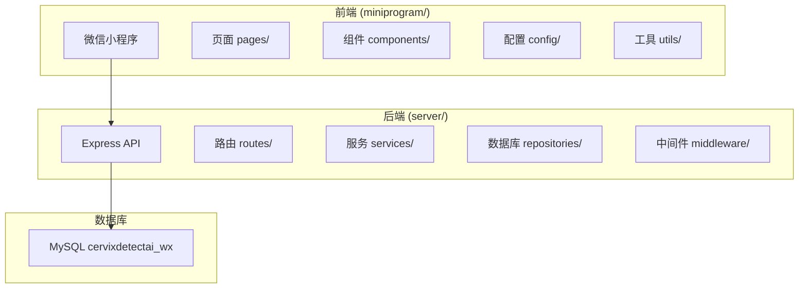
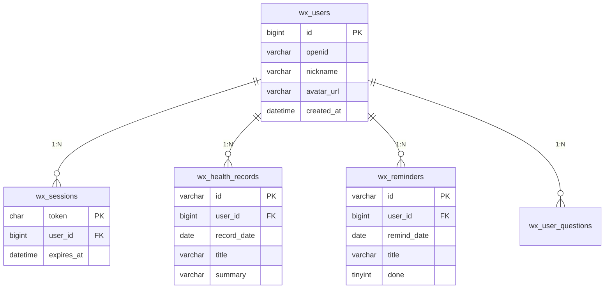
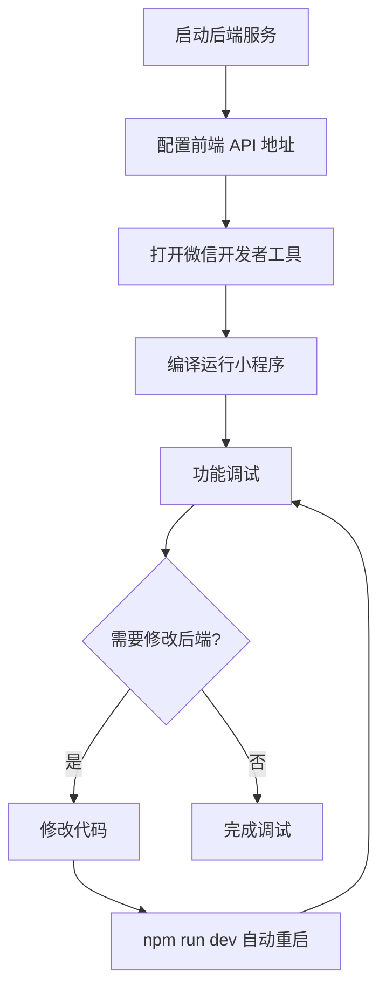

本页面将指导您从零开始搭建 CervixDetectAI_wx 开发环境，包括前端小程序和后端 API 服务的配置与运行。无论您是初次接触微信小程序开发，还是需要快速启动项目进行调试，都可以按照以下步骤完成环境准备。

## 前置条件

在开始之前，请确保您的开发环境满足以下要求：

| 组件               | 版本要求    | 说明                     |
| ------------------ | ----------- | ------------------------ |
| **微信开发者工具** | 最新版      | 用于开发和调试小程序前端 |
| **Node.js**        | 14.x 或更高 | 后端服务运行环境         |
| **npm**            | 6.x 或更高  | Node.js 包管理器         |
| **MySQL**          | 5.7 或更高  | 数据库服务               |

**注意**：微信开发者工具需要从[微信官方文档](https://developers.weixin.qq.com/miniprogram/dev/devtools/download.html)下载并安装，注册时需要使用您的微信扫码登录。

## 项目结构概览

项目采用前后端分离架构，整体结构如下：



**核心目录说明**：

| 目录                   | 用途                                               |
| ---------------------- | -------------------------------------------------- |
| `miniprogram/`         | 微信小程序前端代码，包含页面、组件、配置和工具函数 |
| `server/`              | Node.js 后端 API 服务，提供数据接口和业务逻辑      |
| `docs/`                | 项目文档、提审材料和设计资源                       |
| `miniapp-privacy.json` | 小程序隐私协议配置文件                             |

## 后端服务搭建

### 1. 安装依赖

进入后端目录并安装 Node.js 依赖：

```bash
cd server
npm install
```

此命令会根据 `package.json` 安装以下核心依赖：

- **express**：Web 框架，提供 HTTP 服务
- **mysql2**：MySQL 数据库驱动
- **dotenv**：环境变量管理
- **cors**：跨域资源共享中间件
- **helmet**：安全相关 HTTP 头设置
- **morgan**：HTTP 请求日志记录

### 2. 配置环境变量

在 `server/` 目录下创建 `.env` 文件，配置数据库连接信息：

```bash
# 数据库配置
DB_HOST=127.0.0.1
DB_PORT=3306
DB_NAME=cervixdetectai_wx
DB_USER=root
DB_PASSWORD=your_password_here

# 服务配置
PORT=3789
HOST=0.0.0.0

# 微信小程序配置（可选，用于登录功能）
WECHAT_APP_ID=your_app_id
WECHAT_APP_SECRET=your_app_secret
```

**配置说明**：

| 变量名        | 默认值            | 说明             |
| ------------- | ----------------- | ---------------- |
| `DB_HOST`     | 127.0.0.1         | MySQL 服务器地址 |
| `DB_PORT`     | 3306              | MySQL 端口       |
| `DB_NAME`     | cervixdetectai_wx | 数据库名称       |
| `DB_USER`     | root              | 数据库用户名     |
| `DB_PASSWORD` | (空)              | 数据库密码       |
| `PORT`        | 3789              | API 服务端口     |
| `HOST`        | 0.0.0.0           | 服务监听地址     |

**注意**：`.env` 文件包含敏感信息，已添加到 `.gitignore` 中，不会被提交到版本控制系统。

### 3. 初始化数据库

执行初始化脚本创建数据库和表结构：

```bash
# 连接到 MySQL 并执行初始化脚本
mysql -u root -p < database/init.sql
```

或者先登录 MySQL 控制台，再执行脚本：

```bash
mysql -u root -p
# 输入密码后执行
source /path/to/server/database/init.sql;
```

初始化脚本会创建以下表结构：



### 4. 启动后端服务

```bash
# 开发模式启动（自动重启）
npm run dev

# 或直接启动
node src/app.js
```

成功启动后，控制台会显示：

```
CervixDetectAI wx server listening on http://0.0.0.0:3789
```

可以通过访问 `http://localhost:3789/health` 验证服务是否正常运行：

```json
{
  "ok": true,
  "service": "cervixdetectai-wx-server",
  "mysql": "enabled",
  "database": "cervixdetectai_wx"
}
```

## 前端小程序搭建

### 1. 打开项目

1. 启动微信开发者工具
2. 点击「导入项目」或「打开项目」
3. 选择项目根目录下的 `miniprogram/` 文件夹
4. AppID 填写：`xxxxxxxxxxxxxxxxxxx`（或使用测试号）

**注意**：如果您没有小程序 AppID，可以选择「测试号」进行开发调试。

### 2. 配置 API 地址

根据您的开发环境，修改 `miniprogram/config/app.js` 中的 API 地址：

```javascript
module.exports = {
  // 开发者工具环境
  devtoolsApiBaseUrl: "http://localhost:3789/api/miniapp",

  // 真机调试环境（同一 WiFi）
  deviceApiBaseUrl: "http://192.168.x.x:3789/api/miniapp",

  // 生产环境
  productionApiBaseUrl: "https://your-domain.com/api/miniapp",

  // 其他配置...
};
```

**环境配置说明**：

| 场景          | 配置项                 | 说明                            |
| ------------- | ---------------------- | ------------------------------- |
| 开发者工具    | `devtoolsApiBaseUrl`   | 使用 `localhost` 或 `127.0.0.1` |
| 真机调试      | `deviceApiBaseUrl`     | 使用电脑的局域网 IP 地址        |
| 体验版/正式版 | `productionApiBaseUrl` | 使用已备案的 HTTPS 域名         |

**重要提示**：

- 真机调试时，手机和电脑必须连接同一 WiFi 网络
- 电脑的局域网 IP 可通过 `ifconfig`（Mac/Linux）或 `ipconfig`（Windows）查看
- 体验版和正式版必须配置 HTTPS 域名，并在微信后台添加 request 合法域名

### 3. 运行小程序

1. 在微信开发者工具中，确保项目已正确导入
2. 点击工具栏的「编译」按钮或使用快捷键 `Ctrl+B`（Windows）/ `Cmd+B`（Mac）
3. 模拟器会自动加载小程序首页
4. 在「调试器」面板查看网络请求和控制台输出

## 开发调试流程

### 本地开发流程



### 真机调试流程

1. **获取电脑 IP 地址**：

   ```bash
   # Mac/Linux
   ifconfig | grep "inet " | grep -v 127.0.0.1

   # Windows
   ipconfig | findstr "IPv4"
   ```

2. **修改前端配置**：
   将 `deviceApiBaseUrl` 修改为 `http://你的IP:3789/api/miniapp`

3. **开启真机调试**：
   - 在微信开发者工具中点击「真机调试」
   - 使用微信扫描二维码
   - 确保手机和电脑在同一网络

### 常见问题排查

| 问题现象       | 可能原因          | 解决方案                               |
| -------------- | ----------------- | -------------------------------------- |
| 无法连接后端   | 后端服务未启动    | 运行 `npm run dev` 启动服务            |
| 网络请求失败   | API 地址配置错误  | 检查 `config/app.js` 中的地址配置      |
| 数据库连接失败 | 数据库配置错误    | 检查 `.env` 文件中的数据库配置         |
| 真机无法访问   | 网络不在同一网段  | 确保手机和电脑连接同一 WiFi            |
| 页面空白       | 编译错误          | 查看控制台错误信息并修复               |
| 登录失败       | 微信 AppID 未配置 | 在 `.env` 中配置正确的 `WECHAT_APP_ID` |

## 数据库管理

### 连接数据库

```bash
# 使用命令行连接
mysql -h 127.0.0.1 -P 3306 -u root -p cervixdetectai_wx

# 查看所有表
SHOW TABLES;

# 查看表结构
DESCRIBE wx_users;
```

### 备份与恢复

```bash
# 备份数据库
mysqldump -u root -p cervixdetectai_wx > backup_$(date +%Y%m%d).sql

# 恢复数据库
mysql -u root -p cervixdetectai_wx < backup_20240101.sql
```

### 升级数据库

当数据库结构有更新时，执行升级脚本：

```bash
mysql -u root -p cervixdetectai_wx < database/upgrade-login-crud.sql
```

## 开发工具推荐

| 工具                | 用途       | 推荐指数   |
| ------------------- | ---------- | ---------- |
| **VS Code**         | 代码编辑   | ⭐⭐⭐⭐⭐ |
| **MySQL Workbench** | 数据库管理 | ⭐⭐⭐⭐⭐ |
| **Postman**         | API 测试   | ⭐⭐⭐⭐   |
| **Chrome DevTools** | 前端调试   | ⭐⭐⭐⭐⭐ |
| **微信开发者工具**  | 小程序开发 | ⭐⭐⭐⭐⭐ |

## 下一步

环境搭建完成后，建议按照以下顺序阅读文档：

1. **[前端环境配置](3-qian-duan-huan-jing-pei-zhi)**：了解小程序详细配置项
2. **[后端环境变量配置](4-hou-duan-huan-jing-bian-liang-pei-zhi)**：深入了解后端配置选项
3. **[数据库初始化](5-shu-ju-ku-chu-shi-hua)**：学习数据库详细结构和初始化
4. **[系统分层架构](8-xi-tong-fen-ceng-jia-gou)**：理解整体架构设计

如需进一步了解项目结构和功能模块，请参考：

- **[项目概览](1-xiang-mu-gai-lan)**：项目整体介绍
- **[页面结构与分包机制](11-ye-mian-jie-gou-yu-fen-bao-ji-zhi)**：前端页面架构
- **[Express路由与中间件设计](15-expresslu-you-yu-zhong-jian-jian-she-ji)**：后端路由设计
