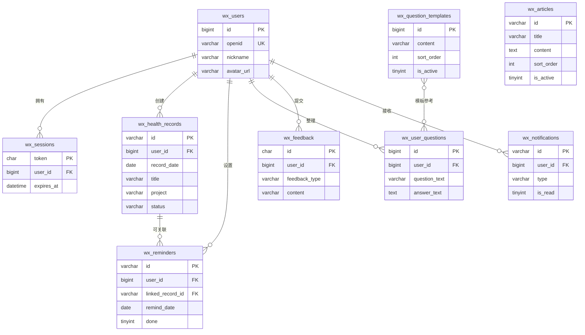
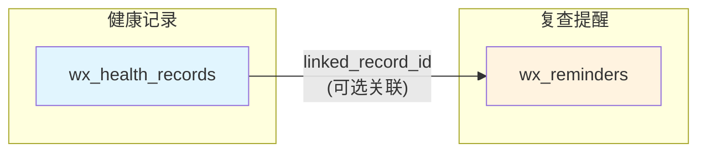
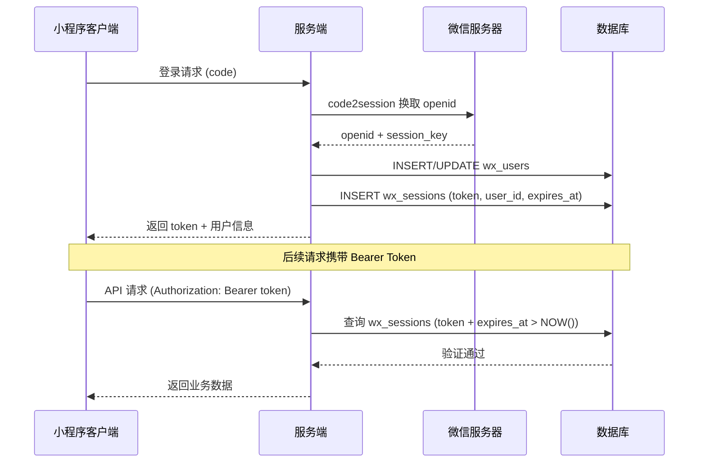
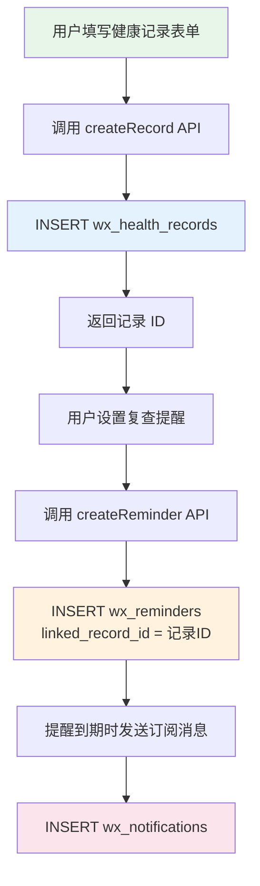

本页面详细讲解 CervixDetectAI 微信小程序中各个数据实体之间的关系。理解这些实体关系是掌握整个系统数据流的关键基础。我们将从**实体分类**、**关系图谱**、**核心业务场景**三个维度来剖析数据模型的设计逻辑。

## 实体分类概览

CervixDetectAI 的数据模型包含 **9 张核心数据表**，按照业务归属可分为三大类：

| 分类 | 实体 | 说明 |
|------|------|------|
| **用户与认证** | `wx_users`、`wx_sessions` | 管理用户身份和登录状态 |
| **健康数据** | `wx_health_records`、`wx_reminders`、`wx_user_questions` | 存储用户个人的健康记录、复查提醒和问题清单 |
| **公共内容** | `wx_question_templates`、`wx_articles` | 全局共享的问题模板和健康知识文章 |
| **交互反馈** | `wx_feedback`、`wx_notifications` | 用户反馈和系统通知 |

Sources: [init.sql](server/database/init.sql#L1-L180)

## 核心实体关系图

下面的 ER 图展示了所有实体之间的关联关系。`wx_users` 是整个系统的**中心节点**，几乎所有业务实体都通过 `user_id` 外键与之关联。

Sources: [init.sql](server/database/init.sql#L11-L180), [05-database-schema.md](docs/wiki/05-database-schema.md#L150-L174)

## 用户中心模型详解

`wx_users` 表是整个系统的**身份锚点**。每个微信用户通过 `openid`（微信唯一标识）与系统建立映射，后续所有业务数据都通过 `user_id` 外键关联到该用户。

**一对多关系说明**：

| 关系 | 目标表 | 外键字段 | 级联策略 | 业务含义 |
|------|--------|----------|----------|----------|
| 1:N | `wx_sessions` | `user_id` | `ON DELETE CASCADE` | 用户可拥有多个活跃会话（多设备登录） |
| 1:N | `wx_health_records` | `user_id` | `ON DELETE CASCADE` | 用户可创建多条健康检查记录 |
| 1:N | `wx_reminders` | `user_id` | `ON DELETE CASCADE` | 用户可设置多个复查提醒 |
| 1:N | `wx_user_questions` | `user_id` | `ON DELETE CASCADE` | 用户可整理多个就诊问题 |
| 1:N | `wx_feedback` | `user_id` | `ON DELETE CASCADE` | 用户可提交多条反馈 |
| 1:N | `wx_notifications` | `user_id` | `ON DELETE CASCADE` | 用户可接收多条系统通知 |

**级联删除策略**：所有子表均采用 `ON DELETE CASCADE`，意味着当用户账号被删除时，该用户的所有业务数据将自动清理，保证数据一致性。

Sources: [init.sql](server/database/init.sql#L25-L50), [miniapp.repository.js](server/src/repositories/miniapp.repository.js#L228-L240)

## 健康记录与复查提醒的关联

`wx_reminders` 表设计了一个**可选的外键字段** `linked_record_id`，用于建立提醒与健康记录之间的关联。这是整个数据模型中**唯一的跨业务表关联**。

**关联逻辑**：
- 当用户创建复查提醒时，可以选择关联某条健康记录（`linked_record_id` 字段）
- 该关联是**可选的**（`DEFAULT NULL`），即提醒也可以独立存在
- 在业务代码中，`linkedRecordId` 通过 `normalizeReminderPayload` 函数进行标准化处理

Sources: [init.sql](server/database/init.sql#L82-L97), [miniapp.service.js](server/src/services/miniapp.service.js#L173-L182)

## 全局表与用户表的分离设计

系统中有两张**全局表**不包含 `user_id` 字段，它们的数据对所有用户可见：

| 全局表 | 用途 | 访问控制 |
|--------|------|----------|
| `wx_question_templates` | 预设的就诊问题模板 | 仅 `is_active=1` 的记录对用户可见 |
| `wx_articles` | 健康知识文章 | 仅 `is_active=1` 的记录对用户可见 |

**设计意图**：问题模板和健康知识是**系统级内容**，由管理员维护，所有用户共享。用户个人的问题清单（`wx_user_questions`）则通过 `user_id` 与用户绑定，两者通过业务逻辑间接关联——用户可以从模板中选择问题添加到个人清单。

Sources: [init.sql](server/database/init.sql#L99-L130), [miniapp.repository.js](server/src/repositories/miniapp.repository.js#L455-L470)

## 会话与认证模型

`wx_sessions` 表管理用户的登录状态，采用**Token 机制**实现无状态认证：

**关键设计点**：
- Token 有效期默认 **30 天**（`SESSION_DAYS = 30`）
- 通过 `expires_at > NOW()` 查询自动过滤过期会话
- 一个用户可以同时拥有多个有效会话（支持多设备）

Sources: [miniapp.repository.js](server/src/repositories/miniapp.repository.js#L75-L115), [auth.js](server/src/middleware/auth.js#L1-L30)

## 通知系统的数据流

`wx_notifications` 表记录应用内通知，支持多种通知类型和已读状态追踪：

| 字段 | 说明 | 业务用途 |
|------|------|----------|
| `type` | 通知类型（system/reminder/record/ai） | 区分通知来源 |
| `is_read` | 已读状态（0/1） | 未读计数 |
| `read_at` | 阅读时间 | 追踪阅读行为 |
| `extra` | JSON 扩展数据 | 存储跳转路径等附加信息 |

通知可以通过 `createNotification` 函数在业务流程中自动生成，例如：记录创建成功、提醒到期等场景。

Sources: [init.sql](server/database/init.sql#L159-L180), [miniapp.repository.js](server/src/repositories/miniapp.repository.js#L600-L650)

## 数据完整性保障

系统通过以下机制保障数据完整性：

| 保障机制 | 实现方式 | 覆盖范围 |
|----------|----------|----------|
| **主键约束** | 每张表都有明确的主键 | 所有表 |
| **外键约束** | `FOREIGN KEY ... REFERENCES` | 所有用户关联表 |
| **唯一约束** | `UNIQUE KEY` on `wx_users.openid` | 用户表 |
| **级联删除** | `ON DELETE CASCADE` | 所有子表 |
| **非空约束** | `NOT NULL` on 核心字段 | 所有表 |
| **默认值** | `DEFAULT` on 状态字段 | 状态、时间戳字段 |

**索引优化**：系统为高频查询场景设计了复合索引，例如：
- `idx_wx_health_records_user_date (user_id, record_date)` — 支持按用户和日期查询记录
- `idx_wx_reminders_user_done_date (user_id, done, remind_date)` — 支持查询用户的待办提醒
- `idx_wx_sessions_user_expires (user_id, expires_at)` — 支持会话验证

Sources: [init.sql](server/database/init.sql#L1-L180), [upgrade-login-crud.sql](server/database/upgrade-login-crud.sql#L1-L162)

## 业务场景数据流示例

以**"用户创建健康记录并设置复查提醒"**为例，展示完整的数据流转过程：

**数据流向**：
1. 用户通过小程序提交健康记录 → 写入 `wx_health_records`
2. 用户关联创建复查提醒 → 写入 `wx_reminders`（含 `linked_record_id`）
3. 提醒到期 → 通过微信订阅消息通知用户 → 写入 `wx_notifications`

Sources: [miniapp.service.js](server/src/services/miniapp.service.js#L107-L130), [miniapp.repository.js](server/src/repositories/miniapp.repository.js#L270-L310)

## 总结

CervixDetectAI 的数据模型采用**用户中心化设计**，以 `wx_users` 为核心向外辐射，通过外键约束和级联删除保证数据一致性。关键设计特点包括：

1. **清晰的职责分离**：用户数据与全局内容分离，便于独立管理
2. **灵活的关联机制**：`linked_record_id` 提供可选的跨表关联
3. **完整的生命周期管理**：从创建、更新到级联删除，覆盖数据全生命周期
4. **性能优化意识**：通过复合索引优化高频查询场景

理解这些实体关系后，建议继续阅读以下相关页面：
- [数据库表结构设计](19-shu-ju-ku-biao-jie-gou-she-ji) — 了解每张表的详细字段定义
- [数据库升级与迁移脚本](21-shu-ju-ku-sheng-ji-yu-qian-yi-jiao-ben) — 了解数据库版本管理策略
- [业务服务层架构](16-ye-wu-fu-wu-ceng-jia-gou) — 了解业务逻辑如何操作这些实体