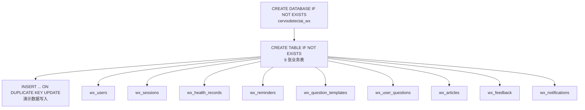
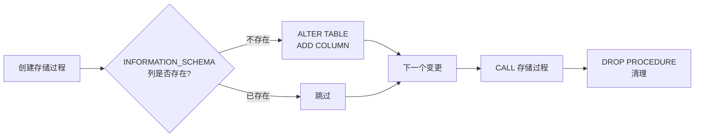
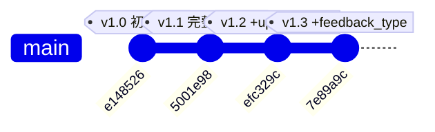
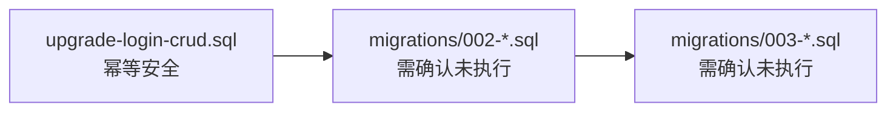

本页系统梳理 CervixDetectAI 微信小程序项目的数据库演进策略：从初始建表脚本、独立升级脚本到有序迁移文件，涵盖脚本的组织结构、幂等性保障机制、执行流程与版本演进历史。

## 迁移脚本整体架构

项目采用**无框架手动迁移**策略，不依赖 Flyway、Knex 等自动化迁移工具，而是通过原生 SQL 脚本配合 MySQL 原生的幂等检查机制实现数据库结构的可控演进。所有脚本均位于 `server/database/` 目录下，包含三个层级的脚本文件：

| 脚本类型 | 文件 | 定位 | 幂等策略 |
|---------|------|------|---------|
| 全量初始化 | `init.sql` | 全新环境的完整建库建表 | `CREATE ... IF NOT EXISTS` + `ON DUPLICATE KEY UPDATE` |
| 独立升级包 | `upgrade-login-crud.sql` | 已有环境的功能增量升级 | 存储过程检查 `INFORMATION_SCHEMA` |
| 顺序迁移 | `migrations/002-*.sql` / `003-*.sql` | 后续结构变更的有序记录 | `ADD COLUMN` / `CREATE TABLE IF NOT EXISTS` |

Sources: [README.md](server/database/README.md#L1-L32), [init.sql](server/database/init.sql#L1-L143), [upgrade-login-crud.sql](server/database/upgrade-login-crud.sql#L1-L162)

## 全量初始化脚本 (init.sql)

`init.sql` 是数据库的**权威状态定义文件**，代表当前最新的完整表结构。它始终与代码中 Repository 层的 SQL 查询保持一致，是新环境部署的唯一入口。

脚本的执行流程遵循以下结构：



整个脚本共创建 9 张表，建表语句全部使用 `CREATE TABLE IF NOT EXISTS` 确保幂等。演示数据插入采用 `INSERT ... ON DUPLICATE KEY UPDATE` 模式——当主键或唯一键冲突时执行更新而非报错，这意味着重复执行 `init.sql` 不会产生错误，而是将演示数据刷新到脚本中定义的状态。

执行命令（详见 [数据库初始化](5-shu-ju-ku-chu-shi-hua)）：

```bash
mysql -h <host> -P <port> -u <user> -p cervixdetectai_wx < server/database/init.sql
```

Sources: [init.sql](server/database/init.sql#L1-L143), [init.sql](server/database/init.sql#L145-L280)

## 独立升级脚本 (upgrade-login-crud.sql)

`upgrade-login-crud.sql` 是项目中第一个结构升级脚本，在已有数据库上增量添加 `avatar_url`、`answer_text`、`updated_at`、`feedback_type` 等字段。它采用**存储过程 + INFORMATION_SCHEMA 元数据查询**的幂等检查模式，是本项目中最精密的迁移脚本。

### 存储过程幂等检查模式

脚本的核心是一次性存储过程 `upgrade_cervixdetectai_wx_login_crud()`，执行完毕后立即销毁。每一条 `ALTER TABLE` 语句前都通过查询 `INFORMATION_SCHEMA` 确认目标列或索引是否已存在：



具体的检查分为两类：

**列存在性检查** — 查询 `INFORMATION_SCHEMA.COLUMNS`：

```sql
IF NOT EXISTS (
  SELECT 1
  FROM INFORMATION_SCHEMA.COLUMNS
  WHERE TABLE_SCHEMA = DATABASE()
    AND TABLE_NAME = 'wx_users'
    AND COLUMN_NAME = 'avatar_url'
) THEN
  ALTER TABLE wx_users ADD COLUMN avatar_url VARCHAR(500) NULL AFTER nickname;
END IF;
```

**索引存在性检查** — 查询 `INFORMATION_SCHEMA.STATISTICS`：

```sql
IF NOT EXISTS (
  SELECT 1
  FROM INFORMATION_SCHEMA.STATISTICS
  WHERE TABLE_SCHEMA = DATABASE()
    AND TABLE_NAME = 'wx_user_questions'
    AND INDEX_NAME = 'idx_wx_user_questions_user_updated'
    AND COLUMN_NAME = 'updated_at'
) THEN
  ALTER TABLE wx_user_questions
    ADD INDEX idx_wx_user_questions_user_updated (user_id, updated_at, created_at);
END IF;
```

### 脚本结构详解

该脚本包含三个执行阶段：

| 阶段 | 内容 | 幂等策略 |
|------|------|---------|
| 建表保障 | `CREATE TABLE IF NOT EXISTS wx_sessions` | 确保会话表在升级前存在 |
| 结构变更 | 存储过程内的 4 项 ALTER TABLE | `INFORMATION_SCHEMA` 元数据检查 |
| 数据补充 | 新增演示记录（健康记录 m3/m4、提醒、模板、文章） | `WHERE EXISTS` 条件 + `ON DUPLICATE KEY UPDATE` |

数据补充阶段的 `WHERE EXISTS` 子句确保仅在演示用户 (id=1) 存在时才插入数据，避免在无演示数据的生产环境产生孤立记录。

Sources: [upgrade-login-crud.sql](server/database/upgrade-login-crud.sql#L1-L13), [upgrade-login-crud.sql](server/database/upgrade-login-crud.sql#L15-L78), [upgrade-login-crud.sql](server/database/upgrade-login-crud.sql#L82-L162)

## 顺序迁移文件 (migrations/)

`migrations/` 目录下的文件采用**三位数序号前缀 + 描述性后缀**的命名规范，按序号顺序执行。当前包含两个迁移文件：

| 文件 | 序号 | 执行日期 | 变更内容 |
|------|------|---------|---------|
| `002-enhance-records-reminders.sql` | 002 | 2026-06-12 | 扩展健康记录和提醒的业务字段 |
| `003-add-notifications.sql` | 003 | 2026-06-12 | 创建应用内通知表 |

注意序号从 `002` 开始——`001` 对应的结构变更由 `upgrade-login-crud.sql` 承担，后者在 `migrations/` 目录建立之前就已存在。

### 002: 增强检查记录与随访管理

此迁移对两张核心业务表进行字段扩展：

**wx_health_records 新增字段：**

| 字段 | 类型 | 说明 | 位置 |
|------|------|------|------|
| `hospital` | VARCHAR(200) | 检查机构 | status 之后 |
| `doctor_name` | VARCHAR(80) | 主检医生 | hospital 之后 |
| `conclusion` | TEXT | 结论摘要 | doctor_name 之后 |
| `attachments` | JSON | 报告图片URL列表 | conclusion 之后 |

**wx_reminders 新增字段：**

| 字段 | 类型 | 说明 | 位置 |
|------|------|------|------|
| `type` | VARCHAR(40) | 类型: follow_up/medication/test/custom | description 之后 |
| `priority` | VARCHAR(20) | 优先级: high/medium/low | type 之后 |
| `linked_record_id` | VARCHAR(32) | 关联检查记录ID | priority 之后 |
| `notes` | TEXT | 备注 | linked_record_id 之后 |

该迁移还为 `linked_record_id` 添加了索引 `idx_wx_reminders_linked`，支持按关联记录查询提醒。

Sources: [002-enhance-records-reminders.sql](server/database/migrations/002-enhance-records-reminders.sql#L1-L24)

### 003: 新增通知中心

此迁移创建 `wx_notifications` 表，为应用内通知功能提供持久化存储。表结构包含 `user_id`、`type`、`title`、`content` 等核心字段，以及 `is_read` + `read_at` 的已读状态管理机制。外键约束指向 `wx_users` 并设置 `ON DELETE CASCADE`，确保用户删除时通知记录自动清理。

Sources: [003-add-notifications.sql](server/database/migrations/003-add-notifications.sql#L1-L24)

## 版本演进历史

通过 Git 提交记录可以追溯数据库结构的完整演进路径：



| Git 提交 | 变更内容 | 涉及文件 |
|---------|---------|---------|
| `e148526` feat(miniprogram): 实现女性健康管理小程序基础功能 | 初始建表 | `init.sql` |
| `5001e98` feat(miniprogram): 新增云端智诊小程序及核心功能模块 | 完整 schema + demo data | `init.sql` |
| `efc329c` feat(server): 增加用户头像支持及多项功能改进 | 新增 `upgrade-login-crud.sql`，添加 avatar_url/answer_text/updated_at | `init.sql`, `upgrade-login-crud.sql` |
| `7e89a9c` feat(server): 增强反馈功能并完善接口与数据初始化 | 新增 feedback_type 字段，补充演示数据 | `init.sql`, `upgrade-login-crud.sql` |

值得注意的是，`migrations/` 目录下的两个文件没有独立的 Git 提交记录——它们与当前 `HEAD` 的 `init.sql` 同步保持一致，说明这些迁移文件的内容已经被反向合入 `init.sql` 的全量定义中。

Sources: [init.sql](server/database/init.sql#L7-L18), [init.sql](server/database/init.sql#L32-L52), [init.sql](server/database/init.sql#L100-L111), [init.sql](server/database/init.sql#L113-L125), [init.sql](server/database/init.sql#L127-L143)

## 幂等性保障模式总结

项目在不同脚本类型中采用了多种幂等性保障策略，确保任何脚本在任意时间点重复执行都不会产生副作用：

| 模式 | 适用场景 | 实现方式 | 使用位置 |
|------|---------|---------|---------|
| `IF NOT EXISTS` 建表 | 全新表创建 | MySQL 原生语法 | `init.sql`, `003-*.sql`, `upgrade-login-crud.sql` |
| `ON DUPLICATE KEY UPDATE` | 演示数据播种 | 主键/唯一键冲突时更新 | `init.sql`, `upgrade-login-crud.sql` |
| 存储过程 + `INFORMATION_SCHEMA` | 已有表的列/索引变更 | 查询元数据后条件执行 | `upgrade-login-crud.sql` |
| `WHERE EXISTS` 条件插入 | 依赖前置数据的记录 | 子查询检查父记录存在性 | `upgrade-login-crud.sql` |

值得注意的是，`migrations/002-*.sql` 和 `003-*.sql` **未使用**存储过程检查模式——它们是直接的 `ALTER TABLE` 和 `CREATE TABLE` 语句。这意味着这两个迁移脚本不具备重复执行的幂等性，需要由开发者保证按序且仅执行一次。这与 `upgrade-login-crud.sql` 的防御式编程形成对比。

## 执行策略与注意事项

### 新环境部署

全新环境只需执行 `init.sql`，它包含当前最新完整 schema 和全部演示数据。

```bash
mysql -h <host> -P <port> -u <user> -p cervixdetectai_wx < server/database/init.sql
```

### 已有环境升级

已有环境需要按序执行增量脚本：



1. **`upgrade-login-crud.sql`** — 可安全重复执行，存储过程会自动跳过已完成的变更
2. **`migrations/002-enhance-records-reminders.sql`** — 执行前需确认未执行过（可通过检查 `wx_health_records` 是否存在 `hospital` 列判断）
3. **`migrations/003-add-notifications.sql`** — 执行前需确认 `wx_notifications` 表不存在

执行迁移前的检查命令：

```sql
-- 检查 002 是否已执行
SELECT COLUMN_NAME FROM INFORMATION_SCHEMA.COLUMNS
WHERE TABLE_SCHEMA = 'cervixdetectai_wx'
  AND TABLE_NAME = 'wx_health_records'
  AND COLUMN_NAME = 'hospital';

-- 检查 003 是否已执行
SELECT TABLE_NAME FROM INFORMATION_SCHEMA.TABLES
WHERE TABLE_SCHEMA = 'cervixdetectai_wx'
  AND TABLE_NAME = 'wx_notifications';
```

### 数据库连接配置

数据库连接参数通过 `server/.env` 文件配置，详见 [后端环境变量配置](4-hou-duan-huan-jing-bian-liang-pei-zhi)。应用层使用 `mysql2/promise` 连接池，连接配置定义在 [env.js](server/src/config/env.js#L15-L24)。

Sources: [README.md](server/database/README.md#L19-L31), [env.js](server/src/config/env.js#L15-L24), [database.js](server/src/config/database.js#L1-L23)

## 阅读建议

- 若需了解当前完整的表结构定义，请参阅 [数据库表结构设计](19-shu-ju-ku-biao-jie-gou-she-ji)
- 若需了解表之间的业务关系，请参阅 [核心业务实体关系](20-he-xin-ye-wu-shi-ti-guan-xi)
- 若需了解 Repository 层如何使用这些表，请参阅 [数据库访问层实现](17-shu-ju-ku-fang-wen-ceng-shi-xian)
- 若需了解数据库初始化的完整步骤，请参阅 [数据库初始化](5-shu-ju-ku-chu-shi-hua)