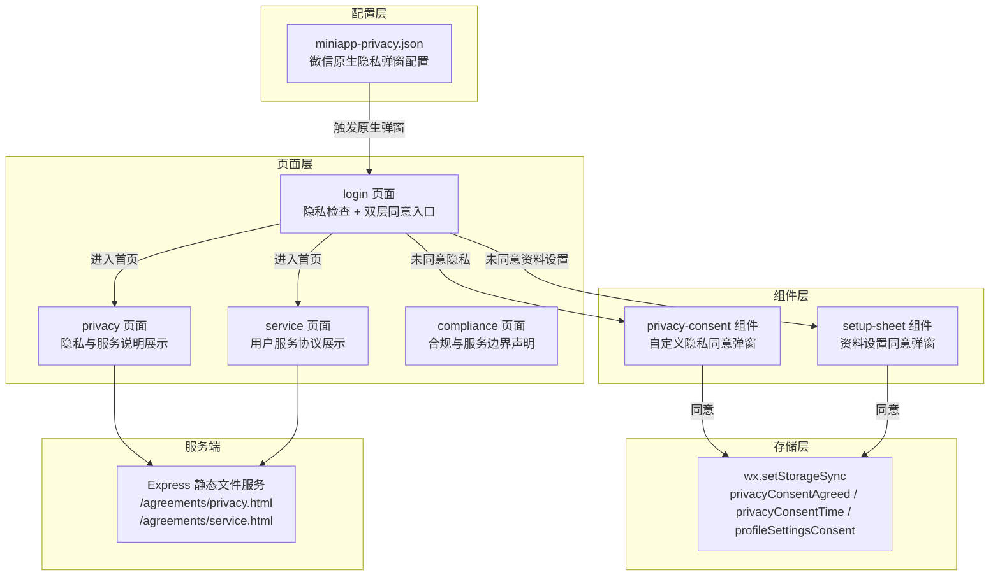
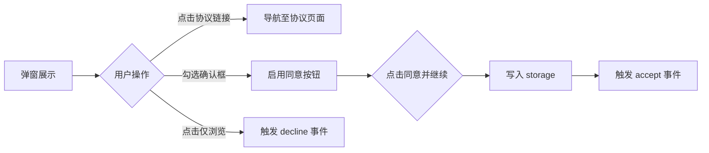
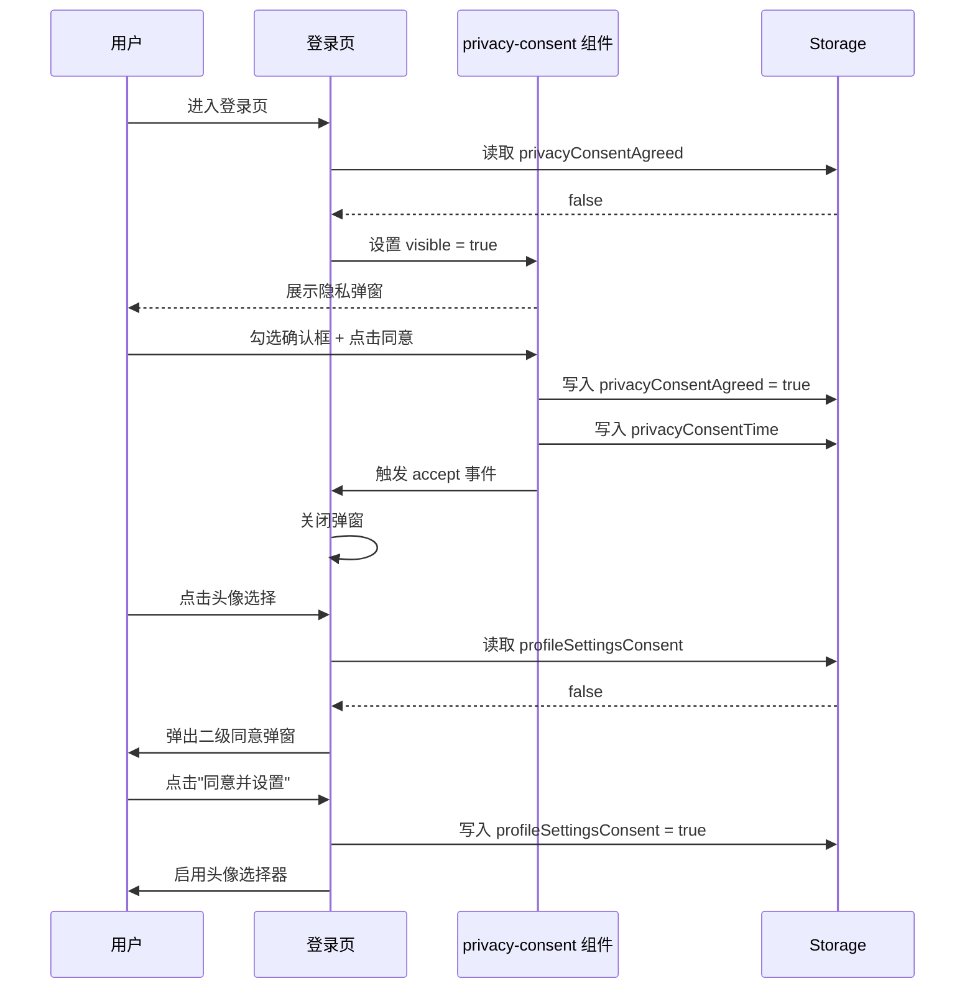
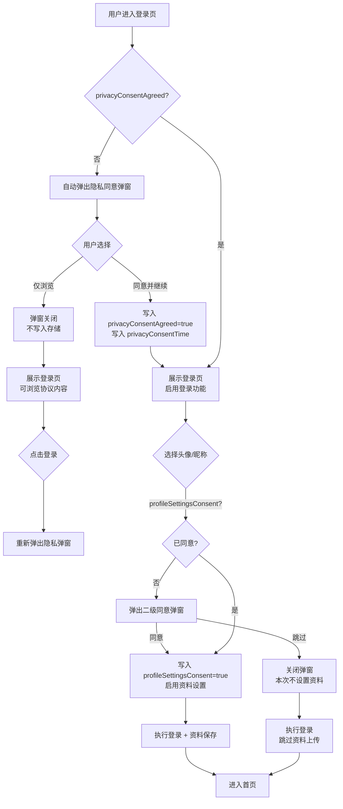

本文档详细说明云端智诊小程序中隐私协议与用户服务协议的完整实现方案，涵盖**双层同意模型**、协议内容管理、后端静态文件托管以及合规边界声明的设计与代码实现。

## 整体架构概览

隐私协议实现采用**两层同意机制**：第一层为隐私与服务协议同意（登录前置条件），第二层为资料设置说明同意（头像/昵称上传前置条件）。两个层次均采用"拒绝可浏览、同意才使用"的渐进式披露策略。



## 双层同意模型

系统将隐私合规分为两个独立的同意层级，每一层都有明确的触发条件和用户路径。

### 第一层：隐私与服务协议同意

这是登录的前置条件。用户必须主动勾选并点击"同意并继续"后，才能调用登录接口。拒绝时进入**仅浏览模式**，可查看首页、健康知识和协议内容，但无法创建记录、设置提醒或使用需要账号的功能。

**存储键**：`privacyConsentAgreed`（布尔值）、`privacyConsentTime`（时间戳）

### 第二层：资料设置说明同意

这是头像选择和昵称保存的前置条件。用户在登录页尝试设置头像或昵称时，若未同意资料设置说明，系统会弹出二级同意弹窗。同意后存储 `profileSettingsConsent`。此层同意是独立的——用户可以同意隐私协议直接登录但跳过资料设置。

**存储键**：`profileSettingsConsent`（布尔值）

| 层级 | 触发场景 | 拒绝后果 | 存储键 |
|------|----------|----------|--------|
| 第一层 | 首次进入登录页、点击登录按钮 | 进入仅浏览模式，无法登录 | `privacyConsentAgreed` |
| 第二层 | 登录页点击头像/昵称区域 | 本次不设置资料，仍可登录 | `profileSettingsConsent` |

Sources: [login/index.js](miniprogram/pages/login/index.js#L37-L52), [privacy-consent/index.js](miniprogram/components/privacy-consent/index.js#L27-L35)

## 微信原生隐私弹窗配置

项目根目录的 `miniapp-privacy.json` 是微信小程序基础库 2.32.3+ 要求的隐私保护指引配置文件。微信平台会在用户首次调用隐私接口时自动弹出原生弹窗，弹窗内容由此文件定义。

```json
{
  "title": "隐私保护说明",
  "message": "欢迎使用云端智诊。你可以先在浏览模式下查看首页、健康知识、隐私说明和服务边界；当你主动使用微信登录、头像填写、个人记录保存与复查提醒等能力时，我们会按照...",
  "confirm": "同意并继续",
  "cancel": "仅浏览",
  "messageLinks": {
    "《隐私与服务说明》": {
      "url": "https://xcx.hpvsc.icu/agreements/privacy.html"
    },
    "《用户服务协议》": {
      "url": "https://xcx.hpvsc.icu/agreements/service.html"
    }
  }
}
```

配置中的 `messageLinks` 字段将文本中的超链接与后端托管的协议 HTML 文件关联。用户点击链接后，微信会在内置 WebView 中打开对应的协议页面。这与小程序内自定义隐私弹窗中的链接互为补充——前者覆盖微信原生隐私弹窗场景，后者覆盖应用自定义弹窗场景。

Sources: [miniapp-privacy.json](miniapp-privacy.json#L1-L36)

## 自定义隐私同意弹窗组件

`privacy-consent` 是一个纯前端自定义组件，承担登录页的第一层隐私同意交互。组件设计遵循**事件驱动**模式，父页面只需控制 `visible` 属性并监听 `accept`/`decline` 事件。

### 组件接口

| 属性/事件 | 方向 | 类型 | 说明 |
|-----------|------|------|------|
| `visible` | 输入 | `Boolean` | 控制弹窗显隐 |
| `accept` | 输出 | `Event` | 用户勾选并点击"同意并继续" |
| `decline` | 输出 | `Event` | 用户点击"仅浏览" |

组件内部维护一个 `checked` 状态，只有勾选了协议阅读确认框后，"同意并继续"按钮才会启用。这种设计确保了用户的**主动同意行为**，满足合规要求。

### 交互流程



用户点击"仅浏览"时，组件仅触发 `decline` 事件，不写入任何存储——这意味着下次进入登录页时弹窗会再次出现，给用户重新选择的机会。用户点击"同意并继续"后，组件会写入 `privacyConsentAgreed` 和 `privacyConsentTime`，然后触发 `accept` 事件通知父页面关闭弹窗。

Sources: [privacy-consent/index.js](miniprogram/components/privacy-consent/index.js#L1-L42), [privacy-consent/index.wxml](miniprogram/components/privacy-consent/index.wxml#L1-L32)

## 登录页隐私拦截逻辑

登录页面是隐私同意的核心拦截点，贯穿用户从进入到完成登录的整个流程。

### 初始化检查

登录页 `onLoad` 时执行 `_checkPrivacyConsent()`：从 Storage 读取 `privacyConsentAgreed`，若未同意则自动弹出隐私同意弹窗。这确保用户在看到登录表单之前就面对协议确认。

### 登录拦截

`submitLogin()` 和 `skipSetupAndLogin()` 两个入口在调用登录逻辑之前都会检查 `privacyConsentAgreed`。若未同意，重新弹出弹窗并提示"请先阅读并同意隐私协议与服务协议"，阻止登录请求发出。

### 资料设置拦截

用户在登录页点击头像选择器时，如果 `setupEnabled` 为 `false`（即未同意第二层资料设置说明），点击事件被拦截并弹出二级同意弹窗。头像选择器在未同意时渲染为纯 `view` 元素（而非 `button[open-type="chooseAvatar"]`），从 DOM 层面阻止原生头像选择器的触发。



Sources: [login/index.js](miniprogram/pages/login/index.js#L33-L52), [login/index.wxml](miniprogram/pages/login/index.wxml#L64-L81)

## 协议内容管理

协议内容在两个位置分别维护，服务于不同的访问场景。

### 小程序内协议页面

位于 `packages/profile/privacy/` 和 `packages/profile/service/` 分包中，采用结构化的编号列表形式展示协议内容。这些页面仅做内容展示，页面 JS 为空实现（`Page({})`），所有内容直接硬编码在 WXML 中。

隐私说明页面包含五个核心板块：
1. **我们收集什么** — 说明数据收集范围仅限用户主动使用的服务
2. **头像昵称用途** — 限定头像和昵称的使用场景
3. **提醒通知授权** — 说明通知授权的触发条件
4. **服务边界** — 声明不提供的医疗服务类型
5. **反馈与删除** — 说明用户数据删除的途径

用户服务协议页面包含六个板块：服务内容、自愿登录、账号责任、使用范围、服务边界和隐私反馈。

这些页面在 `navigation.js` 中注册为 `ROUTES.privacy` 和 `ROUTES.serviceAgreement`，可在登录页弹窗中的协议链接、个人中心等多个入口跳转。

Sources: [privacy/index.wxml](miniprogram/packages/profile/privacy/index.wxml#L1-L54), [service/index.wxml](miniprogram/packages/profile/service/index.wxml#L1-L61), [navigation.js](miniprogram/utils/navigation.js#L1-L17)

### 后端静态协议文件

后端通过 Express 静态文件中间件将 `server/public/agreements/` 目录下的 HTML 文件挂载到 `/agreements` 路径，供 `miniapp-privacy.json` 中的 `messageLinks` 引用。这些 HTML 文件是自包含的单页文档，包含完整的内联样式，可在微信内置浏览器中独立渲染。

服务端配置在 `src/app.js` 中：

```javascript
app.use("/agreements", express.static(
  path.join(__dirname, "..", "public", "agreements")
));
```

协议文件的线上访问地址为：
- 隐私与服务说明：`https://xcx.hpvsc.icu/agreements/privacy.html`
- 用户服务协议：`https://xcx.hpvsc.icu/agreements/service.html`

需要注意的是，小程序内协议页面和后端 HTML 文件的内容应当保持同步。当需要更新协议内容时，需要同时修改两处。

Sources: [app.js](server/src/app.js#L22), [privacy.html](server/public/agreements/privacy.html#L1-L121), [service.html](server/public/agreements/service.html#L1-L121)

## 合规与服务边界声明

`packages/profile/compliance/` 页面提供了独立的合规边界声明页，用"允许使用"和"明确不提供"两组清单的方式向用户直观展示小程序的服务边界。此页面不涉及同意逻辑，仅作为信息展示。

页面数据结构包含三个维度：

| 数据 | 内容 | 作用 |
|------|------|------|
| `allowedItems` | 3 条允许使用的功能描述 | 向用户确认可用范围 |
| `restrictedItems` | 3 条明确不提供的服务 | 声明服务边界，规避医疗合规风险 |
| `checklist` | 隐私说明、用户反馈、健康边界 | 合规要素自检状态 |

Sources: [compliance/index.js](miniprogram/packages/profile/compliance/index.js#L1-L20), [compliance/index.wxml](miniprogram/packages/profile/compliance/index.wxml#L1-L49)

## 全局隐私状态

应用启动时，`app.js` 的 `onLaunch` 从 Storage 读取隐私同意状态并缓存到 `globalData.privacyConsentAgreed`。这为其他需要快速判断同意状态的模块提供了不依赖 Storage 读取的全局入口。

```javascript
// app.js onLaunch
this.globalData.privacyConsentAgreed = !!wx.getStorageSync("privacyConsentAgreed");
```

不过，当前代码中 `globalData.privacyConsentAgreed` 仅在启动时读取一次，未被其他页面直接引用。各页面仍然通过 `wx.getStorageSync("privacyConsentAgreed")` 独立读取，这保证了状态的一致性——因为同意操作由组件直接写入 Storage，无需通知全局对象更新。

Sources: [app.js](miniprogram/app.js#L55-L58)

## 首页浏览模式

未同意隐私协议时，用户仍可浏览首页。`pages/home/index.js` 中通过 `isLoggedIn()` 判断登录状态，未登录时渲染 `GUEST_HOME` 静态数据——展示功能入口和鼓励性文案，但不加载任何个人数据。

`GUEST_HOME` 对象中的关键引导信息：
- `latestTitle`: "首页可先浏览主要功能"
- `latestSummary`: 引导用户了解健康记录、复查提醒等功能
- `nextReminder`: 说明登录后可同步数据到账号
- `disclaimer`: 产品仅用于健康信息记录与提醒的服务边界声明

用户从首页点击功能入口时，部分功能（如记录列表、提醒列表）会因未登录而无法使用，但健康知识和协议页面可以正常访问。

Sources: [home/index.js](miniprogram/pages/home/index.js#L20-L36)

## 数据流全景

