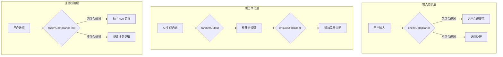
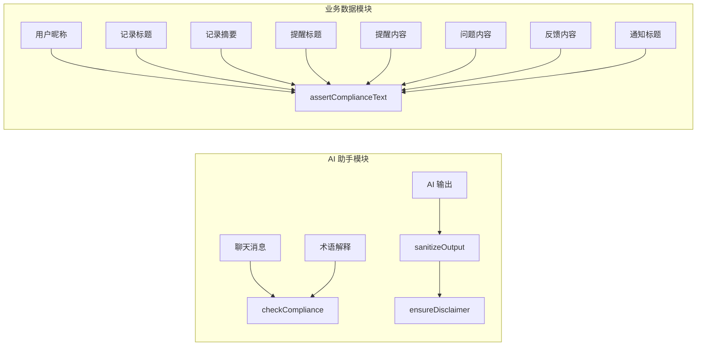
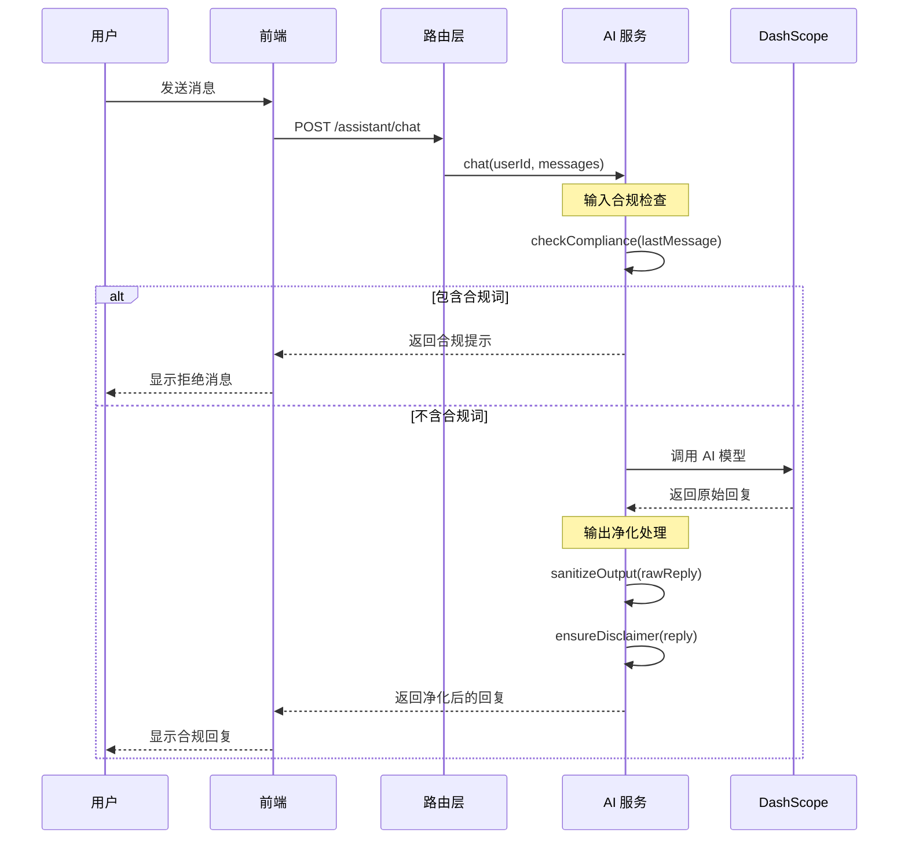
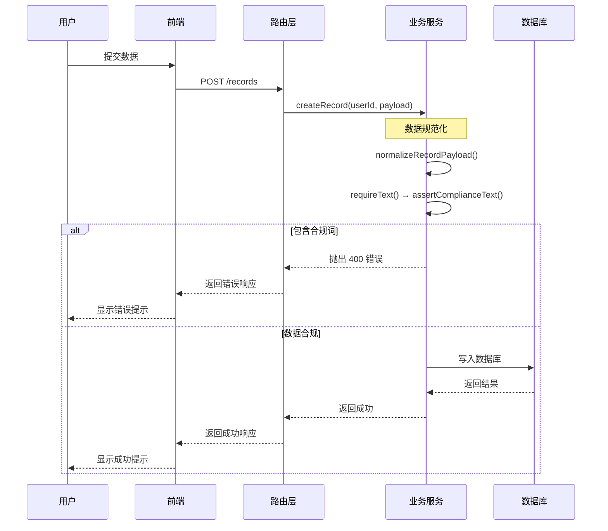

## 概述

CervixDetectAI 小程序作为女性健康科普工具，严格遵守医疗健康类应用的合规要求。合规词拦截机制是系统安全架构的核心组成部分，通过双重防护策略（输入拦截 + 输出净化）确保 AI 助手和用户生成内容不涉及医疗诊断、治疗方案等受监管领域。该机制在服务层统一实现，覆盖所有文本输入点，为小程序的合规运营提供技术保障。

## 架构设计

合规词拦截采用**双层防护架构**，分别在输入端和输出端进行内容审核：



## 合规词清单

系统定义了统一的禁止服务术语列表，涵盖医疗诊断、治疗方案、在线问诊等受监管领域：

| 类别 | 禁止术语 | 监管依据 |
|------|----------|----------|
| **诊断类** | AI诊断、辅助诊断、在线诊断 | 《互联网诊疗管理办法》 |
| **问诊类** | 在线问诊、诊疗建议 | 《互联网诊疗管理办法》 |
| **治疗类** | 治疗方案、处方代开 | 《处方管理办法》 |
| **预测类** | 疾病预测、病变识别 | 《医疗器械监督管理条例》 |
| **其他** | 挂号缴费 | 医疗机构资质要求 |

**术语列表定义位置**：
- AI 助手服务：`PROHIBITED_TERMS` 数组
- 业务服务层：`PROHIBITED_SERVICE_TERMS` 数组

Sources: [ai-assistant.service.js](server/src/services/ai-assistant.service.js#L20-L24), [miniapp.service.js](server/src/services/miniapp.service.js#L10-L21)

## 核心函数实现

### 1. 输入合规检查 `checkCompliance(text)`

**功能**：检查用户输入是否包含禁止术语，返回友好的合规提示。

**实现逻辑**：
- 将输入转换为字符串
- 使用 `Array.find()` 查找第一个匹配的禁止术语
- 匹配成功时返回格式化的拒绝消息
- 未匹配时返回 `null` 表示通过检查

**返回值示例**：
```javascript
// 输入包含"在线诊断"
"抱歉，我无法提供在线诊断相关服务。本助手仅提供健康科普和术语解释。"

// 输入不含合规词
null
```

Sources: [ai-assistant.service.js](server/src/services/ai-assistant.service.js#L26-L33)

### 2. 输出净化 `sanitizeOutput(text)`

**功能**：从 AI 生成的内容中移除所有禁止术语，确保输出内容合规。

**实现逻辑**：
- 遍历所有禁止术语
- 使用 `String.split(term).join("")` 移除匹配的术语
- 返回净化后的文本

**处理示例**：
```javascript
// AI 输出
"根据您的描述，建议进行AI诊断以确定..."

// 净化后
"根据您的描述，建议进行以确定..."
```

Sources: [ai-assistant.service.js](server/src/services/ai-assistant.service.js#L35-L41)

### 3. 免责声明注入 `ensureDisclaimer(text)`

**功能**：确保 AI 回复包含免责声明，符合健康科普类应用的合规要求。

**实现逻辑**：
- 检查文本是否已包含"以线下医疗机构意见为准"或"仅供参考"
- 未包含时自动追加标准免责声明
- 返回带免责声明的完整文本

**免责声明内容**：
> "以上信息仅供参考，不作为医疗诊断依据，请以线下医疗机构意见为准。"

Sources: [ai-assistant.service.js](server/src/services/ai-assistant.service.js#L43-L49)

### 4. 业务断言检查 `assertComplianceText(text, fieldName)`

**功能**：用于业务数据校验，当文本包含禁止术语时抛出 HTTP 400 错误。

**实现逻辑**：
- 查找第一个匹配的禁止术语
- 匹配成功时创建带 `status: 400` 的 Error 对象
- 错误信息包含字段名和匹配的术语
- 由 Express 错误处理中间件统一捕获

**错误信息格式**：
```
"{fieldName}包含"{matchedTerm}"等本小程序不提供的服务内容，请改为健康记录或线下咨询准备描述"
```

Sources: [miniapp.service.js](server/src/services/miniapp.service.js#L91-L99)

## 拦截点分布

合规词拦截覆盖系统的所有文本输入点，形成完整的防护网络：



### 拦截点详细说明

| 模块 | 拦截点 | 拦截函数 | 触发场景 |
|------|--------|----------|----------|
| **AI 助手** | 聊天消息 | `checkCompliance` | 用户发送消息前 |
| **AI 助手** | 术语解释 | `checkCompliance` | 解释医学术语前 |
| **AI 助手** | AI 输出 | `sanitizeOutput` | AI 生成回复后 |
| **用户资料** | 昵称 | `assertComplianceText` | 登录/更新资料时 |
| **健康记录** | 标题、摘要、建议 | `requireText` → `assertComplianceText` | 创建/更新记录时 |
| **复查提醒** | 标题、描述 | `requireText` → `assertComplianceText` | 创建/更新提醒时 |
| **问题整理** | 问题内容 | `requireText` → `assertComplianceText` | 创建/更新问题时 |
| **用户反馈** | 内容、联系方式 | `requireText` → `assertComplianceText` | 提交反馈时 |
| **通知系统** | 通知标题 | `assertComplianceText` | 创建通知时 |

Sources: [miniapp.service.js](server/src/services/miniapp.service.js#L204-L213), [miniapp.service.js](server/src/services/miniapp.service.js#L223-L229), [miniapp.service.js](server/src/services/miniapp.service.js#L371-L381), [miniapp.service.js](server/src/services/miniapp.service.js#L401-L409)

## 数据流时序

### AI 助手合规拦截流程



### 业务数据合规校验流程



## 错误处理机制

### 错误响应格式

当合规词拦截触发时，系统返回统一的错误格式：

```javascript
{
  "success": false,
  "message": "记录标题包含"在线诊断"等本小程序不提供的服务内容，请改为健康记录或线下咨询准备描述"
}
```

### HTTP 状态码

| 场景 | 状态码 | 说明 |
|------|--------|------|
| 合规词拦截 | 400 | 业务校验失败 |
| AI 助手合规拦截 | 200 | 返回合规提示（非错误） |
| 请求频率限制 | 429 | 触发限流保护 |

Sources: [miniapp.service.js](server/src/services/miniapp.service.js#L91-L99)

## 配置与扩展

### 添加新的禁止术语

如需扩展合规词列表，需同时修改两个文件：

**1. AI 助手服务** (`server/src/services/ai-assistant.service.js`):
```javascript
const PROHIBITED_TERMS = [
  // 现有术语...
  "新增术语1",
  "新增术语2"
];
```

**2. 业务服务层** (`server/src/services/miniapp.service.js`):
```javascript
const PROHIBITED_SERVICE_TERMS = [
  // 现有术语...
  "新增术语1",
  "新增术语2"
];
```

**注意事项**：
- 两个列表必须保持同步
- 术语应为精确匹配（区分大小写）
- 建议按类别分组管理

### 调整拦截行为

当前拦截行为可通过以下方式调整：

| 配置项 | 位置 | 说明 |
|--------|------|------|
| 免责声明内容 | `ai-assistant.service.js` L3 | 修改 `DISCLAIMER` 常量 |
| 错误消息格式 | `miniapp.service.js` L96 | 修改 `assertComplianceText` 函数 |
| 匹配方式 | 各函数内部 | 可改为正则匹配或模糊匹配 |

## 测试验证

### 合规词测试用例

| 输入 | 预期结果 | 测试函数 |
|------|----------|----------|
| "帮我做个AI诊断" | 返回合规提示 | `checkCompliance` |
| "什么是ASC-US？" | 通过检查 | `checkCompliance` |
| "在线问诊一下" | 返回合规提示 | `checkCompliance` |
| "记录标题包含治疗方案" | 抛出 400 错误 | `assertComplianceText` |
| "正常健康记录" | 通过检查 | `assertComplianceText` |

### 输出净化测试

| AI 输出 | 净化后 |
|---------|--------|
| "建议进行AI诊断" | "建议进行" |
| "可以在线问诊" | "可以" |
| "ASC-US是..." | "ASC-US是..."（无变化） |

## 最佳实践

### 开发规范

1. **统一使用合规函数**：所有文本输入点必须调用合规检查函数
2. **错误信息友好**：向用户说明拒绝原因，引导正确使用
3. **日志记录**：记录合规拦截事件，便于审计和分析
4. **定期更新**：根据监管要求及时更新合规词列表

### 性能考虑

- 合规词列表规模较小（当前 10 个术语），线性查找性能可接受
- 如需支持大量术语，可考虑使用 Trie 树或 Aho-Corasick 算法优化
- 缓存编译后的正则表达式可提升匹配性能

## 相关文档

- [隐私协议实现](22-yin-si-xie-yi-shi-xian) - 了解用户隐私保护机制
- [Express 路由与中间件设计](15-expresslu-you-yu-zhong-jian-jian-she-ji) - 了解路由层架构
- [业务服务层架构](16-ye-wu-fu-wu-ceng-jia-gou) - 了解服务层设计
- [接口参考](06-api-reference) - 查看完整的 API 文档

## 下一步

完成合规词拦截机制的理解后，建议继续阅读：

1. [头像存储与跨域处理](24-tou-xiang-cun-chu-yu-kua-yu-chu-li) - 了解文件存储和跨域策略
2. [健康检查记录管理](25-jian-kang-jian-cha-ji-lu-guan-li) - 了解核心业务功能实现
3. [问题整理功能](27-wen-ti-zheng-li-gong-neng) - 了解用户内容管理