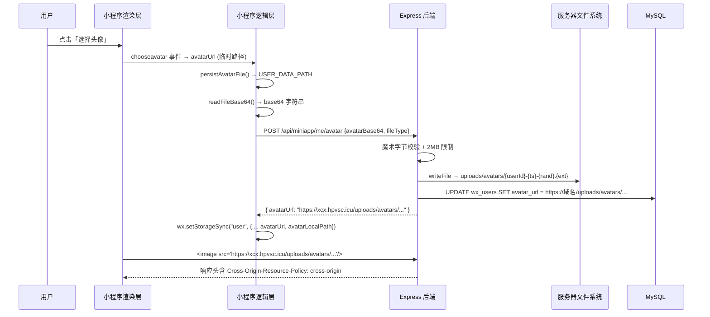

本页详细说明"云端智诊"微信小程序中用户头像的完整生命周期——从前端选择与持久化、Base64 编码传输、服务端文件落地存储，到渲染层跨域加载头像图片时所需的 HTTP 响应头配置。全文围绕两个核心问题展开：**头像文件如何可靠地存储为可公开访问的 URL**，以及**小程序渲染层为什么需要跨域策略、如何配置**。

## 整体架构概览

头像处理涉及前端（微信小程序）与后端（Express + MySQL）两个独立进程，通过一条 Base64 编码的 JSON 请求串联。下图展示了从用户选择头像到最终展示的完整数据流：



Sources: [avatar.js](miniprogram/utils/avatar.js#L1-L254), [avatar-storage.service.js](server/src/services/avatar-storage.service.js#L1-L104), [app.js](server/src/app.js#L1-L49)

## 前端头像处理链路

前端头像处理分为三个阶段：**临时路径获取**、**本地持久化**和 **Base64 编码上传**。核心逻辑封装在 `miniprogram/utils/avatar.js` 中，由 `setup-sheet` 组件和 `profile` 页面分别在不同场景调用。

### 临时路径获取与持久化

微信 `open-type="chooseAvatar"` 按钮返回的 `avatarUrl` 是一个临时路径。在开发者工具中，这个路径通常是 `http://127.0.0.1:PORT/__tmp__/xxx` 格式的 HTTP URL；在真机上则是 `wxfile://tmp/xxx` 格式的本地文件路径。**临时路径随时可能被系统回收**，因此必须在使用前将其持久化到 `USER_DATA_PATH`。

`persistAvatarFile()` 函数实现了三级降级策略，应对开发者工具临时 URL 无法被标准 API 直接访问的问题：

| 优先级 | 策略 | 适用场景 | 核心 API |
|--------|------|----------|----------|
| 1 | readFile → writeFile | 部分基础库可直接读取 `__tmp__` URL | `wx.getFileSystemManager().readFile` + `writeFile` |
| 2 | downloadFile → saveFile | HTTP 临时 URL 可被下载 | `wx.downloadFile` + `wx.saveFile` |
| 3 | getImageInfo → saveFile | 以上均失败时的最终兜底 | `wx.getImageInfo` + `wx.saveFile` |

关键安全约束：**返回值绝对不能是 `__tmp__` 临时 URL**，否则下游 `<image>` 标签加载时会触发渲染层 500 错误。函数在最终返回前统一过滤此类 URL。[avatar.js](miniprogram/utils/avatar.js#L122-L167)

Sources: [avatar.js](miniprogram/utils/avatar.js#L70-L167), [setup-sheet/index.js](miniprogram/components/setup-sheet/index.js#L91-L112)

### Base64 编码与文件类型检测

头像上传不使用 `wx.uploadFile`，而是将文件内容编码为 Base64 字符串后随 JSON 请求体发送。这样做的原因是项目采用统一的 `request()` 封装，Base64 方式可以复用 Token 注入、缓存、错误处理等基础设施。

`readFileBase64()` 在读取时需要注意：部分基础库对 HTTP URL 返回 `ArrayBuffer` 而非 Base64 字符串，此时需要手动通过 `Uint8Array` 逐块转换，或回退到 `wx.arrayBufferToBase64`。[avatar.js](miniprogram/utils/avatar.js#L56-L68)

`resolveAvatarFileType()` 采用**魔术字节优先、扩展名兜底**的策略检测文件类型，避免扩展名与内容不一致导致服务端校验失败：

| 魔术字节 | 偏移 | 对应类型 |
|----------|------|----------|
| `FF D8 FF` | 前 3 字节 | image/jpeg |
| `89 50 4E 47 0D 0A 1A 0A` | 前 8 字节 | image/png |
| `RIFF....WEBP` | 前 12 字节 | image/webp |

[avatar.js](miniprogram/utils/avatar.js#L210-L247)

### URL 格式归一化

`normalizeRemoteAvatarUrl()` 会将 `http://xcx.hpvsc.icu`（或带 `:443` 端口）的 URL 自动升级为 `https://xcx.hpvsc.icu`。这是因为在微信小程序中，非 HTTPS 域名的图片在某些场景下可能被拦截。该函数同时验证 URL 必须以 `http://` 或 `https://` 开头，过滤掉空值或本地路径误入的情况。[avatar.js](miniprogram/utils/avatar.js#L24-L29)

## 服务端头像存储

### 上传接口与鉴权链路

头像上传走 `POST /api/miniapp/me/avatar` 路由，受 `authenticate` 中间件保护，需要 `Authorization: Bearer <token>` 请求头。请求体格式为 JSON（非 multipart/form-data），包含两个字段：

| 字段 | 类型 | 说明 |
|------|------|------|
| `avatarBase64` | string | 头像文件的 Base64 编码 |
| `fileType` | string | MIME 类型：`image/jpeg`、`image/png` 或 `image/webp` |

路由处理链：`authenticate` → `asyncRoute` → `miniappService.uploadAvatar` → `avatarStorage.saveAvatar` → `repository.updateProfile`。[miniapp.js](server/src/routes/miniapp.js#L67-L69), [miniapp.service.js](server/src/services/miniapp.service.js#L199-L204)

### 文件落地与安全校验

`avatar-storage.service.js` 的 `saveAvatar()` 函数执行以下步骤：

1. **格式校验**：仅接受 JPEG、PNG、WebP 三种 MIME 类型
2. **大小限制**：文件不得超过 2MB（`AVATAR_MAX_BYTES = 2 * 1024 * 1024`）
3. **魔术字节双重校验**：用 `detectImageType()` 检测 Buffer 前几个字节，**必须与声明的 `fileType` 一致**——这是防止客户端伪造文件类型的关键安全措施
4. **目录自动创建**：`fs.mkdir(AVATAR_DIR, { recursive: true })` 确保 `uploads/avatars/` 目录存在
5. **唯一文件名生成**：`{userId}-{timestamp}-{randomHex}.{ext}` 格式，避免并发冲突和文件名碰撞
6. **写入磁盘并返回公开 URL**

文件名示例：`42-1700000000000-a1b2c3d4e5f6.jpg`

落地后的文件路径为 `server/uploads/avatars/`，在 `.gitignore` 中被排除，不会被纳入版本控制。[avatar-storage.service.js](server/src/services/avatar-storage.service.js#L63-L97)

Sources: [avatar-storage.service.js](server/src/services/avatar-storage.service.js#L1-L104), [.gitignore](server/.gitignore#L1-L3)

### 公开 URL 的拼接逻辑

`resolvePublicBaseUrl()` 优先使用环境变量 `MINIAPP_PUBLIC_BASE_URL`（例如 `https://xcx.hpvsc.icu`），如果未配置则回退到 `req.protocol + req.get("host")`。最终返回的 URL 格式为 `https://xcx.hpvsc.icu/uploads/avatars/{filename}`。这个 URL 被写入 `wx_users.avatar_url` 列，作为头像的持久化地址。[avatar-storage.service.js](server/src/services/avatar-storage.service.js#L53-L57)

## 跨域处理机制

### 为什么小程序图片加载需要跨域策略

微信小程序的渲染层是一个独立的 WebView 进程。当 `<image>` 标签加载外部 HTTPS 域名的图片时，浏览器内核会按标准的跨域资源共享（CORS）策略处理请求。如果服务端未返回正确的响应头，渲染层会拒绝加载图片，表现为 `<image>` 触发 `error` 事件且图片不显示。

与传统 Web 应用不同，**小程序的 `<image>` 标签不存在 `crossOrigin` 属性设置**，跨域策略完全由服务端响应头控制。

### helmet 全局中间件配置

Express 使用 `helmet` 中间件设置全局安全头。默认配置下，helmet 会设置 `Cross-Origin-Resource-Policy: same-origin`，这会阻止小程序渲染层（作为跨源请求方）加载图片。项目通过显式覆盖为 `cross-origin` 策略来解决此问题：

```javascript
app.use(helmet({
  crossOriginResourcePolicy: { policy: "cross-origin" }
}));
```

[app.js](server/src/app.js#L14-L16)

### /uploads 静态资源的双重响应头

对于 `/uploads` 路径下的静态文件（包括头像），项目在 `express.static` 的 `setHeaders` 回调中额外设置了两个关键响应头：

| 响应头 | 值 | 作用 |
|--------|-----|------|
| `Cross-Origin-Resource-Policy` | `cross-origin` | 允许跨源上下文（小程序渲染层 WebView）嵌入该资源 |
| `Access-Control-Allow-Origin` | `*` | 允许任意来源读取资源，兼容部分基础库的 CORS 预检 |

这两层配置形成冗余保护：`Cross-Origin-Resource-Policy` 是较新的标准（CORP），而 `Access-Control-Allow-Origin` 是传统的 CORS 头，两者共同确保不同版本的 WebView 内核都能正常加载头像图片。[app.js](server/src/app.js#L19-L25)

### CORS 中间件与 AllowedOrigin

`cors()` 中间件通过环境变量 `MINIAPP_ALLOWED_ORIGIN` 配置允许的来源，默认值为 `*`。这主要影响的是 API 请求的跨域行为（如浏览器中的 `wx.request`），与图片资源的跨域加载是两套独立的机制。[app.js](server/src/app.js#L17), [env.js](server/src/config/env.js#L4)

## 头像展示与降级策略

### 双路径存储模型

前端在 `wx.getStorageSync("user")` 中同时维护两个头像字段：

| 字段 | 来源 | 说明 |
|------|------|------|
| `avatarUrl` | 服务端返回的公开 URL | 远程地址，如 `https://xcx.hpvsc.icu/uploads/avatars/...` |
| `avatarLocalPath` | 本地持久化后的路径 | 如 `wxfile://usr/avatar_1700000000000.jpg` |

`avatarLocalPath` 在头像刚被选择、尚未成功上传到服务端时作为**本地兜底**；上传成功后 `avatarUrl` 被更新，优先使用远程 URL。

### 渲染层降级逻辑

`resolveActiveAvatarUrl()` 函数决定了 `<image>` 标签实际使用的 `src`。其优先级为：**远程 URL > 本地路径 > 空（显示默认头像）**。当远程 URL 加载失败时（触发 `onAvatarLoadError`），记录失败的 URL 并自动切换到 `avatarLocalPath`，实现无感知降级。[profile/index.js](miniprogram/pages/profile/index.js#L37-L43), [profile/index.js](miniprogram/pages/profile/index.js#L246-L253)

### 待同步头像的延迟上传

`syncPendingAvatar()` 处理一种边界场景：用户在离线或网络不佳时选择了头像，`avatarLocalPath` 已持久化但 `avatarUrl` 为空（服务端尚未收到）。每次进入 profile 页面时，此函数会检测这一状态并自动重试上传。如果检测到 `avatarLocalPath` 是已失效的开发者工具临时 URL，则清除该路径避免反复失败。[profile/index.js](miniprogram/pages/profile/index.js#L306-L353)

## 数据库存储

头像的公开 URL 持久化在 `wx_users` 表的 `avatar_url` 列中：

```sql
avatar_url VARCHAR(500) NULL
```

在登录、更新资料、上传头像三个场景中，`avatar_url` 均通过 `COALESCE(VALUES(avatar_url), avatar_url)` 语义更新——即仅在新值非空时覆盖，防止误传空值导致已有头像丢失。本地路径 `avatarLocalPath` 不存入数据库，仅保存在小程序本地存储中。[init.sql](server/database/init.sql#L11), [miniapp.repository.js](server/src/repositories/miniapp.repository.js#L139-L147)

## 环境变量配置

与头像和跨域相关的环境变量位于 `server/.env`（已加入 `.gitignore`）：

| 变量名 | 默认值 | 说明 |
|--------|--------|------|
| `MINIAPP_PUBLIC_BASE_URL` | `""`（回退到请求域名） | 头像公开 URL 的基准地址，生产环境建议设为 `https://xcx.hpvsc.icu` |
| `MINIAPP_ALLOWED_ORIGIN` | `"*"` | CORS 允许的来源，影响 API 请求的跨域行为 |

Sources: [env.js](server/src/config/env.js#L3-L4)

## 相关阅读建议

- 需要了解小程序如何封装统一请求、注入 Token，请参阅 [请求封装与Token管理](12-qing-qiu-feng-zhuang-yu-tokenguan-li)
- 需要了解鉴权中间件与会话管理的完整机制，请参阅 [鉴权机制与会话管理](18-jian-quan-ji-zhi-yu-hui-hua-guan-li)
- 需要了解数据库用户表的完整字段设计，请参阅 [数据库表结构设计](19-shu-ju-ku-biao-jie-gou-she-ji)
- 需要了解后端部署时域名与 HTTPS 证书配置，请参阅 [后端服务部署](7-hou-duan-fu-wu-bu-shu)
- 需要了解用户登录与资料管理的业务流程，请参阅 [用户登录与资料管理](29-yong-hu-deng-lu-yu-zi-liao-guan-li)