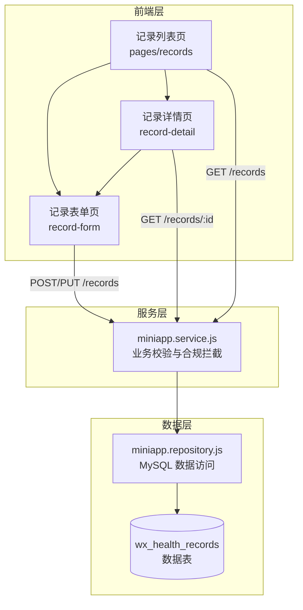
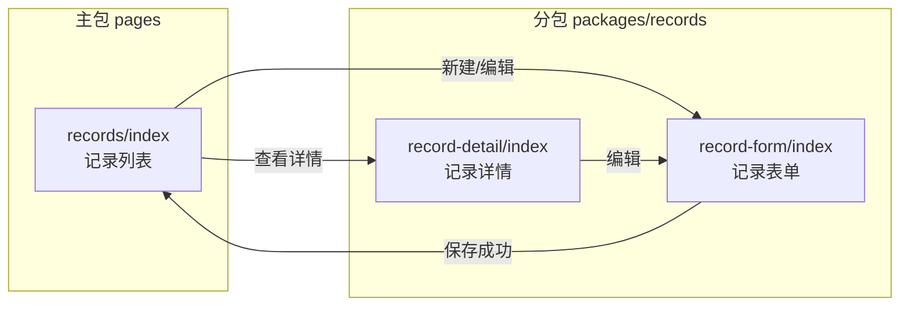
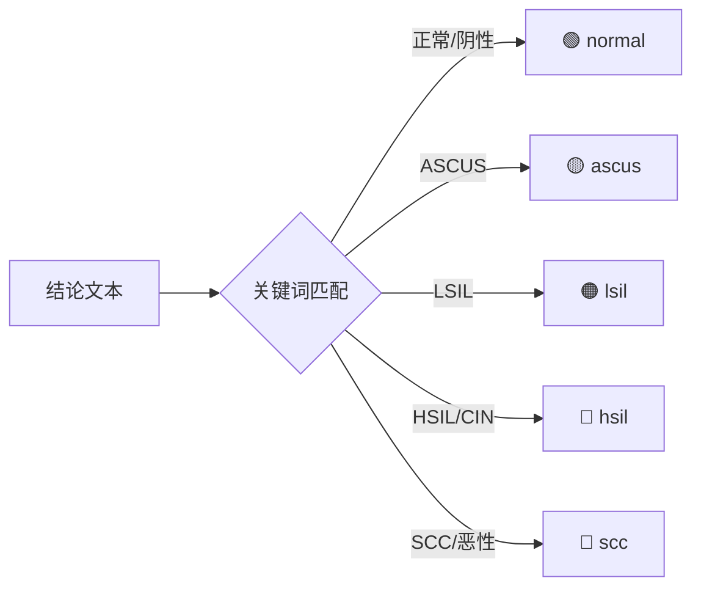
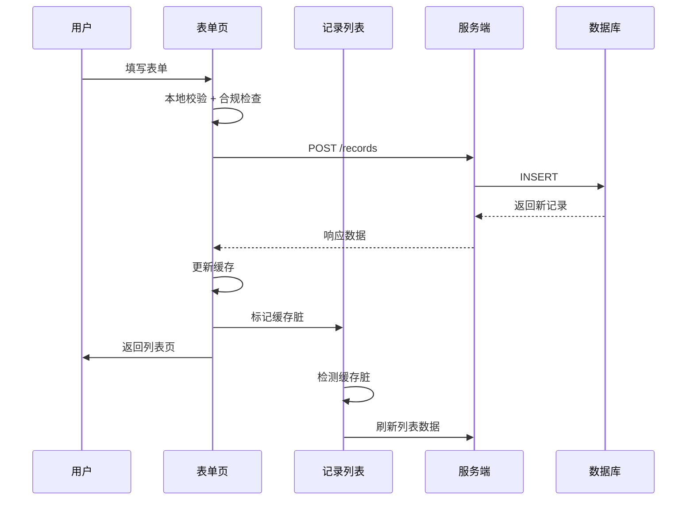
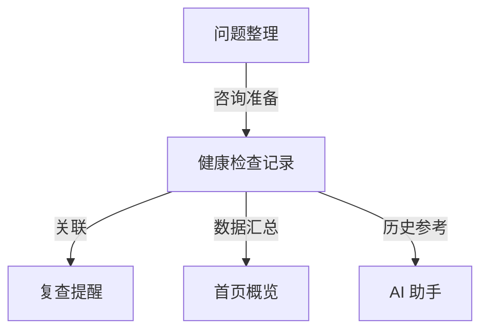

健康检查记录管理是"云端智诊"小程序的核心功能模块，为用户提供个人健康检查摘要的完整生命周期管理。该模块严格遵循合规设计原则，仅记录检查事实和复查提醒，不涉及诊断结论或治疗建议，确保用户能够安全地管理自己的健康档案。

Sources: [init.sql](server/database/init.sql#L28-L47), [api-contract.md](docs/api-contract.md#L10-L19)

## 模块架构概览

健康检查记录管理采用典型的三层架构设计，前后端职责清晰分离。前端负责用户交互和数据展示，服务层处理业务逻辑和合规校验，仓储层专注数据持久化。



该架构的关键设计决策是将记录表单和记录详情分离到独立的分包（packages/records）中，与主包的记录列表页面形成清晰的职责边界。这种设计既优化了主包体积，又保持了相关功能的内聚性。

Sources: [app.json](miniprogram/app.json#L15-L26), [miniapp.js](server/src/routes/miniapp.js#L40-L68)

## 数据模型设计

健康检查记录的数据模型围绕 `wx_health_records` 表构建，该表采用宽表设计，将检查的所有关键信息集中存储，便于查询和展示。

| 字段名 | 类型 | 约束 | 说明 |
|--------|------|------|------|
| id | VARCHAR(32) | PRIMARY KEY | UUID 格式的记录标识 |
| user_id | BIGINT UNSIGNED | FOREIGN KEY | 关联 wx_users 表 |
| record_date | DATE | NOT NULL | 检查日期 |
| title | VARCHAR(120) | NOT NULL | 记录标题，用于列表展示 |
| project | VARCHAR(120) | NOT NULL | 检查项目名称 |
| summary | VARCHAR(500) | NOT NULL | 检查摘要 |
| suggestion | VARCHAR(500) | NOT NULL | 复查提醒建议 |
| status | VARCHAR(40) | DEFAULT '已记录' | 记录状态 |
| hospital | VARCHAR(200) | DEFAULT '' | 检查机构 |
| doctor_name | VARCHAR(80) | DEFAULT '' | 主检医生 |
| conclusion | TEXT | NULLABLE | 结论摘要 |
| attachments | JSON | NULLABLE | 报告图片 URL 列表 |
| created_at | DATETIME | AUTO | 创建时间 |
| updated_at | DATETIME | AUTO | 更新时间 |

记录状态采用枚举白名单机制，只允许以下四种状态值：`已记录`、`待复查`、`待关注`、`已完成`。这种设计确保了状态的一致性，便于前端进行分类筛选和视觉区分。

Sources: [init.sql](server/database/init.sql#L28-L47), [miniapp.service.js](server/src/services/miniapp.service.js#L28-L29)

## API 接口设计

健康检查记录管理提供完整的 RESTful API 接口，所有接口均需通过 Token 鉴权，确保用户只能访问自己的记录数据。

### 接口列表

| 方法 | 路径 | 说明 | 查询参数 |
|------|------|------|----------|
| GET | /records | 获取记录列表 | status, page, pageSize |
| POST | /records | 创建新记录 | - |
| GET | /records/:id | 获取记录详情 | - |
| PUT | /records/:id | 更新记录 | - |
| DELETE | /records/:id | 删除记录 | - |
| POST | /records/:id/report-subscription | 发送报告订阅消息 | - |

### 列表查询接口

列表查询支持分页和状态筛选，返回结构包含分页元数据：

```javascript
// 请求示例
GET /records?status=待复查&page=1&pageSize=20

// 响应结构
{
  "success": true,
  "data": {
    "items": [...],      // 记录数组
    "total": 12,         // 总记录数
    "page": 1,           // 当前页码
    "hasMore": true      // 是否有更多数据
  }
}
```

列表查询的排序规则是先按 `record_date` 降序，再按 `created_at` 降序，确保最新记录始终排在最前面。

Sources: [miniapp.repository.js](server/src/repositories/miniapp.repository.js#L268-L310), [miniapp.js](server/src/routes/miniapp.js#L40-L53)

## 前端页面结构

前端采用分包架构，将记录相关页面组织在独立的子包中，优化主包加载性能。



### 记录列表页

记录列表页是用户访问记录管理的入口，提供以下核心功能：

**数据摘要卡片**：页面顶部展示记录统计信息，包括总记录数、待关注数量和最近记录日期，帮助用户快速了解健康档案概况。

**状态筛选标签**：提供"全部"、"待关注"、"已完成"三个筛选维度，支持按记录状态快速过滤。标签旁显示对应状态的记录数量。

**搜索功能**：支持按标题、项目、日期等关键词进行本地搜索，搜索结果实时过滤，无匹配时显示空状态提示。

**时间线列表**：记录卡片采用时间线布局，每张卡片展示标题、日期、项目、摘要和状态标签。待关注状态的记录会显示红色圆点提示。

Sources: [records/index.js](miniprogram/pages/records/index.js#L1-L80), [records/index.wxml](miniprogram/pages/records/index.wxml#L1-L50)

### 记录表单页

记录表单页负责记录的创建和编辑，采用表单模板和草稿保存机制提升用户体验。

**表单模板系统**：预置三种常用模板，一键填充标题、项目、摘要和建议字段：

| 模板名称 | 适用场景 | 默认状态 |
|----------|----------|----------|
| 筛查摘要 | TCT/HPV 等检查 | 待复查 |
| 复查准备 | 复查前资料整理 | 待关注 |
| 日常记录 | 普通健康记录 | 已记录 |

**草稿保存机制**：新建记录时自动保存草稿到本地存储，页面重新进入时提示恢复。草稿采用防抖策略，用户停止输入 300ms 后触发保存，避免频繁写入。

**附件管理**：支持上传最多 9 张检查报告图片，图片以网格形式展示，支持预览和删除操作。

**合规校验**：所有文本字段在提交前进行合规词拦截，禁止包含"AI诊断"、"辅助诊断"等违规内容，确保记录内容符合小程序服务边界。

Sources: [record-form/index.js](miniprogram/packages/records/record-form/index.js#L30-L85), [record-form/index.wxml](miniprogram/packages/records/record-form/index.wxml#L10-L40)

### 记录详情页

记录详情页展示单条记录的完整信息，并提供诊断结果的视觉识别功能。

**诊断关键词识别**：系统会自动分析结论字段，识别并标注诊断结果级别：



诊断结果的优先级按严重程度排序，当结论中包含多个关键词时，优先显示最高级别的诊断标签。

**报告订阅提醒**：集成微信订阅消息功能，用户点击"开启提醒"后，系统会发送一条报告查看提醒到微信消息列表，方便用户稍后返回查看记录。

Sources: [record-detail/index.js](miniprogram/packages/records/record-detail/index.js#L10-L45), [record-detail/index.wxml](miniprogram/packages/records/record-detail/index.wxml#L40-L80)

## 数据流转过程

记录的完整生命周期涉及多个页面和缓存层的数据同步，系统采用内存缓存加脏标记的策略确保数据一致性。

### 创建流程



### 缓存同步机制

前端采用内存缓存（responseCache）存储接口响应数据，缓存有效期默认 30 秒。当用户执行写操作（创建、更新、删除）后，系统会：

1. 更新本地缓存中的记录详情（setCachedData）
2. 更新列表缓存中的对应项（upsertCachedListItem）
3. 标记首页缓存为脏（markCacheDirty）
4. 返回列表页时检测到脏标记，触发列表刷新

这种设计避免了每次页面展示都发起网络请求，同时保证了数据的最终一致性。

Sources: [request.js](miniprogram/utils/request.js#L1-L50), [record-form/index.js](miniprogram/packages/records/record-form/index.js#L400-L440)

## 合规与安全设计

健康检查记录管理模块严格遵循医疗健康类小程序的合规要求，在多个层面实施安全控制。

### 服务边界声明

页面底部始终显示安全提示："记录内容用于个人健康管理和复查准备，不作为诊断、治疗或紧急医疗建议。"明确告知用户该小程序的服务边界。

### 合规词拦截

服务层在处理记录创建和更新时，会对所有文本字段进行合规词检查。拦截的关键词包括：

- 医疗诊断类：AI诊断、辅助诊断、在线诊断、在线问诊
- 治疗方案类：诊疗建议、治疗方案、处方代开
- 风险预测类：疾病预测、病变识别
- 医疗服务类：挂号缴费

当检测到违规内容时，系统返回 400 状态码，并提示用户修改为"健康记录或线下咨询准备描述"。

Sources: [miniapp.service.js](server/src/services/miniapp.service.js#L14-L25), [miniapp.service.js](server/src/services/miniapp.service.js#L65-L75)

### 数据隔离

所有记录查询和操作都严格绑定用户 ID，SQL 查询条件始终包含 `WHERE user_id = ?`，确保用户只能访问自己的数据。删除操作使用 `DELETE ... WHERE id = ? AND user_id = ?` 双重条件，防止越权访问。

Sources: [miniapp.repository.js](server/src/repositories/miniapp.repository.js#L320-L340), [authenticate middleware](server/src/middleware/auth.js)

## 核心实现细节

### 表单验证策略

表单采用双层验证机制：前端实时校验 + 服务端强制校验。

前端验证规则定义在 `formRules` 数组中，覆盖所有必填字段：

```javascript
const formRules = [
  { name: "date", rules: { required: true, message: "请选择检查日期" } },
  { name: "title", rules: { required: true, message: "请填写记录标题" } },
  { name: "project", rules: { required: true, message: "请填写检查项目" } },
  { name: "summary", rules: { required: true, message: "请填写摘要" } },
  { name: "suggestion", rules: { required: true, message: "请填写提醒建议" } },
  { name: "status", rules: { required: true, message: "请选择记录状态" } }
];
```

服务端使用 `requireText` 和 `requireDate` 函数进行强制校验，确保数据完整性。日期格式校验采用正则匹配加日期有效性双重验证，防止无效日期入库。

Sources: [record-form/index.js](miniprogram/packages/records/record-form/index.js#L70-L78), [miniapp.service.js](server/src/services/miniapp.service.js#L80-L105)

### 附件存储机制

附件采用 JSON 数组存储在数据库中，每个元素为图片的完整 URL。前端上传图片时，先获取临时文件路径，提交表单时一并发送到服务端。

服务端对附件列表进行规范化处理：
- 过滤非 HTTPS 协议的 URL
- 限制最多 9 张图片
- 每个 URL 最大长度 500 字符

```javascript
function normalizeAttachments(value) {
  if (!value) return null;
  const list = Array.isArray(value) ? value : [];
  const urls = list
    .map((item) => cleanText(typeof item === "string" ? item : item?.url || "", 500))
    .filter((url) => url && /^https?:\/\//i.test(url))
    .slice(0, 9);
  return urls.length > 0 ? urls : null;
}
```

Sources: [miniapp.service.js](server/src/services/miniapp.service.js#L120-L130), [record-form/index.js](miniprogram/packages/records/record-form/index.js#L250-L270)

### 订阅消息集成

报告订阅消息功能通过微信订阅消息 API 实现，需要用户主动授权后才能发送。

**模板配置**：在 `config/app.js` 中配置报告模板 ID，支持通过环境变量覆盖。

**授权流程**：
1. 用户点击"开启提醒"按钮
2. 调用 `wx.requestSubscribeMessage` 请求授权
3. 用户同意后，调用后端 `/records/:id/report-subscription` 接口
4. 服务端构建消息数据并发送

**消息字段映射**：

| 模板字段 | 数据来源 | 说明 |
|----------|----------|------|
| thing22 | record.summary | 检查摘要（最多 20 字） |
| phrase4 | record.status | 记录状态 |
| date2 | record.date | 检查日期 |
| thing1 | record.project | 检查项目 |
| thing18 | record.title | 记录标题 |

Sources: [report-subscription.js](miniprogram/packages/records/utils/report-subscription.js#L1-L42), [miniapp.service.js](server/src/services/miniapp.service.js#L230-L260)

## 与其他模块的关联

健康检查记录管理模块与其他功能模块存在紧密的数据关联：

**与复查提醒的关联**：记录详情页提供"开启提醒"功能，可直接为当前记录关联一个复查提醒。提醒模块的 `linked_record_id` 字段存储关联的记录 ID。

**与首页的联动**：首页展示最近一条记录的摘要信息和记录统计数量，这些数据来源于记录模块。记录变更后会标记首页缓存为脏，触发首页数据刷新。

**与问题整理的协同**：用户可以结合检查记录整理就诊前需要咨询的问题，问题模块提供模板支持，两者共同服务于线下咨询准备场景。



Sources: [init.sql](server/database/init.sql#L48-L65), [miniapp.repository.js](server/src/repositories/miniapp.repository.js#L220-L255)

## 扩展开发指南

### 添加新的记录状态

如需扩展记录状态，需要同时修改以下位置：

1. 后端白名单 `RECORD_STATUS_WHITELIST`：[miniapp.service.js](server/src/services/miniapp.service.js#L29)
2. 前端状态选项 `statusOptions`：[record-form/index.js](miniprogram/packages/records/record-form/index.js#L55)
3. 列表页筛选逻辑 `STATUS_FILTERS` 和 `isPendingStatus`/`isDoneStatus` 函数：[records/index.js](miniprogram/pages/records/index.js#L45-L65)

### 自定义表单模板

表单模板定义在 `recordTemplates` 数组中，每个模板包含名称、描述和预填字段：

```javascript
{
  name: "模板名称",
  desc: "模板描述",
  form: {
    title: "预填标题",
    project: "预填项目",
    summary: "预填摘要",
    suggestion: "预填建议",
    status: "预填状态"
  }
}
```

添加新模板后，需要同步更新 WXML 中的模板卡片数量。

Sources: [record-form/index.js](miniprogram/packages/records/record-form/index.js#L30-L65), [record-form/index.wxml](miniprogram/packages/records/record-form/index.wxml#L10-L35)

## 相关文档导航

- 如需了解记录模块的 API 详细规格，请参阅 [API 参考](6-api-reference)
- 如需了解数据表的完整结构设计，请参阅 [数据库表结构设计](19-shu-ju-ku-biao-jie-gou-she-ji)
- 如需了解记录与提醒的关联机制，请参阅 [复查提醒与订阅消息](26-fu-cha-ti-xing-yu-ding-yue-xiao-xi)
- 如需了解前端分包机制，请参阅 [页面结构与分包机制](11-ye-mian-jie-gou-yu-fen-bao-ji-zhi)
- 如需了解合规拦截机制的完整设计，请参阅 [合规词拦截机制](23-he-gui-ci-lan-jie-ji-zhi)