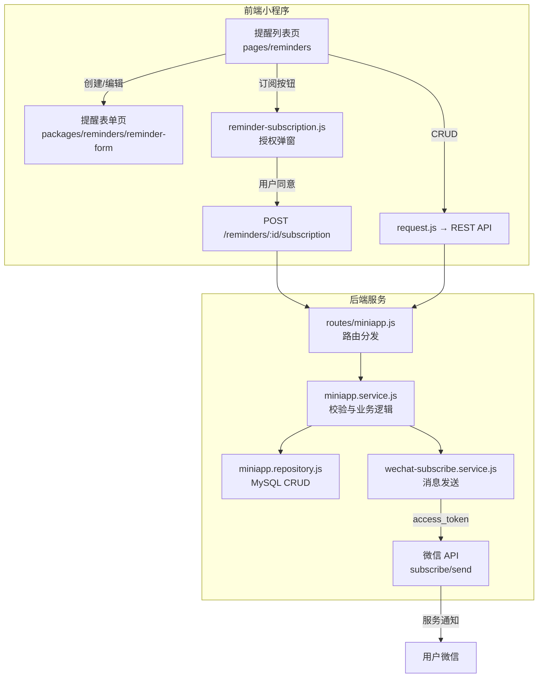
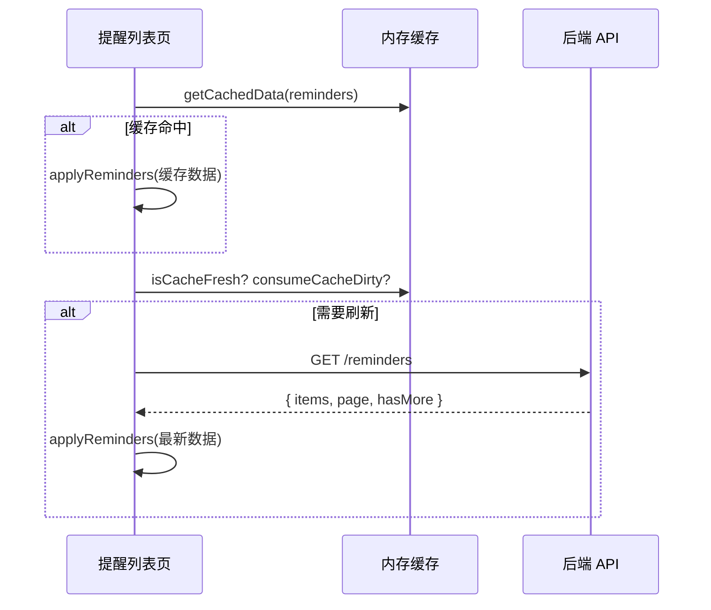
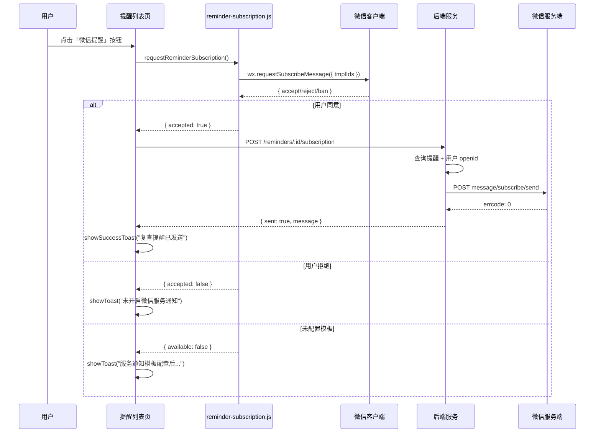

复查提醒模块为用户提供健康检查复查计划的创建、编辑、完成标记、删除以及微信订阅消息推送等能力。本模块涉及小程序前端提醒列表页与提醒表单页、后端 REST API 与业务服务层、微信订阅消息发送服务以及数据库 `wx_reminders` 表。

## 功能架构总览

复查提醒功能贯穿前端展示、后端业务逻辑与微信消息通道三层。前端负责提醒的 CRUD 交互与订阅授权弹窗，后端完成数据持久化校验后通过微信 `subscribe/send` 接口将提醒推送到用户微信服务通知。



## 页面结构与路由注册

提醒相关页面分布在主包和分包中。提醒列表页作为 TabBar 入口页放在主包，提醒表单页放在 `packages/reminders` 分包中，由首页预加载规则触发提前下载。

| 页面 | 路径 | 所在包 | TabBar | 说明 |
|------|------|--------|--------|------|
| 提醒列表 | `pages/reminders/index` | 主包 | ✅ 是 | 展示摘要卡片、搜索、类型筛选、提醒卡片列表 |
| 提醒表单 | `packages/reminders/reminder-form/index` | `packages/reminders` | ❌ 否 | 新增/编辑提醒，含模板、快捷日期、草稿恢复 |

路由注册位于 `app.json` 的 `pages` 与 `subpackages` 字段中，分包预加载规则确保用户进入首页时即下载提醒表单分包。

Sources: [app.json](miniprogram/app.json#L3-L8), [app.json 分包配置](miniprogram/app.json#L16-L21), [app.json 预加载规则](miniprogram/app.json#L39-L48)

## 提醒列表页核心逻辑

提醒列表页是提醒模块的主入口，负责从后端拉取提醒数据、展示概览卡片、提供搜索与类型筛选，并为每条提醒提供「微信提醒」「标记完成」「编辑」「删除」四个操作按钮。

### 数据加载与缓存策略

页面通过 `onShow` 生命周期触发数据加载。首先检查内存缓存（`CACHE_KEYS.reminders`），若缓存存在则立即渲染；随后判断缓存是否过期或被标记为脏数据（`consumeCacheDirty`），决定是否发起静默刷新请求。加载成功后将数据写回缓存，确保下次进入时可瞬间呈现。



分页加载通过 `onReachBottom` 实现，当用户滚动到底部且 `_hasMore` 为 true 时，自动请求下一页并合并到现有列表中。

Sources: [pages/reminders/index.js onShow](miniprogram/pages/reminders/index.js#L103-L138), [loadReminders](miniprogram/pages/reminders/index.js#L140-L165), [onReachBottom](miniprogram/pages/reminders/index.js#L167-L197)

### 搜索与类型筛选

提醒列表支持关键词搜索和类型筛选两种方式。搜索基于标题、内容、状态文本和日期字段的模糊匹配；类型筛选通过 `typeFilter` 字段联动 `filterByType` 函数，从全部提醒中过滤出指定类型。筛选结果实时更新 `typeTabs` 中各标签的计数。

支持的提醒类型及其前端标签如下：

| 类型值 | 前端标签 | 色调变量 |
|--------|----------|----------|
| `follow_up` | 复查 | primary |
| `material` | 资料 | info |
| `consultation` | 咨询 | warning |
| `record` | 整理 | success |

类型筛选 Tab 行展示「全部」「复查」「资料」「咨询」四个选项，每个选项旁显示对应数量角标。

Sources: [filterReminders](miniprogram/pages/reminders/index.js#L38-L45), [filterByType](miniprogram/pages/reminders/index.js#L80-L83), [TYPE_FILTERS](miniprogram/pages/reminders/index.js#L50-L55), [onTypeFilterChange](miniprogram/pages/reminders/index.js#L246-L250)

### 订阅消息授权与发送流程

当用户点击提醒卡片上的「微信提醒」按钮时，前端首先调用 `requestReminderSubscription()` 弹出微信订阅消息授权弹窗。用户同意后，前端向后端发送 `POST /reminders/:id/subscription` 请求，后端再调用微信 `subscribe/send` API 完成消息推送。



订阅授权函数从 `config/app.js` 读取模板 ID 列表。当前配置了 `reminder` 和 `report` 两个模板。若模板 ID 未配置或微信接口不可用，则返回 `{ available: false }` 并展示提示文案。

Sources: [subscribeReminder](miniprogram/pages/reminders/index.js#L289-L313), [reminder-subscription.js](miniprogram/utils/reminder-subscription.js#L1-L45), [config/app.js 订阅模板配置](miniprogram/config/app.js#L7-L10)

## 提醒表单页核心逻辑

提醒表单页支持新建和编辑两种模式，通过 URL 参数 `id` 区分。新建模式下支持草稿恢复机制，编辑模式下从缓存或 API 加载已有数据。

### 表单字段与校验

表单包含以下字段：

| 字段 | 类型 | 必填 | 前端控件 | 后端校验 |
|------|------|------|----------|----------|
| `title` | string | ✅ | 输入框（可选预设标题） | `requireText`，最长 120 字符 |
| `date` | string | ✅ | 日期选择器 + 快捷日期 | `requireDate`，格式 `YYYY-MM-DD` |
| `desc` | string | ✅ | 多行文本域 | `requireText`，最长 500 字符 |
| `type` | enum | ❌ | Chip 选择（默认 `follow_up`） | `validateEnum`，白名单校验 |
| `priority` | enum | ❌ | Chip 选择（默认 `medium`） | `validateEnum`，白名单校验 |
| `done` | boolean | ❌ | 复选框 | `normalizeDone` 布尔转换 |
| `notes` | string | ❌ | 多行文本域 | `cleanText`，最长 2000 字符 |
| `linkedRecordId` | string | ❌ | 预留（未来关联记录） | `cleanText`，最长 32 字符 |

后端校验白名单值：

| 字段 | 允许值 |
|------|--------|
| `type` | `follow_up`, `material`, `consultation`, `record` |
| `priority` | `low`, `medium`, `high` |

所有文本字段经过 `assertComplianceText` 合规检查，拦截包含医疗服务关键词（如「在线诊断」「治疗方案」「处方代开」等）的内容。

Sources: [normalizeReminderPayload](server/src/services/miniapp.service.js#L137-L147), [formRules](miniprogram/packages/reminders/reminder-form/index.js#L57-L61), [PROHIBITED_SERVICE_TERMS](server/src/services/miniapp.service.js#L10-L22)

### 模板与快捷日期

新建提醒时，表单页顶部提供三个常用模板卡片：「复查」「资料」「问题」。选择模板后自动填充标题、描述和建议日期（基于偏移天数计算）。快捷日期按钮提供「今天」「3天后」「1周后」「1个月后」四个选项，点击后直接设置日期。

| 模板名 | 标题 | 默认偏移 | 说明 |
|--------|------|----------|------|
| 复查 | 复查提醒 | 90 天 | 到期前安排复查 |
| 资料 | 资料准备 | 7 天 | 咨询前整理摘要和历史记录 |
| 问题 | 线下咨询准备 | 3 天 | 咨询前整理问题清单 |

若表单已有内容，应用模板前会弹出确认对话框，避免误覆盖。

Sources: [reminderTemplates](miniprogram/packages/reminders/reminder-form/index.js#L37-L59), [quickDateOptions](miniprogram/packages/reminders/reminder-form/index.js#L60-L65), [applyTemplate](miniprogram/packages/reminders/reminder-form/index.js#L313-L340)

### 草稿自动保存

新建提醒时，表单页初始化草稿保存机制。每次表单字段变更时，通过 300ms 防抖将当前数据写入本地存储（`draft:reminder-form`）。下次进入新建页面时自动检测草稿并提示恢复。保存成功后自动清除草稿。

Sources: [_initDraftSave](miniprogram/packages/reminders/reminder-form/index.js#L240-L244), [form.js saveDraft/loadDraft](miniprogram/utils/form.js#L19-L38), [submitForm 清除草稿](miniprogram/packages/reminders/reminder-form/index.js#L438)

## 后端 API 与路由设计

提醒模块的 RESTful 路由定义在 `routes/miniapp.js` 中，所有提醒接口均需登录鉴权（通过 `authenticate` 中间件）。

| 方法 | 路径 | 说明 | 服务层函数 |
|------|------|------|------------|
| `GET` | `/reminders` | 列表（支持 type/page/pageSize） | `listReminders` |
| `GET` | `/reminders/:id` | 详情 | `getReminderById` |
| `POST` | `/reminders` | 创建 | `createReminder` |
| `PUT` | `/reminders/:id` | 更新 | `updateReminder` |
| `PATCH` | `/reminders/:id/done` | 标记完成 | `completeReminder` |
| `POST` | `/reminders/:id/subscription` | 发送订阅消息 | `sendReminderSubscription` |
| `DELETE` | `/reminders/:id` | 删除 | `deleteReminder` |

列表接口支持分页参数 `page`（默认 1）和 `pageSize`（默认 20，上限 50），以及 `type` 过滤参数。排序规则为未完成优先、日期升序、创建时间降序。

Sources: [路由定义](server/src/routes/miniapp.js#L79-L103), [listReminders](server/src/repositories/miniapp.repository.js#L382-L418), [getReminderById](server/src/repositories/miniapp.repository.js#L420-L431)

## 微信订阅消息发送机制

订阅消息发送涉及前端授权、后端消息组装和微信 API 调用三个环节。后端 `wechat-subscribe.service.js` 封装了微信 `access_token` 获取与 `subscribe/send` 调用。

### Access Token 管理

`wechat-subscribe.service.js` 维护一个内存级 `tokenCache`，包含 token 值和过期时间戳。每次发送消息前检查 token 是否有效（过期前 60 秒刷新），避免频繁请求微信 token 接口。token 获取失败时，针对常见微信错误码提供中文提示。

Sources: [getAccessToken](server/src/services/wechat-subscribe.service.js#L24-L64), [tokenCache](server/src/services/wechat-subscribe.service.js#L5-L8)

### 消息数据组装

提醒订阅消息的数据结构通过 `buildReminderMessageData` 组装，遵循微信订阅消息模板字段要求。文本字段经过 `compactMessageText` 清洗（去除换行、截断超长内容），时间字段通过 `normalizeTemplateTime` 格式化为 `YYYY-MM-DD HH:MM`。

| 模板字段 | 数据来源 | 最大长度 | 说明 |
|----------|----------|----------|------|
| `thing13` | 用户昵称 | 20 字符 | 接收人称呼 |
| `thing3` | 固定值 | — | 检查机构，固定为「线下医疗机构」 |
| `thing14` | 固定值 | — | 医生姓名，固定为「专业人员」 |
| `thing6` | 提醒标题 | 20 字符 | 提醒主题 |
| `time19` | 提醒日期 | — | 格式化后的提醒时间 |

发送消息时，`page` 字段设置为 `pages/reminders/index`，用户点击通知后直接跳转到提醒列表页。

Sources: [buildReminderMessageData](server/src/services/miniapp.service.js#L71-L78), [sendReminderSubscription](server/src/services/miniapp.service.js#L336-L364), [sendSubscribeMessage](server/src/services/wechat-subscribe.service.js#L66-L98)

## 数据库表结构

提醒数据存储在 `wx_reminders` 表中，使用 VARCHAR(32) 作为主键（由前端传入或后端生成的 32 位 UUID 去横线格式）。

```sql
CREATE TABLE wx_reminders (
  id              VARCHAR(32) NOT NULL PRIMARY KEY,
  user_id         BIGINT UNSIGNED NOT NULL,
  title           VARCHAR(120) NOT NULL,
  remind_date     DATE NOT NULL,
  description     VARCHAR(500) NOT NULL,
  type            VARCHAR(40) NOT NULL DEFAULT 'follow_up',
  priority        VARCHAR(20) NOT NULL DEFAULT 'medium',
  linked_record_id VARCHAR(32) DEFAULT NULL,
  notes           TEXT DEFAULT NULL,
  done            TINYINT(1) NOT NULL DEFAULT 0,
  completed_at    DATETIME NULL,
  created_at      DATETIME NOT NULL DEFAULT CURRENT_TIMESTAMP,
  updated_at      DATETIME NOT NULL DEFAULT CURRENT_TIMESTAMP ON UPDATE CURRENT_TIMESTAMP,
  -- 索引
  KEY idx_wx_reminders_user_done_date (user_id, done, remind_date),
  CONSTRAINT fk_wx_reminders_user FOREIGN KEY (user_id) REFERENCES wx_users(id) ON DELETE CASCADE
);
```

关键设计点：
- **主键生成**：使用 `crypto.randomUUID().replace(/-/g, "")` 生成 32 位十六进制字符串
- **排序索引**：`(user_id, done, remind_date)` 联合索引支撑列表查询的 `ORDER BY done ASC, remind_date ASC` 排序
- **完成时间**：`completed_at` 仅在 `done = 1` 时填充，通过 SQL 的 `IF` 条件实现
- **级联删除**：用户删除时自动清理关联提醒

`type` 和 `priority` 字段在 `002-enhance-records-reminders.sql` 迁移脚本中通过 `ALTER TABLE` 添加，属于后续增强功能。

Sources: [init.sql wx_reminders](server/database/init.sql#L53-L70), [002 增强迁移](server/database/migrations/002-enhance-records-reminders.sql#L13-L18), [createCompactId](server/src/repositories/miniapp.repository.js#L7-L9)

## 首页提醒摘要集成

首页通过 `GET /home` 接口获取提醒摘要数据，包括待处理提醒数量和最近一条待处理提醒的日期。数据来源是 `wx_reminders` 表的聚合查询。

摘要查询逻辑：
- `pending_count`：`COUNT(*) WHERE done = 0`
- `next_remind_date`：最早一条未完成提醒的日期

前端将摘要展示为首页指标卡的「下次提醒」格子，值为日期或「暂无待处理提醒」。

Sources: [getHome 仓库层聚合查询](server/src/repositories/miniapp.repository.js#L222-L227), [getHome 首页接口](server/src/services/miniapp.service.js#L254-L256), [首页渲染 normalizeHome](miniprogram/pages/home/index.js#L40-L94)

## 后端环境变量配置

订阅消息功能依赖以下环境变量：

| 变量名 | 说明 | 默认值 |
|--------|------|--------|
| `WECHAT_APP_ID` | 微信小程序 AppID | 空 |
| `WECHAT_APP_SECRET` | 微信小程序 AppSecret | 空 |
| `WECHAT_REMINDER_TEMPLATE_ID` | 提醒订阅模板 ID | `Mpn-CisfT0yxvsrkrzSfHbZQY7Vr2rwWesquRE-dgn8` |
| `WECHAT_REPORT_TEMPLATE_ID` | 报告订阅模板 ID | `eZJlyXlekmNOsM1mLn8bcn29P2k-WAXo0XunYj96uSk` |
| `WECHAT_MINIPROGRAM_STATE` | 小程序跳转状态 | `formal` |

前端 `config/app.js` 中也配置了对应的模板 ID，用于 `wx.requestSubscribeMessage` 的 `tmplIds` 参数。

Sources: [env.js 微信配置](server/src/config/env.js#L9-L14), [config/app.js](miniprogram/config/app.js#L7-L10)

## 错误处理与用户反馈

订阅消息发送过程中的错误处理覆盖前端和后端两端。

**前端**：订阅授权失败时展示 Toast 提示；后端请求失败时展示「微信提醒发送失败」。发送过程中通过 `sendingReminderId` 控制按钮 loading 状态，防止重复点击。

**后端**：`wechat-subscribe.service.js` 针对微信 API 常见错误码提供中文映射：

| errcode | 中文提示 |
|---------|----------|
| 40003 | 接收用户信息无效，请重新登录后再试 |
| 40037 | 订阅消息模板无效，请检查模板 ID |
| 43101 | 你还没有订阅该提醒，请先在弹窗中允许通知 |
| 43108 | 请勿短时间内重复发送同一条提醒 |
| 45168 | 提醒内容包含不适合发送的词语 |
| 47003 | 报告提醒内容格式不符合微信要求，请精简后再试 |