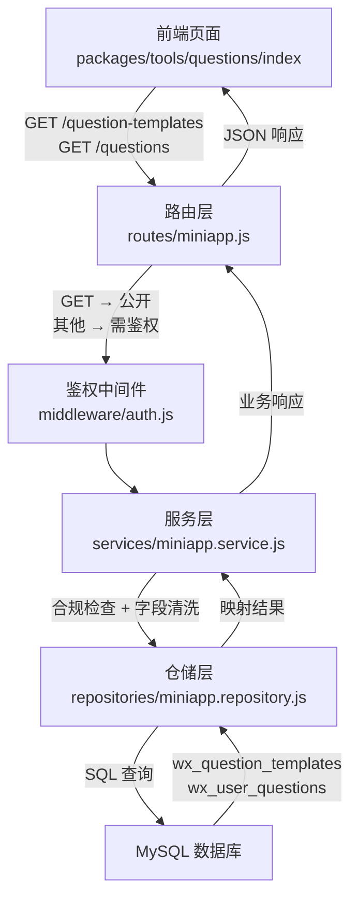
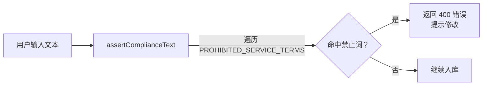
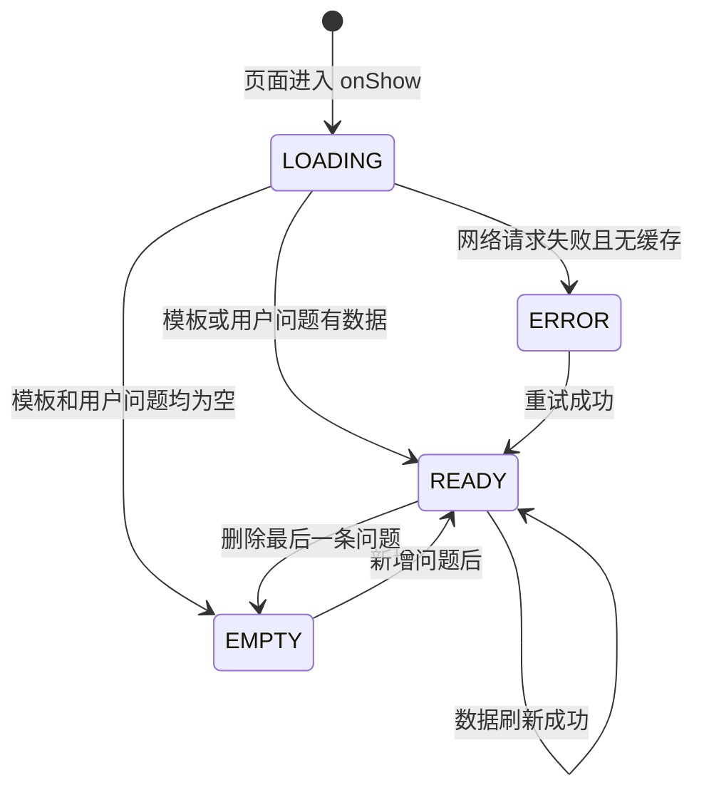
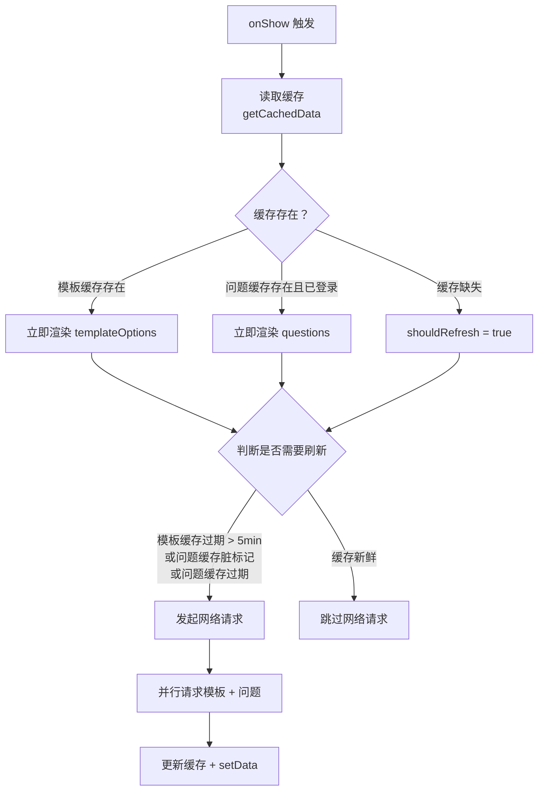
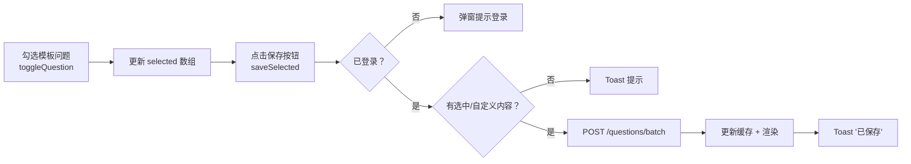
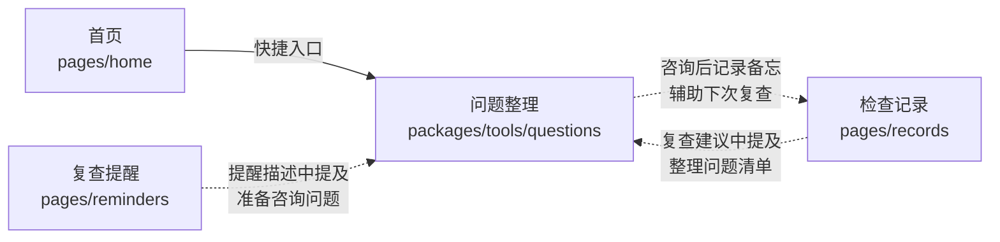

问题整理功能帮助用户在线下就医咨询前列出需要确认的重点问题，咨询后还可以在每条问题下记录个人备忘。整个功能横跨前端页面、后端 API 和数据库三层，遵循"模板引导 → 用户选择/自定义 → 持久化 → 后续编辑"的完整流程。

## 功能定位与使用场景

问题整理功能属于"工具"分包（`packages/tools`），从首页快捷入口或 URL 直接访问。它的核心目标是：在用户前往线下正规医疗机构之前，帮助其有条理地准备好需要咨询的问题，避免遗漏重点。咨询完成后，用户还可以在每条问题下方填写"备忘"，记录专业人员的回复要点或个人感悟。

该功能**严格不提供**诊断、治疗方案或在线问诊服务——页面底部始终显示合规声明："本页只帮助整理线下沟通问题和个人备忘，不提供问诊、诊断或治疗建议。"

Sources: [index.wxml](miniprogram/packages/tools/questions/index.wxml#L1-L2), [index.wxml](miniprogram/packages/tools/questions/index.wxml#L95-L95)

## 整体架构概览

问题整理功能的完整数据流从页面层到数据库层共经历五个关键环节：



前端页面在 `onShow` 生命周期中并行加载模板和用户问题数据，采用**缓存优先**策略——先读取内存缓存展示给用户，再判断缓存新鲜度决定是否发起网络请求。后端通过三层分离（路由 → 服务 → 仓储）保证职责清晰，服务层负责所有合规词拦截和字段规范化，仓储层只处理 SQL 操作。

Sources: [index.js](miniprogram/packages/tools/questions/index.js#L46-L74), [miniapp.js](server/src/routes/miniapp.js#L117-L139), [miniapp.service.js](server/src/services/miniapp.service.js#L311-L333), [miniapp.repository.js](server/src/repositories/miniapp.repository.js#L409-L500)

## 数据库表结构

问题整理功能依赖两张数据库表：**模板表**用于存放管理后台预设的常用问题，**用户问题表**用于存储每位用户选择或自定义的问题及备忘。

| 表名 | 用途 | 主键 | 关键字段 |
|------|------|------|----------|
| `wx_question_templates` | 管理员维护的常用问题模板 | `id`（自增） | `content`（问题文本，≤255）、`sort_order`（排序）、`is_active`（是否启用） |
| `wx_user_questions` | 用户保存的问题及备忘 | `id`（自增） | `user_id`（外键→wx_users）、`question_text`（≤255）、`answer_text`（TEXT）、`created_at`、`updated_at` |

两张表都通过 `ON DELETE CASCADE` 与 `wx_users` 关联，删除用户时自动清理对应数据。模板表建有 `idx_wx_question_templates_active_sort (is_active, sort_order)` 复合索引，按排序顺序快速检索启用的模板；用户问题表建有 `idx_wx_user_questions_user_time (user_id, updated_at, created_at)` 复合索引，支持按更新时间倒序查询。

Sources: [init.sql](server/database/init.sql#L67-L90)

## 后端 API 设计

问题整理相关接口共 6 个，其中 1 个为公开接口（无需登录），其余 5 个均需 Bearer Token 鉴权：

| 方法 | 路径 | 鉴权 | 用途 | 请求体 | 响应 |
|------|------|------|------|--------|------|
| `GET` | `/question-templates` | ❌ | 获取常用问题模板 | — | `data: string[]`（content 数组） |
| `GET` | `/questions` | ✅ | 获取用户已保存的问题 | — | `data: Question[]` |
| `POST` | `/questions/batch` | ✅ | 批量保存问题（最多 20 条） | `{ questions: string[] }` | `data: { questions: Question[] }` |
| `POST` | `/questions` | ✅ | 新建单个问题 | `{ questionText, answerText }` | `data: Question` |
| `PUT` | `/questions/:id` | ✅ | 修改问题文本或备忘 | `{ questionText, answerText }` | `data: Question` |
| `DELETE` | `/questions/:id` | ✅ | 删除问题 | — | `data: { deleted: true }` |

其中 `Question` 对象的完整结构如下：

```json
{
  "id": "12",
  "questionText": "这次检查摘要里，我需要重点留意哪些信息？",
  "answerText": "",
  "createdAt": "2026-05-01 10:00:00",
  "updatedAt": "2026-05-01 10:00:00"
}
```

路由层的代码极其精简——每个路由只做入参提取和状态码处理，业务逻辑全部委托给服务层。`GET /question-templates` 路由定义在 `authenticate` 中间件之前（第 21 行），因此它是公开接口；`GET /questions` 及后续路由定义在 `authenticate` 之后（第 117 行起），必须携带有效 Token。

Sources: [miniapp.js](server/src/routes/miniapp.js#L21-L23), [miniapp.js](server/src/routes/miniapp.js#L117-L139), [api-reference](docs/wiki/06-api-reference.md#L203-L234)

## 服务层：合规校验与字段清洗

服务层是整个功能的"守门人"，负责两项关键职责：**合规词拦截**和**字段规范化**。

### 合规词拦截

所有文本输入在入库前都必须经过 `assertComplianceText` 检查。系统维护了一个禁止列表 `PROHIBITED_SERVICE_TERMS`，包含"AI诊断"、"辅助诊断"、"在线问诊"、"诊疗建议"、"治疗方案"、"处方代开"等 10 个医疗越界词汇。如果用户的问题文本或备忘中命中任何一个词，后端直接返回 400 错误，提示用户修改为健康记录相关的描述。



### 字段规范化

| 操作 | 规范化函数 | 处理逻辑 |
|------|-----------|----------|
| 批量保存 | `normalizeQuestions` | 过滤空值、去首尾空格、截断至 20 条 |
| 单条新建/修改 | `normalizeQuestionPayload` | `questionText` 必填且 ≤255 字，经 `requireText` 清洗 + 合规检查；`answerText` 可选且 ≤1000 字，经 `cleanText` 清洗 |

`normalizeQuestions` 函数将传入的字符串数组逐项 `trim` 并过滤空值后，通过 `.slice(0, 20)` 限制最多 20 条，防止恶意超量写入。`normalizeQuestionPayload` 中的 `requireText` 不仅做 trim 和长度截断，还会调用 `assertComplianceText` 确保内容合规。

Sources: [miniapp.service.js](server/src/services/miniapp.service.js#L10-L21), [miniapp.service.js](server/src/services/miniapp.service.js#L87-L106), [miniapp.service.js](server/src/services/miniapp.service.js#L137-L170), [miniapp.service.js](server/src/services/miniapp.service.js#L311-L333)

## 仓储层：数据库操作

仓储层封装了全部 MySQL 查询，通过 `mapQuestion` 函数将数据库行（下划线命名）映射为 API 响应（驼峰命名）：

| 数据库字段 | API 字段 | 说明 |
|-----------|---------|------|
| `id` | `id`（转为 String） | 自增主键 |
| `question_text` | `questionText` | 问题内容 |
| `answer_text` | `answerText` | 用户备忘 |
| `created_at` | `createdAt` | 创建时间 |
| `updated_at` | `updatedAt` | 更新时间 |

关键实现细节：

**批量保存**（`saveQuestions`）采用逐条循环调用 `createQuestion` 的方式实现——虽然不是事务性批量插入，但由于每条都调用 `getQuestionById` 返回完整对象，前端可以立即获得新创建问题的 `id`，便于后续编辑和删除。

**查询排序**遵循"最近更新优先"原则——`ORDER BY updated_at DESC, created_at DESC`，确保用户刚编辑过的备忘对应的问题排在列表最前面。

**权限隔离**通过 `WHERE user_id = ?` 条件在 SQL 层面保证——每个用户只能读写自己的问题，无法访问他人数据。删除操作通过 `affectedRows > 0` 判断是否实际删除了记录，如果 `id` 不存在或不属于当前用户则返回 `{ deleted: false }`。

Sources: [miniapp.repository.js](server/src/repositories/miniapp.repository.js#L58-L66), [miniapp.repository.js](server/src/repositories/miniapp.repository.js#L409-L500)

## 前端页面实现

### 页面配置与组件依赖

问题页面位于 `packages/tools` 分包中，在 `app.json` 中注册为 `packages/tools/questions/index`。由于属于子包，它不会在小程序启动时立即加载，而是在用户点击首页"问题整理"入口时按需加载。首页配置了预加载规则，当用户在首页时会提前下载 `packages/tools` 分包，减少跳转等待时间。

页面 JSON 配置声明了以下组件依赖：

| 组件 | 来源 | 用途 |
|------|------|------|
| `section-header` | 自建组件 `/components/section-header` | 页面顶部标题栏 |
| `weui-confirm` | 自建组件 `/components/weui-confirm` | 删除确认弹窗 |
| `mp-searchbar` | WeUI 扩展库 | 搜索框（搜索模板和已保存问题） |
| `mp-cells` / `mp-checkbox-group` / `mp-checkbox` | WeUI 扩展库 | 模板问题多选列表 |
| `mp-icon` | WeUI 扩展库 | 操作按钮图标 |

页面启用了下拉刷新（`enablePullDownRefresh: true`），用户下拉时触发 `onPullDownRefresh` 重新加载数据。

Sources: [app.json](miniprogram/app.json#L23-L29), [app.json](miniprogram/app.json#L41-L49), [index.json](miniprogram/packages/tools/questions/index.json#L1-L14), [index.js](miniprogram/packages/tools/questions/index.js#L118-L121)

### 页面状态机

页面采用四态状态机管理 UI 展示，状态转换逻辑清晰：



`resolveQuestionsStatus` 函数决定状态：只要模板数组或用户问题数组有一个非空，状态就是 `READY`；两者都为空则为 `EMPTY`。当网络请求失败时，如果已有缓存数据展示，页面不会切换到 `ERROR` 状态——只有在无任何数据可展示的情况下才显示错误面板和重试按钮。

Sources: [page-state.js](miniprogram/utils/page-state.js#L1-L6), [index.js](miniprogram/packages/tools/questions/index.js#L15-L17), [index.js](miniprogram/packages/tools/questions/index.js#L109-L115)

### 数据加载与缓存策略

页面在 `onShow` 生命周期中执行缓存优先的数据加载流程，这是整个前端交互的核心逻辑：



缓存系统基于 `request.js` 模块提供的内存缓存机制，使用 `CACHE_KEYS.questionTemplates` 和 `CACHE_KEYS.questions` 两个 key。缓存新鲜度判断条件包括：

| 缓存项 | 最大存活时间 | 脏标记机制 |
|--------|-------------|-----------|
| 模板（`questionTemplates`） | 5 分钟（300,000ms） | 无（模板由管理员维护，变化频率低） |
| 用户问题（`questions`） | 30 秒（默认值） | 有——增删改操作后通过 `markCacheDirty` 标记，下次 `onShow` 强制刷新 |

模板数据不要求登录即可获取（公开接口），而用户问题数据仅在 `isLoggedIn()` 为 `true` 时才发起请求。如果当前是游客模式，页面只展示模板数据，不请求用户问题接口。

Sources: [index.js](miniprogram/packages/tools/questions/index.js#L46-L74), [index.js](miniprogram/packages/tools/questions/index.js#L77-L116), [request.js](miniprogram/utils/request.js#L5-L14), [request.js](miniprogram/utils/request.js#L71-L96)

### 用户交互流程

页面的交互分为三个主要场景：**选择模板问题**、**自定义问题**和**管理已保存问题**。

#### 场景一：选择模板问题并批量保存

模板问题通过 `mp-checkbox-group` 组件以多选列表的形式呈现。用户可以一次勾选多条模板问题，点击"保存到问题清单"后，选中的问题文本和自定义问题文本合并为一个数组，调用 `POST /questions/batch` 批量保存。



`toggleQuestion` 方法通过检查 `selected` 数组中是否已包含该文本来决定添加还是移除，实现了标准的 toggle 逻辑。`onTemplateChange` 则在 checkbox-group 的 `change` 事件中同步更新选中状态。

保存成功后，前端将新创建的问题对象合并到 `questions` 数组头部（`[...createdQuestions, ...this.data.questions]`），并清空 `selected` 数组和自定义输入框，用户可以立即看到新保存的问题出现在"已保存问题"列表中。

#### 场景二：编辑问题备忘

已保存的每条问题下方都附有一个 textarea 用于填写备忘。用户编辑备忘后点击"保存备忘"按钮，触发 `saveAnswer` 方法调用 `PUT /questions/:id` 接口更新。`onAnswerInput` 使用 `setData` 的路径语法 `questions[${index}].answerText` 实现实时双向绑定，避免整个列表重新渲染。

#### 场景三：删除问题

删除操作采用"二次确认"模式——`deleteQuestion` 方法先弹出 `weui-confirm` 组件，用户点击"删除"后才执行 `confirmDeleteQuestion`，调用 `DELETE /questions/:id` 接口。删除成功后通过 `removeCachedListItem` 同步清理缓存中的对应条目。

所有写操作（保存、更新备忘、删除）都受 `isLoggedIn()` 保护——如果用户未登录，操作会被拦截并弹出提示弹窗引导登录。这是通过在每个操作方法入口处检查登录状态实现的。

Sources: [index.js](miniprogram/packages/tools/questions/index.js#L123-L131), [index.js](miniprogram/packages/tools/questions/index.js#L163-L200), [index.js](miniprogram/packages/tools/questions/index.js#L203-L235), [index.js](miniprogram/packages/tools/questions/index.js#L237-L275), [index.wxml](miniprogram/packages/tools/questions/index.wxml#L38-L87)

### 搜索功能

页面内嵌了基于 WeUI `mp-searchbar` 组件的搜索功能。`searchQuestions` 方法实现了一个纯前端的搜索——它将模板文本和已保存问题的文本合并为一个数组，然后用 `indexOf` 做大小写不敏感的模糊匹配，返回过滤后的结果供搜索栏下拉建议展示。搜索不会触发网络请求，完全基于已加载的本地数据。

Sources: [index.js](miniprogram/packages/tools/questions/index.js#L134-L141), [index.wxml](miniprogram/packages/tools/questions/index.wxml#L28-L36)

### 页面 UI 结构

页面的视觉布局从上到下依次为：

| 区域 | 样式类名 | 内容 | 条件显示 |
|------|---------|------|---------|
| 标题栏 | `section-header` 组件 | "问题整理"标题 + "把线下咨询前想确认的重点提前列好"描述 | 始终显示 |
| 引导卡 | `question-hero` | 图标 + "保存线下沟通重点"说明文字 | 始终显示 |
| 搜索栏 | `mp-searchbar` | 搜索模板或已保存问题 | `pageStatus !== loading && !== error` |
| 常用问题面板 | `question-panel` | Checkbox 多选模板列表 | 同上 |
| 自定义问题面板 | `question-panel` | textarea 输入框 + 保存按钮 | 同上 |
| 已保存问题面板 | `saved-panel` | 问题列表（序号 + 问题文本 + 备忘 textarea + 操作按钮） | `questions.length > 0` |
| 游客提示卡 | `guest-card` | "体验模式不展示个人问题清单" | `isGuest && !questions.length` |
| 合规声明 | `safe-note` | 底部免责文字 | 始终显示 |

游客模式下，"保存到问题清单"按钮文案变为"登录后保存"，已保存问题区域不显示，取而代之的是一个引导卡片提示用户登录后可保存个人数据。

Sources: [index.wxml](miniprogram/packages/tools/questions/index.wxml#L1-L105)

## 预置模板内容

数据库初始化脚本预置了 7 条常用问题模板，覆盖了用户在线下咨询中最常需要确认的几个维度：

| 排序 | 模板内容 | 关注维度 |
|------|---------|---------|
| 10 | 这次检查摘要里，我需要重点留意哪些信息？ | 检查结果理解 |
| 20 | 复查前需要准备哪些资料？ | 资料准备 |
| 30 | 历史记录需要一起带去吗？ | 历史数据携带 |
| 40 | 如果近期身体不适，我应该如何安排线下咨询？ | 异常应对 |
| 50 | 下次复查时间建议如何安排和记录？ | 复查计划 |
| 60 | 哪些生活习惯和近期变化需要一并说明？ | 生活信息 |
| 70 | 这次记录中有哪些内容需要后续持续关注？ | 持续关注 |

这些模板通过 `sort_order` 字段控制展示顺序，通过 `is_active` 字段支持动态启停——管理员可以在数据库中将某条模板的 `is_active` 设为 0 即可临时下线它，无需删除数据。

Sources: [init.sql](server/database/init.sql#L190-L203)

## 与相关功能的关系

问题整理功能处于整个小程序的功能网络中，与其他模块形成协同关系：



首页通过 `actions` 数组中的"问题整理"入口将用户引导到此页面。健康检查记录的建议字段和复查提醒的描述字段中都包含引导用户使用问题整理功能的提示文案（例如"建议把本次摘要、既往记录和想确认的问题整理到同一处"），形成闭环的健康管理流程。

Sources: [index.js](miniprogram/pages/home/index.js#L115-L121), [init.sql](server/database/init.sql#L155-L156), [init.sql](server/database/init.sql#L181-L182)

## 合规设计要点

问题整理功能的合规设计贯穿前端和后端两个层面：

**后端层面**：服务层通过 `assertComplianceText` 对所有用户输入文本进行合规词扫描。问题文本（`questionText`）在 `requireText` 中经过合规检查，备忘文本（`answerText`）虽然经过 `cleanText` 清洗但未经过合规检查——这是因为备忘字段是用户的私人笔记，只要不触发服务边界即可。

**前端层面**：页面底部常驻一条合规声明"本页只帮助整理线下沟通问题和个人备忘，不提供问诊、诊断或治疗建议"，游客模式下也展示引导卡片说明功能边界。保存按钮的文案在游客模式下变为"登录后保存"而非隐藏，既引导登录又明确功能可用性。