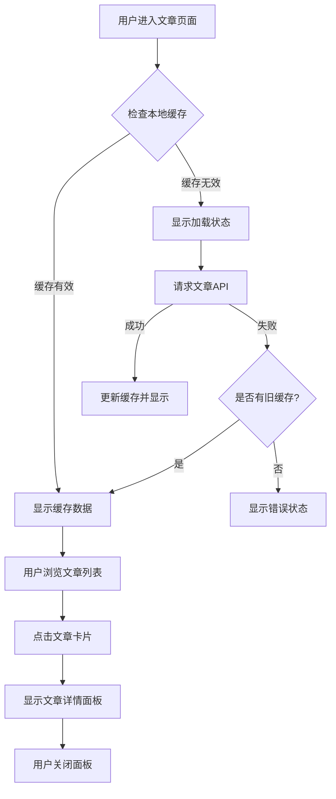

健康知识文章浏览模块为用户提供了健康管理相关的知识内容，帮助用户了解健康检查记录、复查提醒等概念，以及如何更好地管理个人健康信息。该模块采用前后端分离架构，前端以卡片列表展示文章，点击后以底部面板形式查看完整内容；后端通过RESTful API提供文章数据，并支持缓存优化。

## 功能概述

健康知识文章浏览模块的核心功能包括：

- **文章列表展示**：以卡片形式展示健康知识文章，每篇文章显示标题和摘要
- **文章详情查看**：点击文章卡片后，以底部弹出面板形式显示完整文章内容
- **缓存优化**：前端缓存文章数据，减少重复网络请求，提升加载速度
- **下拉刷新**：支持下拉刷新操作，强制获取最新文章数据
- **状态管理**：完整处理加载、错误、空数据等状态，提供良好的用户体验

Sources: [miniprogram/packages/tools/articles/index.js](miniprogram/packages/tools/articles/index.js#L1-L85)

## 前端实现

### 页面结构

文章页面采用微信小程序的标准页面结构，包含四个核心文件：

- **index.js**：页面逻辑，处理数据加载、缓存、用户交互
- **index.wxml**：页面模板，定义UI结构和数据绑定
- **index.wxss**：页面样式，定义视觉表现和动画效果
- **index.json**：页面配置，声明使用的组件和页面属性

页面配置中启用了下拉刷新功能，并声明了三个自定义组件：`section-header`用于显示页面标题，`empty-state`用于显示空状态提示，`mp-icon`用于显示图标。

Sources: [miniprogram/packages/tools/articles/index.json](miniprogram/packages/tools/articles/index.json#L1-L11)

### 数据加载与缓存策略

文章页面实现了智能的数据加载策略：

1. **缓存优先**：页面显示时首先检查本地缓存，如果缓存存在且有效（5分钟内），则直接使用缓存数据
2. **静默刷新**：如果缓存过期或不存在，会在后台静默刷新数据，避免用户看到加载动画
3. **错误处理**：网络请求失败时，如果已有缓存数据则继续显示，否则显示错误状态和重试按钮

缓存管理通过`CACHE_KEYS.articles`键实现，使用`request.js`工具中的缓存函数进行数据存储和有效性检查。

Sources: [miniprogram/packages/tools/articles/index.js](miniprogram/packages/tools/articles/index.js#L24-L45)

### 用户交互流程

文章浏览的用户交互流程如下：

1. 用户进入文章页面，系统自动加载文章列表
2. 文章以卡片形式展示，每张卡片包含信息图标、文章标题和摘要
3. 用户点击文章卡片，触发`openArticle`事件处理函数
4. 系统从列表中查找对应文章，设置为当前激活文章
5. 底部面板弹出，显示文章完整内容，包括标题、摘要和详细内容
6. 用户可通过点击遮罩层或关闭按钮关闭面板



Sources: [miniprogram/packages/tools/articles/index.js](miniprogram/packages/tools/articles/index.js#L47-L85)

### UI组件与样式

文章页面使用了以下UI组件和设计模式：

- **卡片设计**：文章列表采用卡片式布局，每张卡片包含图标、标题、摘要和箭头指示器
- **底部面板**：文章详情以底部滑出面板形式显示，具有圆角、阴影和关闭按钮
- **状态指示**：加载状态显示旋转动画和提示文字，错误状态显示错误信息和重试按钮
- **安全提示**：页面底部显示免责提示，强调内容仅供参考

样式设计遵循微信小程序的设计规范，使用`rpx`单位实现响应式布局，颜色和间距通过设计令牌系统统一管理。

Sources: [miniprogram/packages/tools/articles/index.wxss](miniprogram/packages/tools/articles/index.wxss#L1-L159)

## 后端实现

### API接口设计

文章浏览功能通过RESTful API提供数据支持：

- **接口地址**：`GET /articles`
- **认证要求**：无需用户认证（公开接口）
- **响应格式**：JSON格式，包含`success`和`data`字段
- **数据结构**：返回文章数组，每篇文章包含`id`、`title`、`summary`、`content`字段

该接口设计为公开接口，允许未登录用户访问健康知识内容，符合健康科普类应用的特性。

Sources: [server/src/routes/miniapp.js](server/src/routes/miniapp.js#L28-L30)

### 数据访问层实现

数据访问层负责从数据库查询文章数据：

```javascript
async function listArticles() {
  const rows = await db.query(
    `
      SELECT id, title, summary, content
      FROM wx_articles
      WHERE is_active = 1
      ORDER BY sort_order ASC, created_at DESC
    `
  );
  return rows;
}
```

查询逻辑包含以下关键点：
1. **过滤条件**：只查询`is_active = 1`的文章，确保只返回启用状态的文章
2. **排序规则**：先按`sort_order`升序排列，再按`created_at`降序排列，实现自定义排序和最新内容优先
3. **字段选择**：返回`id`、`title`、`summary`、`content`四个字段，满足前端展示需求

Sources: [server/src/repositories/miniapp.repository.js](server/src/repositories/miniapp.repository.js#L520-L530)

### 数据库表结构

文章数据存储在`wx_articles`表中，表结构设计如下：

| 字段名 | 类型 | 约束 | 说明 |
|--------|------|------|------|
| `id` | VARCHAR(32) | 主键 | 文章唯一标识符 |
| `title` | VARCHAR(120) | 非空 | 文章标题 |
| `summary` | VARCHAR(500) | 非空 | 文章摘要 |
| `content` | TEXT | 可空 | 文章完整内容 |
| `sort_order` | INT | 默认0 | 排序权重，数值越小越靠前 |
| `is_active` | TINYINT(1) | 默认1 | 启用状态，1为启用，0为禁用 |
| `created_at` | DATETIME | 自动 | 创建时间 |
| `updated_at` | DATETIME | 自动 | 更新时间 |

表设计支持以下特性：
- **软删除**：通过`is_active`字段实现文章的启用/禁用，而非物理删除
- **自定义排序**：`sort_order`字段允许管理员控制文章显示顺序
- **内容分离**：`summary`用于列表展示，`content`用于详情展示，支持不同场景的内容需求

Sources: [server/database/init.sql](server/database/init.sql#L218-L231)

### 初始数据示例

系统初始化时插入了5篇示例文章，涵盖健康管理的核心主题：

1. **如何整理一次健康检查记录**：指导用户如何系统记录健康检查信息
2. **复查提醒为什么重要**：解释复查提醒在健康管理中的作用
3. **就诊前可以准备哪些信息**：帮助用户准备线下咨询所需材料
4. **如何把复查安排放进日常计划**：提供复查时间管理的实用建议
5. **填写健康记录时注意什么**：指导用户规范填写健康记录

这些示例文章为用户提供了实用的健康管理知识，体现了应用的健康教育功能。

Sources: [server/database/init.sql](server/database/init.sql#L254-L290)

## 缓存与性能优化

### 缓存策略设计

文章浏览功能采用了多层缓存策略优化性能：

1. **前端内存缓存**：使用`responseCache`对象存储API响应，键为`CACHE_KEYS.articles`
2. **缓存有效期**：默认5分钟（300,000毫秒），平衡数据新鲜度和性能
3. **静默刷新**：缓存过期后不阻塞UI，后台静默更新数据
4. **下拉刷新**：提供手动刷新机制，满足用户即时获取最新内容的需求

缓存管理通过`isCacheFresh`函数判断缓存有效性，`setCachedData`和`getCachedData`函数进行数据存取。

Sources: [miniprogram/utils/request.js](miniprogram/utils/request.js#L30-L50)

### 网络请求优化

文章数据的网络请求进行了以下优化：

- **请求去重**：使用`inflightRequests`对象避免重复请求
- **超时控制**：默认12秒超时，避免长时间等待
- **错误恢复**：网络失败时优先使用缓存数据，提升用户体验
- **状态管理**：完整的加载、错误、空状态处理，提供清晰的用户反馈

这些优化确保了在网络不稳定或服务器响应较慢时，用户仍能获得良好的使用体验。

Sources: [miniprogram/utils/request.js](miniprogram/utils/request.js#L220-L280)

## 合规与安全考虑

### 内容免责设计

文章浏览功能特别注重合规性设计：

1. **免责声明**：页面底部显示"知识内容用于日常健康管理参考，不能替代专业医疗意见"
2. **详情面板提示**：文章详情面板底部显示"以上内容仅用于健康管理参考，如需判断具体健康问题，请前往线下正规医疗机构咨询"
3. **内容审核**：文章内容经过审核，避免包含医疗诊断建议或治疗方案
4. **公开访问**：文章接口无需认证，符合健康科普内容的公开性要求

这些设计确保了应用符合健康类小程序的内容合规要求，避免提供医疗诊断服务。

Sources: [miniprogram/packages/tools/articles/index.wxml](miniprogram/packages/tools/articles/index.wxml#L50-L53)

### 数据安全

文章数据的安全性通过以下措施保障：

- **输入验证**：后端对文章内容进行长度限制和格式验证
- **SQL注入防护**：使用参数化查询避免SQL注入攻击
- **敏感词过滤**：集成合规词拦截机制，避免违规内容
- **访问控制**：文章数据公开访问，但敏感操作需要用户认证

这些措施确保了文章内容的安全性和合规性。

Sources: [server/src/services/miniapp.service.js](server/src/services/miniapp.service.js#L1-L50)

## 扩展与维护指南

### 添加新文章

管理员可以通过以下方式添加新的健康知识文章：

1. **数据库直接插入**：向`wx_articles`表插入新记录，设置合适的`sort_order`值
2. **内容审核**：确保文章内容符合健康科普要求，不包含医疗诊断建议
3. **测试验证**：在小程序中验证文章显示效果和详情面板功能

### 自定义排序

文章排序通过`sort_order`字段控制：

- **数值越小越靠前**：设置较小的`sort_order`值使文章显示在列表前面
- **同值排序**：相同`sort_order`的文章按创建时间降序排列
- **动态调整**：可随时修改`sort_order`值调整文章显示顺序

### 内容更新

更新文章内容时需要注意：

1. **摘要与详情分离**：`summary`用于列表展示，`content`用于详情展示
2. **长度限制**：标题最多120字符，摘要最多500字符，内容无严格限制
3. **启用状态**：通过`is_active`字段控制文章是否显示，避免物理删除

## 调试与故障排除

### 常见问题排查

**问题1：文章列表不显示**
- 检查`wx_articles`表中是否有`is_active = 1`的记录
- 验证数据库连接是否正常
- 检查API接口`/articles`是否正常响应

**问题2：文章详情内容不显示**
- 检查`content`字段是否为空，为空时前端会显示`summary`内容
- 验证文章详情面板的CSS样式是否正确加载

**问题3：缓存导致内容不更新**
- 用户可通过下拉刷新强制获取最新数据
- 开发者可清除小程序缓存或修改缓存键名

### 调试技巧

1. **查看网络请求**：在微信开发者工具中查看`/articles`请求的响应数据
2. **检查缓存状态**：在控制台输出`getCachedData(CACHE_KEYS.articles)`查看缓存内容
3. **验证数据库**：直接查询`wx_articles`表确认数据正确性

Sources: [miniprogram/packages/tools/articles/index.js](miniprogram/packages/tools/articles/index.js#L57-L70)

## 相关资源

- **前端页面结构**：[页面结构与分包机制](11-ye-mian-jie-gou-yu-fen-bao-ji-zhi)
- **请求封装**：[请求封装与Token管理](12-qing-qiu-feng-zhuang-yu-tokenguan-li)
- **数据库设计**：[数据库表结构设计](19-shu-ju-ku-biao-jie-gou-she-ji)
- **API参考**：[API接口参考](06-api-reference)
- **合规设计**：[隐私协议实现](22-yin-si-xie-yi-shi-xian)