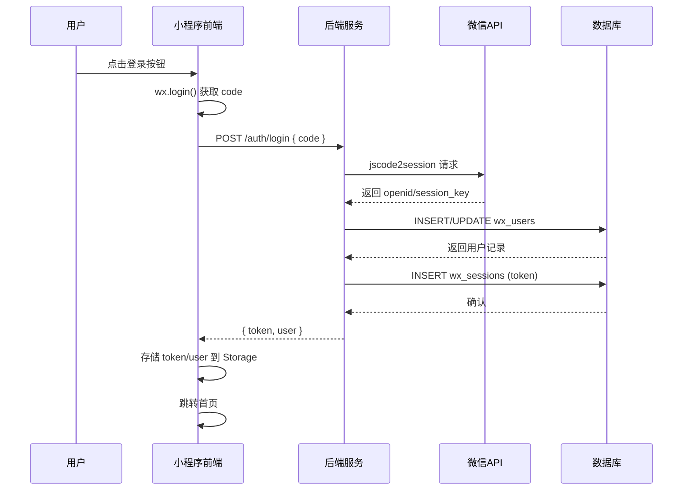
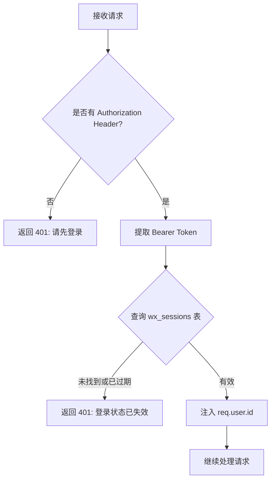
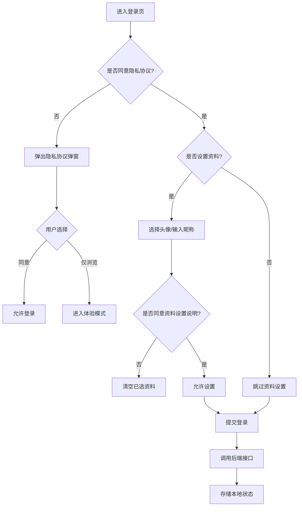
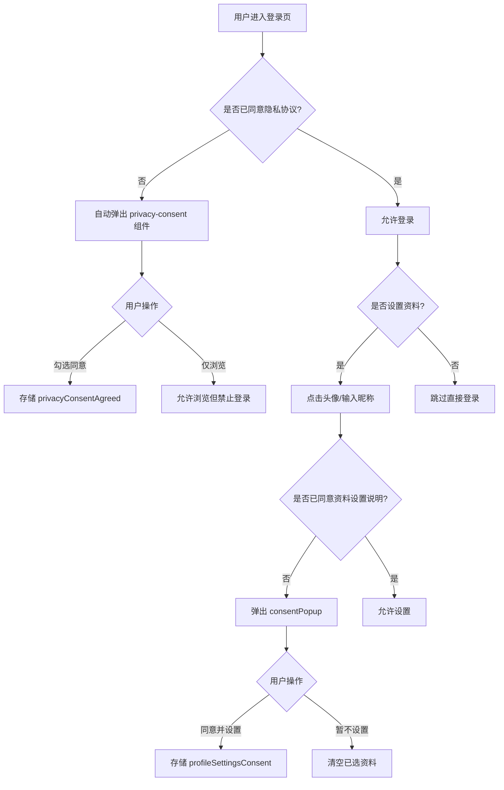

本文档详细说明了"云端智诊"小程序的用户登录认证机制和资料管理功能，涵盖微信登录流程、会话管理、头像昵称设置以及隐私协议合规处理。

## 登录认证架构概览

系统采用微信小程序原生登录机制，通过 `wx.login()` 获取临时凭证 `code`，后端调用微信接口换取用户唯一标识 `openid`，并生成自定义会话 `token` 完成认证。整个登录流程遵循"先登录后授权"的设计原则，用户可选择跳过资料设置直接进入小程序。



Sources: [miniprogram/pages/login/index.js](miniprogram/pages/login/index.js#L7-L20), [server/src/repositories/miniapp.repository.js](server/src/repositories/miniapp.repository.js#L68-L168), [server/src/middleware/auth.js](server/src/middleware/auth.js#L1-L33)

## 微信登录实现细节

前端登录入口位于 `miniprogram/pages/login/index.js`，核心函数 `_performLogin()` 负责协调整个登录流程。该函数首先调用 `wxLoginCode()` 获取微信临时凭证，随后调用后端 `/auth/login` 接口完成用户注册与认证。

**登录凭证获取**：通过 `wx.login()` API 获取临时 `code`，该凭证有效期为 5 分钟且仅可使用一次。

```javascript
// miniprogram/pages/login/index.js#L7-L20
function wxLoginCode() {
  return new Promise((resolve, reject) => {
    wx.login({
      success: (res) => {
        if (res.code) {
          resolve(res.code);
          return;
        }
        reject(new Error("未获取到微信登录凭证，请稍后重试"));
      },
      fail: () => reject(new Error("微信登录授权失败，请稍后重试"))
    });
  });
}
```

**后端会话换取**：后端接收到 `code` 后，调用微信 `jscode2session` 接口换取 `openid` 和 `session_key`。系统仅使用 `openid` 作为用户唯一标识，`session_key` 不存储以避免安全风险。

```javascript
// server/src/repositories/miniapp.repository.js#L68-L112
async function requestWechatSession(code) {
  // ... 验证参数
  const params = new URLSearchParams({
    appid: env.wechat.appId,
    secret: env.wechat.appSecret,
    js_code: code,
    grant_type: "authorization_code"
  });
  
  const response = await fetch(`https://api.weixin.qq.com/sns/jscode2session?${params.toString()}`);
  const data = await response.json();
  
  return {
    openid: data.openid,
    sessionKey: data.session_key || "",
    unionId: data.unionid || ""
  };
}
```

**用户记录创建/更新**：采用 `INSERT ... ON DUPLICATE KEY UPDATE` 模式，首次登录创建用户记录，后续登录更新昵称和头像等信息。

```sql
-- server/src/repositories/miniapp.repository.js#L137-L148
INSERT INTO wx_users (openid, nickname, avatar_url, phone, created_at, updated_at)
VALUES (?, ?, ?, ?, NOW(), NOW())
ON DUPLICATE KEY UPDATE
  nickname = VALUES(nickname),
  avatar_url = COALESCE(VALUES(avatar_url), avatar_url),
  phone = COALESCE(VALUES(phone), phone),
  updated_at = CURRENT_TIMESTAMP
```

**会话 Token 生成**：登录成功后生成随机 token 并存储到 `wx_sessions` 表，默认有效期为 30 天。

```javascript
// server/src/repositories/miniapp.repository.js#L155-L162
const token = createToken();
await db.query(
  `INSERT INTO wx_sessions (token, user_id, expires_at, created_at)
   VALUES (?, ?, DATE_ADD(NOW(), INTERVAL ? DAY), NOW())`,
  [token, user.id, SESSION_DAYS]
);
```

Sources: [miniprogram/pages/login/index.js](miniprogram/pages/login/index.js#L141-L233), [server/src/repositories/miniapp.repository.js](server/src/repositories/miniapp.repository.js#L130-L168), [server/src/routes/miniapp.js](server/src/routes/miniapp.js#L17-L19)

## 会话管理与鉴权机制

系统采用基于 Token 的无状态会话管理方案。前端将 `token` 存储在微信本地存储中，每次请求通过 HTTP Header `Authorization: Bearer <token>` 携带。后端通过 `authenticate` 中间件验证会话有效性。

**鉴权中间件流程**：



**前端 Token 管理**：请求拦截器自动为已登录用户添加 Authorization Header，遇到 401 响应时自动清除本地状态并跳转登录页。

```javascript
// miniprogram/utils/request.js#L280-L295
wx.request({
  // ...
  header: {
    "content-type": "application/json",
    ...(getToken() ? { Authorization: `Bearer ${getToken()}` } : {}),
    ...(options.header || {})
  },
  success: (res) => {
    if (res.statusCode === 401) {
      if (getToken()) {
        redirectLogin();  // 清除本地状态并跳转登录
        reject(new Error("登录状态已失效，请重新登录"));
        return;
      }
      reject(createLoginRequiredError("登录后可继续使用此功能"));
      return;
    }
    // ...
  }
});
```

**会话有效期**：默认 30 天，过期后用户需重新登录。过期会话不会被主动清理，而是在验证时自然失效。

Sources: [server/src/middleware/auth.js](server/src/middleware/auth.js#L9-L29), [miniprogram/utils/request.js](miniprogram/utils/request.js#L146-L173), [server/database/init.sql](server/database/init.sql#L20-L30)

## 用户资料管理

用户资料包括昵称和头像两个字段，支持登录时设置和登录后修改两种场景。

### 资料设置流程



### 昵称设置

昵称通过微信原生 `type="nickname"` 输入框获取，支持微信昵称选择和手动输入两种方式。后端使用 `assertComplianceText()` 进行合规词过滤，确保昵称不包含违规内容。

```javascript
// server/src/services/miniapp.service.js#L191-L197
async function updateProfile(userId, payload = {}) {
  assertComplianceText(payload.nickname, "昵称");
  return repository.updateProfile(userId, {
    nickname: cleanText(payload.nickname || "微信用户", 80),
    avatarUrl: normalizePersistentAvatarUrl(payload.avatarUrl)
  });
}
```

**默认昵称**：未设置昵称的用户默认显示"微信用户"，这是微信小程序的规范要求。

### 头像上传机制

头像上传采用 **Base64 编码** 方式，前端将用户选择的头像文件转换为 Base64 字符串后发送给后端。这种方式避免了复杂的文件上传接口设计，同时兼容微信小程序的文件系统限制。

**前端头像处理流程**：

1. 用户选择头像后，`onChooseAvatar` 事件触发
2. 调用 `avatarUtil.readFileBase64()` 读取文件为 Base64
3. 调用 `avatarUtil.persistAvatarFile()` 将临时文件持久化到本地
4. 生成预览 URL（本地路径或 Data URL）
5. 登录成功后调用 `uploadAvatar()` 上传

```javascript
// miniprogram/utils/avatar.js#L53-L86
function readFileBase64(filePath) {
  return new Promise((resolve, reject) => {
    wx.getFileSystemManager().readFile({
      filePath,
      encoding: "base64",
      success: (res) => {
        const data = res.data;
        if (typeof data === "string") {
          resolve(data);
          return;
        }
        // 部分基础库对 HTTP URL 返回 ArrayBuffer，需手动转换
        try {
          const bytes = new Uint8Array(data);
          // ... 转换逻辑
          resolve(wx.arrayBufferToBase64(data) || "");
        } catch (_e) {
          resolve("");
        }
      },
      fail: () => reject(new Error("头像读取失败，请重新选择"))
    });
  });
}
```

**后端头像存储**：`avatar-storage.service.js` 负责接收 Base64 数据、验证格式和大小、保存到服务器文件系统，并返回可访问的 URL。

```javascript
// server/src/services/avatar-storage.service.js#L90-L99
async function saveAvatar(req, payload) {
  const { buffer, extension } = decodeAvatar(payload);
  await fs.mkdir(AVATAR_DIR, { recursive: true });

  const fileName = `${req.user.id}-${Date.now()}-${crypto.randomBytes(6).toString("hex")}.${extension}`;
  const filePath = path.join(AVATAR_DIR, fileName);
  await fs.writeFile(filePath, buffer);

  return `${resolvePublicBaseUrl(req)}/uploads/avatars/${fileName}`;
}
```

**头像格式验证**：
- 支持格式：JPG、PNG、WebP
- 最大大小：2MB
- 魔术字节检测：通过文件头验证真实格式，防止扩展名伪造

```javascript
// server/src/services/avatar-storage.service.js#L14-L47
function detectImageType(buffer) {
  if (buffer[0] === 0xff && buffer[1] === 0xd8 && buffer[2] === 0xff) {
    return "image/jpeg";
  }
  if (buffer[0] === 0x89 && buffer[1] === 0x50 && /* PNG 魔术字节 */) {
    return "image/png";
  }
  if (/* RIFF + WEBP 标识 */) {
    return "image/webp";
  }
  return "";
}
```

Sources: [miniprogram/utils/avatar.js](miniprogram/utils/avatar.js#L53-L242), [server/src/services/avatar-storage.service.js](server/src/services/avatar-storage.service.js#L1-L103), [miniprogram/pages/login/index.js](miniprogram/pages/login/index.js#L78-L112)

## 资料设置状态管理

系统通过多个本地存储标记跟踪用户的资料设置状态，实现"首次引导、后续跳过"的用户体验。

| 存储键 | 类型 | 用途 |
|--------|------|------|
| `token` | String | 登录会话 Token |
| `user` | Object | 用户信息缓存 |
| `privacyConsentAgreed` | Boolean | 是否同意隐私协议 |
| `privacyConsentTime` | Number | 隐私协议同意时间戳 |
| `profileSettingsConsent` | Boolean | 是否同意资料设置说明 |
| `profileNicknameReady` | Boolean | 昵称是否已设置 |
| `profileAvatarReady` | Boolean | 头像是否已设置 |

**资料就绪判断逻辑**：个人中心页面根据 `profileNicknameReady` 和 `profileAvatarReady` 状态决定是否显示资料设置引导弹窗。

```javascript
// miniprogram/pages/profile/index.js#L172-L182
_maybeOpenSetupSheet() {
  if (this.data.setupSheetVisible) return;
  if (!isLoggedIn()) return;
  if (this._setupSheetAutoShown) return;
  
  const nicknameReady = !!wx.getStorageSync("profileNicknameReady");
  const avatarReady = !!wx.getStorageSync("profileAvatarReady");
  
  // 昵称和头像都完成时不再自动弹
  if (nicknameReady && avatarReady) return;
  
  this._setupSheetAutoShown = true;
  this.setData({ setupSheetVisible: true });
}
```

**头像 URL 规范化**：前端使用 `normalizeStoredUser()` 函数统一处理存储的用户数据，确保头像 URL 符合规范（远程 URL 必须为 HTTPS，本地路径必须有效）。

```javascript
// miniprogram/utils/avatar.js#L43-L51
function normalizeStoredUser(user) {
  const source = user || {};
  return {
    ...source,
    nickname: normalizeText(source.nickname) || "微信用户",
    avatarUrl: normalizeRemoteAvatarUrl(source.avatarUrl),
    avatarLocalPath: normalizeLocalAvatarPath(source.avatarLocalPath)
  };
}
```

Sources: [miniprogram/pages/profile/index.js](miniprogram/pages/profile/index.js#L170-L182), [miniprogram/utils/avatar.js](miniprogram/utils/avatar.js#L43-L51), [miniprogram/utils/request.js](miniprogram/utils/request.js#L146-L152)

## 隐私协议合规处理

系统实现两层隐私协议同意机制，符合微信小程序隐私保护规范：

1. **一级协议**：隐私协议与服务协议，登录前必须同意
2. **二级协议**：资料设置说明，设置头像昵称前必须同意

**协议同意流程**：



**隐私协议组件**：`privacy-consent` 组件负责展示协议内容、收集用户同意状态，并将同意结果存储到本地。

```javascript
// miniprogram/components/privacy-consent/index.js#L20-L26
onConfirm() {
  if (!this.data.checked) return;
  wx.setStorageSync("privacyConsentAgreed", true);
  wx.setStorageSync("privacyConsentTime", Date.now());
  this.setData({ checked: false });
  this.triggerEvent("accept");
}
```

**登录前校验**：提交登录时会检查隐私协议同意状态，未同意则弹出提示。

```javascript
// miniprogram/pages/login/index.js#L142-L148
async submitLogin() {
  if (!wx.getStorageSync("privacyConsentAgreed")) {
    this.setData({ privacyConsentVisible: true });
    showErrorToast("请先阅读并同意隐私协议与服务协议", "登录前提示");
    return;
  }
  // ... 继续登录流程
}
```

Sources: [miniprogram/components/privacy-consent/index.js](miniprogram/components/privacy-consent/index.js#L1-L42), [miniprogram/pages/login/index.js](miniprogram/pages/login/index.js#L35-L64), [miniprogram/pages/login/index.wxml](miniprogram/pages/login/index.wxml#L80-L103)

## 数据库表结构

### wx_users 用户表

存储用户基本信息，以 `openid` 作为唯一标识。

```sql
-- server/database/init.sql#L7-L18
CREATE TABLE IF NOT EXISTS wx_users (
  id BIGINT UNSIGNED NOT NULL AUTO_INCREMENT,
  openid VARCHAR(128) NULL,
  nickname VARCHAR(80) NOT NULL DEFAULT '微信用户',
  avatar_url VARCHAR(500) NULL,
  phone VARCHAR(32) NULL,
  gender VARCHAR(16) NULL,
  created_at DATETIME NOT NULL DEFAULT CURRENT_TIMESTAMP,
  updated_at DATETIME NOT NULL DEFAULT CURRENT_TIMESTAMP ON UPDATE CURRENT_TIMESTAMP,
  PRIMARY KEY (id),
  UNIQUE KEY uk_wx_users_openid (openid)
) ENGINE=InnoDB DEFAULT CHARSET=utf8mb4 COLLATE=utf8mb4_unicode_ci COMMENT='小程序用户表';
```

**字段说明**：

| 字段 | 类型 | 说明 |
|------|------|------|
| `id` | BIGINT UNSIGNED | 自增主键 |
| `openid` | VARCHAR(128) | 微信用户唯一标识，唯一索引 |
| `nickname` | VARCHAR(80) | 用户昵称，默认"微信用户" |
| `avatar_url` | VARCHAR(500) | 头像 URL（HTTPS） |
| `phone` | VARCHAR(32) | 手机号（可选） |
| `gender` | VARCHAR(16) | 性别（可选） |

### wx_sessions 会话表

存储登录会话信息，以 `token` 作为主键。

```sql
-- server/database/init.sql#L20-L30
CREATE TABLE IF NOT EXISTS wx_sessions (
  token CHAR(64) NOT NULL,
  user_id BIGINT UNSIGNED NOT NULL,
  expires_at DATETIME NOT NULL,
  created_at DATETIME NOT NULL DEFAULT CURRENT_TIMESTAMP,
  PRIMARY KEY (token),
  KEY idx_wx_sessions_user_expires (user_id, expires_at),
  CONSTRAINT fk_wx_sessions_user
    FOREIGN KEY (user_id) REFERENCES wx_users (id)
    ON DELETE CASCADE
) ENGINE=InnoDB DEFAULT CHARSET=utf8mb4 COLLATE=utf8mb4_unicode_ci COMMENT='小程序登录会话';
```

**会话清理策略**：过期会话不会被主动清理，而是在查询时通过 `WHERE expires_at > NOW()` 条件自然过滤。外键约束 `ON DELETE CASCADE` 确保用户删除时关联会话自动清理。

Sources: [server/database/init.sql](server/database/init.sql#L7-L30), [server/database/upgrade-login-crud.sql](server/database/upgrade-login-crud.sql#L1-L80)

## API 接口汇总

| 接口 | 方法 | 认证 | 说明 |
|------|------|------|------|
| `/auth/login` | POST | 否 | 微信登录，返回 token 和用户信息 |
| `/me` | GET | 是 | 获取当前用户资料 |
| `/me/profile` | PUT | 是 | 更新昵称 |
| `/me/avatar` | POST | 是 | 上传头像（Base64） |

**登录接口请求/响应示例**：

```javascript
// 请求
POST /api/miniapp/auth/login
{
  "code": "0a3lGd000xxxxx"
}

// 响应
{
  "success": true,
  "data": {
    "token": "a1b2c3d4e5f6...",
    "user": {
      "id": 1,
      "nickname": "微信用户",
      "avatarUrl": "",
      "avatarLocalPath": ""
    }
  }
}
```

**头像上传接口**：

```javascript
// 请求
POST /api/miniapp/me/avatar
Authorization: Bearer <token>
{
  "avatarBase64": "/9j/4AAQSkZJRg...",
  "fileType": "image/jpeg"
}

// 响应
{
  "success": true,
  "data": {
    "id": 1,
    "nickname": "用户昵称",
    "avatarUrl": "https://xcx.hpvsc.icu/uploads/avatars/1-1234567890-abc123.jpg"
  }
}
```

Sources: [server/src/routes/miniapp.js](server/src/routes/miniapp.js#L17-L41), [miniprogram/utils/request.js](miniprogram/utils/request.js#L331-L350)

## 登出与状态清理

用户登出时需要清除本地所有认证状态和缓存数据，确保下次登录时状态干净。

```javascript
// miniprogram/pages/profile/index.js#L408-L416
confirmLogout() {
  this.closeConfirmDialog();
  wx.removeStorageSync("token");
  wx.removeStorageSync("user");
  wx.removeStorageSync("profileNicknameReady");
  wx.removeStorageSync("profileAvatarReady");
  clearAllCaches();
  openRoute(ROUTES.login, {}, { reLaunch: true });
}
```

**缓存清理**：`clearAllCaches()` 函数清除内存中的响应缓存和进行中的请求队列，防止登出后残留数据泄露。

```javascript
// miniprogram/utils/request.js#L322-L329
function clearAllCaches() {
  Object.keys(responseCache).forEach((key) => {
    delete responseCache[key];
  });
  Object.keys(inflightRequests).forEach((key) => {
    delete inflightRequests[key];
  });
}
```

Sources: [miniprogram/pages/profile/index.js](miniprogram/pages/profile/index.js#L408-L416), [miniprogram/utils/request.js](miniprogram/utils/request.js#L322-L329)

## 开发者工具兼容性处理

微信开发者工具的头像选择器返回的是 `http://127.0.0.1:PORT/__tmp__/xxx` 格式的临时 URL，该 URL 生命周期不可靠且可能返回 500 错误。系统实现了三级降级策略处理这类临时 URL：

1. **readFile + writeFile**：直接读取临时文件并写入永久路径
2. **downloadFile + saveFile**：通过 HTTP 下载到临时文件再保存
3. **getImageInfo**：获取图片信息中的本地缓存路径

```javascript
// miniprogram/utils/avatar.js#L109-L132
function persistDevToolsTempFile(url) {
  return new Promise((resolve) => {
    const ext = extractExtFromUrl(url);
    const permanentPath = `${wx.env.USER_DATA_PATH}/avatar_${Date.now()}${ext}`;

    // 策略1: readFile 直接读取 → writeFile 写入永久路径
    wx.getFileSystemManager().readFile({
      filePath: url,
      success: (readRes) => {
        if (!readRes.data) {
          tryDownloadStrategy(url, ext, resolve);
          return;
        }
        wx.getFileSystemManager().writeFile({
          filePath: permanentPath,
          data: readRes.data,
          success: () => resolve(permanentPath),
          fail: () => tryDownloadStrategy(url, ext, resolve)
        });
      },
      fail: () => tryDownloadStrategy(url, ext, resolve)
    });
  });
}
```

**安全闸机制**：`persistAvatarFile()` 函数在返回结果前检查是否为临时 URL，如果是则返回空字符串，避免将不可靠的 URL 用于 `<image>` 组件渲染。

```javascript
// miniprogram/utils/avatar.js#L204-L209
// 关键安全闸：返回值绝对不能是 __tmp__ 临时 URL
return run().then((result) => {
  if (isDevToolsTempUrl(result)) return "";
  return result || "";
});
```

Sources: [miniprogram/utils/avatar.js](miniprogram/utils/avatar.js#L109-L210), [miniprogram/pages/profile/index.js](miniprogram/pages/profile/index.js#L331-L375)

## 相关文档

- [鉴权机制与会话管理](18-jian-quan-ji-zhi-yu-hui-hua-guan-li)：深入了解后端鉴权实现
- [隐私协议实现](22-yin-si-xie-yi-shi-xian)：隐私合规机制详解
- [头像存储与跨域处理](24-tou-xiang-cun-chu-yu-kua-yu-chu-li)：头像存储架构与 CDN 配置
- [请求封装与Token管理](12-qing-qiu-feng-zhuang-yu-tokenguan-li)：前端请求层设计
- [数据库表结构设计](19-shu-ju-ku-biao-jie-gou-she-ji)：完整数据库设计文档