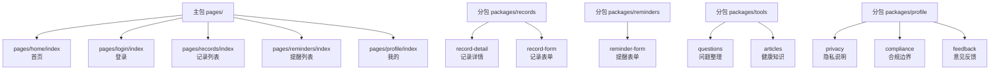
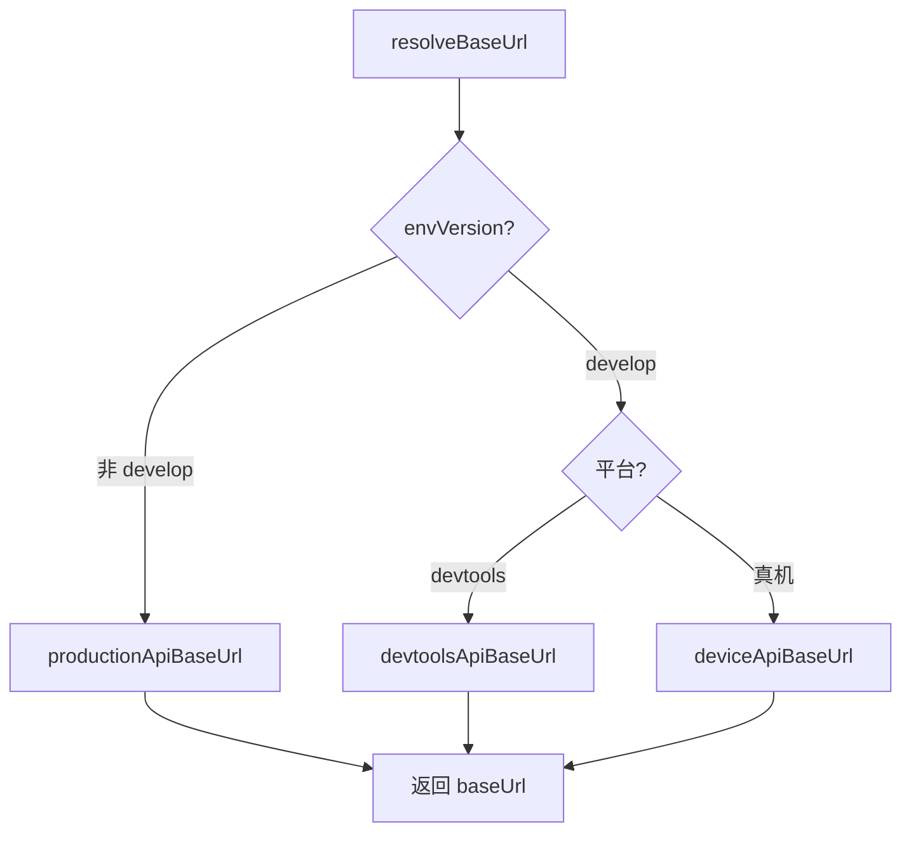
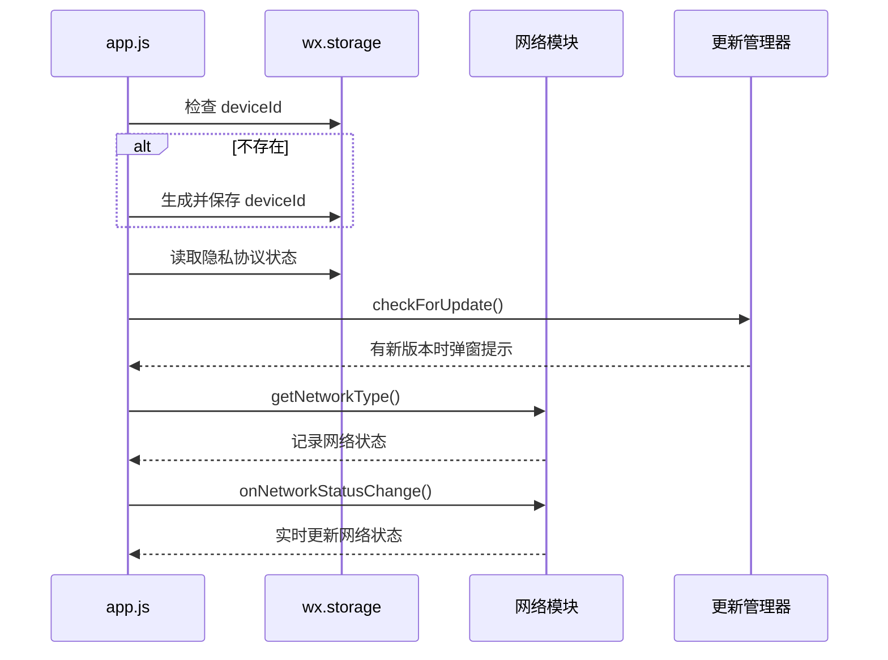
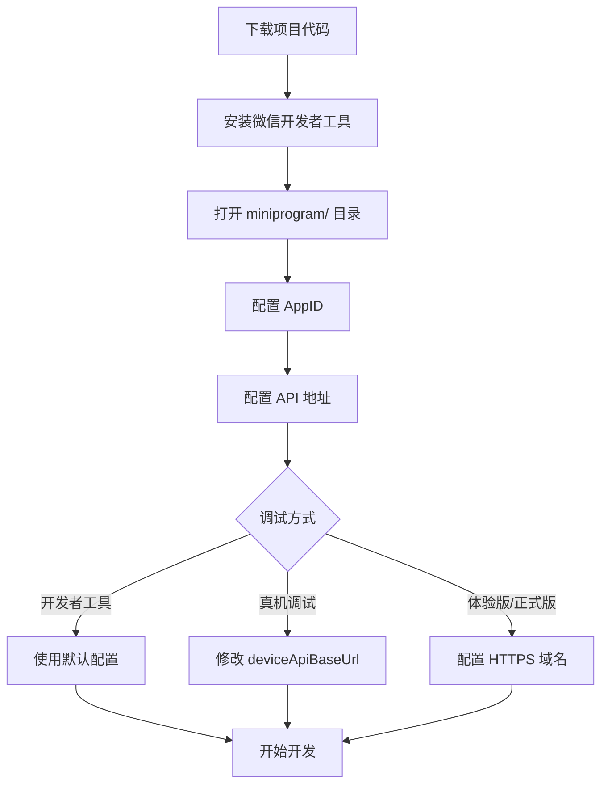

本文档介绍云端智诊小程序前端的核心配置文件及其作用。理解这些配置文件是开发和调试小程序的基础，能帮助你快速定位问题并进行定制化修改。

## 配置文件概览

小程序前端配置分散在多个文件中，各自承担不同的职责。下表展示了核心配置文件的分布：

| 配置文件               | 位置                  | 核心职责                        |
| ---------------------- | --------------------- | ------------------------------- |
| `project.config.json`  | `miniprogram/`        | 微信开发者工具项目配置          |
| `app.json`             | `miniprogram/`        | 小程序全局路由与界面配置        |
| `app.js`               | `miniprogram/`        | 小程序启动逻辑与全局数据        |
| `config/app.js`        | `miniprogram/config/` | 业务配置（API地址、超时时间等） |
| `miniapp-privacy.json` | 项目根目录            | 隐私保护弹窗配置                |
| `sitemap.json`         | `miniprogram/`        | 微信搜索收录规则                |
| `project.miniapp.json` | 项目根目录            | 小程序隐私能力声明              |

Sources: [project.config.json](miniprogram/project.config.json)、[app.json](miniprogram/app.json)、[config/app.js](miniprogram/config/app.js)

## project.config.json 详解

`project.config.json` 是微信开发者工具识别项目的核心配置，决定了编译行为、代码转换和打包策略。

**基本项目信息**：

- `appid`：`xxxxxxxxxxxxxxxxxxx` — 小程序唯一标识，需与微信公众平台注册的 AppID 一致
- `projectname`：`CervixDetectAI_wx` — 项目名称
- `compileType`：`miniprogram` — 标识为小程序项目
- `libVersion`：`latest` — 使用最新版基础库

**编译设置**：

| 配置项                | 值     | 作用                                |
| --------------------- | ------ | ----------------------------------- |
| `es6`                 | `true` | 启用 ES6 转 ES5，确保低版本微信兼容 |
| `postcss`             | `true` | 自动转换 CSS 样式                   |
| `minified`            | `true` | 代码压缩                            |
| `enhance`             | `true` | 启用增强编译                        |
| `uploadWithSourceMap` | `true` | 上传时包含 SourceMap，便于线上调试  |
| `minifyWXSS`          | `true` | 压缩 WXSS 样式文件                  |
| `minifyWXML`          | `true` | 压缩 WXML 模板文件                  |

**打包排除**：
`packOptions.ignore` 配置了 `/minitest` 文件夹，避免测试配置被打包到生产环境：

```json
"packOptions": {
  "ignore": [
    { "value": "/minitest", "type": "folder" },
    { "type": "folder", "value": "minitest/" }
  ]
}
```

Sources: [project.config.json](miniprogram/project.config.json#L1-L49)

## app.json 全局配置

`app.json` 定义了小程序的页面结构、分包策略、TabBar 和全局窗口样式。这是理解小程序页面组织方式的关键文件。

**页面结构与分包**：

项目采用**主包 + 4 个分包**的架构设计：



**预加载策略**：

- `pages/home/index` 预加载 `packages/records`、`packages/reminders`、`packages/tools` — 首页进入后立即加载常用功能分包
- `pages/profile/index` 预加载 `packages/profile` — 我的页面进入后加载个人中心分包

**TabBar 配置**：

| Tab 项 | 页面路径                | 图标文件                                                       |
| ------ | ----------------------- | -------------------------------------------------------------- |
| 首页   | `pages/home/index`      | `assets/icons/home-inactive.png` / `home-active.png`           |
| 记录   | `pages/records/index`   | `assets/icons/records-inactive.png` / `records-active.png`     |
| 提醒   | `pages/reminders/index` | `assets/icons/reminders-inactive.png` / `reminders-active.png` |
| 我的   | `pages/profile/index`   | `assets/icons/profile-inactive.png` / `profile-active.png`     |

**全局开关**：

- `style: "v2"` — 使用新版组件样式
- `lazyCodeLoading: "requiredComponents"` — 按需注入组件代码，优化首屏加载
- `__usePrivacyCheck__: true` — 启用隐私协议检查

Sources: [app.json](miniprogram/app.json#L1-L102)

## config/app.js 业务配置

`miniprogram/config/app.js` 是业务层的核心配置文件，集中管理 API 地址、超时时间和订阅消息模板等参数。修改 API 地址时只需编辑此文件。

**配置项详解**：

| 配置项                 | 当前值                                | 说明                 |
| ---------------------- | ------------------------------------- | -------------------- |
| `appName`              | `"云端智诊"`                          | 应用全称             |
| `shortName`            | `"云端智诊"`                          | 应用简称             |
| `appId`                | `"xxxxxxxxxxxxxxxxxxx"`               | 小程序 AppID         |
| `apiBaseUrl`           | `"https://xcx.hpvsc.icu/api/miniapp"` | 通用 API 基础地址    |
| `devtoolsApiBaseUrl`   | `"https://xcx.hpvsc.icu/api/miniapp"` | 开发者工具专用地址   |
| `deviceApiBaseUrl`     | `"https://xcx.hpvsc.icu/api/miniapp"` | 真机调试专用地址     |
| `productionApiBaseUrl` | `"https://xcx.hpvsc.icu/api/miniapp"` | 生产环境地址         |
| `requestTimeout`       | `12000`                               | 请求超时时间（毫秒） |

**订阅消息模板 ID**：

```javascript
subscriptionTemplateIds: {
  reminder: "Mpn-CisfT0yxvsrkrzSfHbZQY7Vr2rwWesquRE-dgn8",
  report: "eZJlyXlekmNOsM1mLn8bcn29P2k-WAXo0XunYj96uSk"
}
```

这些模板 ID 需要在微信公众平台配置订阅消息后获取。如果未配置，提醒页会显示「服务通知模板配置后，可在这里开启微信提醒。」提示。

**API 地址选择逻辑**：

`request.js` 中的 `resolveBaseUrl()` 函数根据运行环境自动选择 API 地址：



**开发环境地址配置建议**：

| 场景               | 修改配置项             | 地址示例                                |
| ------------------ | ---------------------- | --------------------------------------- |
| 开发者工具本地调试 | `devtoolsApiBaseUrl`   | `http://localhost:3000/api/miniapp`     |
| 同 WiFi 真机调试   | `deviceApiBaseUrl`     | `http://192.168.1.100:3000/api/miniapp` |
| 体验版/正式版      | `productionApiBaseUrl` | `https://your-domain.com/api/miniapp`   |

> **注意**：真机调试时，手机无法直接访问电脑的 `localhost`，需将 `deviceApiBaseUrl` 改为电脑的局域网 IP 地址。

Sources: [config/app.js](miniprogram/config/app.js#L1-L15)、[request.js](miniprogram/utils/request.js#L200-L220)

## app.js 启动逻辑

`app.js` 负责小程序启动时的初始化工作，包括设备标识生成、网络状态监听和版本更新检查。

**启动流程**：



**globalData 全局数据**：

| 属性                   | 类型      | 说明                             |
| ---------------------- | --------- | -------------------------------- |
| `apiBaseUrl`           | `string`  | 从 config/app.js 继承的 API 地址 |
| `devtoolsApiBaseUrl`   | `string`  | 开发者工具 API 地址              |
| `deviceApiBaseUrl`     | `string`  | 真机调试 API 地址                |
| `productionApiBaseUrl` | `string`  | 生产环境 API 地址                |
| `appName`              | `string`  | 应用名称                         |
| `shortName`            | `string`  | 应用简称                         |
| `networkType`          | `string`  | 当前网络类型                     |
| `isOnline`             | `boolean` | 是否在线                         |
| `hasNewVersion`        | `boolean` | 是否有新版本                     |
| `privacyConsentAgreed` | `boolean` | 隐私协议是否已同意               |

**设备标识生成**：
`deviceId` 使用 `wx-device-{timestamp}-{random}` 格式生成，存储在 `wx.storage` 中，用于标识用户设备。

Sources: [app.js](miniprogram/app.js#L1-L76)

## 隐私保护配置

项目使用两层隐私配置：微信官方隐私弹窗和自定义隐私说明页面。

**miniapp-privacy.json**：

这是微信官方隐私弹窗的配置文件，定义了弹窗的文案和样式：

| 配置项    | 值               | 说明         |
| --------- | ---------------- | ------------ |
| `title`   | `"隐私保护说明"` | 弹窗标题     |
| `confirm` | `"同意并继续"`   | 确认按钮文案 |
| `cancel`  | `"仅浏览"`       | 取消按钮文案 |

弹窗中包含两个协议链接：

- 《隐私与服务说明》：`https://xcx.hpvsc.icu/agreements/privacy.html`
- 《用户服务协议》：`https://xcx.hpvsc.icu/agreements/service.html`

**project.miniapp.json**：

声明小程序支持隐私能力，包含 Android 和 iOS 的隐私配置：

```json
{
  "mini-android": {
    "privacy": {
      "enable": true,
      "privacyTemplate": "miniapp-privacy.json",
      "supportBrowseMode": true
    }
  },
  "mini-ios": {
    "privacy": {
      "enable": true,
      "privacyTemplate": "miniapp-privacy.json",
      "supportBrowseMode": true
    }
  }
}
```

`supportBrowseMode: true` 允许用户在不同意隐私协议的情况下浏览部分内容，符合提审要求。

Sources: [miniapp-privacy.json](miniapp-privacy.json#L1-L36)、[project.miniapp.json](project.miniapp.json#L1-L23)

## sitemap.json 搜索收录

`sitemap.json` 控制微信搜索对小程序页面的收录规则：

```json
{
  "rules": [
    {
      "action": "allow",
      "page": "*"
    }
  ]
}
```

当前配置为**允许所有页面被微信搜索收录**。如需排除特定页面（如登录页），可添加更具体的规则。

Sources: [sitemap.json](miniprogram/sitemap.json#L1-L10)

## 全局样式配置

`app.wxss` 定义了全局样式变量和通用组件样式，是小程序视觉一致性的基础。

**页面基础样式**：

- 背景色：`#f7f9fb`（浅灰色）
- 文字颜色：`#191c1e`（深灰色）
- 字体栈：`-apple-system, BlinkMacSystemFont, "PingFang SC", "Microsoft YaHei", sans-serif`

**通用样式类**：

| 类名              | 用途         | 特点                                         |
| ----------------- | ------------ | -------------------------------------------- |
| `.page`           | 页面容器     | 最小高度 100vh，内边距 32rpx，底部安全区适配 |
| `.button-content` | 按钮内容容器 | Flex 布局居中                                |
| `.button-text`    | 按钮文字     | 单行溢出省略                                 |
| `.local-loading`  | 加载状态容器 | Flex 垂直居中布局                            |
| `.loading-ring`   | 加载动画环   | CSS 旋转动画                                 |

**安全区适配**：
页面底部使用 `calc(120rpx + env(safe-area-inset-bottom))` 适配 iPhone 刘海屏底部安全区。

Sources: [app.wxss](miniprogram/app.wxss#L1-L101)

## 图标资源

项目图标统一存放在 `miniprogram/assets/icons/` 目录，采用**语义化命名 + 状态后缀**的规范：

| 命名模式              | 示例                | 说明             |
| --------------------- | ------------------- | ---------------- |
| `{name}-active.png`   | `home-active.png`   | 选中/激活状态    |
| `{name}-inactive.png` | `home-inactive.png` | 未选中/默认状态  |
| `{name}-danger.png`   | `trash-danger.png`  | 危险操作（删除） |
| `{name}-teal.png`     | `check-teal.png`    | 辅助色状态       |
| `{name}-white.png`    | `plus-white.png`    | 白色背景用图标   |

**TabBar 使用的图标**：

| Tab 项 | 默认图标                 | 选中图标               |
| ------ | ------------------------ | ---------------------- |
| 首页   | `home-inactive.png`      | `home-active.png`      |
| 记录   | `records-inactive.png`   | `records-active.png`   |
| 提醒   | `reminders-inactive.png` | `reminders-active.png` |
| 我的   | `profile-inactive.png`   | `profile-active.png`   |

Sources: [assets/icons/](miniprogram/assets/icons)

## Git 配置说明

**miniprogram/.gitignore**：

小程序目录的 `.gitignore` 仅排除了 `project.config.json`，因为该文件包含个人开发者工具配置（如编辑器设置、调试配置），不同开发者的配置可能不同。

**根目录 .gitignore**：

根目录的 `.gitignore` 排除了更多内容：

| 排除项                        | 说明                     |
| ----------------------------- | ------------------------ |
| `.DS_Store`、`.vscode/`       | macOS 和编辑器配置       |
| `node_modules/`               | Node.js 依赖             |
| `.env`、`.env.*`              | 环境变量文件（敏感信息） |
| `project.private.config.json` | 微信开发者工具个人配置   |
| `miniprogram_npm/`            | npm 构建产物             |
| `dist/`、`build/`             | 构建输出目录             |
| `coverage/`                   | 测试覆盖率报告           |

> **提示**：`project.private.config.json` 是微信开发者工具生成的个人配置文件，包含调试设置、界面布局等，不应提交到版本控制。

Sources: [miniprogram/.gitignore](miniprogram/.gitignore)、[.gitignore](.gitignore#L1-L44)

## 开发环境搭建步骤

以下是配置前端开发环境的完整流程：



**详细步骤**：

1. **下载微信开发者工具**
   - 访问 [微信开发者工具官网](https://developers.weixin.qq.com/miniprogram/dev/devtools/download.html)
   - 选择 macOS 版本下载安装

2. **导入项目**
   - 打开微信开发者工具
   - 选择「导入项目」
   - 目录选择 `miniprogram/` 文件夹
   - AppID 填写 `xxxxxxxxxxxxxxxxxxx`（或使用测试号）

3. **配置 API 地址**
   - 编辑 `miniprogram/config/app.js`
   - 修改对应的 API 地址配置项

4. **配置合法域名**（体验版/正式版必需）
   - 登录微信公众平台
   - 进入「开发」→「开发设置」→「服务器域名」
   - 添加 `https://xcx.hpvsc.icu` 到 request 合法域名

5. **隐私协议配置**（提审必需）
   - 在微信公众平台配置隐私协议落地页
   - 确保 `miniapp-privacy.json` 中的协议链接可访问

## 常见问题排查

| 问题                     | 原因                   | 解决方案                            |
| ------------------------ | ---------------------- | ----------------------------------- |
| `url not in domain list` | API 域名未加入合法域名 | 在微信公众平台配置 request 合法域名 |
| 真机无法请求接口         | 手机无法访问 localhost | 将 `deviceApiBaseUrl` 改为局域网 IP |
| 隐私弹窗不显示           | 未配置隐私协议         | 在微信公众平台配置隐私保护指引      |
| `chooseAvatar:fail`      | 隐私协议未声明头像用途 | 在隐私保护指引中补充头像用途声明    |
| 分包加载失败             | 分包路径配置错误       | 检查 `app.json` 中的分包路径        |
| 订阅消息不生效           | 模板 ID 未配置         | 在微信公众平台配置订阅消息模板      |

## 下一步阅读

完成前端环境配置后，建议按以下顺序继续：

1. **[后端环境变量配置](4-hou-duan-huan-jing-bian-liang-pei-zhi)** — 配置后端服务的数据库连接和密钥
2. **[数据库初始化](5-shu-ju-ku-chu-shi-hua)** — 创建数据库表结构和演示数据
3. **[环境搭建与运行](2-huan-jing-da-jian-yu-yun-xing)** — 完整的开发环境搭建指南

如需深入了解小程序架构，可阅读：

- **[页面结构与分包机制](11-ye-mian-jie-gou-yu-fen-bao-ji-zhi)** — 理解项目的页面组织和加载策略
- **[请求封装与Token管理](12-qing-qiu-feng-zhuang-yu-tokenguan-li)** — 深入了解 API 请求机制
