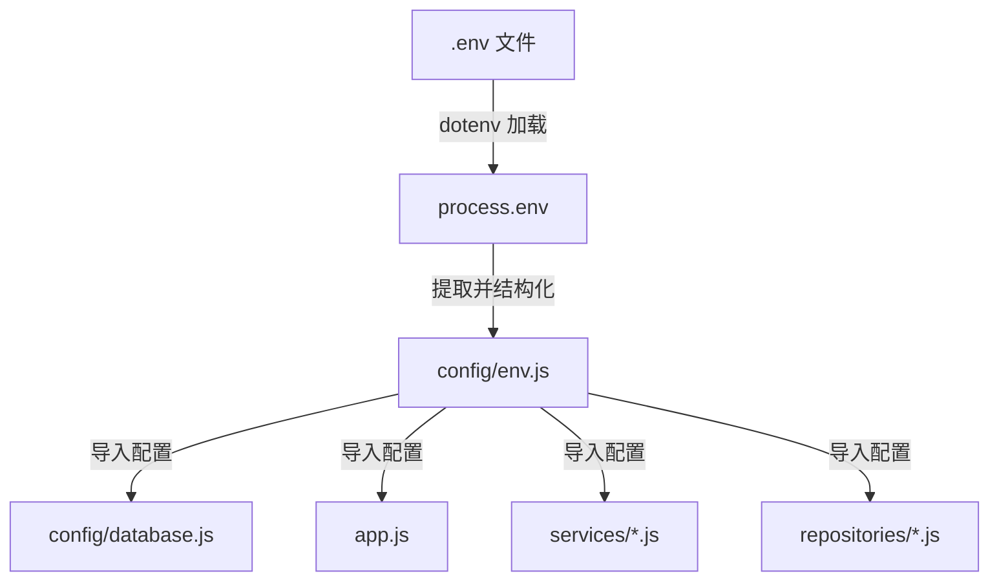
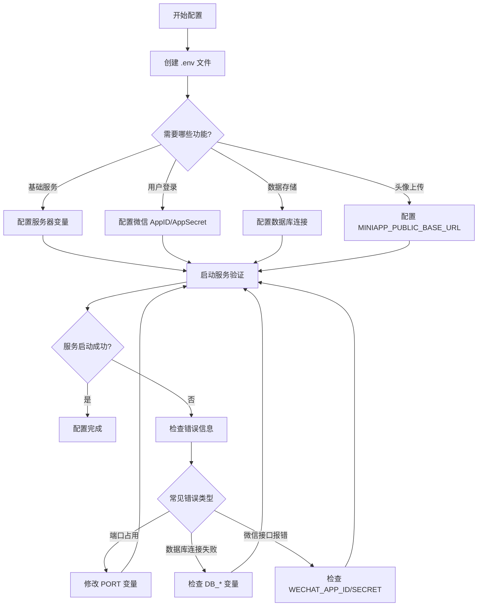
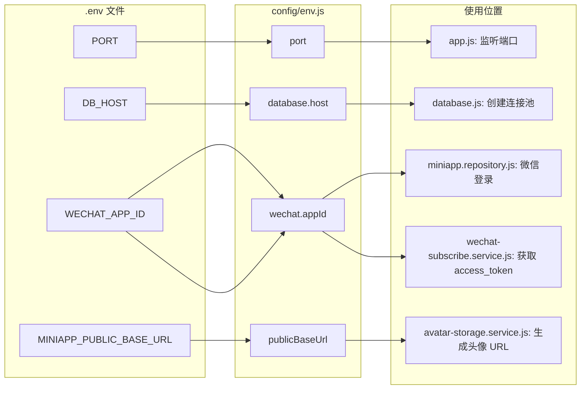

本页面详细介绍 CervixDetectAI 微信小程序后端服务的环境变量配置方法。环境变量是控制服务运行行为的关键参数，包括服务器监听地址、数据库连接信息、微信小程序凭证等。正确配置这些变量是后端服务正常运行的前提。

## 环境变量的作用与加载机制

后端服务使用 `dotenv` 库从 `.env` 文件加载环境变量。当服务启动时，`config/env.js` 文件会调用 `require("dotenv").config()` 读取项目根目录下的 `.env` 文件，并将其中定义的变量注入到 `process.env` 中。随后，`env.js` 会提取这些变量并导出一个结构化的配置对象，供其他模块使用。



Sources: [env.js](server/src/config/env.js#L1-L26), [database.js](server/src/config/database.js#L1-L23), [app.js](server/src/app.js#L1-L49)

## 环境变量完整列表

下表列出了所有可配置的环境变量，按功能分为四个类别：服务器配置、CORS 与公共 URL、微信小程序配置、数据库连接配置。

| 变量名 | 默认值 | 必填 | 说明 |
|--------|--------|------|------|
| **服务器配置** | | | |
| `PORT` | `3789` | 否 | 服务器监听端口 |
| `HOST` | `0.0.0.0` | 否 | 服务器监听地址，`0.0.0.0` 表示接受所有网络接口的连接 |
| **CORS 与公共 URL** | | | |
| `MINIAPP_ALLOWED_ORIGIN` | `*` | 否 | CORS 允许的来源，`*` 表示允许所有来源 |
| `MINIAPP_PUBLIC_BASE_URL` | 空 | 生产环境必填 | 头像返回 URL 的前缀，建议配置为公网 HTTPS 域名 |
| **微信小程序配置** | | | |
| `WECHAT_APP_ID` | 空 | 是 | 微信小程序 AppID，从微信公众平台获取 |
| `WECHAT_APP_SECRET` | 空 | 是 | 微信小程序 AppSecret，从微信公众平台获取 |
| `WECHAT_REPORT_TEMPLATE_ID` | `eZJlyXlekmNOsM1mLn8bcn29P2k-WAXo0XunYj96uSk` | 否 | 报告提醒的订阅消息模板 ID |
| `WECHAT_REMINDER_TEMPLATE_ID` | `Mpn-CisfT0yxvsrkrzSfHbZQY7Vr2rwWesquRE-dgn8` | 否 | 复查提醒的订阅消息模板 ID |
| `WECHAT_MINIPROGRAM_STATE` | `formal` | 否 | 小程序状态，`formal` 为正式版，`developer` 为开发版，`trial` 为体验版 |
| **数据库连接配置** | | | |
| `DB_HOST` | `127.0.0.1` | 是 | MySQL 服务器地址 |
| `DB_PORT` | `3306` | 否 | MySQL 服务器端口 |
| `DB_NAME` | `cervixdetectai_wx` | 是 | 数据库名称 |
| `DB_USER` | `root` | 是 | 数据库用户名 |
| `DB_PASSWORD` | 空 | 是 | 数据库密码 |
| `DB_CONNECTION_LIMIT` | `10` | 否 | 数据库连接池最大连接数 |

Sources: [env.js](server/src/config/env.js#L3-L25)

## 创建 .env 文件

### 第一步：创建文件

在 `server/` 目录下创建名为 `.env` 的文件。注意文件名以点号开头，且没有扩展名。

```bash
cd server
touch .env
```

### 第二步：填写配置内容

使用文本编辑器打开 `.env` 文件，按照以下格式填写配置。每行一个变量，格式为 `变量名=值`。

```bash
# 服务器配置
PORT=3789
HOST=0.0.0.0

# CORS 与公共 URL
MINIAPP_ALLOWED_ORIGIN=*
MINIAPP_PUBLIC_BASE_URL=https://your-domain.com

# 微信小程序配置（必填）
WECHAT_APP_ID=your-app-id
WECHAT_APP_SECRET=your-app-secret

# 数据库连接配置（必填）
DB_HOST=127.0.0.1
DB_PORT=3306
DB_NAME=cervixdetectai_wx
DB_USER=root
DB_PASSWORD=your-password
DB_CONNECTION_LIMIT=10
```

### 第三步：验证配置

配置完成后，启动服务验证是否正常工作：

```bash
npm run dev
```

如果配置正确，控制台会显示：

```
CervixDetectAI wx server listening on http://0.0.0.0:3789
```

Sources: [package.json](server/package.json#L7-L9)

## 各变量详细说明

### 服务器配置

**`PORT`** 和 **`HOST`** 控制 Express 服务器的监听行为。默认配置为监听所有网络接口的 3789 端口。在本地开发时，通常不需要修改这些配置。如果端口被占用，可以修改 `PORT` 为其他未被使用的端口号。

Sources: [env.js](server/src/config/env.js#L4-L5), [app.js](server/src/app.js#L43-L45)

### CORS 与公共 URL

**`MINIAPP_ALLOWED_ORIGIN`** 控制跨域资源共享策略。默认值 `*` 允许所有来源访问 API，适合开发阶段。生产环境建议配置为小程序服务器的实际域名，以提高安全性。

**`MINIAPP_PUBLIC_BASE_URL`** 用于生成头像的完整 URL。当用户上传头像后，服务会返回类似 `https://your-domain.com/uploads/avatars/filename.jpg` 的地址。如果未配置此变量，服务会使用请求的协议和主机名动态生成 URL，但在生产环境中可能导致头像无法正常显示。

Sources: [env.js](server/src/config/env.js#L6-L7), [avatar-storage.service.js](server/src/services/avatar-storage.service.js#L55-L60)

### 微信小程序配置

**`WECHAT_APP_ID`** 和 **`WECHAT_APP_SECRET`** 是微信小程序的核心凭证，用于调用微信登录接口和发送订阅消息。这两个变量必须配置，否则以下功能将无法使用：

1. **用户登录**：无法调用微信 `jscode2session` 接口获取用户 openid
2. **订阅消息**：无法获取 `access_token` 发送订阅消息

获取方式：登录微信公众平台 → 开发 → 开发管理 → 开发设置 → AppID(小程序ID) 和 AppSecret(小程序密钥)。

**`WECHAT_REPORT_TEMPLATE_ID`** 和 **`WECHAT_REMINDER_TEMPLATE_ID`** 是订阅消息的模板 ID。默认值已配置，如需自定义模板，可在微信公众平台订阅消息模块获取新的模板 ID。

**`WECHAT_MINIPROGRAM_STATE`** 控制订阅消息跳转的小程序版本。`formal` 表示正式版，`developer` 表示开发版，`trial` 表示体验版。开发阶段可设置为 `developer`，生产环境必须设置为 `formal`。

Sources: [env.js](server/src/config/env.js#L8-L14), [wechat-subscribe.service.js](server/src/services/wechat-subscribe.service.js#L14-L18), [miniapp.repository.js](server/src/repositories/miniapp.repository.js#L68-L112)

### 数据库连接配置

数据库配置用于连接 MySQL 服务器。`config/database.js` 使用这些配置创建连接池，所有数据库操作都通过连接池执行。

**`DB_CONNECTION_LIMIT`** 控制连接池的最大连接数。默认值 10 适合大多数场景。如果应用并发量较大，可以适当增加此值，但需注意 MySQL 服务器的最大连接数限制。

Sources: [env.js](server/src/config/env.js#L15-L24), [database.js](server/src/config/database.js#L1-L23)

## 配置流程图



## 常见问题与排查

### 问题 1：服务启动后无法访问

**可能原因**：
- `PORT` 端口被其他程序占用
- `HOST` 配置为 `127.0.0.1` 导致外部无法访问

**解决方案**：
```bash
# 检查端口占用情况
lsof -i :3789

# 修改 .env 文件
PORT=3790
HOST=0.0.0.0
```

### 问题 2：数据库连接失败

**可能原因**：
- `DB_HOST`、`DB_PORT`、`DB_USER`、`DB_PASSWORD` 配置错误
- MySQL 服务未启动
- 数据库用户权限不足

**解决方案**：
```bash
# 测试数据库连接
mysql -h <DB_HOST> -P <DB_PORT> -u <DB_USER> -p

# 检查 MySQL 服务状态
systemctl status mysql  # Linux
brew services list      # macOS
```

### 问题 3：微信登录失败

**可能原因**：
- `WECHAT_APP_ID` 或 `WECHAT_APP_SECRET` 配置错误
- AppSecret 已被重置

**解决方案**：
1. 登录微信公众平台核对 AppID 和 AppSecret
2. 检查服务日志中的错误信息
3. 确保服务器 IP 已加入微信接口 IP 白名单（如果配置了白名单）

### 问题 4：订阅消息发送失败

**可能原因**：
- `WECHAT_APP_ID` 或 `WECHAT_APP_SECRET` 未配置
- 模板 ID 不正确
- 用户未订阅消息

**解决方案**：
1. 检查服务日志中的错误码
2. 常见错误码：
   - `40001`：AppSecret 无效
   - `40003`：用户 openid 无效
   - `40037`：模板 ID 无效
   - `43101`：用户未订阅

Sources: [wechat-subscribe.service.js](server/src/services/wechat-subscribe.service.js#L40-L54), [wechat-subscribe.service.js](server/src/services/wechat-subscribe.service.js#L84-L93)

## 环境变量与代码的对应关系

下图展示了环境变量如何在代码中被使用：



Sources: [env.js](server/src/config/env.js#L1-L26), [app.js](server/src/app.js#L11-L12), [database.js](server/src/config/database.js#L6-L11), [miniapp.repository.js](server/src/repositories/miniapp.repository.js#L73-L75), [wechat-subscribe.service.js](server/src/services/wechat-subscribe.service.js#L14-L18), [avatar-storage.service.js](server/src/services/avatar-storage.service.js#L55-L60)

## 生产环境配置建议

### 安全性配置

1. **不要提交 .env 文件**：`.gitignore` 已配置忽略 `.env` 文件，确保不会将敏感信息提交到代码仓库
2. **使用强密码**：数据库密码应包含大小写字母、数字和特殊字符
3. **限制 CORS 来源**：生产环境将 `MINIAPP_ALLOWED_ORIGIN` 配置为具体域名

Sources: [.gitignore](server/.gitignore#L1-L4)

### 性能配置

1. **数据库连接池**：根据并发量调整 `DB_CONNECTION_LIMIT`，一般设置为 10-50
2. **服务器监听地址**：生产环境建议保持 `0.0.0.0`，配合反向代理使用

### 微信配置

1. **IP 白名单**：在微信公众平台配置服务器 IP 白名单，提高安全性
2. **模板消息**：根据业务需求自定义订阅消息模板
3. **小程序状态**：生产环境必须设置为 `formal`

## 配置示例

### 本地开发环境

```bash
# server/.env
PORT=3789
HOST=0.0.0.0
MINIAPP_ALLOWED_ORIGIN=*
MINIAPP_PUBLIC_BASE_URL=

WECHAT_APP_ID=wx1234567890abcdef
WECHAT_APP_SECRET=your-app-secret-here

DB_HOST=127.0.0.1
DB_PORT=3306
DB_NAME=cervixdetectai_wx
DB_USER=root
DB_PASSWORD=
DB_CONNECTION_LIMIT=10
```

### 生产环境

```bash
# server/.env
PORT=3789
HOST=0.0.0.0
MINIAPP_ALLOWED_ORIGIN=https://your-domain.com
MINIAPP_PUBLIC_BASE_URL=https://your-domain.com

WECHAT_APP_ID=wx1234567890abcdef
WECHAT_APP_SECRET=your-app-secret-here
WECHAT_MINIPROGRAM_STATE=formal

DB_HOST=mysql7.sqlpub.com
DB_PORT=3312
DB_NAME=cervixdetectai_wx
DB_USER=xingranya666
DB_PASSWORD=your-strong-password
DB_CONNECTION_LIMIT=20
```

Sources: [README.md](server/README.md#L13-L20)

## 下一步

配置完成后，建议继续阅读以下文档：

1. [数据库初始化](5-shu-ju-ku-chu-shi-hua) - 初始化数据库表结构和基础数据
2. [后端服务部署](7-hou-duan-fu-wu-bu-shu) - 将服务部署到生产环境
3. [系统分层架构](8-xi-tong-fen-ceng-jia-gou) - 深入了解后端架构设计
4. [Express路由与中间件设计](15-expresslu-you-yu-zhong-jian-jian-she-ji) - 了解路由和中间件的工作原理