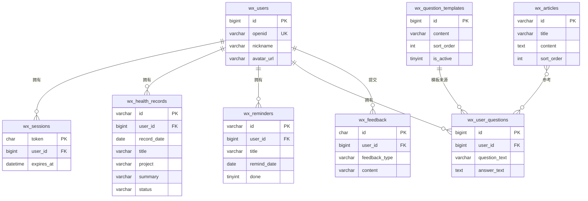
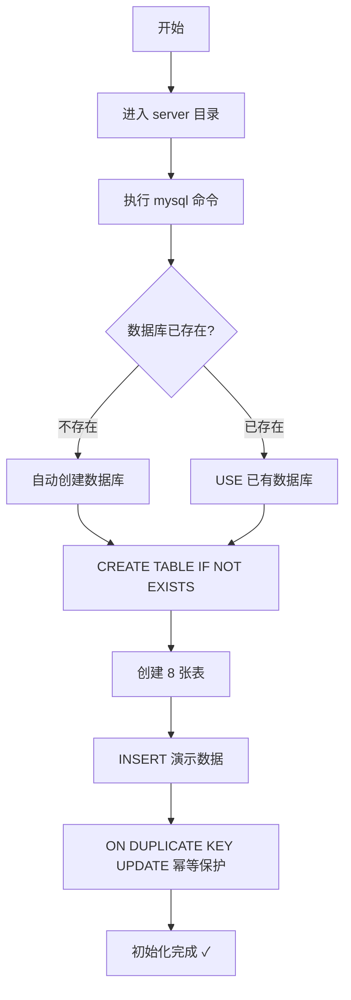

本文档介绍如何为 CervixDetectAI 微信小程序后端创建并初始化 MySQL 数据库。完成初始化后，数据库会包含完整的表结构和一套演示数据，让小程序首次打开就能看到完整效果。

## 初始化前的准备

在开始之前，请确认以下条件已满足：

| 条件 | 说明 |
|------|------|
| **MySQL 5.7+** | 需要支持 `utf8mb4` 字符集和存储过程 |
| **数据库连接信息** | 主机地址、端口、用户名、密码（写在 `server/.env` 中） |
| **命令行工具** | 终端可执行 `mysql` 命令 |

项目默认的数据库连接信息如下（实际值在 `server/.env` 文件中配置）：

| 配置项 | 环境变量名 | 默认值 |
|--------|-----------|--------|
| 主机地址 | `DB_HOST` | `127.0.0.1` |
| 端口 | `DB_PORT` | `3306` |
| 数据库名 | `DB_NAME` | `cervixdetectai_wx` |
| 用户名 | `DB_USER` | `root` |
| 密码 | `DB_PASSWORD` | （空） |
| 连接池大小 | `DB_CONNECTION_LIMIT` | `10` |

Sources: [env.js](server/src/config/env.js#L15-L24)

## 数据库与表结构概览

初始化脚本会自动创建名为 `cervixdetectai_wx` 的数据库，字符集为 `utf8mb4`，排序规则为 `utf8mb4_unicode_ci`（完整支持中文和 emoji）。脚本共创建 **8 张表**，它们之间的关系如下：



以下是各表的用途说明：

| 表名 | 用途 | 关联关系 |
|------|------|----------|
| `wx_users` | 小程序用户基本信息 | 核心主表 |
| `wx_sessions` | 登录会话（token 管理） | 外键 → `wx_users.id` |
| `wx_health_records` | 健康检查摘要记录 | 外键 → `wx_users.id` |
| `wx_reminders` | 复查提醒 | 外键 → `wx_users.id` |
| `wx_question_templates` | 就诊前问题模板（全局共享） | 独立表 |
| `wx_user_questions` | 用户自己整理的问题清单 | 外键 → `wx_users.id` |
| `wx_articles` | 健康管理知识文章（全局共享） | 独立表 |
| `wx_feedback` | 用户反馈 | 外键 → `wx_users.id` |

Sources: [init.sql](server/database/init.sql#L1-L117)

## 执行初始化脚本

### 全新初始化（推荐）

这是首次部署时使用的方式。脚本会创建数据库、建表、并插入演示数据，整个过程是**幂等的**（重复执行不会报错或产生重复数据）。

**步骤一：进入 server 目录**

```bash
cd server
```

**步骤二：执行初始化脚本**

```bash
mysql -h <主机地址> -P <端口> -u <用户名> -p cervixdetectai_wx < database/init.sql
```

执行后终端会提示输入密码，输入密码后按回车即可。为避免密码出现在终端历史记录中，**请勿**在命令中直接写 `-p密码`。

**完整示例：**

```bash
mysql -h mysql7.sqlpub.com -P 3312 -u xingranya666 -p cervixdetectai_wx < database/init.sql
```

Sources: [README.md](server/database/README.md#L19-L31), [server/README.md](server/README.md#L28-L34)

### 初始化流程图



### 老库升级

如果你的数据库是早期版本创建的，需要执行升级脚本来补充新增的字段和数据：

```bash
mysql -h <主机地址> -P <端口> -u <用户名> -p cervixdetectai_wx < database/upgrade-login-crud.sql
```

升级脚本会通过存储过程**幂等地**完成以下变更：

| 变更内容 | 涉及的表 | 说明 |
|----------|----------|------|
| 新增 `avatar_url` 字段 | `wx_users` | 支持头像外链存储 |
| 新增 `answer_text` 字段 | `wx_user_questions` | 支持问题备忘 |
| 新增 `updated_at` 字段 | `wx_user_questions` | 支持排序查询 |
| 新增索引 `idx_wx_user_questions_user_updated` | `wx_user_questions` | 优化查询性能 |
| 新增 `feedback_type` 字段 | `wx_feedback` | 支持反馈分类 |
| 补充演示数据 | 多张表 | 新增记录、提醒、模板和文章 |

升级脚本执行后会自动删除临时存储过程，不会在数据库中留下冗余对象。

Sources: [upgrade-login-crud.sql](server/database/upgrade-login-crud.sql#L1-L162)

## 演示数据说明

初始化脚本会写入一套完整的演示数据，方便首次打开小程序时直接看到效果。所有演示数据都使用 `ON DUPLICATE KEY UPDATE` 保证幂等——重复执行不会产生重复记录，只会更新已有数据。

### 演示用户

| 字段 | 值 |
|------|-----|
| `id` | `1` |
| `openid` | `demo-openid-001` |
| `nickname` | 张女士 |
| `gender` | female |

Sources: [init.sql](server/database/init.sql#L119-L124)

### 健康检查记录（4 条）

| 标题 | 检查日期 | 状态 |
|------|----------|------|
| 女性健康筛查记录 | 2026-03-18 | 待复查 |
| 健康检查记录 | 2026-01-15 | 已记录 |
| 年度健康检查摘要 | 2026-05-20 | 已记录 |
| 复查前资料整理 | 2026-06-02 | 待关注 |

Sources: [init.sql](server/database/init.sql#L126-L175)

### 复查提醒（4 条）

| 标题 | 提醒日期 | 完成状态 |
|------|----------|----------|
| 复查提醒 | 2026-09-18 | 未完成 |
| 资料准备 | 2026-09-10 | 未完成 |
| 记录整理 | 2026-07-05 | 未完成 |
| 线下咨询准备 | 2026-07-12 | 未完成 |

Sources: [init.sql](server/database/init.sql#L177-L188)

### 问题模板（7 条）

初始化脚本会插入 7 个就诊前常见问题模板，用于"问题整理"功能的快速添加：

| 排序 | 问题内容 |
|------|----------|
| 10 | 这次检查摘要里，我需要重点留意哪些信息？ |
| 20 | 复查前需要准备哪些资料？ |
| 30 | 历史记录需要一起带去吗？ |
| 40 | 如果近期身体不适，我应该如何安排线下咨询？ |
| 50 | 下次复查时间建议如何安排和记录？ |
| 60 | 哪些生活习惯和近期变化需要一并说明？ |
| 70 | 这次记录中有哪些内容需要后续持续关注？ |

Sources: [init.sql](server/database/init.sql#L190-L203)

### 健康知识文章（5 篇）

| 排序 | 标题 |
|------|------|
| 10 | 如何整理一次健康检查记录 |
| 20 | 复查提醒为什么重要 |
| 30 | 就诊前可以准备哪些信息 |
| 40 | 如何把复查安排放进日常计划 |
| 50 | 填写健康记录时注意什么 |

Sources: [init.sql](server/database/init.sql#L205-L253)

## 常见问题

### 脚本执行报错 "Access denied"

请检查 `server/.env` 中的 `DB_USER` 和 `DB_PASSWORD` 是否正确，以及该用户是否有创建数据库和表的权限。如果使用远程数据库，还需确认数据库服务器允许你的 IP 地址连接。

### 脚本执行报错 "Unknown database"

初始化脚本第一行会自动执行 `CREATE DATABASE IF NOT EXISTS cervixdetectai_wx`，通常不需要手动建库。如果报错，可能是数据库用户缺少 `CREATE` 权限，需要联系数据库管理员授权。

### 重复执行会出问题吗？

不会。脚本全面使用了 `IF NOT EXISTS`（建表）和 `ON DUPLICATE KEY UPDATE`（插入数据）机制，重复执行只会更新已有数据，不会产生重复记录或报错。

### 如何验证初始化成功？

执行以下 SQL 查询，确认各表有数据：

```sql
USE cervixdetectai_wx;
SELECT COUNT(*) FROM wx_users;
SELECT COUNT(*) FROM wx_health_records;
SELECT COUNT(*) FROM wx_question_templates;
SELECT COUNT(*) FROM wx_articles;
```

如果 `wx_users` 返回 1、`wx_health_records` 返回 4、`wx_question_templates` 返回 7、`wx_articles` 返回 5，说明初始化成功。

## 文件清单

| 文件路径 | 用途 |
|----------|------|
| `server/database/init.sql` | 全量初始化脚本（建库 + 建表 + 演示数据） |
| `server/database/upgrade-login-crud.sql` | 老库升级脚本（幂等补字段 + 补数据） |
| `server/database/README.md` | 数据库初始化简要说明 |
| `server/.env` | 数据库连接配置（不提交到 Git） |
| `server/src/config/env.js` | 读取 `.env` 并导出配置对象 |
| `server/src/config/database.js` | 创建 MySQL 连接池并提供 `query` 方法 |

Sources: [database.js](server/src/config/database.js#L1-L23), [env.js](server/src/config/env.js#L1-L26)

## 下一步

完成数据库初始化后，可以继续阅读以下文档：

- [后端环境变量配置](4-hou-duan-huan-jing-bian-liang-pei-zhi) — 配置微信 AppID、AppSecret 等后端环境变量
- [环境搭建与运行](2-huan-jing-da-jian-yu-yun-xing) — 安装依赖并启动后端服务
- [数据库表结构设计](19-shu-ju-ku-biao-jie-gou-she-ji) — 深入了解每张表的字段定义和索引设计
- [数据库升级与迁移脚本](21-shu-ju-ku-sheng-ji-yu-qian-yi-jiao-ben) — 了解升级脚本的设计原理