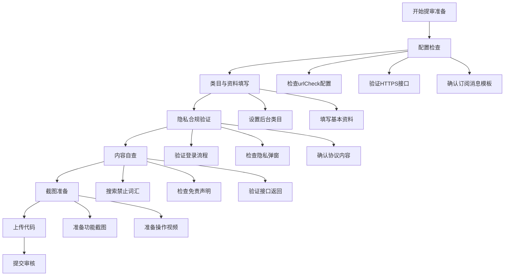
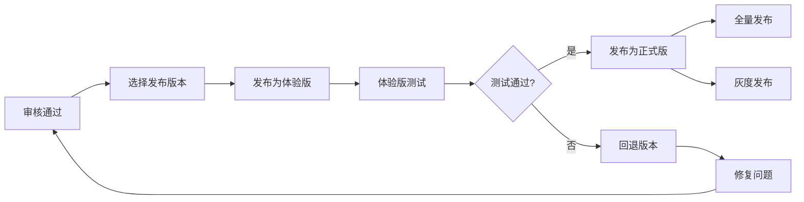

本指南旨在帮助开发者顺利完成"云端智诊"微信小程序的提交审核流程。微信小程序提审是应用上线前的关键环节，需要确保配置正确、内容合规、用户体验符合平台规范。本指南将基于项目实际配置，提供完整的提审准备清单和操作步骤。

## 1. 提审前配置检查

在提交审核前，必须确保小程序的基础配置符合微信平台要求。以下配置项直接影响审核结果：

| 配置项           | 文件位置                          | 要求说明                                     | 当前状态  |
| ---------------- | --------------------------------- | -------------------------------------------- | --------- |
| **URL检查**      | `miniprogram/project.config.json` | `urlCheck` 应保持开启，确保接口域名安全      | ✅ 已开启 |
| **HTTPS接口**    | 微信公众平台后台                  | 所有接口必须使用HTTPS，并配置request合法域名 | ✅ 已配置 |
| **订阅消息模板** | `miniprogram/config/app.js`       | 如需微信服务通知，需填写订阅消息模板ID       | ✅ 已配置 |
| **隐私保护指引** | 微信公众平台后台                  | 需声明头像、昵称、健康记录、提醒、反馈等用途 | ⚠️ 需确认 |
| **AppID**        | `miniprogram/project.config.json` | `xxxxxxxxxxxxxxxxxxx`                        | ✅ 已配置 |

**关键配置验证**：在 `miniprogram/config/app.js` 中，`subscriptionTemplateIds` 已配置两个模板ID（`reminder` 和 `report`），确保在提审前已在微信公众平台完成模板申请和审核。

Sources: [project.config.json](miniprogram/project.config.json#L1-L25), [config/app.js](miniprogram/config/app.js#L1-L15)

## 2. 后台类目与基本资料填写

### 2.1 后台类目设置

微信小程序审核对类目选择有严格限制，特别是医疗健康类应用。根据项目特性，必须选择以下类目：

**正确类目**：`工具 / 健康管理`

**禁止选择的类目**（会导致审核失败）：

- 医疗服务 / 就医服务
- 医疗服务 / 就医服务 / 查报告单
- 医疗服务 / 互联网医院
- 医疗服务 / 其他医学健康服务
- 政务民生 / 医疗

**原因**：本小程序仅用于健康信息记录与提醒，不提供在线诊断、治疗或问诊服务，因此不属于医疗服务类目。

### 2.2 基本资料填写规范

| 填写项         | 内容要求                       | 示例                                                                                                                               |
| -------------- | ------------------------------ | ---------------------------------------------------------------------------------------------------------------------------------- |
| **小程序名称** | 与应用功能相符，不超过30字符   | 云端智诊                                                                                                                           |
| **小程序简称** | 简洁明了，不超过10字符         | 云端智诊                                                                                                                           |
| **功能介绍**   | 明确说明应用用途，避免医疗术语 | 女性用户的健康管理助手，记录检查摘要、管理复查提醒、整理就诊前问题。产品仅用于健康信息记录与提醒，不提供在线诊断、治疗或问诊服务。 |
| **标签**       | 与功能相关的关键词，最多10个   | 健康管理、记录、提醒、女性健康                                                                                                     |

**特别注意**：功能介绍中必须明确说明"不提供在线诊断、治疗或问诊服务"，这是避免被归类为医疗服务的关键。

Sources: [submission-checklist.md](docs/submission-checklist.md#L1-L20)

## 3. 登录与隐私合规实现

微信小程序审核对登录流程和隐私保护有严格要求，以下是本项目的合规实现要点：

### 3.1 登录流程合规性

**核心原则**：用户必须能够先浏览主要功能，再自愿选择登录。

**实现验证**：

1. **首页访客模式**：在 `miniprogram/pages/home/index.js` 中，当用户未登录时显示 `GUEST_HOME` 内容，允许浏览健康知识、问题模板等功能
2. **登录页隐私弹窗**：在 `miniprogram/pages/login/index.js` 中，登录前必须显示隐私协议弹窗
3. **协议勾选机制**：在 `miniprogram/components/privacy-consent/index.js` 中，用户必须主动勾选"我已阅读并同意上述协议"，未勾选时"同意并继续"按钮禁用

**审核红线**：

- ❌ 首页首屏不得直接要求手机号、头像、昵称授权登录
- ❌ 登录页不得默认勾选《用户服务协议》或《隐私政策》
- ❌ 未登录状态下，健康知识和问题模板接口必须可正常返回内容

### 3.2 隐私保护实现

**隐私协议配置**：项目使用微信官方隐私授权弹窗模式，在 `miniapp-privacy.json` 中配置：

```json
{
  "title": "隐私保护说明",
  "message": "欢迎使用云端智诊。你可以先在浏览模式下查看首页、健康知识、隐私说明和服务边界；当你主动使用微信登录、头像填写、个人记录保存与复查提醒等能力时，我们会按照《隐私与服务说明》与《用户服务协议》处理相关信息。",
  "confirm": "同意并继续",
  "cancel": "仅浏览"
}
```

**协议文档托管**：隐私协议和服务协议以HTML形式托管在服务器端：

- 隐私协议：`https://xcx.hpvsc.icu/agreements/privacy.html`
- 服务协议：`https://xcx.hpvsc.icu/agreements/service.html`

**头像昵称处理**：根据微信最新规范，头像和昵称设置应放在登录后的资料引导页单独处理，避免与登录前隐私弹窗链路混淆。在 `miniprogram/pages/login/index.wxml` 中，头像选择器在未同意协议时显示为禁用状态。

Sources: [miniapp-privacy.json](miniapp-privacy.json#L1-L36), [privacy-consent/index.js](miniprogram/components/privacy-consent/index.js#L1-L42), [login/index.js](miniprogram/pages/login/index.js#L1-L50)

## 4. 审核截图准备建议

微信审核需要提供小程序主要功能的截图，以下为各页面的截图建议：

| 页面         | 截图内容要求                                                                         | 关键元素                         |
| ------------ | ------------------------------------------------------------------------------------ | -------------------------------- |
| **首页**     | 显示"最近检查摘要、复查提醒、检查记录、问题整理"，并能先浏览功能，不出现首屏强制登录 | 访客模式提示、功能入口、免责声明 |
| **检查记录** | 显示健康检查摘要列表                                                                 | 记录列表、摘要信息、无登录强制   |
| **复查提醒** | 显示复查计划和标记完成按钮                                                           | 提醒列表、完成状态、时间显示     |
| **问题整理** | 显示就诊前问题清单                                                                   | 问题模板、添加入口、分类标签     |
| **健康知识** | 显示文章列表，并可打开文章正文                                                       | 文章标题、摘要、阅读功能         |
| **我的**     | 显示隐私说明、合规与服务边界、意见反馈入口                                           | 个人中心、设置选项、协议入口     |

**截图技巧**：

1. 使用真机截图，确保界面清晰
2. 展示完整功能流程，避免截取空白或错误状态
3. 确保截图中不出现禁止使用的词汇
4. 建议提供5-8张核心功能截图

Sources: [submission-checklist.md](docs/submission-checklist.md#L25-L40)

## 5. 内容合规自查清单

微信审核对内容用词有严格限制，以下是必须遵守的规范：

### 5.1 禁止出现的词汇

**医疗相关术语**（绝对禁止）：

- AI 诊断、辅助诊断、诊疗建议
- 在线问诊、医生咨询、查报告单
- 医院官方、挂号、缴费、处方
- 治疗方案、疾病预测、病变识别

**替代方案**：使用以下合规表述：

- 健康记录、检查摘要、复查提醒
- 问题整理、就诊前准备、健康管理知识
- 线下咨询专业人员

### 5.2 必须保留的免责声明

在以下页面必须显示免责声明：

1. **首页**：`miniprogram/pages/home/index.wxml`
2. **检查记录详情页**：`miniprogram/packages/records/record-detail/index.wxml`
3. **问题整理页**：`miniprogram/packages/tools/questions/index.wxml`
4. **隐私说明页**：`miniprogram/packages/profile/privacy/index.wxml`

**免责声明内容**：

```
本小程序仅用于健康信息记录与提醒，不提供在线诊断、治疗或问诊服务。
```

### 5.3 自查方法

1. **全局搜索**：在项目目录中搜索禁止词汇
2. **接口检查**：确保所有API返回数据不包含敏感词
3. **用户输入**：检查用户输入框是否有限制或过滤机制
4. **静态资源**：检查图片、图标是否包含敏感内容

**特别提醒**：在 `miniprogram/pages/home/index.js` 的 `GUEST_HOME` 对象中，已正确使用合规表述，如"产品用于个人健康记录、复查提醒和线下咨询准备，不提供在线诊断、治疗、处方或问诊服务"。

Sources: [submission-checklist.md](docs/submission-checklist.md#L55-L80), [home/index.js](miniprogram/pages/home/index.js#L20-L35)

## 6. 提审操作流程

### 6.1 提审前准备步骤



### 6.2 详细操作步骤

**第一步：代码上传**

1. 在微信开发者工具中打开 `miniprogram/` 目录
2. 点击"上传"按钮，填写版本号（如 `1.0.0`）和项目备注
3. 确保上传的代码包大小符合微信限制（目前为2MB）

**第二步：审核信息填写**

1. 登录微信公众平台（https://mp.weixin.qq.com）
2. 进入"版本管理" → "开发版本"
3. 点击"提交审核"，填写以下信息：
   - **版本描述**：简要说明本次更新内容
   - **测试账号**：如需提供测试账号，在此填写
   - **审核截图**：上传准备好的功能截图
   - **补充说明**：可添加特殊说明或注意事项

**第三步：审核配合**

1. **操作视频**：建议录制"首页浏览 → 健康知识 → 隐私说明 → 返回首页 → 主动登录 → 资料设置"的完整流程
2. **测试账号**：如审核需要，提供已登录的测试账号
3. **补充材料**：根据审核反馈及时补充材料

### 6.3 常见审核问题及解决方案

| 问题类型     | 常见原因             | 解决方案                  |
| ------------ | -------------------- | ------------------------- |
| **类目不符** | 选择了医疗服务类目   | 修改为"工具 / 健康管理"   |
| **登录强制** | 首页要求强制登录     | 确保访客模式可正常浏览    |
| **隐私问题** | 协议未勾选或默认勾选 | 实现主动勾选机制          |
| **内容违规** | 使用医疗术语         | 替换为合规表述            |
| **功能不全** | 接口无法访问         | 检查HTTPS配置和域名白名单 |

**特别注意**：如果审核被拒，仔细阅读审核反馈，针对性修改后重新提交。常见问题在 `docs/submission-checklist.md` 中有详细说明。

Sources: [submission-checklist.md](docs/submission-checklist.md#L45-L55), [app.json](miniprogram/app.json#L1-L102)

## 7. 提审后监控与维护

### 7.1 审核状态监控

提交审核后，需要关注以下状态：

1. **审核中**：通常1-3个工作日，期间不可修改代码
2. **审核通过**：可发布为体验版或正式版
3. **审核失败**：根据反馈修改后重新提交

### 7.2 版本发布流程



### 7.3 后续更新注意事项

1. **版本号管理**：遵循语义化版本规范（如 `1.0.1`）
2. **更新日志**：详细记录每次更新的内容
3. **兼容性测试**：确保新版本与旧版本数据兼容
4. **回退机制**：准备快速回退方案，应对紧急问题

**最佳实践**：在 `miniprogram/app.js` 中已实现版本更新检测机制，当有新版本时会提示用户更新。建议在重大更新时，通过此机制引导用户及时升级。

Sources: [app.js](miniprogram/app.js#L25-L45), [07-runtime-and-deployment.md](docs/wiki/07-runtime-and-deployment.md#L1-L80)

## 8. 总结与检查清单

### 8.1 提审前最终检查清单

| 检查项                          | 状态 | 说明                   |
| ------------------------------- | ---- | ---------------------- |
| 后台类目设置为"工具 / 基础服务" | ☐    | 必须选择正确类目       |
| 功能介绍包含免责声明            | ☐    | 明确说明不提供医疗服务 |
| 首页可访客浏览                  | ☐    | 不强制登录             |
| 登录页隐私协议主动勾选          | ☐    | 不默认勾选             |
| 隐私保护指引声明完整            | ☐    | 包含所有必要声明       |
| 接口全部使用HTTPS               | ☐    | 域名已配置白名单       |
| 订阅消息模板已配置              | ☐    | 如需服务通知           |
| 内容无禁止词汇                  | ☐    | 全局搜索验证           |
| 免责免责声明显示                | ☐    | 四个页面必须显示       |
| 审核截图准备完成                | ☐    | 5-8张核心功能截图      |

### 8.2 成功提审的关键要点

1. **合规第一**：严格遵守微信平台规范，特别是医疗健康类应用的限制
2. **用户体验**：确保用户可先体验再决定是否登录
3. **内容安全**：避免使用敏感词汇，明确服务边界
4. **配置正确**：所有技术配置必须符合要求
5. **材料完整**：提供清晰的截图和说明材料

**最终建议**：在提审前，邀请团队成员或测试用户完整体验小程序，收集反馈并及时修复问题。同时，仔细阅读微信官方文档，了解最新的审核要求和规范变化。
