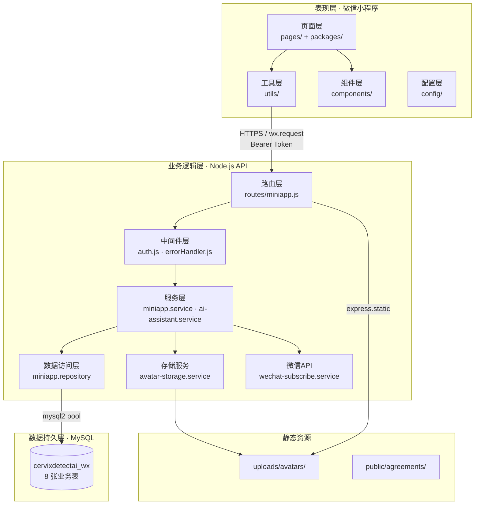
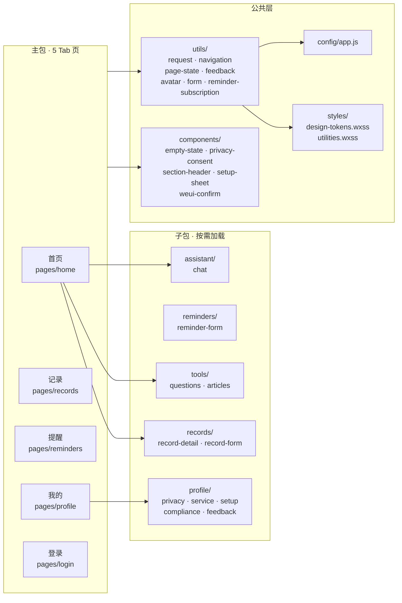
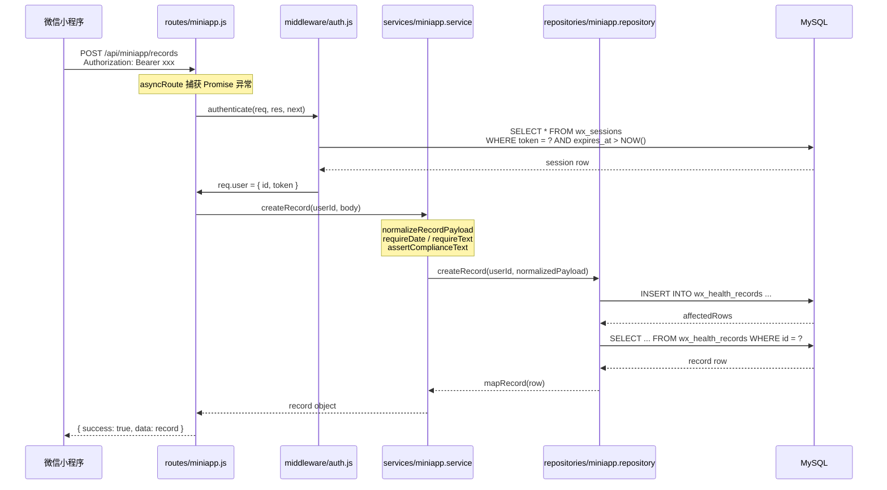

本页从**第一性原理**出发，拆解「云端智诊」的整体分层结构——前端微信小程序、Node.js API 服务、MySQL 数据库三层如何协作，以及每层内部的职责边界与设计模式。阅读本页后，你将能够快速定位任意功能在代码中的位置，并理解数据从用户点击到持久化落盘的完整路径。

## 架构全景

系统采用经典的**三层架构**：表现层（微信小程序）、业务逻辑层（Express API）、数据持久层（MySQL）。三层之间通过明确的协议边界隔离——前端通过 HTTPS + Bearer Token 与后端通信，后端通过 mysql2 连接池与数据库交互。

上图的核心观察：**每一层只与相邻层交互**。页面不直接访问数据库，路由不直接编写 SQL，服务层不关心 HTTP 协议细节。这种单向依赖链使得任何一层的变更都不会向上传播到不可控的范围。

Sources: [server/src/app.js](server/src/app.js#L1-L49), [miniprogram/app.js](miniprogram/app.js#L1-L76), [miniprogram/app.json](miniprogram/app.json#L1-L115)

## 前端分层：表现层内部结构

前端采用微信小程序原生框架，按**页面 → 组件 → 工具 → 配置**四层组织。主包包含 5 个 Tab 页面，6 个子包按功能域拆分，通过 `preloadRule` 实现预加载策略。

前端的分包策略基于用户行为分析：首页是入口枢纽，用户从首页出发进入记录、提醒、工具等功能域，因此将这些子包设为首页的预加载目标。`packages/profile` 子包则跟随「我的」页面预加载。

| 分包 | 路径 | 包含页面 | 预加载触发点 |
|------|------|----------|-------------|
| 主包 | `/` | home, records, reminders, profile, login | 随小程序启动 |
| records | `packages/records` | record-detail, record-form | pages/home |
| reminders | `packages/reminders` | reminder-form | pages/home |
| tools | `packages/tools` | questions, articles | pages/home |
| profile | `packages/profile` | privacy, service, setup, compliance, feedback | pages/profile |
| assistant | `packages/assistant` | chat | pages/home |

Sources: [miniprogram/app.json](miniprogram/app.json#L1-L115), [miniprogram/utils/navigation.js](miniprogram/utils/navigation.js#L1-L59)

## 工具层：前端的「胶水」职责

工具层是前端架构的核心枢纽——它不包含 UI，而是提供**请求封装、路由管理、状态机、反馈机制、头像处理、表单防抖、订阅消息**七大横切关注点的统一抽象。

| 工具模块 | 文件 | 核心职责 | 关键导出 |
|----------|------|----------|----------|
| 请求封装 | `utils/request.js` | wx.request 包装、Bearer Token 注入、内存缓存、401 拦截、陈旧缓存降级 | `request`, `CACHE_KEYS`, `getCachedData`, `markCacheDirty` |
| 路由管理 | `utils/navigation.js` | 集中路径常量、Tab/普通/重定向/重启四类跳转 | `ROUTES`, `openRoute` |
| 页面状态机 | `utils/page-state.js` | loading → ready / empty / error 四态判定 | `PAGE_STATUS`, `resolveListStatus`, `resolveDetailStatus` |
| 反馈机制 | `utils/feedback.js` | Toast/Modal 统一封装，错误信息规范化 | `showErrorToast`, `showSuccessToast`, `showErrorModal` |
| 头像处理 | `utils/avatar.js` | 本地/远程路径判定、base64 编码、开发者工具临时 URL 持久化 | `normalizeStoredUser`, `readFileBase64`, `persistAvatarFile` |
| 表单防抖 | `utils/form.js` | loading 锁，防止重复提交 | `withPageLoading` |
| 订阅消息 | `utils/reminder-subscription.js` | 微信订阅消息模板 ID 管理与授权请求 | `requestReminderSubscription` |

请求封装层的设计尤为精巧——它实现了**三级容错机制**：优先返回新鲜缓存（30s 内），其次合并重复请求（inflight dedup），最后在 5xx 错误时降级到陈旧缓存。这使得弱网环境下用户仍能看到上一次成功加载的内容。

Sources: [miniprogram/utils/request.js](miniprogram/utils/request.js#L1-L381), [miniprogram/utils/navigation.js](miniprogram/utils/navigation.js#L1-L59), [miniprogram/utils/page-state.js](miniprogram/utils/page-state.js#L1-L21), [miniprogram/utils/feedback.js](miniprogram/utils/feedback.js#L1-L39), [miniprogram/utils/avatar.js](miniprogram/utils/avatar.js#L1-L254), [miniprogram/utils/form.js](miniprogram/utils/form.js#L1-L15), [miniprogram/utils/reminder-subscription.js](miniprogram/utils/reminder-subscription.js#L1-L45)

## 后端分层：请求处理流水线

后端采用 Express 框架，遵循**路由 → 中间件 → 服务 → 仓库**四层结构。每一层的职责边界清晰：路由层只做参数传递，中间件处理横切关注点，服务层承载业务逻辑，仓库层封装 SQL。

上图展示了一次完整的写入请求。注意三个关键设计决策：**路由层通过 `asyncRoute` 包装统一捕获异步异常**，避免遗漏 `next(error)` 调用；**服务层在业务校验阶段执行合规词拦截**，而非在数据库层；**仓库层遵循「写后读」模式**——INSERT 之后立即 SELECT，确保返回给前端的数据与数据库一致。

Sources: [server/src/routes/miniapp.js](server/src/routes/miniapp.js#L1-L169), [server/src/middleware/auth.js](server/src/middleware/auth.js#L1-L34), [server/src/middleware/errorHandler.js](server/src/middleware/errorHandler.js#L1-L21)

## 服务层：业务逻辑的核心容器

服务层是整个后端最厚的一层，承载了**数据规范化、合规校验、业务编排**三大职责。它不直接操作 SQL，而是将规范化后的数据委托给仓库层。

**数据规范化**方面，服务层定义了一套完整的 `normalize*Payload` 函数族，对每个字段执行类型转换、长度截断、默认值填充。以 `normalizeRecordPayload` 为例，它对 `date` 字段执行 `requireDate` 校验（正则匹配 + 日期有效性验证），对 `title`、`project`、`summary`、`suggestion` 执行 `requireText` 校验（非空 + 合规词过滤），对可选字段 `hospital`、`doctorName` 执行 `cleanText` 清洗。

**合规校验**方面，`assertComplianceText` 函数维护了一份 `PROHIBITED_SERVICE_TERMS` 列表（包含"AI诊断"、"在线问诊"、"治疗方案"等 10 个禁止词），在用户输入的文本中执行子串匹配。命中即抛出 400 错误，附带具体的违规词和改写建议。这一机制在三个入口点生效：记录创建/更新、提醒创建/更新、反馈提交。

**业务编排**方面，服务层协调多个下游服务完成复合操作。典型场景如发送订阅消息：先从仓库获取记录详情，再查询用户的 openid，然后调用微信订阅消息 API。这种编排逻辑如果放在路由层会使路由臃肿，放在仓库层则违反数据访问层的职责。

Sources: [server/src/services/miniapp.service.js](server/src/services/miniapp.service.js#L1-L398), [server/src/services/ai-assistant.service.js](server/src/services/ai-assistant.service.js#L1-L234), [server/src/services/avatar-storage.service.js](server/src/services/avatar-storage.service.js#L1-L104), [server/src/services/wechat-subscribe.service.js](server/src/services/wechat-subscribe.service.js#L1-L99)

## 仓库层：数据访问的唯一出口

仓库层是**唯一允许执行 SQL 的地方**。它通过 `mysql2/promise` 连接池与 MySQL 交互，所有 SQL 均使用参数化查询防止注入。

仓库层内部维护了三类函数：**实体映射函数**（`mapUser`、`mapRecord`、`mapReminder`、`mapQuestion`）负责将数据库行转换为前端友好的对象结构，字段名从蛇形命名转换为驼峰命名；**ID 生成函数**（`createCompactId` 使用 `crypto.randomUUID` 去除连字符，`createToken` 使用 32 字节随机十六进制串）确保主键的唯一性和安全性；**微信 API 调用函数**（`requestWechatSession`）处理与微信 `jscode2session` 接口的通信，解析 `openid` 和 `session_key`。

仓库层还实现了登录态管理的核心逻辑：用户首次登录时执行 `INSERT ... ON DUPLICATE KEY UPDATE` 实现 upsert，然后创建 `wx_sessions` 记录（有效期 30 天），返回 token。后续请求通过 `getSessionByToken` 验证会话有效性。

Sources: [server/src/repositories/miniapp.repository.js](server/src/repositories/miniapp.repository.js#L1-L607), [server/src/config/database.js](server/src/config/database.js#L1-L23)

## 配置与环境管理

系统通过**前端配置文件 + 后端环境变量**双轨管理配置。

后端 [config/env.js](server/src/config/env.js) 通过 `dotenv` 加载 `.env` 文件，导出 5 组配置：服务端口与主机、CORS 白名单、微信 AppID/AppSecret/模板 ID、数据库连接参数、AI 模型参数。数据库配置默认使用 `utf8mb4` 字符集，连接池上限 10 个连接。

前端 [config/app.js](miniprogram/config/app.js) 暴露 4 个 API 根地址用于环境分流：`apiBaseUrl`（默认值）、`devtoolsApiBaseUrl`（开发者工具）、`deviceApiBaseUrl`（同 WiFi 真机调试）、`productionApiBaseUrl`（体验版/正式版）。`request.js` 中的 `resolveBaseUrl` 函数通过 `wx.getAccountInfoSync().miniProgram.envVersion` 判断当前环境——非 `develop` 一律走 `productionApiBaseUrl`，其余按 `platform === 'devtools'` 在两个开发地址之间切换。

| 配置维度 | 前端 | 后端 |
|----------|------|------|
| 存储方式 | `config/app.js` 常量 | `.env` + `process.env` |
| 环境切换 | `resolveBaseUrl()` 自动判定 | 手动修改 `.env` |
| 敏感信息 | 无（token 运行时获取） | DB 密码、微信密钥、AI API Key |
| 覆盖机制 | 无法覆盖 | 环境变量 > `.env` > 默认值 |

Sources: [server/src/config/env.js](server/src/config/env.js#L1-L33), [miniprogram/config/app.js](miniprogram/config/app.js#L1-L15), [server/src/config/database.js](server/src/config/database.js#L1-L23)

## 设计系统：样式架构

前端通过 CSS 变量实现了完整的设计令牌体系，分为**基础令牌层**和**工具类层**两层。

[design-tokens.wxss](miniprogram/styles/design-tokens.wxss) 定义了 100+ CSS 变量，覆盖背景色、文字色、品牌蓝色阶、语义色（成功/警告/危险）、医学诊断色阶（Normal → ASC-US → LSIL → HSIL → SCC）、边框、阴影、圆角、间距、动画时长。所有变量挂载在 `page` 选择器上，通过 `var(--wx-*)` 引用。

[utilities.wxss](miniprogram/styles/utilities.wxss) 在令牌之上提供语义化的组合样式：`.u-card`（卡片）、`.u-primary-button`（主按钮）、`.u-pill`（标签胶囊）、`.u-safe-note`（安全提示条）、`.u-section-title`（章节标题）等。这种两层架构确保了**视觉一致性**——修改一个令牌值，所有引用它的工具类自动更新。

Sources: [miniprogram/styles/design-tokens.wxss](miniprogram/styles/design-tokens.wxss#L1-L107), [miniprogram/styles/utilities.wxss](miniprogram/styles/utilities.wxss#L1-L216)

## 关键依赖关系总览

下表汇总了系统中跨模块的核心依赖关系，可作为代码导航的速查索引：

| 上游调用方 | 下游被调用方 | 交互内容 |
|-----------|-------------|---------|
| 任意 Page | `utils/request` | 所有 HTTP 请求入口，自动注入 Bearer Token |
| 任意 Page | `utils/navigation` | 路由跳转 + 集中路径常量 |
| 任意 Page | `utils/page-state` | loading/ready/empty/error 状态判定 |
| 任意 Page | `utils/feedback` | Toast / Modal 统一封装 |
| 登录页 | `utils/avatar` | 临时头像持久化与 base64 编码 |
| 记录/提醒表单 | `utils/form` | `withPageLoading` 防重复提交 |
| 提醒表单 | `utils/reminder-subscription` | 微信订阅消息授权 |
| `routes/miniapp` | `services/miniapp` | 业务编排入口 |
| `routes/miniapp` | `services/ai-assistant` | AI 助手聊天（普通 + SSE 流式） |
| `services/miniapp` | `repositories/miniapp` | MySQL CRUD |
| `services/miniapp` | `services/avatar-storage` | 头像解码 + 落盘 + URL 生成 |
| `services/miniapp` | `services/wechat-subscribe` | 微信订阅消息发送 |
| `services/miniapp` | `config/env` | 读取微信模板 ID、AI 配置等 |
| `repositories/miniapp` | `config/database` | mysql2 连接池 |
| `repositories/miniapp` | 微信 API | `jscode2session` 登录凭证兑换 |
| 受保护路由 | `middleware/auth` | Bearer Token → userId 解析 |

Sources: [server/src/routes/miniapp.js](server/src/routes/miniapp.js#L1-L169), [server/src/services/miniapp.service.js](server/src/services/miniapp.service.js#L1-L398), [server/src/repositories/miniapp.repository.js](server/src/repositories/miniapp.repository.js#L1-L607)

## 推荐阅读路径

理解分层架构后，建议按以下路径深入各层的实现细节：

1. 若关注**前后端交互流程**，阅读 [前后端交互时序](9-qian-hou-duan-jiao-hu-shi-xu)
2. 若关注**前端缓存机制**，阅读 [缓存模型与数据同步策略](10-huan-cun-mo-xing-yu-shu-ju-tong-bu-ce-lue)
3. 若关注**前端页面组织**，阅读 [页面结构与分包机制](11-ye-mian-jie-gou-yu-fen-bao-ji-zhi)
4. 若关注**后端路由与中间件**，阅读 [Express路由与中间件设计](15-expresslu-you-yu-zhong-jian-jian-she-ji)
5. 若关注**后端服务层业务逻辑**，阅读 [业务服务层架构](16-ye-wu-fu-wu-ceng-jia-gou)
6. 若关注**数据库设计**，阅读 [数据库表结构设计](19-shu-ju-ku-biao-jie-gou-she-ji)