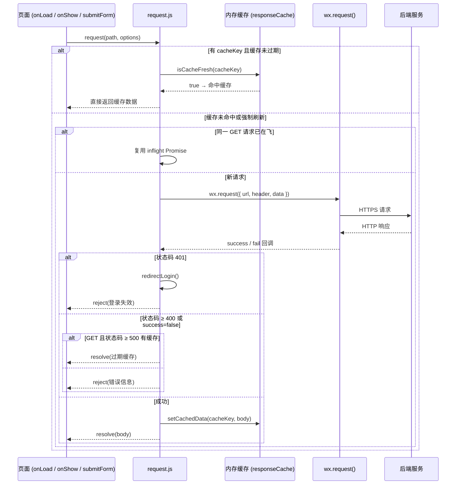
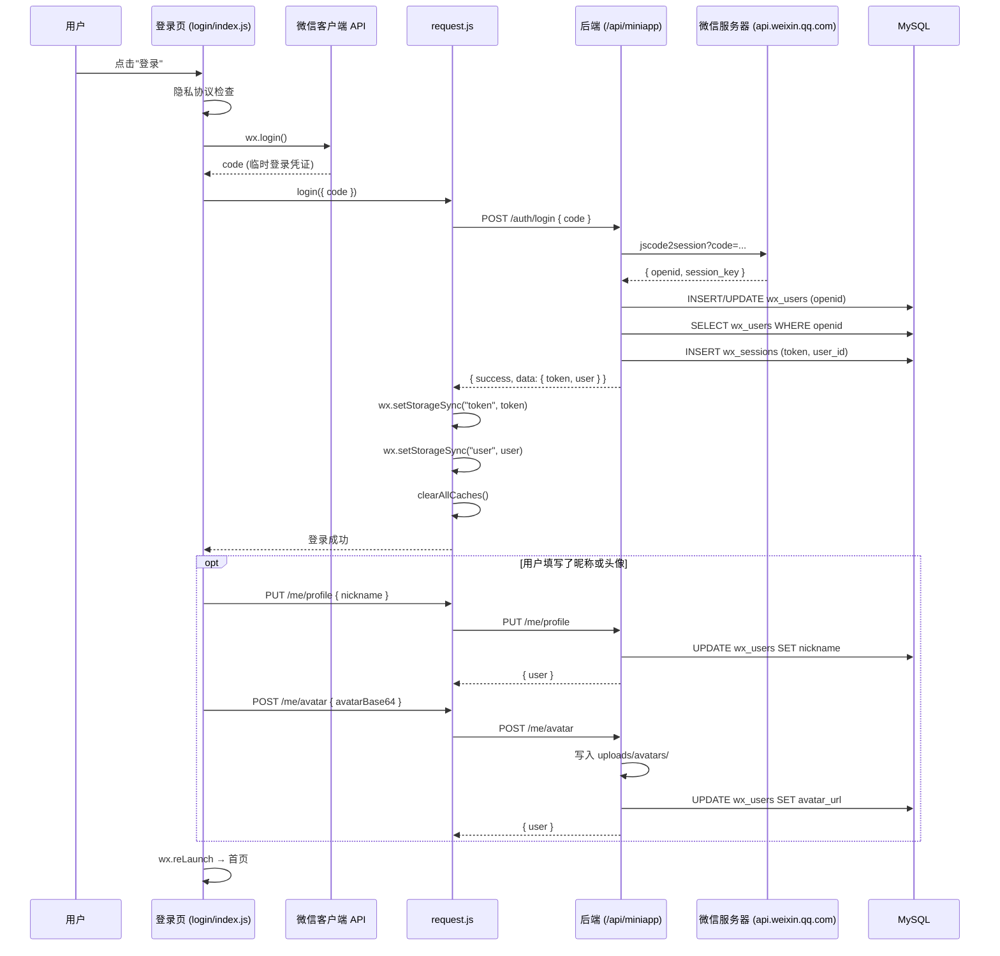
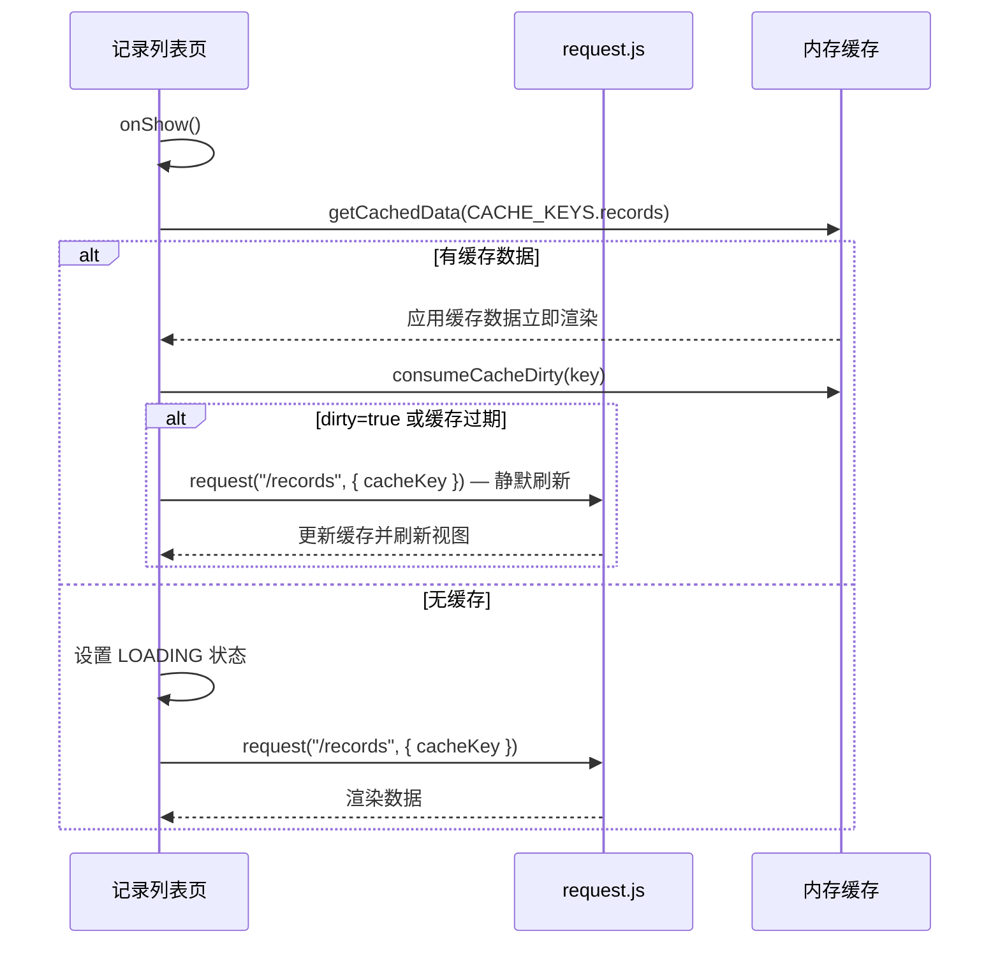
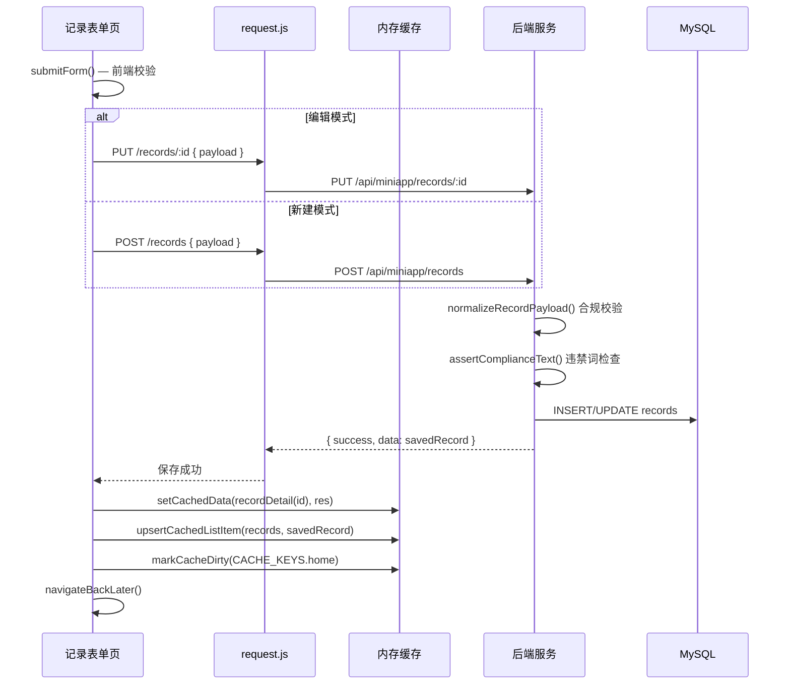
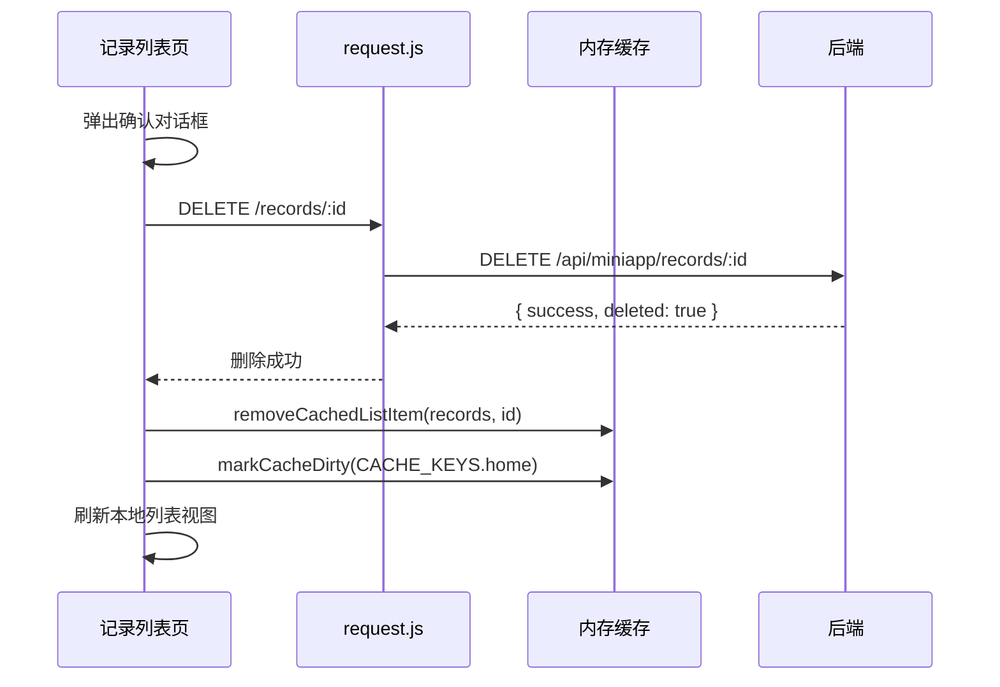
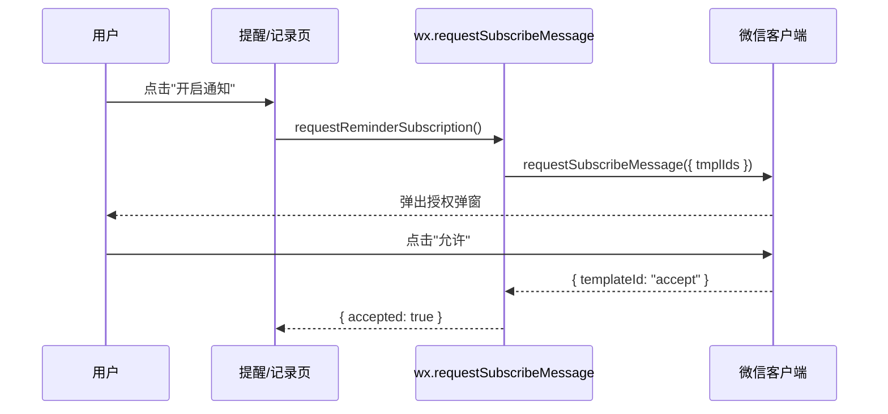
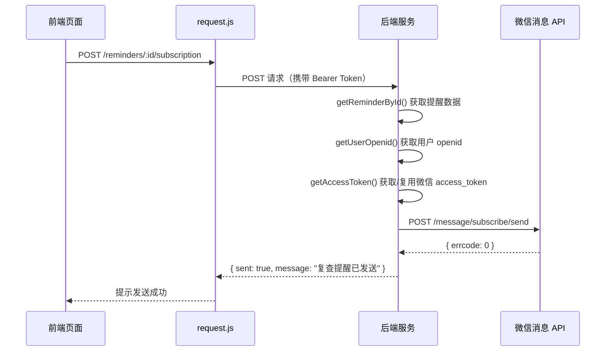
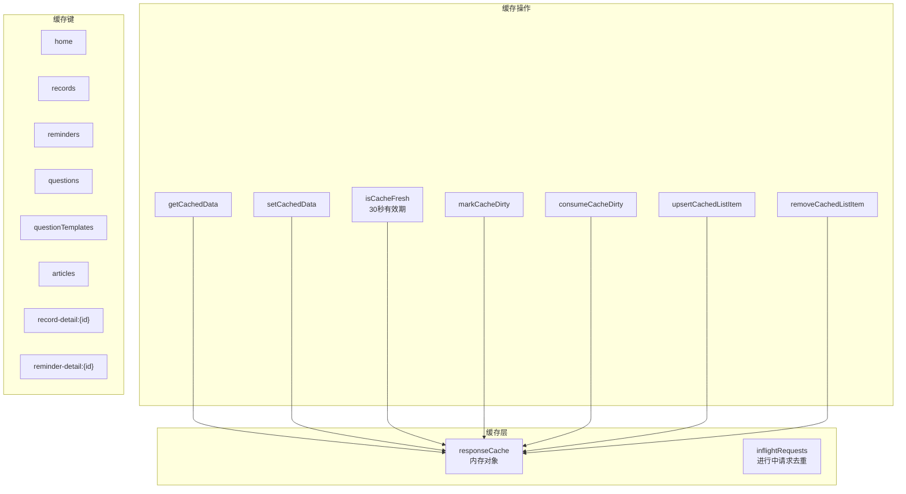
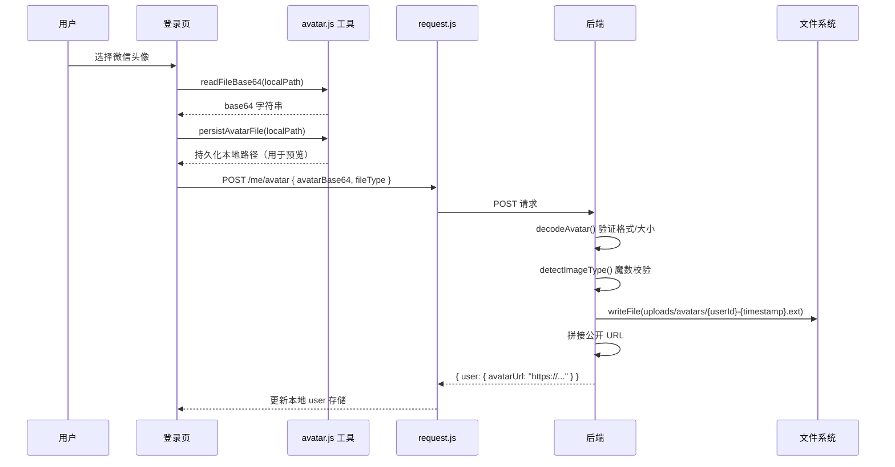

本页从请求生命周期的角度，完整剖析小程序前端与 Node.js 后端之间的交互模式。内容覆盖：请求封装层如何发起网络调用、鉴权令牌如何在请求链路中流转、服务端中间件如何层层处理请求、以及缓存与订阅消息等横切关注点如何影响交互时序。理解这些时序，是排查接口问题和设计新功能的前提。

## 一、请求封装层概览

所有前端网络请求都经过 `miniprogram/utils/request.js` 中的 `request()` 函数。这个函数承担了 **URL 解析、Token 注入、缓存决策、请求去重、错误规范化** 五项职责，是前端与后端通信的唯一出口。



`request()` 函数的核心参数包括 `path`（相对于 API 基础路径的端点）、`options.method`（默认 GET）、`options.data`（请求体）、`options.cacheKey`（缓存标识）和 `options.maxAge`（缓存有效期，默认 30 秒）。GET 请求会自动携带 `Authorization: Bearer <token>` 请求头；非 GET 请求不做缓存处理。

Sources: [request.js](miniprogram/utils/request.js#L252-L327)

## 二、API 基础地址解析

`resolveBaseUrl()` 根据运行环境动态选择后端地址，优先级从高到低为：

| 优先级 | 条件 | 取值来源 |
|:---:|------|---------|
| 1 | 非 develop 版本（正式/体验版） | `config.productionApiBaseUrl` |
| 2 | 微信开发者工具运行 | `globalData.devtoolsApiBaseUrl` → `config.devtoolsApiBaseUrl` → `config.apiBaseUrl` |
| 3 | 真机调试 | `globalData.deviceApiBaseUrl` → `config.deviceApiBaseUrl` → `config.apiBaseUrl` |

在当前配置中，三个地址统一指向 `https://xcx.hpvsc.icu/api/miniapp`，后端 Express 服务将 `/api/miniapp` 前缀路由交给 `miniappRouter` 处理。解析结果会缓存在模块级变量 `baseUrlCache` 中，整个小程序生命周期内只解析一次。

Sources: [request.js](miniprogram/utils/request.js#L142-L168), [config/app.js](miniprogram/config/app.js#L1-L15), [app.js](server/src/app.js#L38)

## 三、登录时序——完整的认证建立流程

登录是前后端交互中最复杂的时序，涉及 **三方协作**（前端、后端、微信服务器）。以下序列图展示了从用户点击"登录"到拿到业务 Token 的完整链路：



**关键设计要点**：

- 后端使用 `wx_users.openid` 作为幂等键，`INSERT ... ON DUPLICATE KEY UPDATE` 确保同一 openid 不会重复创建用户
- 会话 Token 有效期为 30 天（`SESSION_DAYS = 30`），存储在 `wx_sessions` 表中
- 前端在登录成功后调用 `clearAllCaches()` 清除所有内存缓存，避免旧用户数据残留
- 资料保存（昵称/头像）是登录后的可选步骤，失败不阻塞登录流程

Sources: [login/index.js](miniprogram/pages/login/index.js#L157-L198), [miniapp.repository.js](server/src/repositories/miniapp.repository.js#L100-L160), [miniapp.service.js](server/src/services/miniapp.service.js#L139-L156)

## 四、鉴权中间件——请求拦截与用户身份注入

除 `/auth/login`、`/question-templates` 和 `/articles` 三个公开端点外，所有 API 路由都经过 `authenticate` 中间件。这个中间件的工作时序如下：

```mermaid
flowchart TD
    A[请求到达] --> B{Authorization 头存在?}
    B -->|否| C[401: 请先登录]
    B -->|是| D[提取 Bearer Token]
    D --> E[查询 wx_sessions 表]
    E --> F{Token 有效且未过期?}
    F -->|否| G[401: 登录状态已失效]
    F -->|是| H[注入 req.user = {id, token}]
    H --> I[继续执行路由处理函数]
```

中间件调用 `miniappService.getSessionByToken(token)` 执行数据库查询，条件为 `token = ? AND expires_at > NOW()`。查询成功后，`req.user.id` 作为后续所有业务逻辑的用户标识。

前端在收到 401 响应时的处理逻辑：如果当前持有 Token，则清除本地存储并跳转登录页（`redirectLogin()`），同时设置 800 毫秒的防抖间隔避免重复跳转；如果本来就没有 Token，则抛出 `LOGIN_REQUIRED` 错误供页面层处理。

Sources: [auth.js](server/src/middleware/auth.js#L1-L34), [request.js](miniprogram/utils/request.js#L130-L140), [miniapp.js](server/src/routes/miniapp.js#L16-L17)

## 五、典型 CRUD 时序——以检查记录为例

检查记录模块是系统核心功能，其交互时序完整展示了 **列表→新建→编辑→删除** 四种操作模式，也是其他业务模块（提醒、问题）的范本。

### 5.1 列表加载与缓存策略



列表页的加载策略遵循 **"缓存优先 + 后台刷新"** 模式：`onShow()` 时先检查内存缓存，有缓存就立即渲染（用户感知为瞬间加载），然后根据缓存是否"脏"或过期决定是否发起静默网络请求。无缓存时才显示 loading 骨架屏。

Sources: [records/index.js](miniprogram/pages/records/index.js#L78-L112)

### 5.2 新建/编辑记录的提交时序



**提交后的缓存联动**是这个时序的关键细节。保存成功后，前端会同步更新三级缓存：① 记录详情缓存 `recordDetail(id)`，② 记录列表缓存 `records`（通过 `upsertCachedListItem` 实现插入或替换），③ 首页缓存标记为 `dirty`。当用户返回首页时，`onShow()` 中的 `consumeCacheDirty` 检测到 dirty 标记，会触发静默刷新，使首页数据保持最新。

Sources: [record-form/index.js](miniprogram/packages/records/record-form/index.js#L272-L314), [miniapp.service.js](server/src/services/miniapp.service.js#L175-L179)

### 5.3 删除记录的时序



删除操作同样采用乐观的本地缓存策略：后端确认后立即从列表缓存中移除该项，无需重新请求完整列表。

Sources: [records/index.js](miniprogram/pages/records/index.js#L189-L232), [miniapp.js](server/src/routes/miniapp.js#L57-L61)

## 六、后端请求处理管线

每个 API 请求在后端都经过以下标准化管线：

```mermaid
flowchart LR
    A[Express 入口] --> B[Helmet 安全头]
    B --> C[CORS 跨域]
    C --> D[JSON Body 解析]
    D --> E[Morgan 日志]
    E --> F{路由匹配}
    F -->|公开端点| G[业务处理]
    F -->|需鉴权端点| H[authenticate 中间件]
    H --> G
    G --> I[asyncRoute 包装]
    I --> J[Service 层]
    J --> K[Repository 层]
    K --> L[MySQL 查询]
    L --> K
    K --> J
    J --> I
    I -->|成功| M[ok(res, data)]
    I -->|异常| N[errorHandler]
```

**管线各层的职责划分**：

| 层级 | 文件 | 职责 |
|------|------|------|
| 路由层 | `routes/miniapp.js` | 端点定义、HTTP 方法映射、路径参数提取、调用 Service |
| 中间件 | `middleware/auth.js` | Bearer Token 提取、会话验证、用户身份注入 |
| 服务层 | `services/miniapp.service.js` | 输入清洗与校验、合规词拦截、业务编排（调用外部 API） |
| 数据层 | `repositories/miniapp.repository.js` | SQL 拼接、数据库交互、结果映射 |
| 错误处理 | `middleware/errorHandler.js` | 全局异常兜底、HTTP 状态码映射 |

`asyncRoute` 包装函数是后端错误处理的关键：它将 async 函数的 rejected promise 自动传递给 `next(error)`，确保所有未捕获异常都进入全局 `errorHandler`，返回统一格式 `{ success: false, message }`。

Sources: [app.js](server/src/app.js#L1-L49), [miniapp.js](server/src/routes/miniapp.js#L10-L13), [errorHandler.js](server/src/middleware/errorHandler.js#L1-L21)

## 七、订阅消息时序

订阅消息涉及 **前端授权** 和 **后端发送** 两个独立阶段，是微信小程序特有的交互模式。

### 7.1 前端授权阶段



前端调用 `wx.requestSubscribeMessage` 弹出授权弹窗，用户点击"允许"后，微信客户端记录该用户对此模板的订阅授权。每个模板 ID 的授权只能使用一次（单次订阅），后续发送需要用户再次授权。

Sources: [reminder-subscription.js](miniprogram/utils/reminder-subscription.js#L22-L43), [report-subscription.js](miniprogram/packages/records/utils/report-subscription.js#L16-L37)

### 7.2 后端发送阶段



后端在发送前需要获取微信的 `access_token`（通过 `client_credential` 授权方式），该 Token 会被缓存在模块级变量 `tokenCache` 中，过期前 60 秒自动刷新。发送消息时需要用户已有的 `openid`（登录时存入数据库），以及符合微信模板格式的消息内容。

Sources: [miniapp.service.js](server/src/services/miniapp.service.js#L251-L280), [wechat-subscribe.service.js](server/src/services/wechat-subscribe.service.js#L34-L99)

## 八、缓存与数据同步策略总览

前端采用了一套完整的 **内存缓存机制** 来减少网络请求、提升用户体验。以下是缓存系统的核心设计：



**缓存脏标记机制**是跨页面数据同步的核心：当用户在表单页保存数据后，调用 `markCacheDirty(CACHE_KEYS.home)` 将首页缓存标记为脏。当用户返回首页时，`onShow()` 中的 `consumeCacheDirty` 检测到脏标记后触发静默刷新。这比传统的 `onShow` 每次都请求接口更高效，避免了不必要的网络开销。

**请求去重机制**（`inflightRequests`）：当同一个 GET 请求在短时间被多次触发时（如页面快速切换），后续请求会复用第一个请求的 Promise，避免重复网络调用。

**降级策略**：当 GET 请求遇到 5xx 服务端错误时，如果存在过期缓存数据，会使用 `getStaleCachedData` 返回带 `fromCache: true` 标记的旧数据，保证用户至少能看到历史内容而非完全空白。

Sources: [request.js](miniprogram/utils/request.js#L30-L110)

## 九、头像上传的特殊时序

头像上传采用了 **Base64 编码传输** 方案（而非 `wx.uploadFile`），这是因为小程序的 `chooseAvatar` API 返回的是临时文件路径，需要先转为 Base64 再通过 JSON 请求体发送。



服务端通过 **文件魔数**（Magic Bytes）校验图片真实类型，防止文件扩展名伪造。支持的格式为 JPEG（`FF D8 FF`）、PNG（`89 50 4E 47`）、WebP（`52 49 46 46 ... 57 45 42 50`），大小限制为 2MB。头像文件存储在 `uploads/avatars/` 目录下，通过 Express 的静态文件中间件提供访问，并设置了 `Cross-Origin-Resource-Policy: cross-origin` 以解决小程序渲染层的跨域限制。

Sources: [login/index.js](miniprogram/pages/login/index.js#L117-L156), [avatar-storage.service.js](server/src/services/avatar-storage.service.js#L1-L104), [app.js](server/src/app.js#L22-L29)

## 十、错误处理与降级时序

整个请求链路的错误处理采用 **分层捕获、统一格式** 策略：

| 层级 | 错误类型 | 处理方式 |
|------|---------|---------|
| 网络层 | 超时、连接失败、域名未配置 | `normalizeRequestError()` 转为用户友好提示 |
| 协议层 | 401 未授权 | 清除本地状态 + 跳转登录页 |
| 协议层 | 4xx 客户端错误 | 直接 reject 后端 message |
| 协议层 | 5xx 服务端错误 | GET 请求尝试返回过期缓存，其他 reject |
| 后端中间件 | 路由不存在 | `notFoundHandler` → 404 |
| 后端全局 | 未捕获异常 | `errorHandler` → 500 + 日志输出 |
| 页面层 | reject 的 Promise | `showErrorToast()` 或 `showErrorModal()` 展示 |

前端还为开发者工具环境提供了更详细的错误信息（如显示接口地址），帮助开发者快速定位后端连接问题。