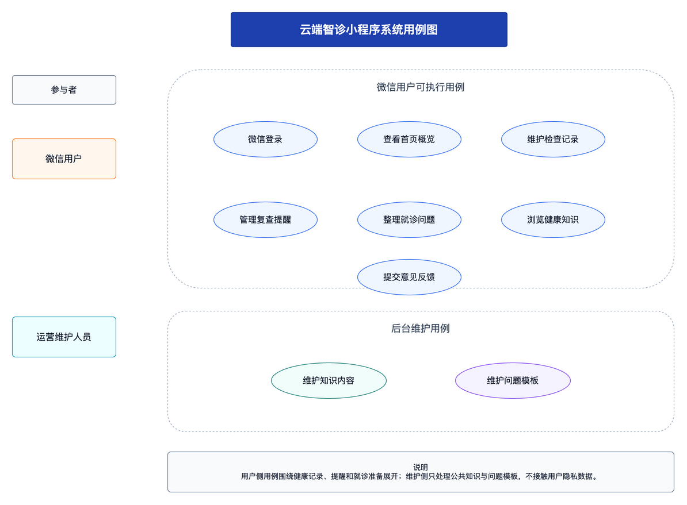
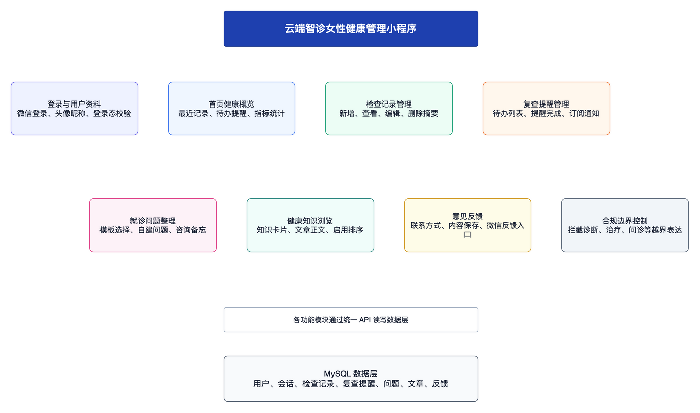
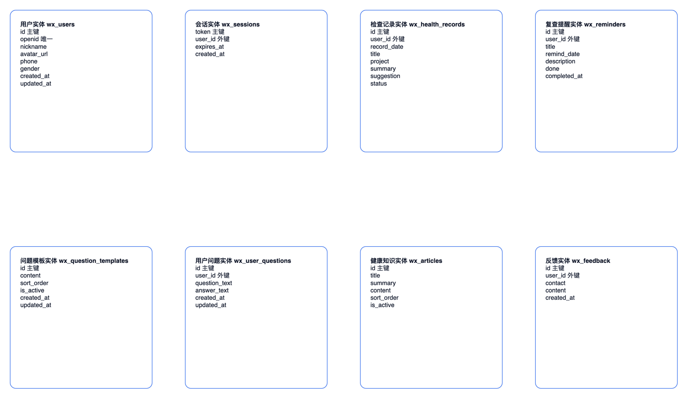
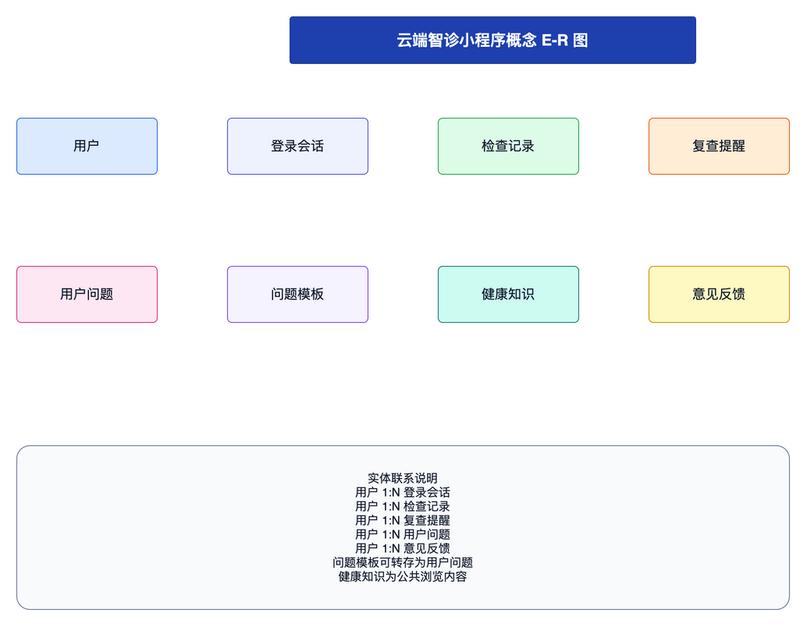
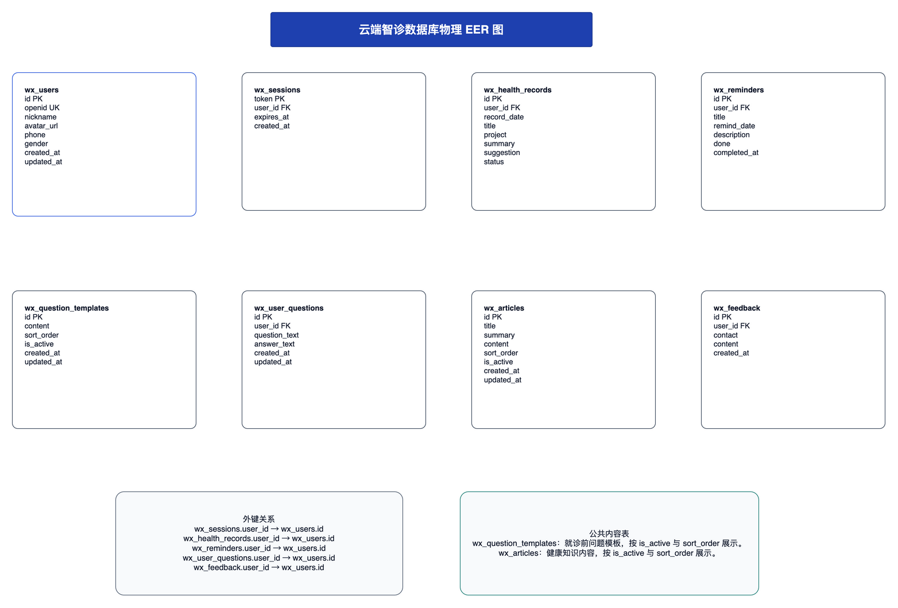
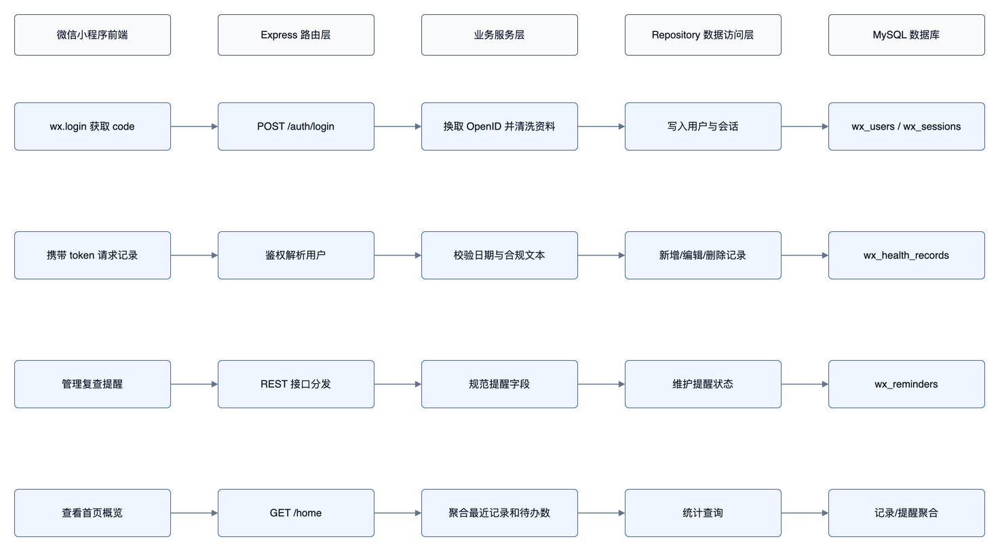

# 云端智诊女性健康管理小程序数据库设计

**课程名称：** 数据库课程设计  
**学院：** 信息与机电工程学院  
**专业：** 计算机科学与技术  
**班级：** 计科5243  
**姓名：** ________  
**学号：** ________  
**指导教师：** 熊守丽  
**实习时间：** 2026年6月6日至2026年7月5日

## 目录

1. 需求分析
2. 数据库概念结构设计
3. 数据库逻辑结构设计
4. 数据库物理结构设计
5. 数据库的实施
6. 系统实现及测试
7. 总结

## 1 需求分析

### 1.1 研究意义

随着微信小程序成为个人健康管理服务的重要入口，用户在完成线下健康检查后，往往需要长期保存检查摘要、按时间管理复查提醒，并在就诊前整理需要向专业人员确认的问题。云端智诊女性健康管理小程序围绕“记录、提醒、整理、了解、反馈”五类需求展开，定位为健康信息管理工具，不提供在线诊断、治疗方案、处方或问诊服务。

本系统采用微信原生小程序作为前端，Express作为轻量API服务，MySQL作为核心数据存储。数据库设计的重点是：一是用用户与会话表支撑微信登录态；二是用检查记录、复查提醒和问题清单表形成用户健康管理闭环；三是用健康知识和反馈表支持内容浏览与意见收集；四是通过外键、索引、视图、存储过程和触发器提高数据一致性与查询效率。

### 1.2 系统用例图



图1 系统用例图

### 1.3 系统功能

系统功能结构如下图所示。



图2 系统功能结构图

- 登录与用户资料模块：小程序端调用 `wx.login()` 获取 code，后端换取 OpenID 并生成自定义 token，用户可维护昵称和头像。
- 首页概览模块：展示最近一次检查摘要、下一次复查提醒、记录数和待关注事项。
- 检查记录模块：支持新增、查看、编辑、删除检查摘要，字段包括检查日期、项目、摘要、提醒建议和状态。
- 复查提醒模块：支持新增、编辑、删除提醒，并可将提醒标记为已完成，后续可扩展微信订阅消息。
- 问题整理模块：提供系统问题模板，支持用户保存、编辑线下咨询前的问题和咨询备忘。
- 健康知识模块：按启用状态和排序号展示健康管理知识卡片与正文。
- 意见反馈模块：保存用户反馈内容和联系方式，便于后续改进系统。

## 2 数据库概念结构设计

### 2.1 实体属性图



图3 实体属性图

系统抽象出用户、登录会话、检查记录、复查提醒、问题模板、用户问题、健康知识、意见反馈八类实体。用户是业务数据的归属主体，检查记录、提醒、用户问题和反馈均通过 `user_id` 与用户建立一对多联系。

### 2.2 E-R图



图4 系统E-R图

概念模型中，用户与登录会话、检查记录、复查提醒、用户问题、意见反馈均为一对多关系。问题模板与用户问题之间在业务上表现为“模板转存为用户问题”，当前数据库直接保存转存后的问题文本，后续若需要追踪模板来源，可增加 `template_id` 外键。

## 3 数据库逻辑结构设计

本系统的E-R图向关系模型转换后，得到如下关系模式。

**小程序用户表：** `wx_users(id, openid, nickname, avatar_url, phone, gender, created_at, updated_at)`

| 列名含义 | 列名（字段名） | 数据类型 | 长度 | 是否为空 | 约束 |
| --- | --- | --- | --- | --- | --- |
| 用户编号 | id | BIGINT UNSIGNED | 20 | 否 | 主键，自增 |
| 微信OpenID | openid | VARCHAR | 128 | 是 | 唯一索引uk_wx_users_openid |
| 昵称 | nickname | VARCHAR | 80 | 否 | 默认微信用户 |
| 头像地址 | avatar_url | VARCHAR | 500 | 是 | 保存后端永久访问地址 |
| 手机号 | phone | VARCHAR | 32 | 是 | 预留字段 |
| 性别 | gender | VARCHAR | 16 | 是 | 预留字段 |
| 创建时间 | created_at | DATETIME | - | 否 | 默认当前时间 |
| 更新时间 | updated_at | DATETIME | - | 否 | 自动更新时间 |

**小程序登录会话：** `wx_sessions(token, user_id, expires_at, created_at)`

| 列名含义 | 列名（字段名） | 数据类型 | 长度 | 是否为空 | 约束 |
| --- | --- | --- | --- | --- | --- |
| 登录令牌 | token | CHAR | 64 | 否 | 主键 |
| 用户编号 | user_id | BIGINT UNSIGNED | 20 | 否 | 外键引用wx_users.id |
| 过期时间 | expires_at | DATETIME | - | 否 | 用于会话失效判断 |
| 创建时间 | created_at | DATETIME | - | 否 | 默认当前时间 |

**健康检查摘要记录：** `wx_health_records(id, user_id, record_date, title, project, summary, suggestion, status, created_at, updated_at)`

| 列名含义 | 列名（字段名） | 数据类型 | 长度 | 是否为空 | 约束 |
| --- | --- | --- | --- | --- | --- |
| 记录编号 | id | VARCHAR | 32 | 否 | 主键，UUID压缩值 |
| 用户编号 | user_id | BIGINT UNSIGNED | 20 | 否 | 外键引用wx_users.id |
| 检查日期 | record_date | DATE | - | 否 | 按日期倒序查询 |
| 记录标题 | title | VARCHAR | 120 | 否 | 页面展示标题 |
| 检查项目 | project | VARCHAR | 120 | 否 | 如TCT / HPV摘要记录 |
| 摘要 | summary | VARCHAR | 500 | 否 | 仅保存健康管理摘要 |
| 提醒建议 | suggestion | VARCHAR | 500 | 否 | 复查或资料准备建议 |
| 状态 | status | VARCHAR | 40 | 否 | 默认已记录 |
| 创建时间 | created_at | DATETIME | - | 否 | 默认当前时间 |
| 更新时间 | updated_at | DATETIME | - | 否 | 自动更新时间 |

**复查提醒：** `wx_reminders(id, user_id, title, remind_date, description, done, completed_at, created_at, updated_at)`

| 列名含义 | 列名（字段名） | 数据类型 | 长度 | 是否为空 | 约束 |
| --- | --- | --- | --- | --- | --- |
| 提醒编号 | id | VARCHAR | 32 | 否 | 主键，UUID压缩值 |
| 用户编号 | user_id | BIGINT UNSIGNED | 20 | 否 | 外键引用wx_users.id |
| 提醒标题 | title | VARCHAR | 120 | 否 | 复查提醒、资料准备等 |
| 提醒日期 | remind_date | DATE | - | 否 | 按未完成和日期排序 |
| 提醒内容 | description | VARCHAR | 500 | 否 | 具体事项说明 |
| 完成状态 | done | TINYINT | 1 | 否 | 0未完成，1已完成 |
| 完成时间 | completed_at | DATETIME | - | 是 | 完成时写入 |
| 创建时间 | created_at | DATETIME | - | 否 | 默认当前时间 |
| 更新时间 | updated_at | DATETIME | - | 否 | 自动更新时间 |

**就诊前问题模板：** `wx_question_templates(id, content, sort_order, is_active, created_at, updated_at)`

| 列名含义 | 列名（字段名） | 数据类型 | 长度 | 是否为空 | 约束 |
| --- | --- | --- | --- | --- | --- |
| 模板编号 | id | BIGINT UNSIGNED | 20 | 否 | 主键，自增 |
| 模板内容 | content | VARCHAR | 255 | 否 | 系统推荐问题 |
| 排序号 | sort_order | INT | - | 否 | 越小越靠前 |
| 启用状态 | is_active | TINYINT | 1 | 否 | 1启用，0停用 |
| 创建时间 | created_at | DATETIME | - | 否 | 默认当前时间 |
| 更新时间 | updated_at | DATETIME | - | 否 | 自动更新时间 |

**用户整理的问题清单：** `wx_user_questions(id, user_id, question_text, answer_text, created_at, updated_at)`

| 列名含义 | 列名（字段名） | 数据类型 | 长度 | 是否为空 | 约束 |
| --- | --- | --- | --- | --- | --- |
| 问题编号 | id | BIGINT UNSIGNED | 20 | 否 | 主键，自增 |
| 用户编号 | user_id | BIGINT UNSIGNED | 20 | 否 | 外键引用wx_users.id |
| 问题内容 | question_text | VARCHAR | 255 | 否 | 用户自建或模板转存 |
| 备忘答案 | answer_text | TEXT | - | 是 | 线下咨询后补充记录 |
| 创建时间 | created_at | DATETIME | - | 否 | 默认当前时间 |
| 更新时间 | updated_at | DATETIME | - | 否 | 自动更新时间 |

**健康管理知识：** `wx_articles(id, title, summary, content, sort_order, is_active, created_at, updated_at)`

| 列名含义 | 列名（字段名） | 数据类型 | 长度 | 是否为空 | 约束 |
| --- | --- | --- | --- | --- | --- |
| 文章编号 | id | VARCHAR | 32 | 否 | 主键 |
| 标题 | title | VARCHAR | 120 | 否 | 知识卡片标题 |
| 摘要 | summary | VARCHAR | 500 | 否 | 列表摘要 |
| 正文 | content | TEXT | - | 是 | 文章正文 |
| 排序号 | sort_order | INT | - | 否 | 越小越靠前 |
| 启用状态 | is_active | TINYINT | 1 | 否 | 1启用，0停用 |
| 创建时间 | created_at | DATETIME | - | 否 | 默认当前时间 |
| 更新时间 | updated_at | DATETIME | - | 否 | 自动更新时间 |

**用户反馈：** `wx_feedback(id, user_id, contact, content, created_at)`

| 列名含义 | 列名（字段名） | 数据类型 | 长度 | 是否为空 | 约束 |
| --- | --- | --- | --- | --- | --- |
| 反馈编号 | id | CHAR | 36 | 否 | 主键，UUID |
| 用户编号 | user_id | BIGINT UNSIGNED | 20 | 否 | 外键引用wx_users.id |
| 联系方式 | contact | VARCHAR | 120 | 是 | 可选 |
| 反馈内容 | content | VARCHAR | 1000 | 否 | 用户反馈正文 |
| 创建时间 | created_at | DATETIME | - | 否 | 默认当前时间 |

## 4 数据库物理结构设计

### 4.1 数据库EER图



图5 数据库EER图

物理模型采用 MySQL InnoDB 引擎，字符集为 `utf8mb4`，排序规则为 `utf8mb4_unicode_ci`。所有用户私有数据均通过外键引用 `wx_users.id`，并使用 `ON DELETE CASCADE` 保证删除用户时可同步清理业务数据。

### 4.2 建库建表语句

```sql
CREATE DATABASE IF NOT EXISTS cervixdetectai_wx
  DEFAULT CHARACTER SET utf8mb4
  COLLATE utf8mb4_unicode_ci;

USE cervixdetectai_wx;

CREATE TABLE IF NOT EXISTS wx_users (
  id BIGINT UNSIGNED NOT NULL AUTO_INCREMENT,
  openid VARCHAR(128) NULL,
  nickname VARCHAR(80) NOT NULL DEFAULT '微信用户',
  avatar_url VARCHAR(500) NULL,
  phone VARCHAR(32) NULL,
  gender VARCHAR(16) NULL,
  created_at DATETIME NOT NULL DEFAULT CURRENT_TIMESTAMP,
  updated_at DATETIME NOT NULL DEFAULT CURRENT_TIMESTAMP ON UPDATE CURRENT_TIMESTAMP,
  PRIMARY KEY (id),
  UNIQUE KEY uk_wx_users_openid (openid)
) ENGINE=InnoDB DEFAULT CHARSET=utf8mb4 COLLATE=utf8mb4_unicode_ci COMMENT='小程序用户表';

CREATE TABLE IF NOT EXISTS wx_sessions (
  token CHAR(64) NOT NULL,
  user_id BIGINT UNSIGNED NOT NULL,
  expires_at DATETIME NOT NULL,
  created_at DATETIME NOT NULL DEFAULT CURRENT_TIMESTAMP,
  PRIMARY KEY (token),
  KEY idx_wx_sessions_user_expires (user_id, expires_at),
  CONSTRAINT fk_wx_sessions_user
    FOREIGN KEY (user_id) REFERENCES wx_users (id)
    ON DELETE CASCADE
) ENGINE=InnoDB DEFAULT CHARSET=utf8mb4 COLLATE=utf8mb4_unicode_ci COMMENT='小程序登录会话';

CREATE TABLE IF NOT EXISTS wx_health_records (
  id VARCHAR(32) NOT NULL,
  user_id BIGINT UNSIGNED NOT NULL,
  record_date DATE NOT NULL,
  title VARCHAR(120) NOT NULL,
  project VARCHAR(120) NOT NULL,
  summary VARCHAR(500) NOT NULL,
  suggestion VARCHAR(500) NOT NULL,
  status VARCHAR(40) NOT NULL DEFAULT '已记录',
  created_at DATETIME NOT NULL DEFAULT CURRENT_TIMESTAMP,
  updated_at DATETIME NOT NULL DEFAULT CURRENT_TIMESTAMP ON UPDATE CURRENT_TIMESTAMP,
  PRIMARY KEY (id),
  KEY idx_wx_health_records_user_date (user_id, record_date),
  CONSTRAINT fk_wx_health_records_user
    FOREIGN KEY (user_id) REFERENCES wx_users (id)
    ON DELETE CASCADE
) ENGINE=InnoDB DEFAULT CHARSET=utf8mb4 COLLATE=utf8mb4_unicode_ci COMMENT='健康检查摘要记录';

CREATE TABLE IF NOT EXISTS wx_reminders (
  id VARCHAR(32) NOT NULL,
  user_id BIGINT UNSIGNED NOT NULL,
  title VARCHAR(120) NOT NULL,
  remind_date DATE NOT NULL,
  description VARCHAR(500) NOT NULL,
  done TINYINT(1) NOT NULL DEFAULT 0,
  completed_at DATETIME NULL,
  created_at DATETIME NOT NULL DEFAULT CURRENT_TIMESTAMP,
  updated_at DATETIME NOT NULL DEFAULT CURRENT_TIMESTAMP ON UPDATE CURRENT_TIMESTAMP,
  PRIMARY KEY (id),
  KEY idx_wx_reminders_user_done_date (user_id, done, remind_date),
  CONSTRAINT fk_wx_reminders_user
    FOREIGN KEY (user_id) REFERENCES wx_users (id)
    ON DELETE CASCADE
) ENGINE=InnoDB DEFAULT CHARSET=utf8mb4 COLLATE=utf8mb4_unicode_ci COMMENT='复查提醒';

CREATE TABLE IF NOT EXISTS wx_question_templates (
  id BIGINT UNSIGNED NOT NULL AUTO_INCREMENT,
  content VARCHAR(255) NOT NULL,
  sort_order INT NOT NULL DEFAULT 0,
  is_active TINYINT(1) NOT NULL DEFAULT 1,
  created_at DATETIME NOT NULL DEFAULT CURRENT_TIMESTAMP,
  updated_at DATETIME NOT NULL DEFAULT CURRENT_TIMESTAMP ON UPDATE CURRENT_TIMESTAMP,
  PRIMARY KEY (id),
  KEY idx_wx_question_templates_active_sort (is_active, sort_order)
) ENGINE=InnoDB DEFAULT CHARSET=utf8mb4 COLLATE=utf8mb4_unicode_ci COMMENT='就诊前问题模板';

CREATE TABLE IF NOT EXISTS wx_user_questions (
  id BIGINT UNSIGNED NOT NULL AUTO_INCREMENT,
  user_id BIGINT UNSIGNED NOT NULL,
  question_text VARCHAR(255) NOT NULL,
  answer_text TEXT NULL,
  created_at DATETIME NOT NULL DEFAULT CURRENT_TIMESTAMP,
  updated_at DATETIME NOT NULL DEFAULT CURRENT_TIMESTAMP ON UPDATE CURRENT_TIMESTAMP,
  PRIMARY KEY (id),
  KEY idx_wx_user_questions_user_time (user_id, updated_at, created_at),
  CONSTRAINT fk_wx_user_questions_user
    FOREIGN KEY (user_id) REFERENCES wx_users (id)
    ON DELETE CASCADE
) ENGINE=InnoDB DEFAULT CHARSET=utf8mb4 COLLATE=utf8mb4_unicode_ci COMMENT='用户整理的问题清单';

CREATE TABLE IF NOT EXISTS wx_articles (
  id VARCHAR(32) NOT NULL,
  title VARCHAR(120) NOT NULL,
  summary VARCHAR(500) NOT NULL,
  content TEXT NULL,
  sort_order INT NOT NULL DEFAULT 0,
  is_active TINYINT(1) NOT NULL DEFAULT 1,
  created_at DATETIME NOT NULL DEFAULT CURRENT_TIMESTAMP,
  updated_at DATETIME NOT NULL DEFAULT CURRENT_TIMESTAMP ON UPDATE CURRENT_TIMESTAMP,
  PRIMARY KEY (id),
  KEY idx_wx_articles_active_sort (is_active, sort_order)
) ENGINE=InnoDB DEFAULT CHARSET=utf8mb4 COLLATE=utf8mb4_unicode_ci COMMENT='健康管理知识';

CREATE TABLE IF NOT EXISTS wx_feedback (
  id CHAR(36) NOT NULL,
  user_id BIGINT UNSIGNED NOT NULL,
  contact VARCHAR(120) NULL,
  content VARCHAR(1000) NOT NULL,
  created_at DATETIME NOT NULL DEFAULT CURRENT_TIMESTAMP,
  PRIMARY KEY (id),
  KEY idx_wx_feedback_user_time (user_id, created_at),
  CONSTRAINT fk_wx_feedback_user
    FOREIGN KEY (user_id) REFERENCES wx_users (id)
    ON DELETE CASCADE
) ENGINE=InnoDB DEFAULT CHARSET=utf8mb4 COLLATE=utf8mb4_unicode_ci COMMENT='用户反馈';
```

## 5 数据库的实施

### 5.1 数据库索引设计

| 表名 | 索引名 | 索引字段 | 索引类型 | 设计目的 |
| --- | --- | --- | --- | --- |
| wx_users | PRIMARY | id | 主键索引 | 按用户编号定位资料 |
| wx_users | uk_wx_users_openid | openid | 唯一索引 | 保证微信用户唯一 |
| wx_sessions | PRIMARY | token | 主键索引 | 按登录令牌校验会话 |
| wx_sessions | idx_wx_sessions_user_expires | user_id, expires_at | 普通索引 | 快速清理或查询用户会话 |
| wx_health_records | idx_wx_health_records_user_date | user_id, record_date | 普通索引 | 按用户和检查日期倒序查询记录 |
| wx_reminders | idx_wx_reminders_user_done_date | user_id, done, remind_date | 普通索引 | 首页和提醒页快速查待办提醒 |
| wx_question_templates | idx_wx_question_templates_active_sort | is_active, sort_order | 普通索引 | 只展示启用模板并按顺序返回 |
| wx_user_questions | idx_wx_user_questions_user_time | user_id, updated_at, created_at | 普通索引 | 按用户查看最近更新的问题 |
| wx_articles | idx_wx_articles_active_sort | is_active, sort_order | 普通索引 | 只展示启用文章并按顺序返回 |
| wx_feedback | idx_wx_feedback_user_time | user_id, created_at | 普通索引 | 按用户和时间追踪反馈 |

### 5.2 数据库视图设计

```sql
CREATE OR REPLACE VIEW v_user_health_overview AS
SELECT
  u.id AS user_id,
  u.nickname,
  COUNT(DISTINCT r.id) AS record_count,
  MAX(r.record_date) AS latest_record_date,
  SUM(CASE WHEN m.done = 0 THEN 1 ELSE 0 END) AS pending_reminder_count,
  MIN(CASE WHEN m.done = 0 THEN m.remind_date ELSE NULL END) AS next_remind_date
FROM wx_users u
LEFT JOIN wx_health_records r ON r.user_id = u.id
LEFT JOIN wx_reminders m ON m.user_id = u.id
GROUP BY u.id, u.nickname;

CREATE OR REPLACE VIEW v_pending_reminders AS
SELECT
  m.id,
  m.user_id,
  u.nickname,
  m.title,
  m.remind_date,
  m.description
FROM wx_reminders m
JOIN wx_users u ON u.id = m.user_id
WHERE m.done = 0
ORDER BY m.remind_date ASC, m.created_at DESC;
```

视图 `v_user_health_overview` 用于统计用户记录数、最近记录日期、待办提醒数和下一次提醒日期，可服务首页概览和后台统计；视图 `v_pending_reminders` 用于集中查询未完成提醒。

### 5.3 数据库存储过程设计

```sql
DELIMITER $$

CREATE PROCEDURE p_create_health_record(
  IN p_user_id BIGINT UNSIGNED,
  IN p_record_date DATE,
  IN p_title VARCHAR(120),
  IN p_project VARCHAR(120),
  IN p_summary VARCHAR(500),
  IN p_suggestion VARCHAR(500),
  IN p_status VARCHAR(40)
)
BEGIN
  DECLARE v_id VARCHAR(32);
  DECLARE EXIT HANDLER FOR SQLEXCEPTION
  BEGIN
    ROLLBACK;
    RESIGNAL;
  END;

  START TRANSACTION;
  SET v_id = REPLACE(UUID(), '-', '');
  INSERT INTO wx_health_records
    (id, user_id, record_date, title, project, summary, suggestion, status)
  VALUES
    (v_id, p_user_id, p_record_date, p_title, p_project, p_summary, p_suggestion, COALESCE(NULLIF(p_status, ''), '已记录'));
  COMMIT;

  SELECT * FROM wx_health_records WHERE id = v_id;
END $$

CREATE PROCEDURE p_complete_reminder(
  IN p_user_id BIGINT UNSIGNED,
  IN p_reminder_id VARCHAR(32)
)
BEGIN
  UPDATE wx_reminders
  SET done = 1, completed_at = NOW(), updated_at = NOW()
  WHERE id = p_reminder_id AND user_id = p_user_id;

  SELECT * FROM wx_reminders WHERE id = p_reminder_id AND user_id = p_user_id;
END $$

DELIMITER ;
```

`p_create_health_record` 使用事务写入健康检查摘要，适合在后续扩展多表写入时保持原子性；`p_complete_reminder` 统一封装提醒完成逻辑，避免多个调用方重复书写状态更新时间。

### 5.4 数据库触发器设计

```sql
DELIMITER $$

CREATE TRIGGER trg_health_record_before_insert
BEFORE INSERT ON wx_health_records
FOR EACH ROW
BEGIN
  IF NEW.status IS NULL OR NEW.status = '' THEN
    SET NEW.status = '已记录';
  END IF;
END $$

CREATE TRIGGER trg_reminder_before_update
BEFORE UPDATE ON wx_reminders
FOR EACH ROW
BEGIN
  IF NEW.done = 1 AND OLD.done = 0 THEN
    SET NEW.completed_at = COALESCE(NEW.completed_at, NOW());
  END IF;
  IF NEW.done = 0 THEN
    SET NEW.completed_at = NULL;
  END IF;
END $$

CREATE TRIGGER trg_feedback_before_insert
BEFORE INSERT ON wx_feedback
FOR EACH ROW
BEGIN
  IF NEW.content IS NULL OR TRIM(NEW.content) = '' THEN
    SIGNAL SQLSTATE '45000' SET MESSAGE_TEXT = '反馈内容不能为空';
  END IF;
END $$

DELIMITER ;
```

触发器主要用于兜底约束：检查记录默认状态、提醒完成时间维护、反馈内容非空校验。应用层已经做了输入校验，数据库触发器作为最后一道一致性保护。

## 6 系统实现及测试

系统的数据访问流程如下图所示。



图6 登录与数据访问流程图

### 6.1 系统登录功能实现及测试

登录页面调用微信登录能力获取 code，后端 `/api/miniapp/auth/login` 通过微信 `code2Session` 换取 OpenID，随后写入或更新 `wx_users`，并在 `wx_sessions` 中生成30天有效的自定义登录态。前端把 token 写入本地缓存，后续请求通过 `Authorization: Bearer <token>` 携带。

| 测试编号 | 测试内容 | 输入数据 | 预期结果 | 测试结论 |
| --- | --- | --- | --- | --- |
| T-LOGIN-01 | 首次微信登录 | 有效code、昵称、头像 | 新增用户并生成token | 通过 |
| T-LOGIN-02 | 重复登录 | 同一OpenID再次登录 | 更新资料，不重复创建用户 | 通过 |
| T-LOGIN-03 | 失效code登录 | 过期或重复使用的code | 返回登录凭证失效提示 | 通过 |
| T-LOGIN-04 | 未带token访问首页 | 空Authorization | 返回401并跳转登录页 | 通过 |

### 6.2 检查记录功能实现及测试

检查记录页面通过 `/records` 查询当前用户的记录列表，新增和编辑页面提交日期、标题、检查项目、摘要、提醒建议和状态。后端服务层对日期格式、必填项和合规词进行校验，Repository层通过 `user_id` 限定数据归属，避免用户访问他人记录。

| 测试编号 | 测试内容 | 输入数据 | 预期结果 | 测试结论 |
| --- | --- | --- | --- | --- |
| T-REC-01 | 新增检查记录 | 2026-03-18、TCT/HPV摘要、待复查 | 写入wx_health_records并返回新记录 | 通过 |
| T-REC-02 | 查看记录详情 | 记录id | 返回当前用户对应记录详情 | 通过 |
| T-REC-03 | 编辑记录 | 修改摘要和状态 | 更新记录并刷新首页缓存 | 通过 |
| T-REC-04 | 删除记录 | 记录id | 删除后列表不再展示 | 通过 |
| T-REC-05 | 提交空摘要 | 摘要为空 | 返回摘要不能为空 | 通过 |

### 6.3 复查提醒功能实现及测试

复查提醒模块通过 `wx_reminders` 保存提醒标题、日期、内容和完成状态。提醒列表按未完成优先、日期升序展示；用户点击完成后调用 `PATCH /reminders/:id/done`，数据库将 `done` 置为1并写入完成时间。

| 测试编号 | 测试内容 | 输入数据 | 预期结果 | 测试结论 |
| --- | --- | --- | --- | --- |
| T-REM-01 | 新增复查提醒 | 标题、日期、内容 | 写入wx_reminders | 通过 |
| T-REM-02 | 编辑提醒日期 | 新的提醒日期 | 更新提醒并保持用户归属 | 通过 |
| T-REM-03 | 标记已完成 | 提醒id | done=1，completed_at写入当前时间 | 通过 |
| T-REM-04 | 删除提醒 | 提醒id | 提醒从列表移除 | 通过 |
| T-REM-05 | 提醒内容为空 | 空description | 返回提醒内容不能为空 | 通过 |

### 6.4 问题整理、健康知识与反馈测试

| 测试编号 | 测试内容 | 输入数据 | 预期结果 | 测试结论 |
| --- | --- | --- | --- | --- |
| T-QA-01 | 获取问题模板 | GET /question-templates | 返回启用模板并按sort_order排序 | 通过 |
| T-QA-02 | 新增用户问题 | questionText、answerText | 写入wx_user_questions | 通过 |
| T-ART-01 | 浏览健康知识 | GET /articles | 只返回启用文章 | 通过 |
| T-FB-01 | 提交意见反馈 | 联系方式、反馈内容 | 写入wx_feedback并返回已收到 | 通过 |
| T-COM-01 | 提交越界医疗表达 | 包含在线诊断等词汇 | 返回合规提示并拒绝保存 | 通过 |

## 7 总结

本次数据库课程设计围绕云端智诊女性健康管理小程序完成了从需求分析、概念结构设计、逻辑结构设计、物理结构设计到数据库实施与系统测试的完整过程。设计过程中，我首先根据小程序的真实业务功能梳理出用户登录、检查记录、复查提醒、问题整理、健康知识和反馈六条核心业务线，再把业务对象抽象为八个数据库实体。通过E-R图和EER图可以看出，用户实体是系统的核心，其他业务数据均围绕用户展开，并通过外键保证数据归属和删除一致性。

在逻辑结构设计阶段，我重点考虑了健康管理类小程序的数据边界。系统只保存用户主动录入的健康检查摘要、提醒建议和就诊前问题，不保存诊断结论、治疗方案或问诊内容，这既符合小程序审核定位，也能降低不必要的数据合规风险。在物理结构设计阶段，所有表统一使用InnoDB和utf8mb4字符集，主键、外键、唯一索引和组合索引围绕实际查询路径设计。例如首页需要快速读取最近记录和最近待办，因此检查记录表按用户和日期建立索引，提醒表按用户、完成状态和提醒日期建立索引。

数据库实施部分进一步补充了视图、存储过程和触发器设计。视图用于首页概览和待办提醒统计，存储过程用于封装检查记录写入和提醒完成操作，触发器用于补充默认状态、完成时间和反馈内容校验。虽然当前小程序后端已经在服务层完成了大部分校验，但数据库层的约束能够作为最后防线，提高系统稳定性。通过测试用例可以验证，登录、记录增删改查、提醒管理、问题整理、知识浏览和意见反馈均能与数据库表结构对应起来，系统具备较好的完整性和可维护性。

通过本次课程设计，我对数据库设计不再停留在单纯建表层面，而是更加理解了需求、实体、关系、索引、事务和应用接口之间的联系。一个可用的数据库方案既要能存下数据，也要能支撑页面查询、权限隔离、异常处理和后续扩展。后续如果继续完善该项目，可以增加模板来源外键、提醒发送日志、数据备份策略和后台内容管理功能，使数据库从演示型设计进一步升级为可长期运行的产品级设计。
